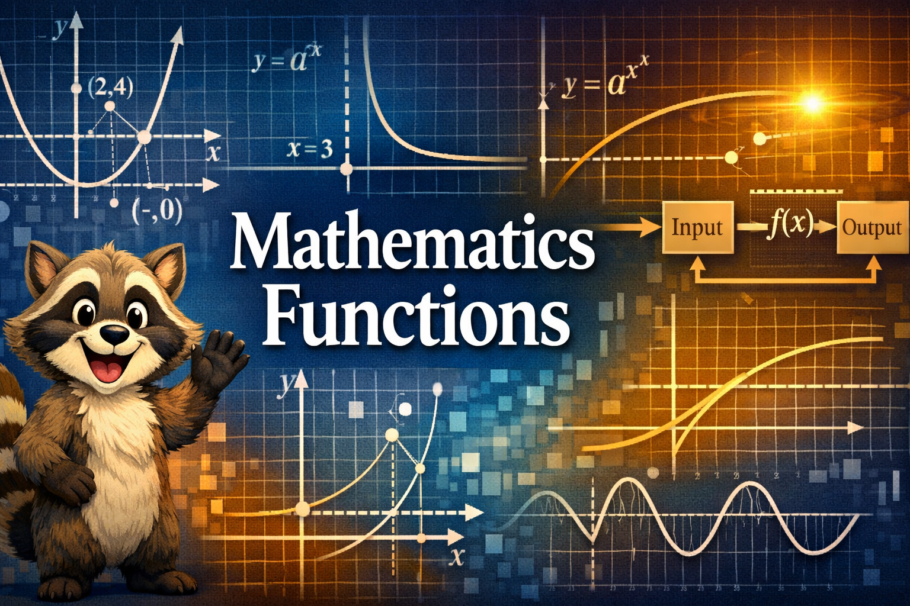

# Welcome to Mathematics Functions

This interactive intelligent textbook is designed to help students master the foundational and unifying theme of functions in mathematics. Through mathematical models, coordinate geometry, and real-world applications, you will explore how functions map inputs to outputs and how these relationships are represented across different forms.

Although we cover the same concepts covered in the IB Mathematics Functions curriculum, this
class is not affiliated with the IB program in any way and we do not seek or claim any
endorsement by the IB program.

## Getting Started

Explore the course content through the following sections:

* [**Course Description**](course-description.md) — Overview of topics, learning objectives, and prerequisites.
* [**Chapters**](chapters/index.md) — Dive into detailed lessons from Algebra Foundations to Modeling and Applications.
* [**Learning Graph**](learning-graph/index.md) — Visualize the conceptual taxonomy and knowledge structure of the course.
* [**MicroSims**](sims/index.md) — Interact with dynamic simulations to deepen your understanding of function behaviors.
