# Interactive MicroSims

These interactive simulations let you explore the mathematical concepts from each chapter hands-on. Click any title to launch the MicroSim.

**Total: 28 MicroSims** across 13 chapters

## Chapter 1: Algebra Foundations

-   **[Number System Hierarchy](./number-system-hierarchy/index.md)**

    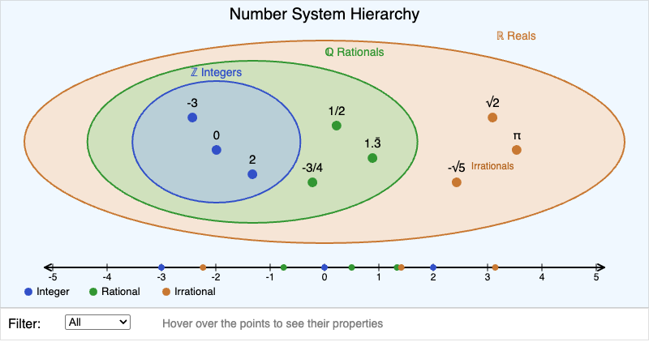

    Visualize nested number systems — integers, rationals, irrationals — with an interactive number line and classification tooltips.

-   **[Factoring Decision Flowchart](./factoring-decision-flowchart/index.md)**

    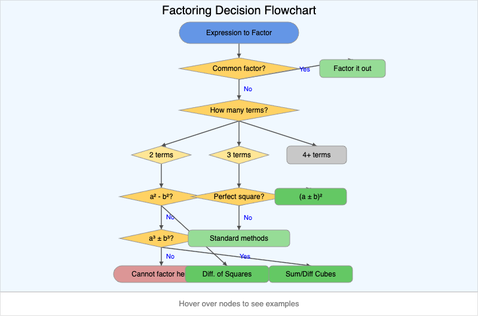

    Interactive flowchart guiding you through choosing the right factoring technique for any expression.

-   **[Expression Builder](./expression-builder/index.md)**

    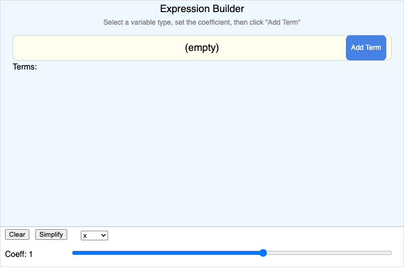

    Build algebraic expressions from term tiles and watch them simplify in real time.

## Chapter 2: Relations and Functions

-   **[Coordinate Plane Explorer](./coordinate-plane-explorer/index.md)**

    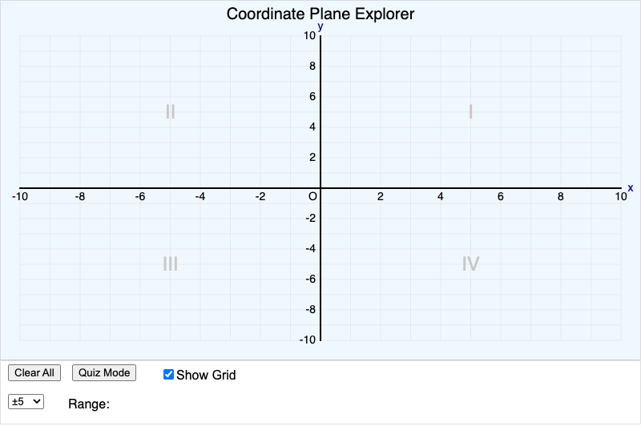

    Click to place points on the coordinate plane. Quiz mode challenges you to find specific coordinates.

-   **[Function vs Non-Function Mapping](./function-vs-non-function-mapping/index.md)**

    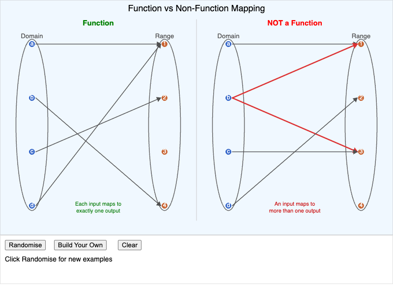

    Side-by-side mapping diagrams showing why some relations are functions and others aren't.

-   **[Domain Restriction Finder](./domain-restriction-finder/index.md)**

    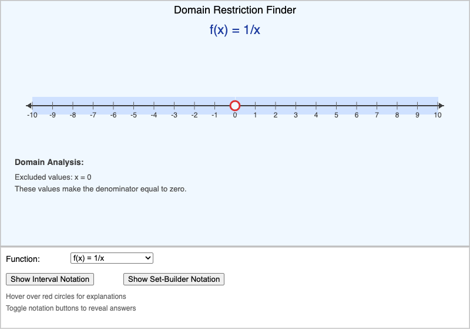

    Explore how division by zero and square roots create domain restrictions on a visual number line.

-   **[Constant & Identity Grapher](./constant-identity-grapher/index.md)**

    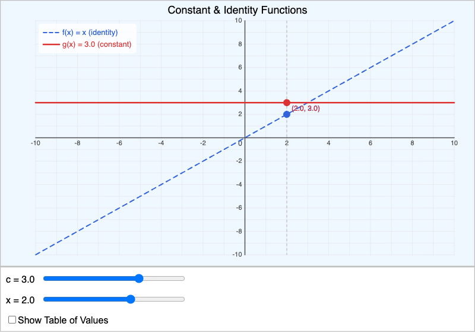

    Compare the constant function and identity function with adjustable parameters and a trace tool.

-   **[Function Property Classifier](./function-property-classifier/index.md)**

    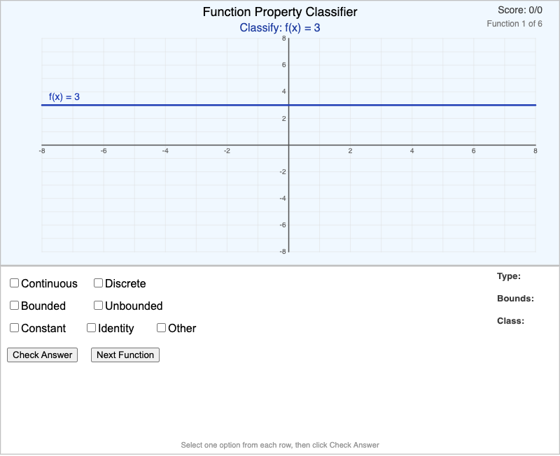

    Classify functions as continuous/discrete, bounded/unbounded from their graphs. Quiz with scoring.

## Chapter 3: Graphing and Key Features

-   **[Key Graph Features Explorer](./key-graph-features-explorer/index.md)**

    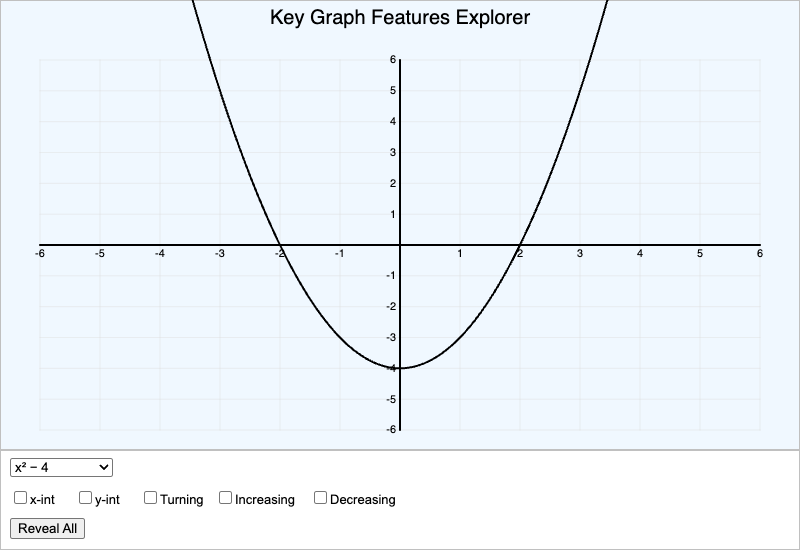

    Toggle intercepts, turning points, and increasing/decreasing intervals on function graphs.

-   **[Window Settings Simulator](./window-settings-simulator/index.md)**

    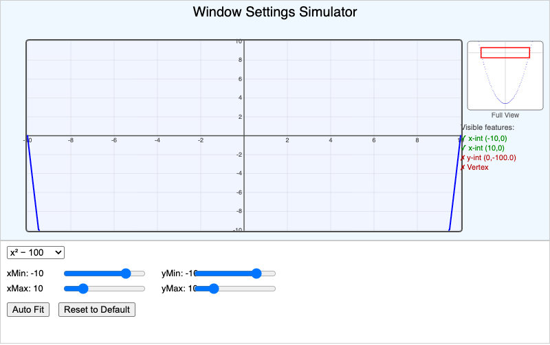

    Learn why GDC window settings matter by adjusting the view and seeing which features are visible.

-   **[Function Feature Identifier](./function-feature-identifier/index.md)**

    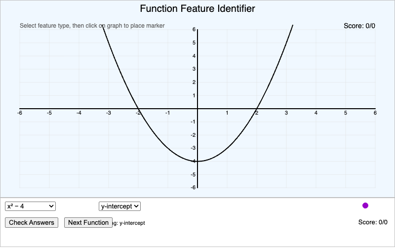

    Click on graphs to identify intercepts, maxima, minima, and inflection points. Scored quiz.

## Chapter 4: Linear Functions

-   **[Gradient Explorer](./gradient-explorer/index.md)**

    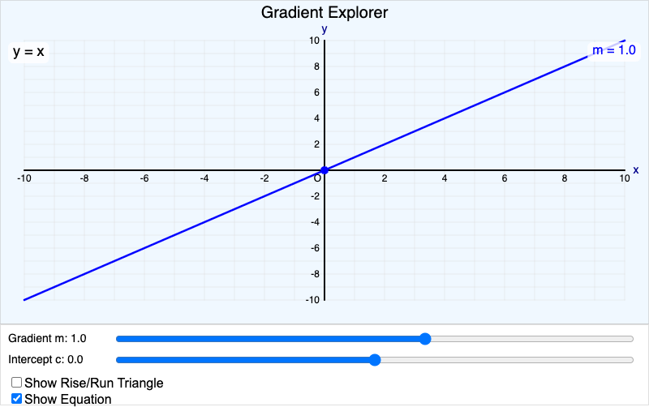

    Adjust the gradient and y-intercept with sliders and see the rise/run triangle update in real time.

-   **[Simultaneous Equations Visualizer](./simultaneous-equations-visualiser/index.md)**

    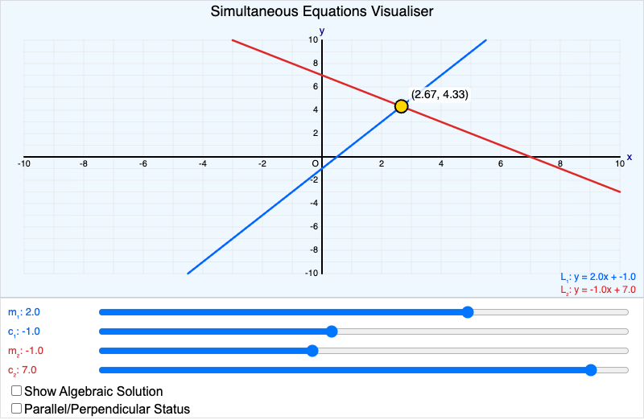

    Graph two lines and find their intersection. Detects parallel and perpendicular relationships.

-   **[Linear Model Builder](./linear-model-builder/index.md)**

    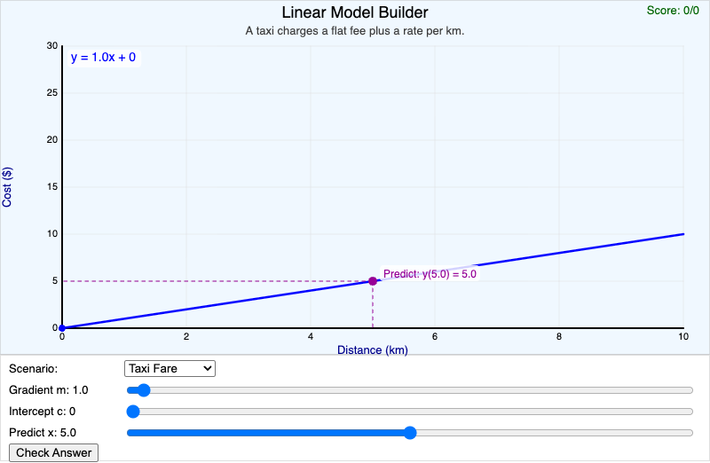

    Match real-world scenarios to linear models by choosing the right gradient and y-intercept.

## Chapter 5: Quadratic Functions

-   **[Quadratic Equation Solver](./quadratic-equation-solver/index.md)**

    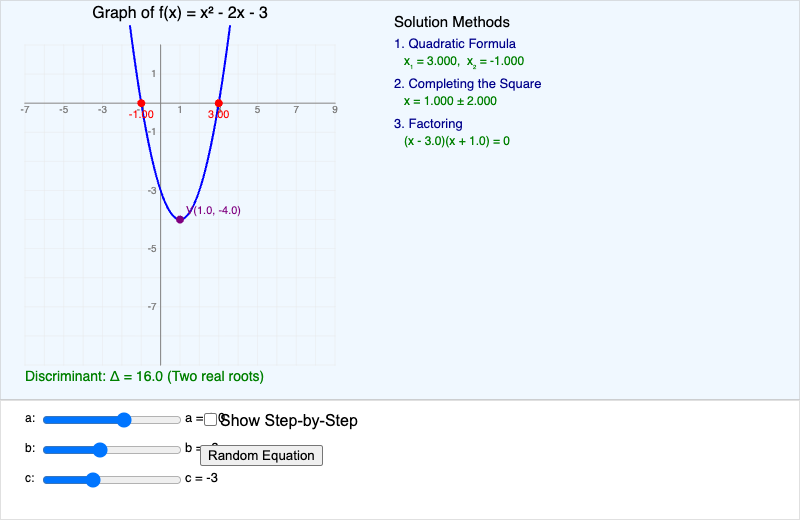

    See three solution methods side by side — factoring, completing the square, and the quadratic formula.

-   **[Sign Diagram Builder](./sign-diagram-builder/index.md)**

    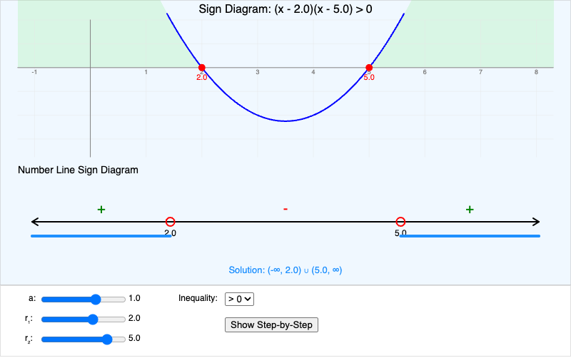

    Build sign diagrams for quadratic inequalities with the parabola and number line aligned.

-   **[Projectile Motion Simulator](./projectile-motion-simulator/index.md)**

    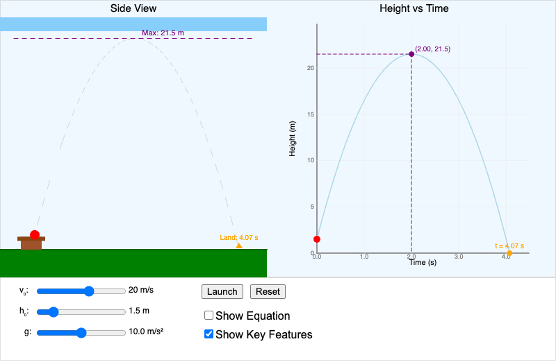

    Launch a projectile and watch the parabolic trajectory with adjustable velocity, height, and gravity.

## Chapter 6: Inverse and Composite Functions

-   **[Inverse Function Reflector](./inverse-function-reflector/index.md)**

    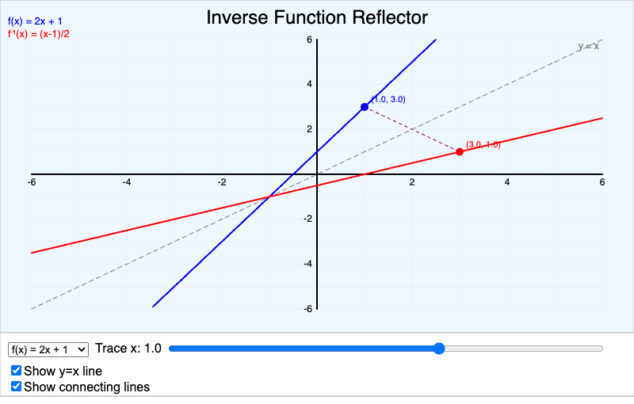

    See a function and its inverse as reflections over the line y = x with traced corresponding points.

-   **[Composite Function Machine](./composite-function-machine/index.md)**

    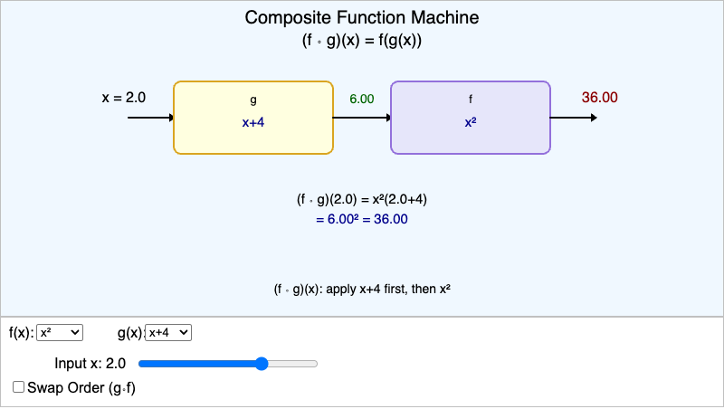

    Feed inputs through two function machines and see how composition order changes the result.

## Chapter 7: Exponential Functions

-   **[Exponential Growth & Decay Explorer](./exponential-growth-decay-explorer/index.md)**

    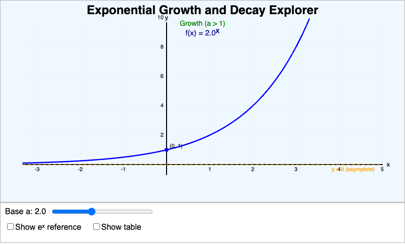

    Adjust the base to see exponential growth morph into decay, with the transition at a = 1.

-   **[Exponential Model Simulator](./exponential-model-simulator/index.md)**

    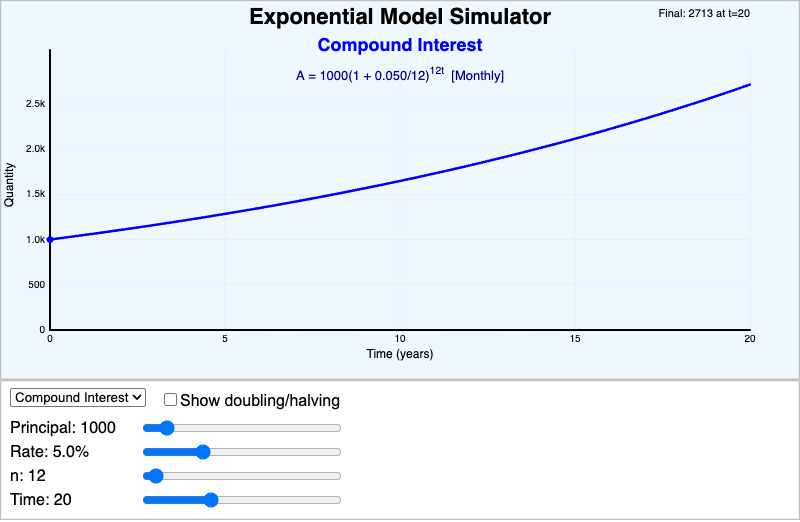

    Explore compound interest, population growth, and half-life models with adjustable parameters.

## Chapter 8: Logarithmic Functions

-   **[Logarithm Equation Solver](./logarithm-equation-solver/index.md)**

    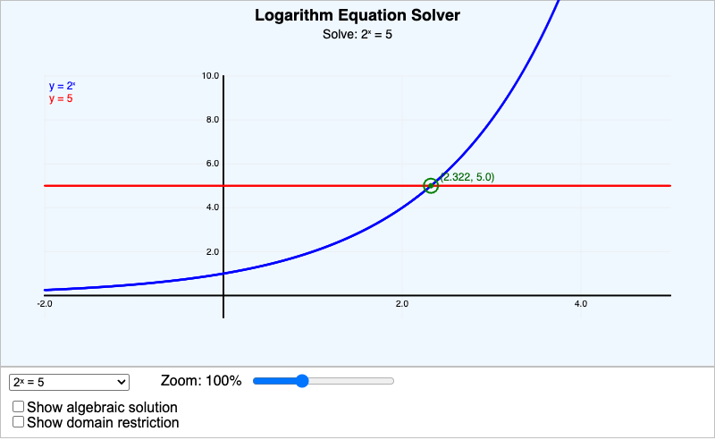

    Solve exponential and logarithmic equations graphically — see both sides plotted with the intersection.

## Chapter 9: Polynomial Functions

-   **[Polynomial Graph Explorer](./polynomial-graph-explorer/index.md)**

    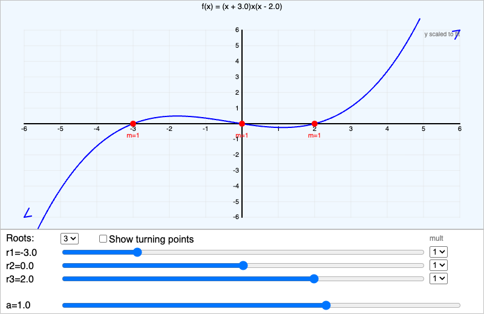

    Build polynomials by setting roots and multiplicities. See how the graph crosses or bounces.

## Chapter 10: Rational Functions

-   **[Rational Function Grapher](./rational-function-grapher/index.md)**

    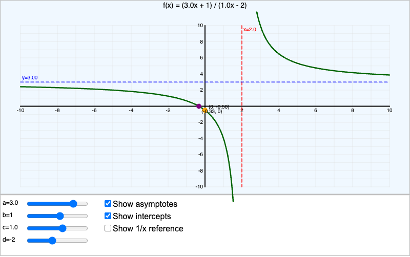

    Graph (ax+b)/(cx+d) with adjustable parameters. See asymptotes, intercepts, and the hyperbola shape.

## Chapter 11: Function Classifications

-   **[Modulus Transformation Explorer](./modulus-transformation-explorer/index.md)**

    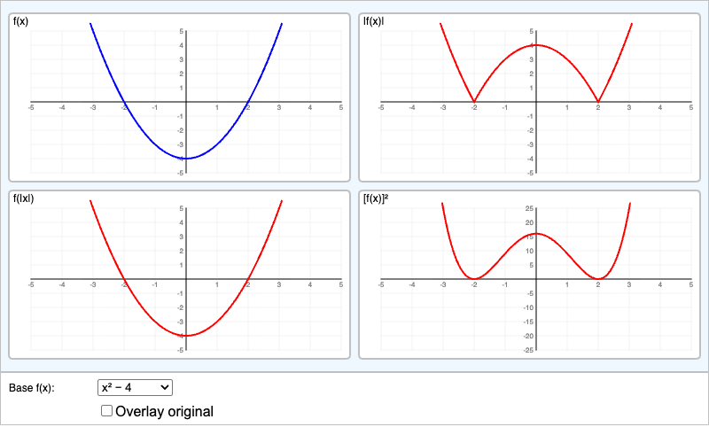

    Compare |f(x)|, f(|x|), and [f(x)]² side by side in a 2×2 grid for multiple base functions.

## Chapter 12: Transformations

-   **[Transformation Explorer](./transformation-explorer/index.md)**

    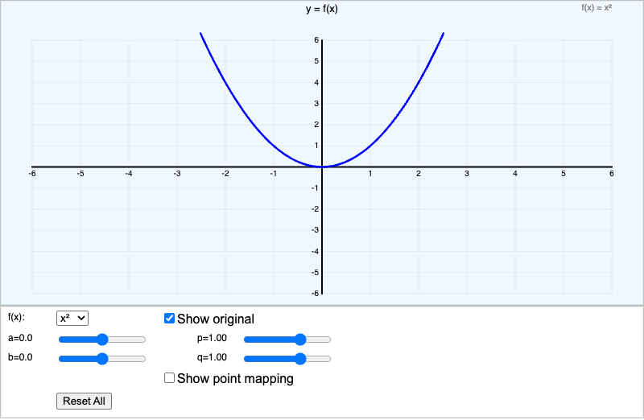

    Apply translations, reflections, and stretches to any base function with four parameter sliders.

## Chapter 13: Modeling and Applications

-   **[Regression Model Fitter](./regression-model-fitter/index.md)**

    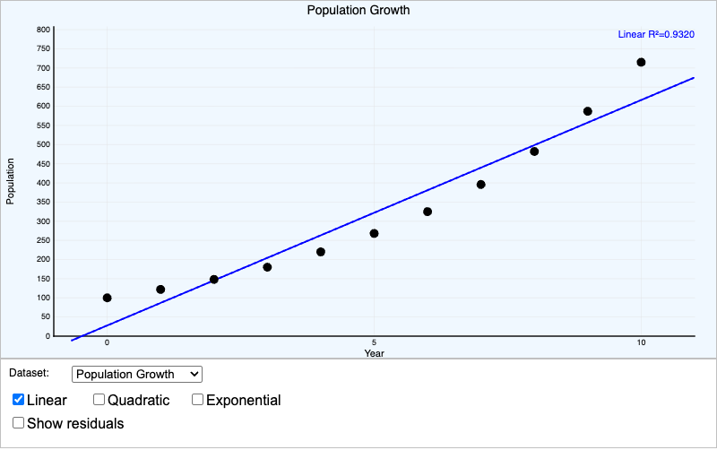

    Fit linear, quadratic, and exponential regression curves to real-world datasets. Compare R² values.

## Learning Tools

-   **[Learning Graph Viewer](./graph-viewer/index.md)**

    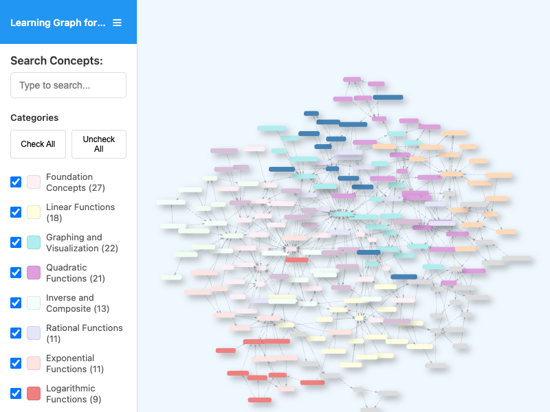

    Explore the interactive concept dependency graph for the entire course.

