# Ada Lovelace: The First Programmer

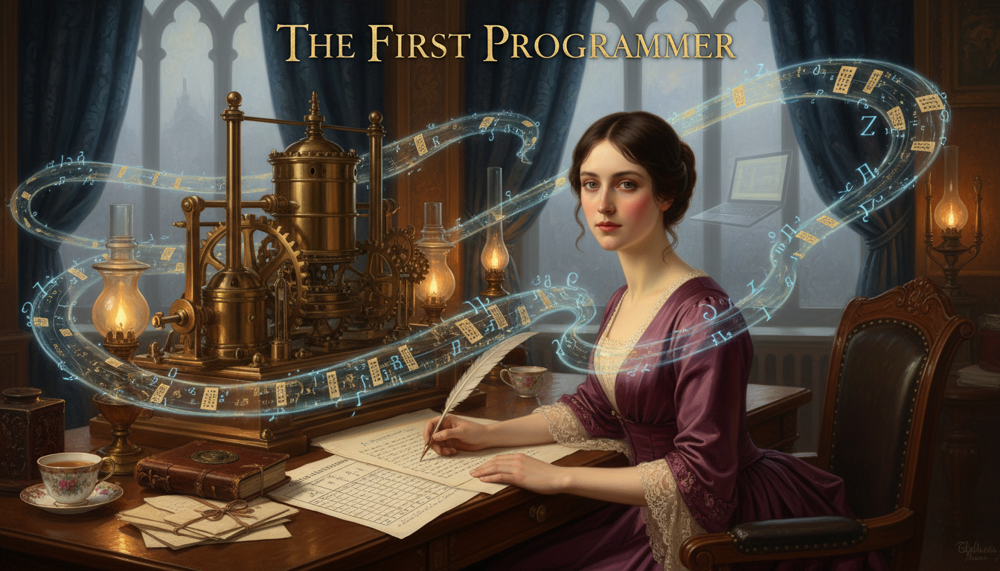

Cover Image Prompt

Please generate a wide-landscape 16:9 cover image in Victorian Pre-Raphaelite painting style depicting Ada Lovelace, a poised young woman in her late twenties with dark brown hair parted in the middle and pulled into a low bun, pale skin, intelligent dark eyes, and a rich plum-colored silk gown with lace sleeves, seated at a walnut writing desk in a gaslit London study in 1843, quill in hand, writing notes beside a sheet showing the world's first algorithm — a table of computations for Bernoulli numbers. Behind her looms a massive partially-built brass and steel Analytical Engine with gleaming gears and cylinders. Ghostly luminous lines of flowing mathematical symbols and what look like punch-card patterns swirl in the air around her. Include the title text "The First Programmer" in elegant Victorian gold serif lettering at the top. Color palette: plum, brass gold, gaslit amber, ivory, midnight blue. Emotional tone: visionary, regal, quietly revolutionary. Include oil lamps, a stack of letters from Charles Babbage, an open copy of a mathematical journal, tall windows with London fog beyond, brocade curtains, a porcelain teacup, and a subtle ghostly silhouette of a modern laptop in the background fog. Generate the image immediately without asking clarifying questions.

Narrative Prompt

This is a 12-panel graphic novel about Augusta Ada King, Countess of Lovelace (1815–1852), the Victorian mathematician and daughter of the poet Lord Byron. The story explores her childhood in Regency England, her training in mathematics under Mary Somerville and Augustus De Morgan, her partnership with Charles Babbage, and her 1843 notes on the Analytical Engine which contain what is recognized as the world's first published algorithm. Themes: imagination beyond existing technology, women in science during a hostile era, mathematics as the bridge between poetry and machinery, and the idea that functions can act on things other than numbers. Keep Ada consistent: dark brown hair in a center part and low bun, pale skin, dark intelligent eyes, Victorian gowns in plum, teal, and ivory. Settings span English country estates, London townhouses, and industrial workshops of the 1820s–1850s.

### Prologue – A Vision a Century Early

In 1843, a twenty-seven-year-old English countess published a set of notes on a machine that had not actually been built yet. Buried in those notes was a carefully ruled table showing exactly how the machine could calculate a sequence of numbers called the Bernoulli numbers, step by step, using what we would today call a *program*. That table is now considered the first computer algorithm in history. Its author, Ada Lovelace, saw something nobody else in the nineteenth century saw: a calculating machine was really a machine for running *functions* — and there was no reason those functions had to be limited to numbers.

## Panel 1: The Poet's Daughter

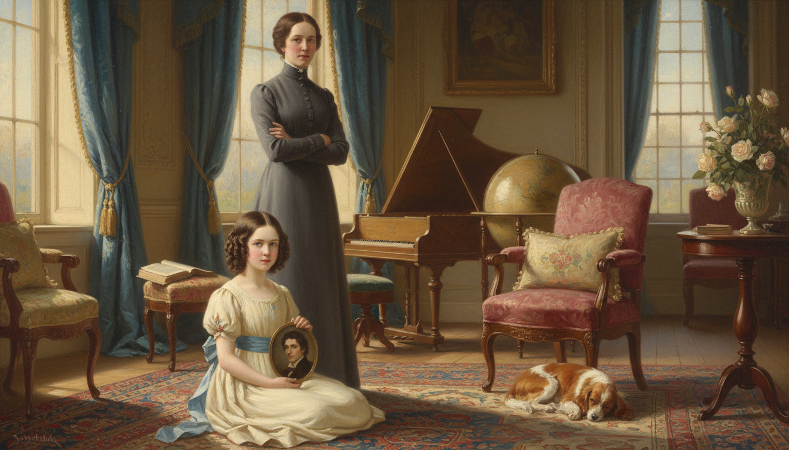

Image Prompt

I am about to ask you to generate a series of images for a graphic novel. Please make the images have a consistent style and consistent characters. Do not ask any clarifying questions. Just generate the image immediately when asked.

Please generate a 16:9 image in Victorian Pre-Raphaelite painting style depicting panel 1 of 12. The scene shows a small five-year-old Ada Byron in 1820, a pale child with dark brown hair in ringlets and a cream-colored Regency dress with a blue sash, sitting on a Persian rug in the sunlit parlor of a grand English country house, holding a small oil portrait of her estranged father, the poet Lord Byron — a brooding handsome man with dark curly hair. Her mother, Annabella Milbanke, Lady Byron, a stern woman in a high-necked gray dress, stands nearby with her arms folded. Color palette: cream, Regency blue, walnut brown, rose. Emotional tone: tender, complicated, the weight of a famous name. Include tall sash windows with velvet drapes, a globe, a harpsichord, a leather-bound book of Byron's poems face-down on a chair, a vase of roses, a sleeping spaniel, and soft morning light. Generate the image immediately without asking clarifying questions.

Ada was born in 1815 to the famous poet Lord Byron and the mathematician Annabella Milbanke. Her parents' marriage collapsed within months of her birth, and her mother took her away forever, determined to raise her on mathematics and logic to stamp out any trace of her father's "poetic madness." Ada grew up never meeting Byron — but she inherited his imagination anyway.

## Panel 2: A Childhood of Mathematics and Illness

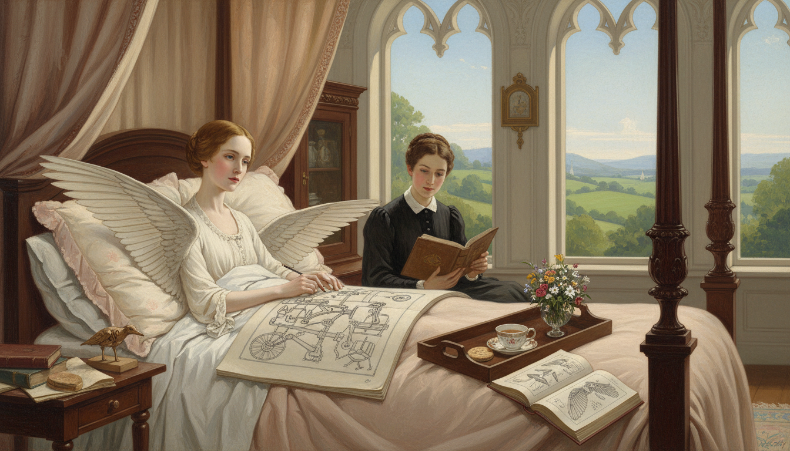

Image Prompt

Please generate a 16:9 image in Victorian Pre-Raphaelite painting style depicting panel 2 of 12. Make the characters and style consistent with the prior panel. The scene shows twelve-year-old Ada in 1827, pale and thin after recovering from illness, sitting up in bed in a canopied four-poster bed at her mother's country estate, drawing detailed mechanical sketches of a flying machine with bird-like wings and a steam engine in a large sketchbook. A governess in a dark dress reads a geometry text to her aloud. Color palette: pale rose, ivory linen, walnut, book leather brown, sky blue. Emotional tone: determined, imaginative, quietly defiant. Include a tray with a teacup and biscuit, a bouquet of wildflowers, an open book of anatomy diagrams, a wooden model of a bird, tall windows with a view of rolling green English hills, and soft diffused afternoon light. Generate the image immediately without asking clarifying questions.

As a child, Ada caught measles at twelve and was bedridden for nearly three years. Rather than despair, she spent the time designing flying machines — carefully studying bird anatomy and drawing steam-powered wings she called "flyology." By her teens she was correcting her tutors' algebra and demanding harder problems. Her mother hired some of the best mathematicians in Britain to keep up with her.

## Panel 3: Meeting Mary Somerville

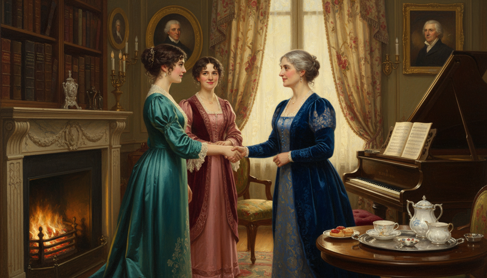

Image Prompt

Please generate a 16:9 image in Victorian Pre-Raphaelite painting style depicting panel 3 of 12. Make the characters and style consistent with the prior panels. The scene shows seventeen-year-old Ada, now a graceful young woman with dark hair in a low bun and a teal silk dress with lace collar, being introduced in a London drawing room to Mary Somerville, a distinguished middle-aged Scottish woman in a deep blue gown — the first woman admitted to the Royal Astronomical Society. They shake hands warmly as Ada's mother looks on. Color palette: teal, deep blue, ivory, rose, candle gold. Emotional tone: mentorship beginning, mutual respect. Include a tall bookshelf with Somerville's own Mechanism of the Heavens, a grand piano, a porcelain tea service on a silver tray, oil portraits of astronomers, heavy damask curtains, a crackling fireplace, and gaslamp light. Generate the image immediately without asking clarifying questions.

When Ada was in her mid-teens, she met the great Scottish mathematician Mary Somerville, one of the first two women ever admitted to the Royal Astronomical Society. Somerville became her friend, mentor, and, crucially, the person who introduced her to another eccentric British mathematician — Charles Babbage.

## Panel 4: The Difference Engine

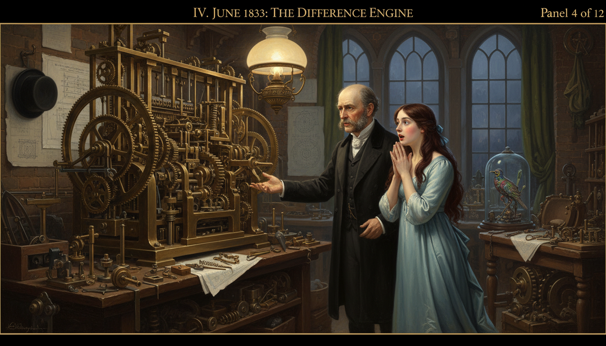

Image Prompt

Please generate a 16:9 image in Victorian Pre-Raphaelite painting style depicting panel 4 of 12. Make the characters and style consistent with the prior panels. The scene shows seventeen-year-old Ada in June 1833, wearing a pale blue silk gown, standing in astonishment in front of a partially built brass-and-steel Difference Engine in Charles Babbage's London workshop. Babbage, a balding middle-aged English gentleman with intense eyes, dark sideburns, and a black frock coat, gestures proudly at the machine. Gears, cranks, and columns of numbered wheels gleam in lamplight. Color palette: brass gold, cool blue, workshop gray, deep chestnut. Emotional tone: awe, thunderstruck wonder, a life-changing moment. Include oily workbenches, blueprints pinned to walls, scattered metal cogs, a top hat on a peg, a mechanical bird automaton in a glass case, an oil lamp, and dramatic chiaroscuro lighting from tall workshop windows. Generate the image immediately without asking clarifying questions.

In June 1833, Ada attended a salon at Babbage's house and saw a working portion of his Difference Engine — a hand-cranked brass calculator that could compute polynomial tables automatically. Most visitors saw a fancy adding machine. Ada, then only seventeen, saw something far bigger. She later wrote that she "understood it as no one else did."

## Panel 5: Marriage and a Title

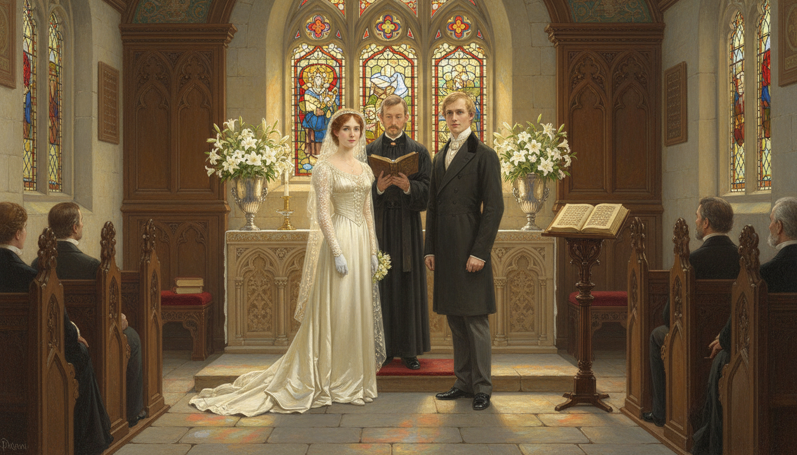

Image Prompt

Please generate a 16:9 image in Victorian Pre-Raphaelite painting style depicting panel 5 of 12. Make the characters and style consistent with the prior panels. The scene shows Ada in 1835 at age nineteen on her wedding day, in an ivory silk Victorian wedding gown with long lace sleeves, standing beside her new husband William King, a calm-faced young gentleman with sandy hair in a dark tailcoat, at the altar of a small English country chapel. A clergyman holds an open prayer book. Color palette: ivory, candle gold, stained-glass blue and red, stone gray. Emotional tone: formal, gentle, hopeful. Include carved wooden pews, arched Gothic windows, fresh white lilies in silver vases, a few family members in Victorian formal dress, sunlight streaming through stained glass onto the stone floor, and a hymn book on a lectern. Generate the image immediately without asking clarifying questions.

In 1835 Ada married William King, a kind and supportive man who was made Earl of Lovelace three years later — making Ada the Countess of Lovelace. Despite having three children in four years, she refused to set aside her mathematics. Her husband actively encouraged her studies and copied her manuscripts for her late into the night.

## Panel 6: Studying with De Morgan

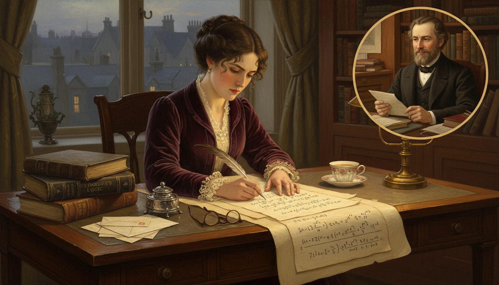

Image Prompt

Please generate a 16:9 image in Victorian Pre-Raphaelite painting style depicting panel 6 of 12. Make the characters and style consistent with the prior panels. The scene shows Ada in her early twenties sitting at a desk in her London home writing out a complicated algebra problem while exchanging letters by post with Augustus De Morgan, an imagined inset showing De Morgan, a kindly bearded mathematician in a dark frock coat, reading her latest letter at University College London. Color palette: deep plum, walnut, ivory parchment, brass lamp gold. Emotional tone: rigorous study, distance bridged by ideas. Include a stack of De Morgan's textbooks on mathematical logic, a tidy pile of sealed envelopes, a silver inkwell, a quill, a pair of reading glasses, a porcelain teacup, a window with London rooftops, and gaslamp light. Generate the image immediately without asking clarifying questions.

Ada took formal mathematics lessons by correspondence with Augustus De Morgan, the famous logician at University College London. De Morgan was astonished by her ability and told her mother privately that if Ada were a man she would become "an original mathematical investigator of the first rank." The limitation, of course, was the era, not her talent.

## Panel 7: The Analytical Engine

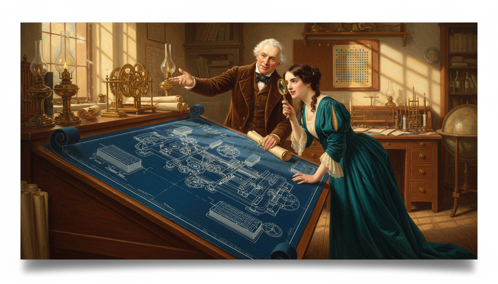

Image Prompt

Please generate a 16:9 image in Victorian Pre-Raphaelite painting style depicting panel 7 of 12. Make the characters and style consistent with the prior panels. The scene shows Babbage unveiling his detailed plans for the Analytical Engine to Ada in his workshop around 1840. Enormous blueprints cover a long drafting table, showing a vast mechanical machine designed to read punched cards borrowed from Jacquard looms. Ada, in a deep teal dress, leans eagerly over the plans with a brass magnifying glass. Color palette: blueprint blue, brass, walnut, candle gold, teal. Emotional tone: dawning revelation, intellectual electricity. Include rolls of schematics, a Jacquard loom punch card sample tacked to the wall, a small brass model of an analytical engine gear, oil lamps, a globe, and crosshatched afternoon light through tall arched workshop windows. Generate the image immediately without asking clarifying questions.

Around 1840 Babbage began designing a far more ambitious machine — the Analytical Engine. Unlike the Difference Engine, which could only compute one kind of table, the Analytical Engine could be instructed. It had what we would now call a memory, a processor, and a way of feeding in programs via punched cards borrowed from the Jacquard silk loom. In modern terms, it was a general-purpose computer — in 1840.

## Panel 8: Translating Menabrea

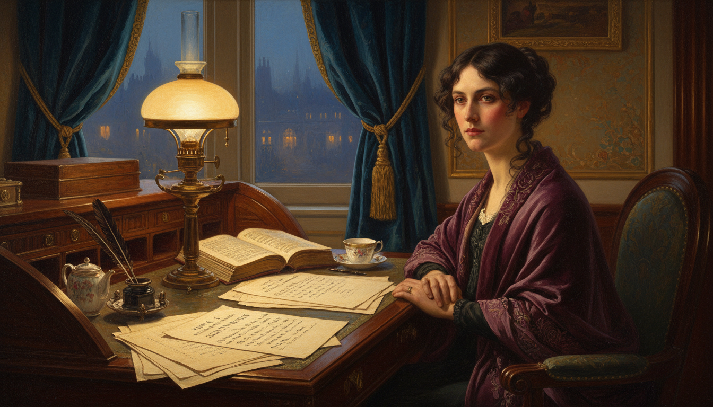

Image Prompt

Please generate a 16:9 image in Victorian Pre-Raphaelite painting style depicting panel 8 of 12. Make the characters and style consistent with the prior panels. The scene shows Ada in 1842 at her writing desk late at night in her London home, translating an Italian article by the mathematician Luigi Menabrea from French into English. The paper describes Babbage's Analytical Engine. Ada writes in a careful hand, her face lit by a single oil lamp. Color palette: deep midnight blue, lamp amber, ivory parchment, plum velvet. Emotional tone: quiet focus, the beginning of something historic. Include a French dictionary, a stack of Menabrea's paper pages, an inkwell with multiple quills, a pot of tea, a shawl draped over her shoulders, a Victorian oil lamp, heavy velvet curtains, and the faint gaslight of London visible through the window. Generate the image immediately without asking clarifying questions.

In 1842 an Italian engineer named Luigi Menabrea published a short description of Babbage's Analytical Engine in French. Babbage asked Ada to translate it into English. She agreed — and then went far, far beyond translation. She added her own extensive "Notes," lettered A through G, that ended up being more than twice as long as the original paper.

## Panel 9: Note G and the First Program

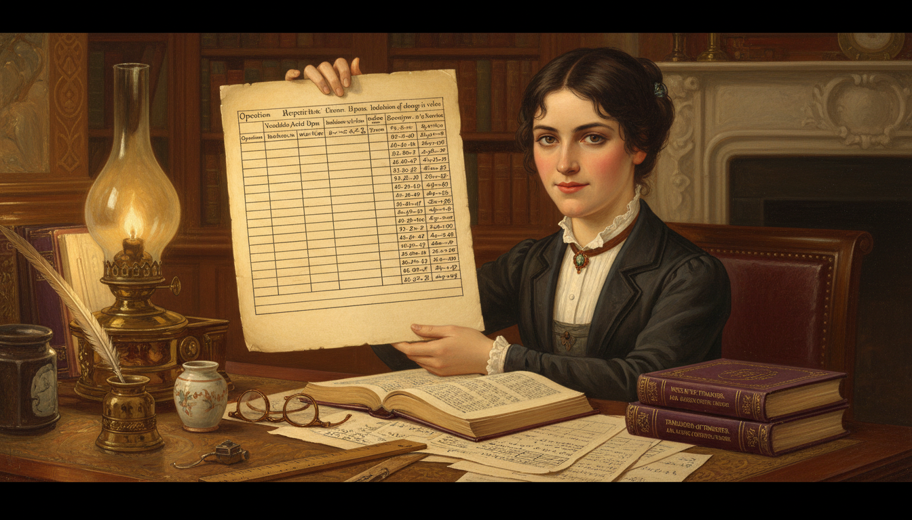

Image Prompt

Please generate a 16:9 image in Victorian Pre-Raphaelite painting style depicting panel 9 of 12. Make the characters and style consistent with the prior panels. The scene shows Ada in 1843 at her desk, holding up a large sheet of paper containing a carefully ruled table with columns labeled "Operation," "Variables Acted Upon," "Indication of change in value," and numerical results for computing Bernoulli numbers. Her face shows quiet triumph. A stack of the published "Notes" lies beside her. Color palette: parchment cream, deep plum, brass gold, ink black. Emotional tone: historic pride, the moment software was born. Include her quill and inkwell, a copy of the translated Menabrea paper, a ruler, reading glasses, an oil lamp, scattered equations, and warm lamplight falling on the ruled table. Generate the image immediately without asking clarifying questions.

In her final note, "Note G," Ada published a detailed step-by-step table showing exactly how the Analytical Engine could compute the Bernoulli numbers — a sequence from advanced mathematics. Every row of her table was an instruction: which variables to use, which operations to perform, and what the result would be. That table is now recognized as the first published computer program in history.

## Panel 10: The Leap Nobody Else Made

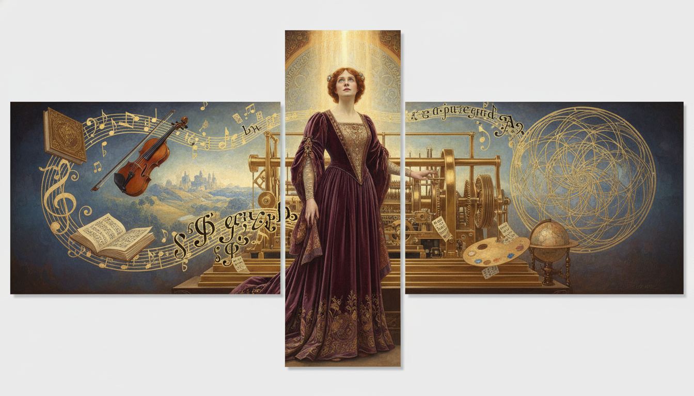

Image Prompt

Please generate a 16:9 image in Victorian Pre-Raphaelite painting style depicting panel 10 of 12. Make the characters and style consistent with the prior panels. The scene is a symbolic tableau showing Ada in a flowing plum gown standing beside the Analytical Engine while imagined visions swirl around her: musical notes on a staff, a painted landscape, lines of alphabetic symbols, a geometric pattern — all flowing out of the machine. The implication is that the machine can act on anything, not just numbers. Color palette: plum, gold, sky blue, ivory, brass. Emotional tone: visionary, almost mystical, prophetic. Include glowing punched cards mid-air, a violin floating among the symbols, an open book of sheet music, a painter's palette, a globe, and a beam of golden light from above illuminating Ada's upturned face. Generate the image immediately without asking clarifying questions.

Ada saw what Babbage himself had not fully articulated: if the engine could operate on symbols according to rules, then those symbols did not have to stand for numbers. They could represent notes in a piece of music, letters of the alphabet, or anything else. "The engine," she wrote, "might compose elaborate and scientific pieces of music of any degree of complexity or extent." She had described software — a century before electronic computers.

## Panel 11: A Short Life Cut Shorter

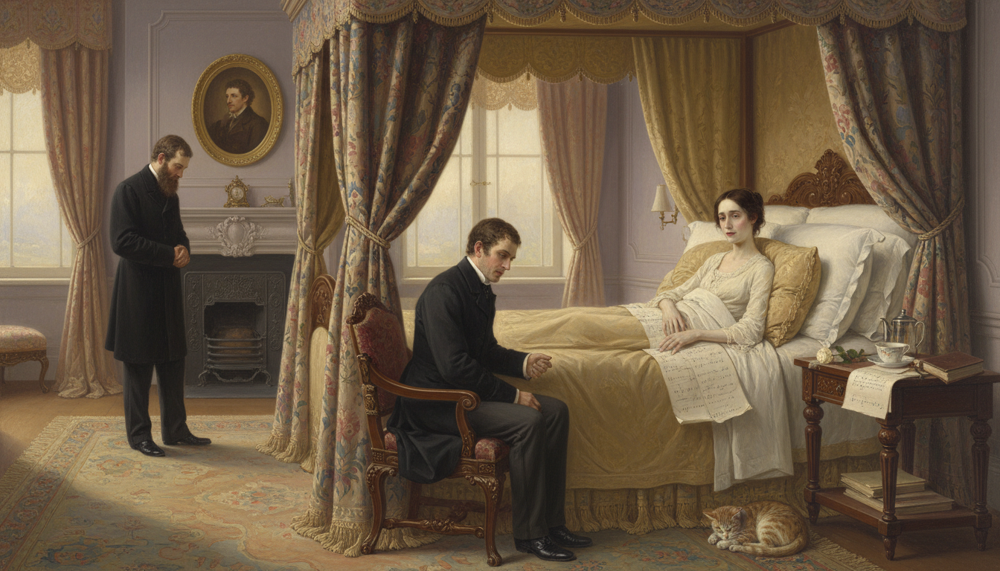

Image Prompt

Please generate a 16:9 image in Victorian Pre-Raphaelite painting style depicting panel 11 of 12. Make the characters and style consistent with the prior panels. The scene shows Ada in 1852, pale and thin at age 36, lying propped up on pillows in a grand canopied bed in her London home. Her husband William sits beside her holding her hand, and a doctor stands nearby. A bedside table holds her unfinished mathematical notes and a single white rose. Color palette: pale ivory, muted rose, lavender gray, soft gold. Emotional tone: sorrowful but dignified, a bright life ending too soon. Include heavy brocade curtains half-drawn, a small oil portrait of Byron on the wall, a Bible, a prayer book, a teacup, filtered afternoon light, and a quiet tabby cat at the foot of the bed. Generate the image immediately without asking clarifying questions.

Ada Lovelace died of uterine cancer in 1852, only thirty-six years old — the same age at which her father, Lord Byron, had died. She was buried beside him at her own request, finally reunited with the parent she had never met. Her notes on the Analytical Engine were largely forgotten for nearly a century.

## Panel 12: Rediscovered by the Computer Age

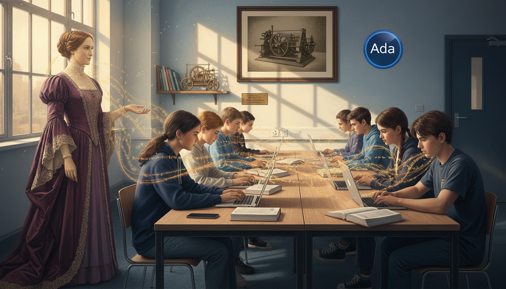

Image Prompt

Please generate a 16:9 image in Victorian Pre-Raphaelite style blended with modern photorealism depicting panel 12 of 12. Make the style consistent with the prior panels. The scene shows a modern computer science classroom where a diverse group of teenage students work at laptops. A translucent ghostly Ada Lovelace in her plum gown watches proudly from a corner, while glowing lines of code stream from her fingertips toward the students' screens. On a wall hangs a framed historical photograph of the Analytical Engine, and beside it the official logo of the Ada programming language. Color palette: modern classroom blue and white, sepia Ada, glowing amber code, plum highlights. Emotional tone: vindication, legacy, quiet pride. Include open IB math textbooks, a modern smartphone, a small brass model of the Analytical Engine on a shelf, sunlight through windows, and a small plaque reading "Ada Lovelace Day." Generate the image immediately without asking clarifying questions.

In the 1950s, as the first real computers came online, pioneers like Alan Turing read Ada's 1843 notes and realized she had described their own machines in startling detail. The U.S. Department of Defense later named the programming language *Ada* in her honor. Today, Ada Lovelace Day celebrates women in science every October — a small debt repaid to a woman who saw functions as something that could move through wires and wheels and light, long before any of those things existed.

### Epilogue – What Made Ada Different?

Ada grew up in an age that did not believe women could do mathematics, surrounded by a family scandal she did not choose, and in a body that was often ill. None of that stopped her from thinking bigger than the men around her. While Babbage saw his engine as a very clever calculator, Ada saw a general-purpose machine that could act on *any* symbolic input — the core idea of modern computing. That leap of imagination is the real inheritance she left us.

| Challenge | How Ada Responded | Lesson for Today |
|-----------|--------------------|------------------|
| A scandalous family name | Let her work speak for itself | Don't let your story be written for you |
| Chronic illness as a child | Studied flight and mechanics from bed | Constraints can sharpen imagination |
| A field closed to women | Found mentors who believed in her | The right teacher changes everything |
| A machine that did not yet exist | Imagined its software anyway | Ideas can outpace the hardware |

### Call to Action

The next time you run a piece of code or type an expression into a graphing calculator, remember that a nineteenth-century countess imagined that moment before the first lightbulb was switched on. When you think about what a function can do, follow Ada's example — don't stop at numbers. Functions can act on letters, images, sounds, and ideas, and the biggest steps forward usually come from the person willing to think one layer bigger than everyone else.

---

*"The Analytical Engine weaves algebraic patterns just as the Jacquard loom weaves flowers and leaves."*
—Ada Lovelace

*"Imagination is the Discovering Faculty, pre-eminently. It is that which penetrates into the unseen worlds around us, the worlds of Science."*
—Ada Lovelace

---

## References

1. [Wikipedia: Ada Lovelace](https://en.wikipedia.org/wiki/Ada_Lovelace) - Biography of the English mathematician often called the first programmer
2. [Wikipedia: Analytical Engine](https://en.wikipedia.org/wiki/Analytical_Engine) - Babbage's proposed mechanical general-purpose computer
3. [Wikipedia: Note G](https://en.wikipedia.org/wiki/Note_G) - Lovelace's note describing the first published algorithm
4. [MacTutor: Augusta Ada King, Countess of Lovelace](https://mathshistory.st-andrews.ac.uk/Biographies/Lovelace/) - University of St Andrews history of mathematics archive
5. [Encyclopaedia Britannica: Ada Lovelace](https://www.britannica.com/biography/Ada-Lovelace) - Overview of Lovelace's life and contributions to computing
