# Alan Turing: The Secret Codebreaker

Cover Image Prompt

Please generate a wide-landscape 16:9 cover image in 1940s WWII noir art style depicting young British mathematician Alan Turing standing in front of his Bombe codebreaking machine at Bletchley Park. Include the title text "The Secret Codebreaker" rendered in a period-appropriate wartime stencil typeface. Color palette: muted olive, khaki, deep brown, and warm amber highlights from tungsten lamps. Emotional tone: tense but hopeful, heroic determination. Turing is a thin young man in his early 30s with short dark hair, wearing a rumpled tweed jacket over a shirt and tie, pencil in hand, staring at a tall black machine covered in rotating drums and colorful wiring. Behind him, coded paper tape cascades across a wooden desk covered with logic diagrams, and a single window shows blackout curtains with moonlight leaking through. Dramatic chiaroscuro lighting. Generate the image immediately without asking clarifying questions.

Narrative Prompt

This graphic novel tells the story of Alan Turing (1912-1954), the British mathematician and logician whose work on computable functions and the theoretical "Turing machine" became the foundation of modern computer science. Set primarily during World War II at Bletchley Park in Buckinghamshire, England, the story shows how Turing used mathematical functions, statistical reasoning, and mechanical computation to break the German Enigma cipher. Keep Turing's appearance consistent across all panels: thin athletic build, dark hair combed to the side, tweed jacket and tie, serious but kind blue eyes. The supporting cast includes Joan Clarke (young woman mathematician with dark hair pulled back) and various Royal Navy officers in olive uniforms. The overall visual style should feel like a 1940s noir graphic novel with heavy shadows, limited color palette, and a sense of quiet urgency.

### Prologue – A Function That Could Save the World

In the darkest days of World War II, Nazi U-boats were sinking Allied ships faster than they could be built. The only way to stop them was to read the Nazis' secret messages, encoded by a machine called Enigma. At a secret country estate called Bletchley Park, a shy young Cambridge mathematician believed that every cipher was just a function, and every function could be inverted. His name was Alan Turing.

## Panel 1: The Boy Who Loved Patterns

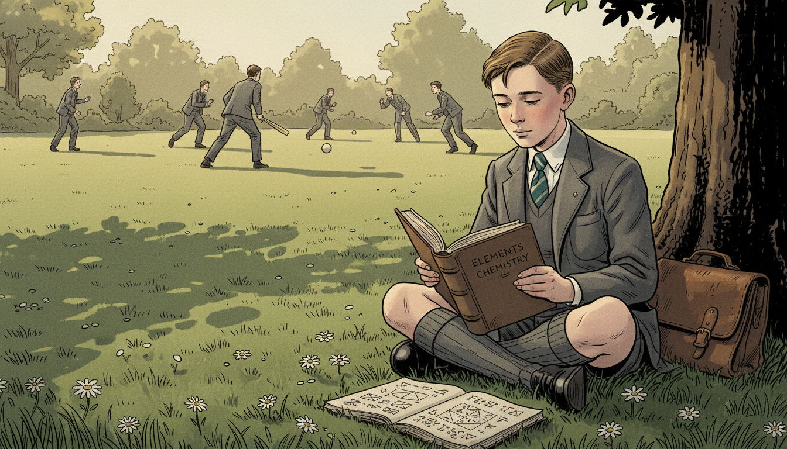

Image Prompt

I am about to ask you to generate a series of images for a graphic novel. Please make the images have a consistent style and consistent characters. Do not ask any clarifying questions. Just generate the image immediately when asked.

Please generate a 16:9 image in 1940s WWII noir style depicting panel 1 of 12. The scene shows a young 10-year-old Alan Turing in 1922 sitting cross-legged in an English garden at Sherborne School, intently reading a worn book on chemistry while other boys play cricket in the background. He wears a gray wool school uniform with short pants, knee socks, and a striped tie. Color palette: muted olive, sage green, cream, faded gold sunlight. Emotional tone: quiet curiosity and gentle isolation. Include scattered daisies, a leather satchel beside him, mathematical doodles in a notebook at his feet, and long afternoon shadows stretching across manicured lawn. Generate the image immediately without asking clarifying questions.

Alan Turing grew up fascinated by how things worked. While other boys played cricket, he read science books and scribbled equations in the margins. Even as a child, he believed the universe ran on hidden rules you could discover with patience and pencil. He saw patterns everywhere.

## Panel 2: Cambridge Dreams

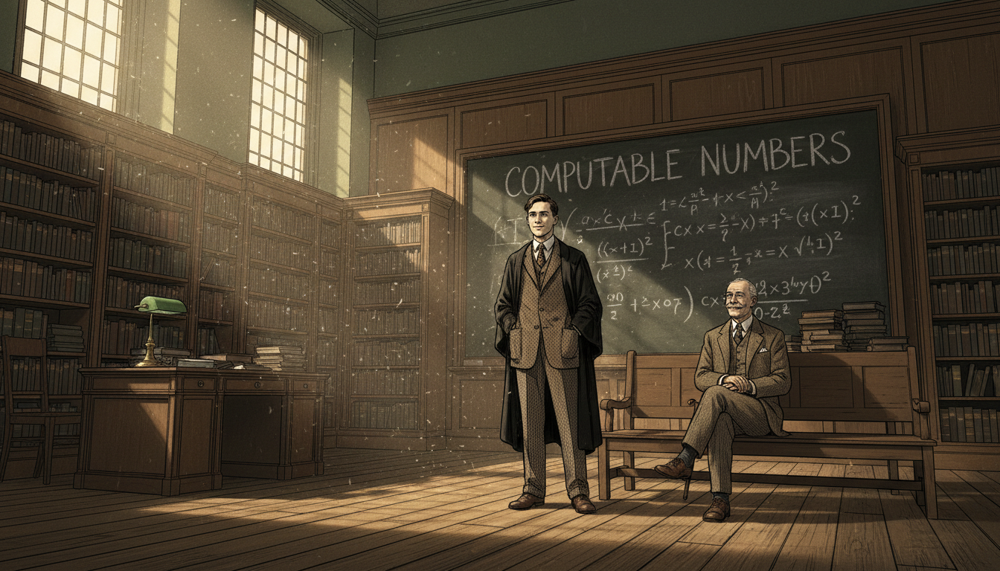

Image Prompt

I am about to ask you to generate a series of images for a graphic novel. Please make the images have a consistent style and consistent characters. Do not ask any clarifying questions. Just generate the image immediately when asked.

Please generate a 16:9 image in 1940s WWII noir style depicting panel 2 of 12. The scene shows 22-year-old Alan Turing in 1934 at King's College Cambridge, standing in a wood-paneled lecture hall at a chalkboard covered with logical symbols and the phrase "computable numbers." He wears a tweed jacket, wool tie, and black academic gown draped over his shoulders. An older professor with white mustache watches approvingly from a front-row bench. Color palette: warm oak brown, chalky white, deep forest green, amber gaslight. Emotional tone: intellectual awakening. Include leaded windows, towering bookshelves, a brass reading lamp, stacks of journals, and dust motes floating in a shaft of sunlight. Generate the image immediately without asking clarifying questions.

At Cambridge, Turing imagined a machine that could compute any function a human mathematician could compute. He described it with pure logic: an infinite tape, a reading head, and a set of rules. Today we call it a Turing machine. It was the theoretical blueprint for every computer that would ever be built.

## Panel 3: War Breaks Out

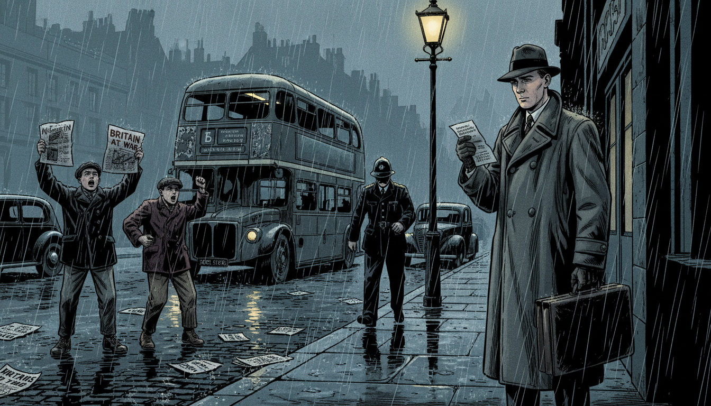

Image Prompt

I am about to ask you to generate a series of images for a graphic novel. Please make the images have a consistent style and consistent characters. Do not ask any clarifying questions. Just generate the image immediately when asked.

Please generate a 16:9 image in 1940s WWII noir style depicting panel 3 of 12. The scene shows a rainy London street in September 1939 with newsboys shouting and headlines reading "BRITAIN AT WAR." Alan Turing, now 27, stands on the curb in a long wool overcoat holding a leather briefcase, reading a telegram summoning him to Bletchley. Color palette: slate gray, rainy blue, dim yellow streetlamp, deep black. Emotional tone: somber resolve. Include double-decker bus in background, scattered newspapers blowing in wind, wet cobblestones reflecting streetlights, blackout-painted car headlights, and an ARP warden in helmet walking past. Generate the image immediately without asking clarifying questions.

When Hitler invaded Poland in September 1939, Britain declared war. Within days, Turing received orders to report to a mysterious country house called Bletchley Park. The government needed its best mathematicians to fight a different kind of battle, one waged with numbers, not guns.

## Panel 4: The Enigma Machine

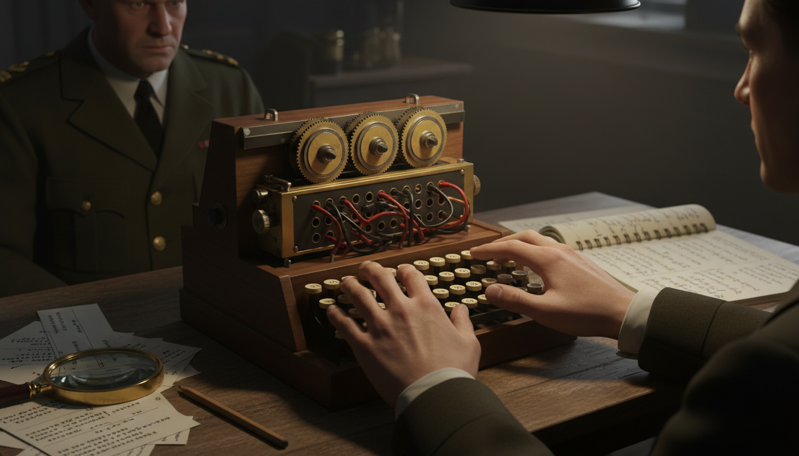

Image Prompt

I am about to ask you to generate a series of images for a graphic novel. Please make the images have a consistent style and consistent characters. Do not ask any clarifying questions. Just generate the image immediately when asked.

Please generate a 16:9 image in 1940s WWII noir style depicting panel 4 of 12. The scene shows a close-up of a German Enigma cipher machine on a wooden table at Bletchley Park, with its three rotor wheels, plugboard cables, and typewriter keys clearly visible. Alan Turing's hands hover over it as he studies the device. In the background, out of focus, a Royal Navy officer in olive uniform watches intently. Color palette: dark walnut brown, brass gold, olive drab, ivory key caps. Emotional tone: fascination mixed with urgency. Include coded message slips, a magnifying glass, pencil, notebook with scribbled permutations, and harsh overhead lamp casting deep shadows. Generate the image immediately without asking clarifying questions.

The Enigma machine scrambled German messages with 158 million million million possible settings. Each keystroke ran a letter through a function of rotors and wires. To break it, Turing needed to invert that function every single day, before the Germans changed the settings. It seemed impossible.

## Panel 5: Bletchley Park at Night

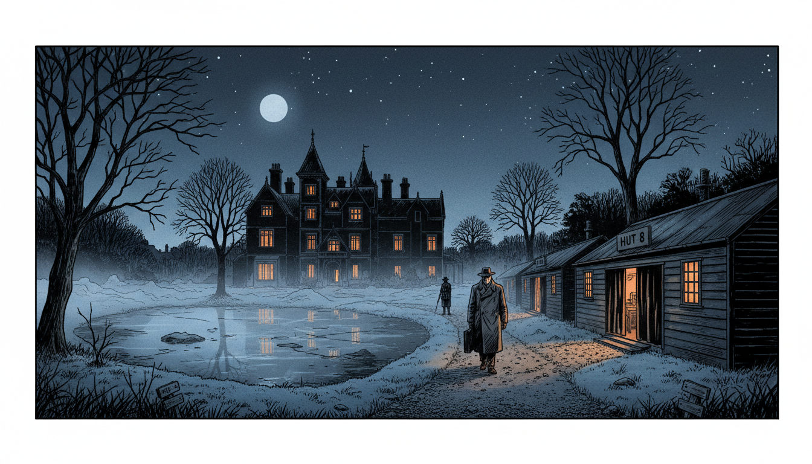

Image Prompt

I am about to ask you to generate a series of images for a graphic novel. Please make the images have a consistent style and consistent characters. Do not ask any clarifying questions. Just generate the image immediately when asked.

Please generate a 16:9 image in 1940s WWII noir style depicting panel 5 of 12. The scene shows a wide exterior view of Bletchley Park mansion and its wartime wooden huts at night in 1940, moonlight on the lake, blackout curtains glowing faintly from within. A lone figure of Alan Turing in overcoat walks along a gravel path between Hut 6 and Hut 8. Color palette: midnight blue, charcoal, pale silver moonlight, warm orange window glow. Emotional tone: mysterious, quiet determination. Include Victorian turrets of the main house, bare winter trees, a single military sentry with rifle, swirling fog, frost on the grass, and stars above the roofline. Generate the image immediately without asking clarifying questions.

Bletchley Park was Britain's best-kept secret. Inside plain wooden huts, thousands of people worked in shifts around the clock. Turing led Hut 8, the team attacking the Naval Enigma. Lives depended on every message they decoded.

## Panel 6: Joan Clarke Joins the Team

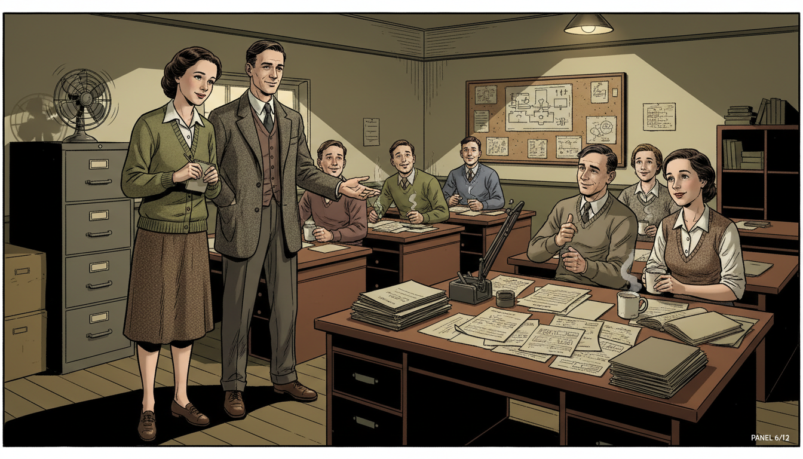

Image Prompt

I am about to ask you to generate a series of images for a graphic novel. Please make the images have a consistent style and consistent characters. Do not ask any clarifying questions. Just generate the image immediately when asked.

Please generate a 16:9 image in 1940s WWII noir style depicting panel 6 of 12. The scene shows the interior of Hut 8 at Bletchley Park with Alan Turing introducing young mathematician Joan Clarke to his team. Joan is 23, with dark hair pinned back, wearing a simple green cardigan over a cream blouse and tweed skirt. Turing gestures toward a desk covered with intercepted messages. Color palette: warm cream, olive green, mahogany, soft lamp yellow. Emotional tone: collegial welcome. Include wooden desks in rows, men and women in civilian clothes working with paper and pencils, cork board covered with diagrams, steaming tea mugs, and a single electric fan on a filing cabinet. Generate the image immediately without asking clarifying questions.

Joan Clarke was one of the few women mathematicians recruited to Bletchley. She was brilliant, and Turing treated her as an equal at a time when few men did. Together they refined a technique called "Banburismus" that used probability to narrow down Enigma's daily settings. It turned guesswork into a science.

## Panel 7: Building the Bombe

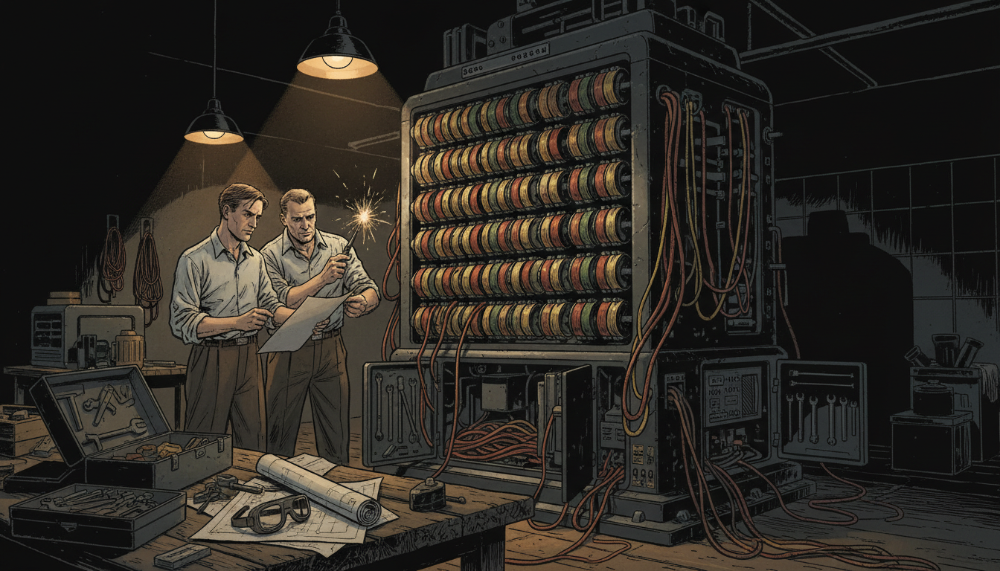

Image Prompt

I am about to ask you to generate a series of images for a graphic novel. Please make the images have a consistent style and consistent characters. Do not ask any clarifying questions. Just generate the image immediately when asked.

Please generate a 16:9 image in 1940s WWII noir style depicting panel 7 of 12. The scene shows the Bombe machine being assembled: a towering black cabinet, about 7 feet tall, covered in rows of rotating colored drums with red, yellow, and green wiring hanging in loops. Alan Turing and an engineer in rolled-up shirtsleeves adjust the rotors together. Color palette: deep black cabinet, rust red, mustard yellow, copper wire, workshop amber lighting. Emotional tone: mechanical triumph. Include toolboxes, schematic blueprints spread on a workbench, wires spilling from open panels, a pair of safety goggles, and sparks from a soldering iron. Generate the image immediately without asking clarifying questions.

Turing designed an electromechanical machine called the Bombe. It tested thousands of Enigma settings at once, eliminating impossible combinations through pure logic. Where a human would take centuries, the Bombe could finish in hours. It was a function machine, brought to life.

## Panel 8: The First Break

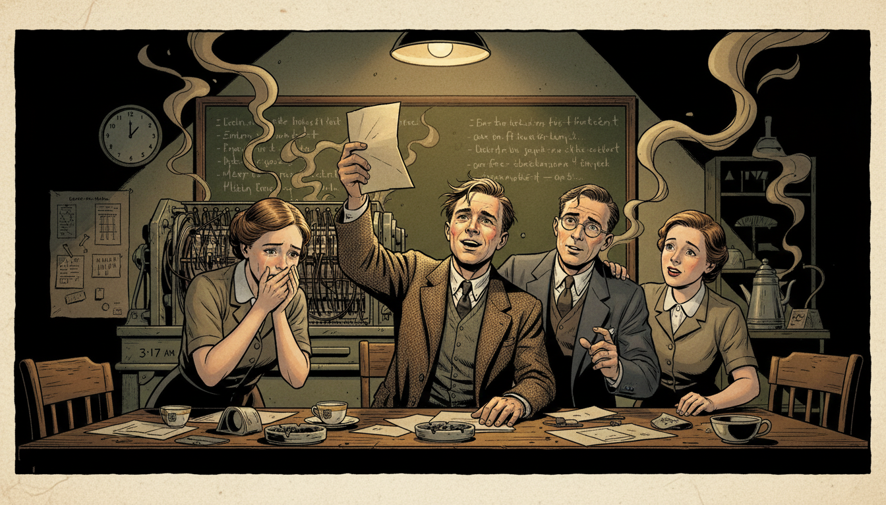

Image Prompt

I am about to ask you to generate a series of images for a graphic novel. Please make the images have a consistent style and consistent characters. Do not ask any clarifying questions. Just generate the image immediately when asked.

Please generate a 16:9 image in 1940s WWII noir style depicting panel 8 of 12. The scene shows the moment of breakthrough in Hut 8: Alan Turing holds up a decoded message as Joan Clarke and two other codebreakers lean in, faces lit with disbelief and joy. A Bombe machine whirs in the background. Color palette: warm gold lamplight, olive drab, cream paper, deep shadow. Emotional tone: electric triumph. Include a wall clock reading 3:17 AM, scattered paper slips, empty tea cups, a chalkboard full of German plaintext, cigarette smoke curling in the light, and tears of relief in one codebreaker's eyes. Generate the image immediately without asking clarifying questions.

One night in 1941, the Bombe cracked a Naval Enigma message. German U-boat orders that had been gibberish moments before suddenly spoke in plain German. The room erupted in silent celebration. Turing had inverted the uninvertible function.

## Panel 9: Battle of the Atlantic

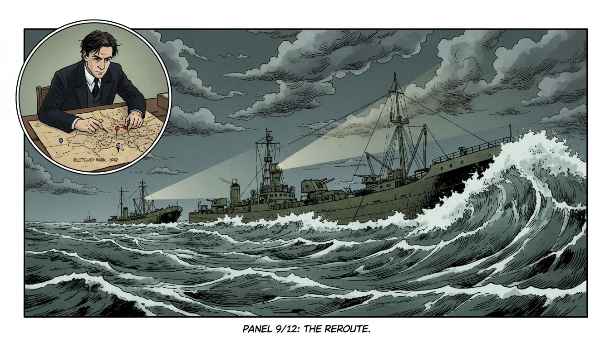

Image Prompt

I am about to ask you to generate a series of images for a graphic novel. Please make the images have a consistent style and consistent characters. Do not ask any clarifying questions. Just generate the image immediately when asked.

Please generate a 16:9 image in 1940s WWII noir style depicting panel 9 of 12. The scene shows an Allied convoy of cargo ships being rerouted around a U-boat wolfpack in the stormy North Atlantic, 1942. Inset in the upper left corner, a small panel shows Alan Turing at a desk at Bletchley marking a map with colored pins. Color palette: stormy gray-green ocean, white foam, slate sky, olive ship hulls, red warning pins. Emotional tone: hidden heroism. Include towering waves, a destroyer with anti-aircraft guns, merchant ships silhouetted against dark clouds, a periscope trail just missed, and dramatic searchlight beams. Generate the image immediately without asking clarifying questions.

Every decoded message helped Allied convoys dodge U-boats. Thousands of sailors reached port safely, never knowing their lives were saved by a mathematician they had never met. Historians estimate Turing's work shortened the war by at least two years and saved 14 million lives.

## Panel 10: The Universal Machine

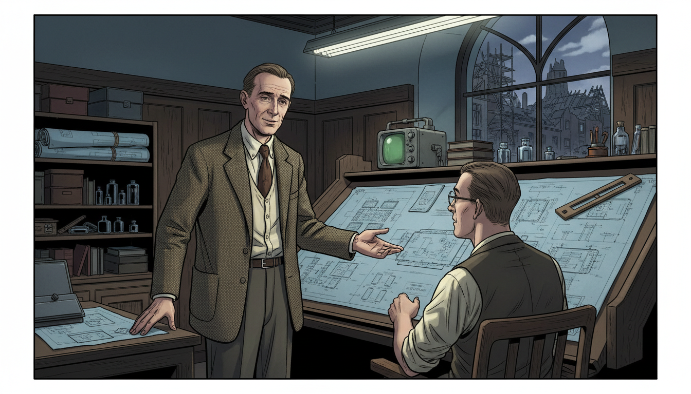

Image Prompt

I am about to ask you to generate a series of images for a graphic novel. Please make the images have a consistent style and consistent characters. Do not ask any clarifying questions. Just generate the image immediately when asked.

Please generate a 16:9 image in 1940s WWII noir style depicting panel 10 of 12. The scene shows postwar Alan Turing in 1946 at the National Physical Laboratory in London, standing beside blueprints for the ACE computer, gesturing to a colleague at a drafting table. He wears the same tweed jacket but looks older and more tired. Color palette: drafting blue, cream paper, oak brown, soft overhead fluorescent white. Emotional tone: visionary quietness. Include rolled-up schematics, a slide rule, ink wells, an early oscilloscope, scattered vacuum tubes on a shelf, and a window showing the rebuilding of bombed London rooftops. Generate the image immediately without asking clarifying questions.

After the war, Turing designed one of the first true stored-program computers, the ACE. He imagined machines that could learn, play chess, and even hold conversations. He was describing artificial intelligence decades before anyone had a name for it. Every app on your phone traces its lineage back to his ideas.

## Panel 11: Persecution and Loss

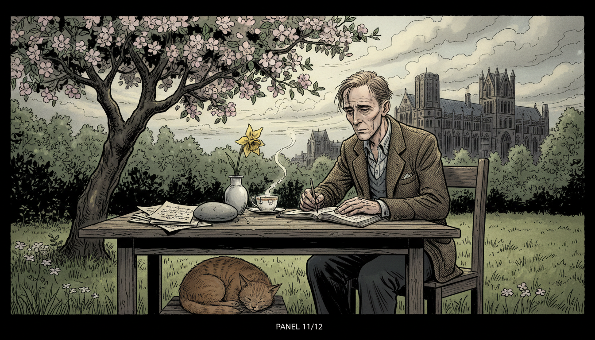

Image Prompt

I am about to ask you to generate a series of images for a graphic novel. Please make the images have a consistent style and consistent characters. Do not ask any clarifying questions. Just generate the image immediately when asked.

Please generate a 16:9 image in 1940s WWII noir style depicting panel 11 of 12. The scene shows Alan Turing alone at a garden table in Manchester in 1953, writing in a notebook, a half-drunk cup of tea beside him. He looks thin and thoughtful. In the distance, a university building rises against a cloudy sky. Color palette: overcast gray, muted moss green, faded brown, pale sunlight through clouds. Emotional tone: dignified sorrow and quiet resilience. Include an apple tree in bloom, a curled sleeping tabby cat at his feet, stacks of mathematical papers held down by a stone, and a single yellow daffodil in a chipped vase. Generate the image immediately without asking clarifying questions.

In 1952, Britain's unjust laws made Turing's private life a crime, and he was prosecuted for being gay. Despite saving the nation, he was treated cruelly by the government he had served. He died in 1954, still only 41. The world had lost one of its greatest minds far too soon.

## Panel 12: Legacy in Every Screen

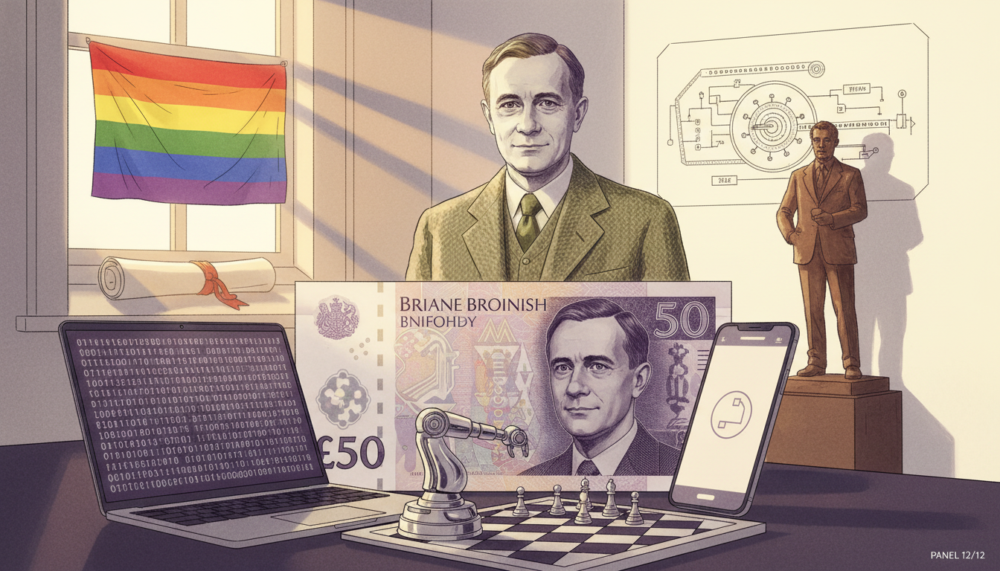

Image Prompt

I am about to ask you to generate a series of images for a graphic novel. Please make the images have a consistent style and consistent characters. Do not ask any clarifying questions. Just generate the image immediately when asked.

Please generate a 16:9 image in 1940s WWII noir style blended with modern accents depicting panel 12 of 12. The scene shows a reverent tribute: Alan Turing's portrait on the modern British 50-pound note, displayed alongside a modern laptop, a smartphone, and a chess-playing robot. A ghostly image of Turing in his tweed jacket stands behind the modern objects, smiling gently. Color palette: purple (Turing note), silver, muted olive from his jacket, warm white background. Emotional tone: grateful remembrance and enduring hope. Include a Pride flag in a window, a Cambridge diploma, a schematic of a Turing machine tape, a bronze statue silhouette, and soft rays of dawn light. Generate the image immediately without asking clarifying questions.

Today Turing is recognized as the father of computer science, and his face appears on British currency. The Turing Award is computing's highest honor. Every function you graph, every program that runs, every AI that answers a question owes something to the shy mathematician who believed the universe could be computed. His story reminds us that mathematical ideas can change the world.

### Epilogue – What Made Turing Different?

Alan Turing saw functions where others saw chaos. He believed that if a problem could be described precisely, a machine could solve it. That single insight built the digital age.

| Challenge | How Turing Responded | Lesson for Today |
|-----------|----------------------|------------------|
| An unbreakable cipher | Treated it as a function to invert | Big problems become smaller when you name them mathematically |
| No computer existed | He invented one on paper first | Theory often comes before the hardware |
| Society rejected who he was | He kept working with dignity | Your worth is not defined by others' prejudice |
| A war to win | Used logic and probability together | Math saves lives, not just grades |

### Call to Action

Next time you use a computer, remember: you are holding a descendant of Turing's imagined machine. Every function, every loop, every decoded message traces back to a young mathematician who refused to believe any problem was too hard. Be curious like Alan. Be brave like Alan. And when you invert a function in class, give him a quiet nod.

---

*"We can only see a short distance ahead, but we can see plenty there that needs to be done."*
—Alan Turing

*"Sometimes it is the people no one imagines anything of who do the things that no one can imagine."*
—Alan Turing

---

## References

1. [Alan Turing: The Enigma](PLACEHOLDER) - Andrew Hodges' definitive biography of Turing
2. [Bletchley Park Official Site](PLACEHOLDER) - History of the codebreaking operation
3. [The Turing Digital Archive](PLACEHOLDER) - King's College Cambridge collection of Turing's papers
4. [On Computable Numbers (1936)](PLACEHOLDER) - Turing's original paper introducing the Turing machine
5. [Imperial War Museum: Codebreakers](PLACEHOLDER) - Archive materials on WWII cryptography
