# Benoit Mandelbrot: The Shape of Nature

Cover Image Prompt

Please generate a wide-landscape 16:9 cover image in late 20th century digital/computational aesthetic with fractal motifs depicting Benoit Mandelbrot in his late 50s, a distinguished man with full silver hair, rounded cheeks, and warm eyes behind rectangular glasses, wearing a brown corduroy jacket over a turtleneck at an IBM research lab in 1980. Include the title text "The Shape of Nature" rendered in a retro computer-terminal typeface. Color palette: deep indigo, electric magenta, cyan, neon green, and warm amber monitor glow. Emotional tone: wonder at infinite complexity. Behind him, a large CRT monitor displays the iconic Mandelbrot set in vivid colors, and the background shows overlapping fractal coastlines, branching trees, and lightning-bolt self-similar patterns. Include a thick printout of computer code, a magnifying glass, scattered scientific papers, and fractal wallpaper pattern behind his shoulder. Generate the image immediately without asking clarifying questions.

Narrative Prompt

This graphic novel tells the story of Benoit Mandelbrot (1924-2010), the Polish-French-American mathematician who founded fractal geometry and showed that nature's irregular shapes could be described by iterated functions. The story spans his childhood in Warsaw, his refugee years in wartime France, his IBM research career in Yorktown Heights New York, and his later years at Yale. Keep Mandelbrot's appearance consistent: later in life, he has a rounded friendly face, full silver hair swept back, rectangular glasses, and wears tweed or corduroy jackets over turtlenecks. Early panels should show him as a dark-haired young man in 1930s Polish or 1940s French clothing. Visual style should feel like a late 20th century digital-age illustrated book, mixing traditional figure illustration with vivid fractal imagery, CRT monitor glow, and a computational palette of neon and deep blues.

### Prologue – The Mathematician Who Saw What Others Missed

For centuries, mathematicians treated nature's rough edges, jagged coastlines, puffy clouds, branching trees, as too messy for math. Benoit Mandelbrot saw them differently. He realized that roughness itself has a pattern, and that pattern is a function repeated infinitely. He called it a fractal, and it changed how we see the world.

## Panel 1: A Boy Between Worlds

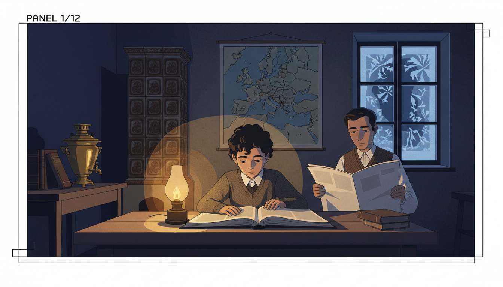

Image Prompt

I am about to ask you to generate a series of images for a graphic novel. Please make the images have a consistent style and consistent characters. Do not ask any clarifying questions. Just generate the image immediately when asked.

Please generate a 16:9 image in late 20th century digital/computational illustration style depicting panel 1 of 12. The scene shows 10-year-old Benoit Mandelbrot in 1934 Warsaw Poland, seated at a wooden kitchen table poring over a geometry book by lamplight while his father, a dark-haired man in a vest reading a newspaper, watches quietly. Young Benoit has dark curly hair and wears a wool sweater over a collared shirt. Color palette: warm amber lamp, deep indigo shadow, muted brown, cream pages. Emotional tone: quiet wonder in troubled times. Include a tiled stove in the corner, a samovar, a map of Europe on the wall, stacks of books, and frost on the window. Generate the image immediately without asking clarifying questions.

Benoit Mandelbrot was born in Warsaw in 1924 into a Jewish family that valued learning above everything. His uncle was a famous mathematician, and books filled every room. Benoit was more interested in pictures than formulas. Where others saw words and symbols, he saw shapes.

## Panel 2: Refugee in France

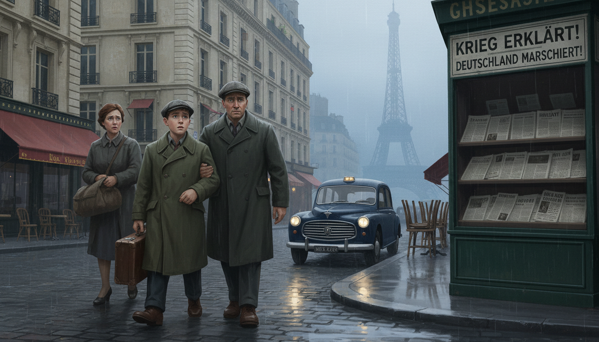

Image Prompt

I am about to ask you to generate a series of images for a graphic novel. Please make the images have a consistent style and consistent characters. Do not ask any clarifying questions. Just generate the image immediately when asked.

Please generate a 16:9 image in late 20th century digital/computational illustration style depicting panel 2 of 12. The scene shows 15-year-old Benoit in 1939 arriving in Paris with his family, carrying a small leather suitcase, walking past grand Haussmann buildings while German newspapers headline war. He wears a worn wool coat and a flat cap. His parents walk alongside him looking anxious. Color palette: slate gray, muted cream limestone, faded red awnings, rain-blue sky. Emotional tone: displacement and resilience. Include a vintage Peugeot taxi, Parisian cafes with chairs stacked up, a distant Eiffel Tower through mist, wet cobblestones, and a newsstand. Generate the image immediately without asking clarifying questions.

As the Nazi threat grew, the Mandelbrot family fled Poland for France. Benoit's education was interrupted again and again. When the Germans invaded France, the family hid in the countryside, where a teenage Benoit taught himself mathematics from old textbooks. Survival and curiosity went hand in hand.

## Panel 3: Hidden in Tulle

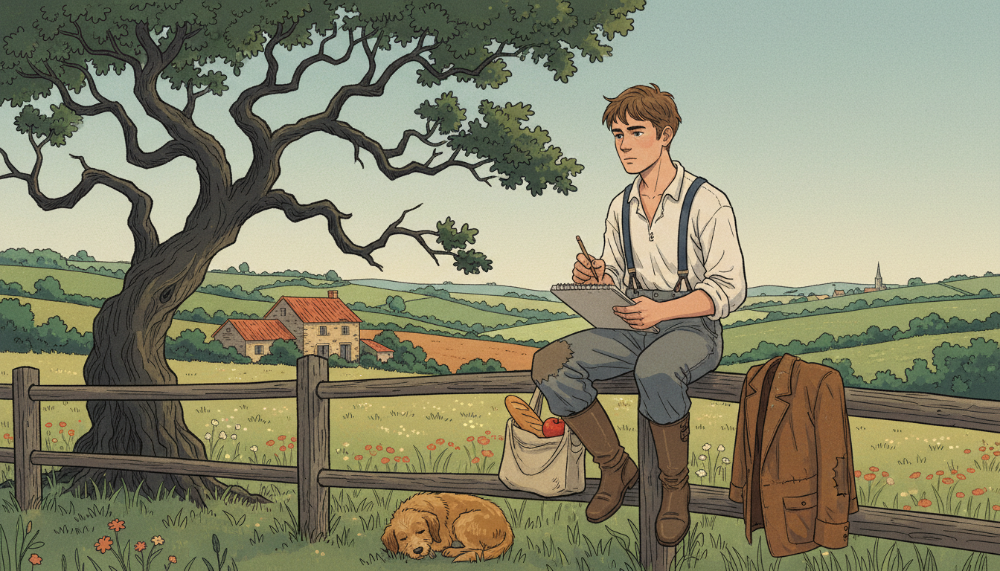

Image Prompt

I am about to ask you to generate a series of images for a graphic novel. Please make the images have a consistent style and consistent characters. Do not ask any clarifying questions. Just generate the image immediately when asked.

Please generate a 16:9 image in late 20th century digital/computational illustration style depicting panel 3 of 12. The scene shows 18-year-old Benoit in 1942 in the countryside near Tulle France, sitting on a wooden fence sketching the irregular shape of a tree's branches in a notebook. A pastoral French landscape spreads behind him: rolling hills, hedgerows, a stone farmhouse. He wears a rough shirt and suspenders with a patched jacket beside him. Color palette: soft sage, warm terracotta, ochre, muted sky blue. Emotional tone: contemplative peace amid danger. Include wildflowers, a sleeping farm dog, a small satchel with bread and an apple, and a distant church spire. Generate the image immediately without asking clarifying questions.

While hiding from the Nazis in the French countryside, Benoit noticed how tree branches split into smaller branches that looked just like the whole tree. Ferns did the same. So did clouds. He did not yet have a word for this pattern, but the seed of fractal geometry was planted in those quiet fields.

## Panel 4: The Geometric Mind

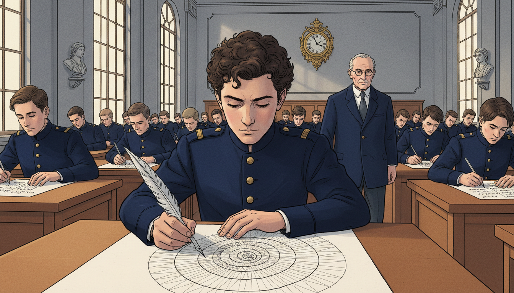

Image Prompt

I am about to ask you to generate a series of images for a graphic novel. Please make the images have a consistent style and consistent characters. Do not ask any clarifying questions. Just generate the image immediately when asked.

Please generate a 16:9 image in late 20th century digital/computational illustration style depicting panel 4 of 12. The scene shows young Benoit Mandelbrot in 1945 at the Ecole Polytechnique in Paris taking an entrance exam, solving a complex problem by sketching a geometric diagram while other students write algebraic equations. He is 21, wearing a school uniform with brass buttons, with dark curly hair. An examiner walks between the rows. Color palette: chalk white, deep navy uniforms, warm wood, institutional gray. Emotional tone: unconventional brilliance. Include tall arched windows, stone walls, an ornate clock, quill-style fountain pens, and a bust of a mathematician on a pedestal. Generate the image immediately without asking clarifying questions.

At France's elite Ecole Polytechnique, Benoit shocked his professors by solving algebra problems with pictures. His brain worked geometrically. He could see shapes hidden inside equations. Mainstream mathematics at the time preferred symbols to pictures, so Benoit became a mathematical outsider, but he kept seeing.

## Panel 5: IBM Opens a Door

Image Prompt

I am about to ask you to generate a series of images for a graphic novel. Please make the images have a consistent style and consistent characters. Do not ask any clarifying questions. Just generate the image immediately when asked.

Please generate a 16:9 image in late 20th century digital/computational illustration style depicting panel 5 of 12. The scene shows Benoit in 1958 at IBM's Thomas J. Watson Research Center in Yorktown Heights, New York, standing in a modernist glass-and-steel lobby with the IBM logo prominent. He wears a charcoal suit and carries a briefcase. An IBM recruiter in a gray suit shakes his hand. Color palette: cool corporate blue, steel gray, cream, warm wood paneling. Emotional tone: new beginning. Include a mid-century modern reception desk, a large globe sculpture, men in skinny ties, a portrait of Thomas Watson, and glimpse of massive mainframe computers through a window. Generate the image immediately without asking clarifying questions.

Universities often rejected Benoit's unusual ideas, so in 1958 he joined IBM as a research fellow. IBM gave him something rare: freedom to explore. And it gave him something even rarer for the era: access to some of the world's most powerful computers. That combination would change mathematics forever.

## Panel 6: The Length of a Coastline

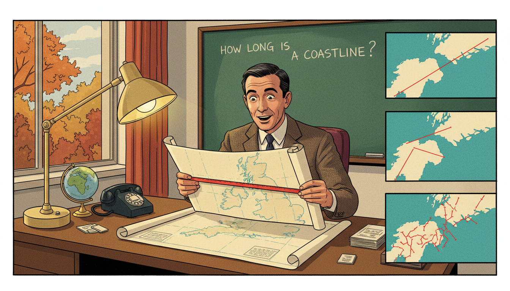

Image Prompt

I am about to ask you to generate a series of images for a graphic novel. Please make the images have a consistent style and consistent characters. Do not ask any clarifying questions. Just generate the image immediately when asked.

Please generate a 16:9 image in late 20th century digital/computational illustration style depicting panel 6 of 12. The scene shows Benoit at his IBM office desk in 1967, holding up a map of Britain with a ruler, zooming into progressively smaller sections showing more and more jagged coastline detail. Inset panels on the right show the coast measured at 3 different zoom levels. Color palette: ocean teal, cream map, red measurement lines, warm desk lamp. Emotional tone: eureka realization. Include an IBM desk lamp, a green chalkboard with the question "How long is a coastline?", a rotary phone, a globe, and a window with autumn trees visible. Generate the image immediately without asking clarifying questions.

In 1967, Benoit published a paper asking a strange question: "How long is the coast of Britain?" The answer shocked everyone. The more closely you measure, the longer the coastline becomes, because more tiny wiggles appear. Normal geometry could not handle this. A new kind of math was needed.

## Panel 7: Inventing Fractals

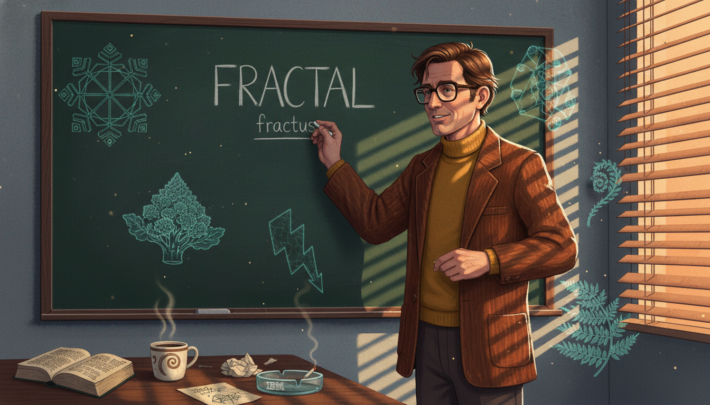

Image Prompt

I am about to ask you to generate a series of images for a graphic novel. Please make the images have a consistent style and consistent characters. Do not ask any clarifying questions. Just generate the image immediately when asked.

Please generate a 16:9 image in late 20th century digital/computational illustration style depicting panel 7 of 12. The scene shows Benoit in 1975 at a chalkboard writing the word "FRACTAL" in capital letters with the Latin root "fractus" underneath. Around him float translucent sketches of snowflakes, Romanesco broccoli, lightning bolts, and ferns. He wears a brown corduroy jacket over a mustard turtleneck. Color palette: chalkboard green, chalky white, burnt orange, teal accents. Emotional tone: naming a discovery. Include an open Latin dictionary, a cup of coffee, scribbled self-similar diagrams, an IBM ashtray, and beams of afternoon sun through venetian blinds. Generate the image immediately without asking clarifying questions.

Benoit needed a new word for the shapes he was seeing, rough, broken, endlessly detailed. He opened a Latin dictionary and found "fractus," meaning broken. He coined the word "fractal" in 1975. A fractal is made by applying the same function over and over, each output becoming the next input.

## Panel 8: The Mandelbrot Set Appears

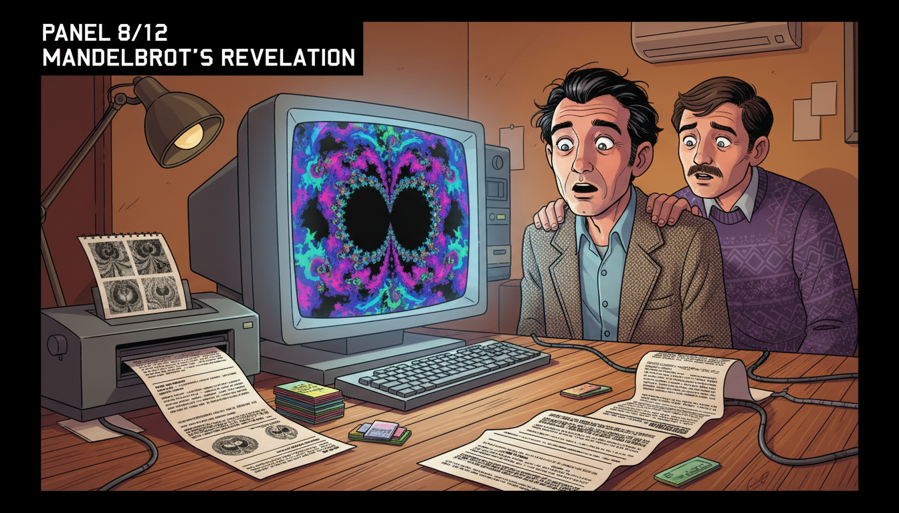

Image Prompt

I am about to ask you to generate a series of images for a graphic novel. Please make the images have a consistent style and consistent characters. Do not ask any clarifying questions. Just generate the image immediately when asked.

Please generate a 16:9 image in late 20th century digital/computational illustration style depicting panel 8 of 12. The scene shows Benoit in 1980 standing in front of a large IBM CRT monitor displaying the famous Mandelbrot set for the first time, its iconic heart-and-bulb black shape surrounded by swirling color. His face is lit by the screen's glow, eyes wide with astonishment. Color palette: deep violet, electric magenta, cyan, neon green, warm skin tones. Emotional tone: stunned wonder. Include a dot matrix printer spitting out early drafts, a line printer printout on the floor, stacks of punch cards, a younger colleague peeking over his shoulder, and the warm amber room light contrasting with the cool screen glow. Generate the image immediately without asking clarifying questions.

In 1980, Benoit asked an IBM computer to plot the function $z \rightarrow z^2 + c$ in the complex plane, coloring each point by whether it escaped to infinity. What appeared on the screen was an infinitely detailed shape of breathtaking beauty. It is now called the Mandelbrot set, the most famous fractal on Earth.

## Panel 9: Zoom In Forever

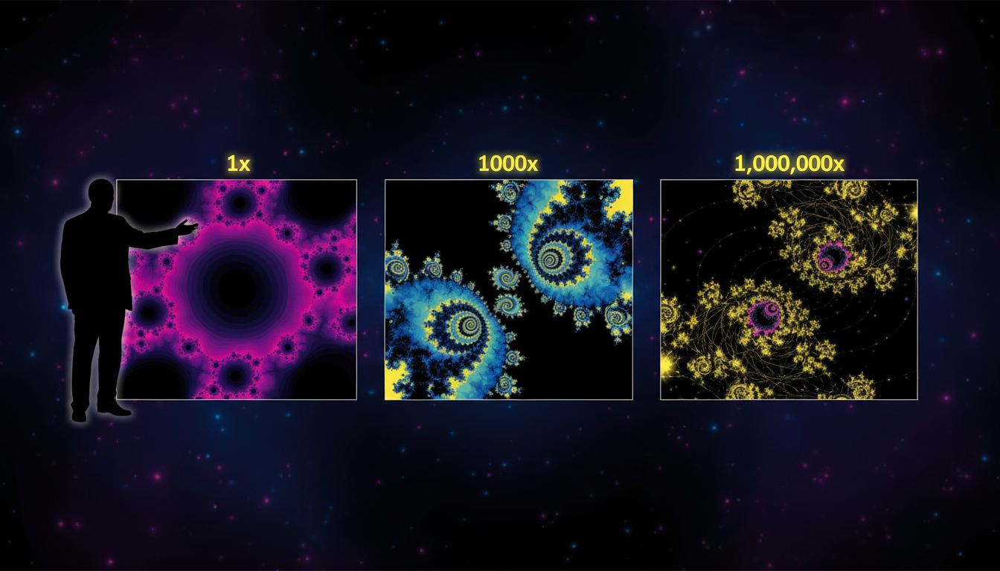

Image Prompt

I am about to ask you to generate a series of images for a graphic novel. Please make the images have a consistent style and consistent characters. Do not ask any clarifying questions. Just generate the image immediately when asked.

Please generate a 16:9 image in late 20th century digital/computational illustration style depicting panel 9 of 12. The scene shows a dramatic sequence of three Mandelbrot set zoom frames arranged left to right, each revealing smaller copies of the whole shape hidden within. A silhouette of Benoit stands at the left edge gesturing toward the sequence. Color palette: deep indigo, hot magenta, cerulean, electric yellow, black. Emotional tone: infinite mystery. Include scale labels "1x", "1000x", "1,000,000x", swirling filigree tendrils, tiny baby-Mandelbrot replicas, and stars of light where the set is densest. Generate the image immediately without asking clarifying questions.

The most amazing thing about the Mandelbrot set is that you can zoom in forever and always find new detail. Hidden deep inside are tiny copies of the whole shape, surrounded by galaxies of swirling color. It is a single mathematical function containing infinite surprise.

## Panel 10: Fractals in the Real World

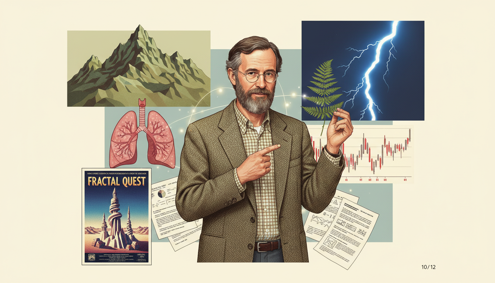

Image Prompt

I am about to ask you to generate a series of images for a graphic novel. Please make the images have a consistent style and consistent characters. Do not ask any clarifying questions. Just generate the image immediately when asked.

Please generate a 16:9 image in late 20th century digital/computational illustration style depicting panel 10 of 12. The scene shows a collage demonstrating fractals in nature and technology: a mountain range, a fern leaf, lightning, a human lung diagram, a stock market chart, and a movie landscape from a 1980s film. At the center, Benoit stands pointing to each with a teaching gesture. Color palette: earth greens, sky blue, lightning white, lung pink, chart red, cinematic cream. Emotional tone: connecting art and science. Include a computer-generated CGI landscape poster, a fern leaf held in his hand, a line chart with jagged peaks, and scattered research papers. Generate the image immediately without asking clarifying questions.

Fractals turned out to be everywhere. Mountains, clouds, lungs, stock markets, and galaxies all follow fractal rules. Hollywood studios used Mandelbrot's math to create realistic CGI landscapes for films like "Star Trek." Engineers used fractals to design cell phone antennas. His equations went from paper to planet.

## Panel 11: The Fractalist at Yale

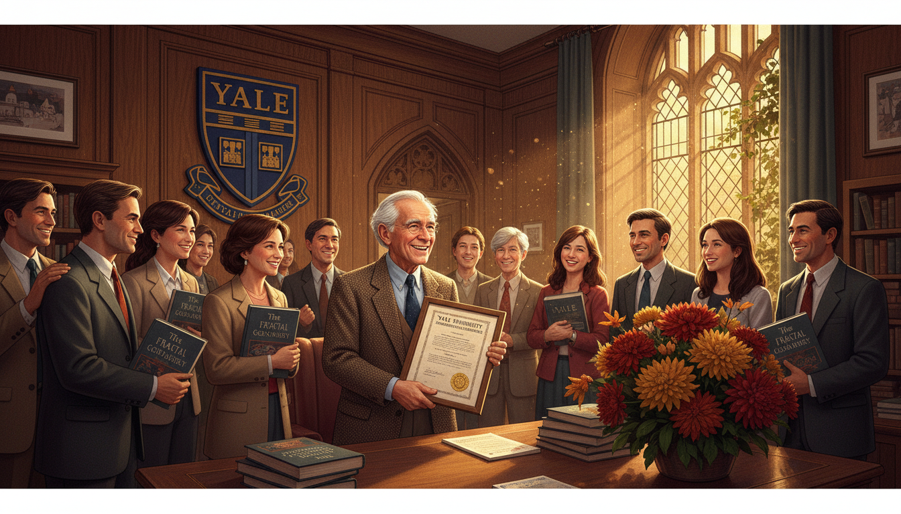

Image Prompt

I am about to ask you to generate a series of images for a graphic novel. Please make the images have a consistent style and consistent characters. Do not ask any clarifying questions. Just generate the image immediately when asked.

Please generate a 16:9 image in late 20th century digital/computational illustration style depicting panel 11 of 12. The scene shows Benoit in 1999 at Yale University at age 75 finally being granted tenure as the Sterling Professor of Mathematical Sciences. He stands in a wood-paneled Yale office, silver-haired, smiling, holding a framed appointment letter. Students of diverse backgrounds gather around congratulating him. Color palette: Yale navy blue, warm oak, cream paper, golden afternoon light. Emotional tone: vindication and joy. Include Yale crest on the wall, stacks of his book "The Fractal Geometry of Nature," ivy outside the window, a Gothic arch doorway, and a bouquet of autumn flowers. Generate the image immediately without asking clarifying questions.

For decades, Benoit had been rejected by traditional academia. Finally, at age 75, Yale University made him a full professor, the oldest person ever to receive tenure there. His book "The Fractal Geometry of Nature" had become a classic. The outsider had become an icon.

## Panel 12: A New Way to See

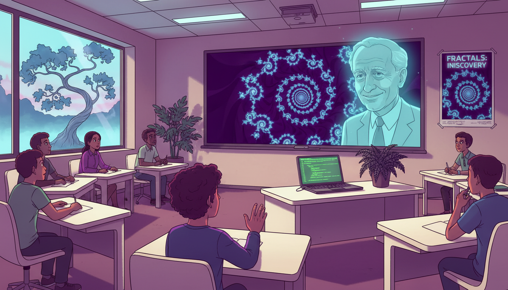

Image Prompt

I am about to ask you to generate a series of images for a graphic novel. Please make the images have a consistent style and consistent characters. Do not ask any clarifying questions. Just generate the image immediately when asked.

Please generate a 16:9 image in late 20th century digital/computational illustration style depicting panel 12 of 12. The scene shows a modern classroom where a teacher shows students a Mandelbrot set zoom on a large screen. A translucent image of Benoit Mandelbrot smiles in the background like a guardian spirit. Students of diverse backgrounds are captivated, one reaching a hand toward the screen. Color palette: deep violet screen, warm classroom cream, cyan highlights, neon accent, magenta glow. Emotional tone: awe passed forward. Include a laptop running Python fractal code, a window overlooking a fractal-like tree, a physical fern on the teacher's desk, and a poster of the Mandelbrot set. Generate the image immediately without asking clarifying questions.

Benoit Mandelbrot died in 2010, but his vision lives in every zoom into a fractal, every CGI mountain, every rough edge of the world. He taught us that nature is not made of smooth lines, and that functions can repeat themselves into infinite beauty. When you iterate a function in class, you are walking in his footsteps.

### Epilogue – What Made Mandelbrot Different?

Benoit Mandelbrot trusted his eyes as much as his equations. He saw that roughness was not noise to be ignored, it was a pattern to be studied. That shift in perspective opened a whole new branch of mathematics.

| Challenge | How Mandelbrot Responded | Lesson for Today |
|---------------------|----------------------------|------------------|
| Rejected by traditional math departments | Found refuge at IBM and kept working | The right environment matters as much as talent |
| Nature seemed too messy for math | Invented new geometry to fit it | If your tools do not fit reality, build better tools |
| Computers were new and distrusted | Used them to visualize ideas | Technology amplifies imagination |
| No existing name for his shapes | Coined the word "fractal" | Name your ideas so others can share them |

### Call to Action

Next time you see a tree branching, a coastline curving, or a cloud puffing, remember Benoit Mandelbrot. Try iterating a function on a calculator, feeding each output back as the next input. You will be doing fractal mathematics, the same kind that revealed hidden shapes in the universe. Keep your eyes open. The patterns are everywhere.

---

*"Clouds are not spheres, mountains are not cones, coastlines are not circles, and bark is not smooth, nor does lightning travel in a straight line."*
—Benoit Mandelbrot

*"Think not of what you see, but what it took to produce what you see."*
—Benoit Mandelbrot

---

## References

1. [The Fractal Geometry of Nature (1982)](PLACEHOLDER) - Mandelbrot's landmark book
2. [The Fractalist: Memoir of a Scientific Maverick](PLACEHOLDER) - His autobiography
3. [How Long Is the Coast of Britain? (1967)](PLACEHOLDER) - The paper that launched fractal geometry
4. [IBM Research: Benoit Mandelbrot](PLACEHOLDER) - IBM archives on his work
5. [Yale University Mathematics Department](PLACEHOLDER) - His academic home in later years
