# Claude Shannon: The Network Weaver

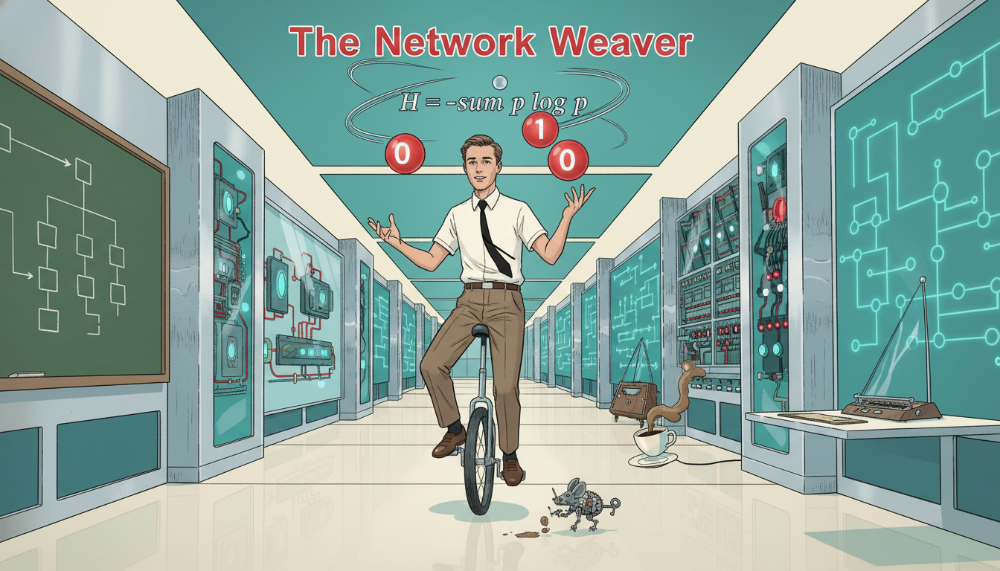

Cover Image Prompt

Please generate a wide-landscape 16:9 cover image in mid-century Atomic Age graphic-novel style depicting Claude Shannon as a lean young man in a white short-sleeved shirt and thin tie, riding a unicycle while juggling three glowing orbs labeled 0 and 1, through a clean modernist Bell Labs corridor lined with vacuum-tube computers and network diagrams. Include the title text "The Network Weaver" rendered in a crisp mid-century sans-serif typeface. Color palette: atomic teal, Bell Labs cream, chromium silver, cherry red accents, chalkboard green. Emotional tone: playful genius and clean optimism. Include a flowchart of Boolean logic on the wall, a theremin in the corner, Shannon's pet mechanical mouse Theseus, wireframe network diagrams in the background, a bank of switching relays, a coffee cup mid-tilt, and the iconic formula H = -sum p log p floating above the scene. Generate the image immediately without asking clarifying questions.

Narrative Prompt

Tell the story of Claude Shannon (1916-2001), the American mathematician and electrical engineer from Gaylord, Michigan, who founded information theory at Bell Labs. Cover his master's thesis linking Boolean algebra to electrical circuits, his Ph.D. work on genetics, his 1948 paper "A Mathematical Theory of Communication," his playful inventions like the maze-solving mouse Theseus and juggling machines, and his unicycle-riding eccentricity. Focus on how he turned functions and logic into the mathematical backbone of the digital age. Use a tone that is playful and clean for IB Diploma high school students, reflecting mid-century optimism and his whimsical brilliance.

### Prologue - The Boy Who Wired the Barn

In rural Michigan in the 1920s, a curious boy built a telegraph line from his house to a friend's house using the barbed-wire fence between their farms. Decades later, that same boy would explain to the world how every message, every signal, and every bit of data could be described by a function. His name was Claude Shannon, and he invented the mathematical language of the digital age.

## Panel 1: Barbed-Wire Telegraph

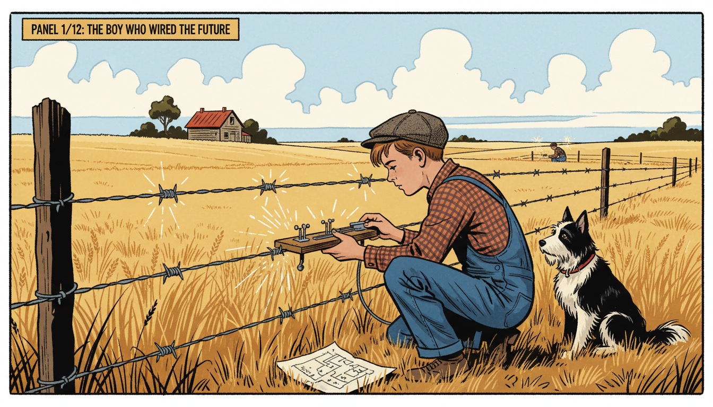

Image Prompt

I am about to ask you to generate a series of images for a graphic novel. Please make the images have a consistent style and consistent characters. Do not ask any clarifying questions. Just generate the image immediately when asked.

Please generate a 16:9 image in mid-century Atomic Age graphic-novel style depicting panel 1 of 12. The scene should include a 12 year old Claude Shannon in denim overalls and a flat cap, tapping a homemade telegraph key attached to a barbed-wire farm fence stretching across a rural Michigan wheat field in 1928. Color palette: prairie gold, sky blue, fence-wire silver, overall indigo, barn red. The emotional tone should be inventive small-town wonder. Include a wooden farmhouse in the distance, a friend half a mile away also at a telegraph key, a hand-drawn wiring diagram in the grass, a black and white farm dog watching curiously, white clouds overhead, and dots and dashes rendered as small sparks along the wire. Generate the image immediately without asking clarifying questions.

Claude Elwood Shannon was born in 1916 in Petoskey, Michigan, and grew up in nearby Gaylord. As a kid, he built model airplanes, radio-controlled boats, and a working telegraph that used a neighbor's barbed-wire fence as the wire. Small experiments like this showed him how on-off signals could carry meaning. He did not know it yet, but he was already thinking about functions from inputs to outputs.

## Panel 2: MIT and the Logic Machine

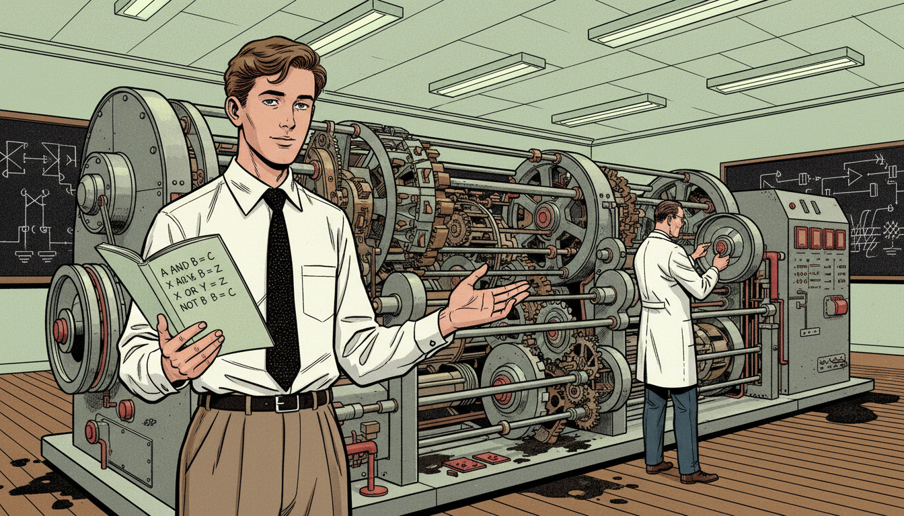

Image Prompt

I am about to ask you to generate a series of images for a graphic novel. Please make the images have a consistent style and consistent characters. Do not ask any clarifying questions. Just generate the image immediately when asked.

Please generate a 16:9 image in mid-century Atomic Age graphic-novel style depicting panel 2 of 12. The scene should include Claude Shannon as a young man of 21 in a white shirt, knit tie, and high-waisted trousers, standing in front of Vannevar Bush's Differential Analyzer at MIT in 1937, with a room-sized analog computer of shafts, gears, and disc integrators behind him. Color palette: MIT crimson, brushed steel, oil brown, lab coat white, chalk green. The emotional tone should be bright curiosity meeting massive machinery. Include blackboards covered with switch diagrams, a notebook in Shannon's hand open to Boolean expressions like A AND B, oil smudges on the floor, rotating metal wheels, fluorescent ceiling lights, and professor Bush in the background adjusting a dial. Generate the image immediately without asking clarifying questions.

Shannon earned degrees in both mathematics and electrical engineering and went to MIT for graduate work in 1936. There he helped run Vannevar Bush's Differential Analyzer, a huge mechanical computer full of relays and gears. Staring at those clicking switches, Shannon had a quiet revelation. Each switch was a function from "open or closed" inputs to an "on or off" output.

## Panel 3: The Most Important Master's Thesis Ever

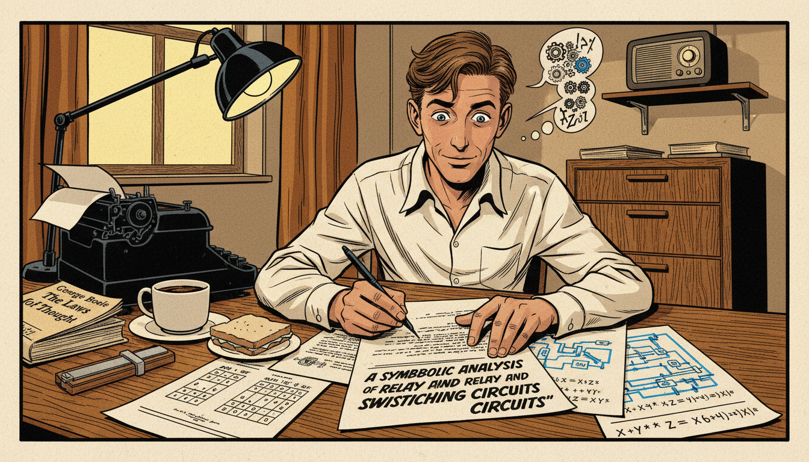

Image Prompt

I am about to ask you to generate a series of images for a graphic novel. Please make the images have a consistent style and consistent characters. Do not ask any clarifying questions. Just generate the image immediately when asked.

Please generate a 16:9 image in mid-century Atomic Age graphic-novel style depicting panel 3 of 12. The scene should include 22 year old Claude Shannon at a wooden desk in a small MIT dormitory room in 1937, writing his master's thesis titled "A Symbolic Analysis of Relay and Switching Circuits", with circuit diagrams and Boolean algebra equations spread across the desk. Color palette: lamp yellow, ink black, paper cream, oak brown, electric blue. The emotional tone should be quiet revolutionary excitement. Include a typewriter, a slide rule, a cup of cold coffee, truth tables for AND OR NOT gates on one page, a schematic of a relay circuit on another, a half-eaten sandwich, a small radio on a shelf, and an open copy of George Boole's "The Laws of Thought". Generate the image immediately without asking clarifying questions.

In his 1937 master's thesis, Shannon showed that Boolean algebra, a branch of logic from a century earlier, could describe any electrical switching circuit. AND, OR, and NOT became functions that turned inputs of 0s and 1s into predictable outputs. Suddenly, engineers could design complex circuits using algebra instead of trial and error. Many call this the most important master's thesis of the 20th century.

## Panel 4: Bell Labs, the Idea Factory

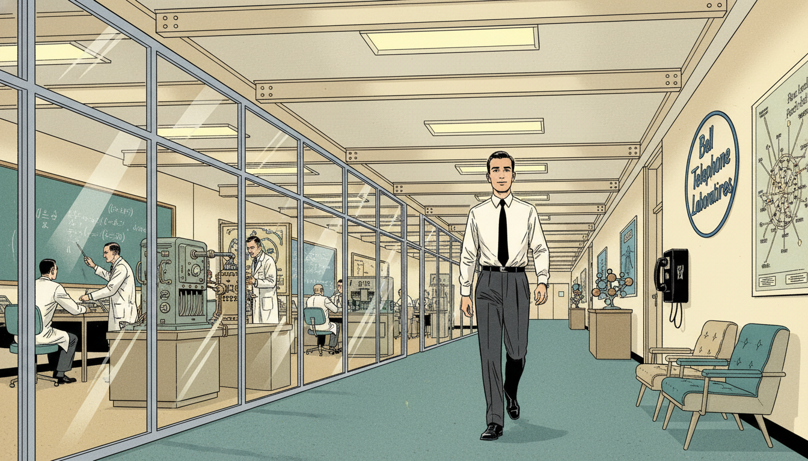

Image Prompt

I am about to ask you to generate a series of images for a graphic novel. Please make the images have a consistent style and consistent characters. Do not ask any clarifying questions. Just generate the image immediately when asked.

Please generate a 16:9 image in mid-century Atomic Age graphic-novel style depicting panel 4 of 12. The scene should include Claude Shannon in a pressed white shirt and thin tie walking through the long modernist corridor of Bell Telephone Laboratories in Murray Hill, New Jersey in 1941, with scientists in lab coats working behind glass-walled offices. Color palette: Bell Labs cream, corridor teal, chrome silver, paper white, sunlight yellow. The emotional tone should be optimistic mid-century possibility. Include a sign reading "Bell Telephone Laboratories", wireframe molecule models on display, a demonstration of an early vocoder machine, scientists discussing equations on a chalkboard, fluorescent light panels, a pay phone, mid-century modern chairs, and a poster of the Bell System network map. Generate the image immediately without asking clarifying questions.

In 1941 Shannon joined Bell Telephone Laboratories, the legendary "Idea Factory" in New Jersey. During World War II he worked on cryptography and fire-control systems. But in quiet moments, he was assembling a much bigger idea: a mathematical theory that could measure information itself, no matter what form it took. Telephone, telegraph, radio, or radar, it would all become one family of functions.

## Panel 5: A Mathematical Theory of Communication

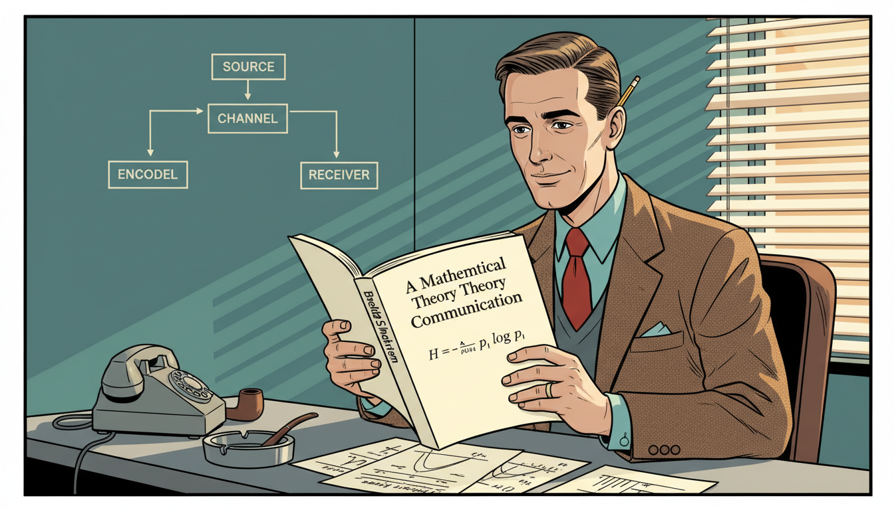

Image Prompt

I am about to ask you to generate a series of images for a graphic novel. Please make the images have a consistent style and consistent characters. Do not ask any clarifying questions. Just generate the image immediately when asked.

Please generate a 16:9 image in mid-century Atomic Age graphic-novel style depicting panel 5 of 12. The scene should include Claude Shannon at his Bell Labs office desk in 1948, holding up a freshly printed copy of the Bell System Technical Journal opened to his landmark paper "A Mathematical Theory of Communication", with the formula H = -sum p_i log p_i visible on the page. Color palette: journal ivory, office teal, tie red, metal gray, lamp amber. The emotional tone should be calm satisfaction at a world-changing moment. Include a block diagram of source, encoder, channel, decoder, and receiver on the wall, a pipe in an ashtray, a pencil behind his ear, a rotary telephone, graph paper with probability curves, and a single sunbeam through venetian blinds. Generate the image immediately without asking clarifying questions.

In 1948 Shannon published "A Mathematical Theory of Communication," creating an entirely new field: information theory. He defined information mathematically using a function now called entropy, written as $H = -\sum p_i \log p_i$. This function measures how much surprise or uncertainty a message carries. It let engineers calculate exactly how many bits are needed to send any signal, from a phone call to a photograph.

## Panel 6: The Bit Is Born

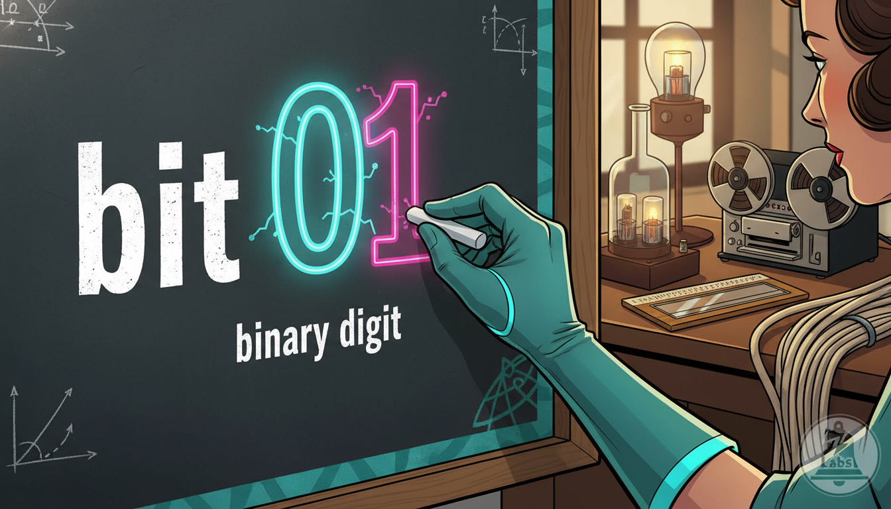

Image Prompt

I am about to ask you to generate a series of images for a graphic novel. Please make the images have a consistent style and consistent characters. Do not ask any clarifying questions. Just generate the image immediately when asked.

Please generate a 16:9 image in mid-century Atomic Age graphic-novel style depicting panel 6 of 12. The scene should include a stylized close-up of Shannon's hand writing the word "bit" on a chalkboard in 1948, beside a large glowing 0 and 1, with the definition "binary digit" underneath. Color palette: chalkboard green, chalk white, neon cyan 0, magenta 1, teal trim. The emotional tone should be iconic and electrifying. Include a blurred laboratory background, a slide rule on a desk, a reel-to-reel tape recorder, a coil of telephone wire, probability diagrams in the margins, small sparks around the 0 and 1, and a Bell Labs logo faintly visible. Generate the image immediately without asking clarifying questions.

Shannon needed a unit for information, and a colleague named John Tukey suggested "bit," short for binary digit. Shannon adopted it, and the word went on to define the digital age. Every photo, song, movie, and text you send is measured in bits. Every one of those bits owes its name to a single 1948 paper.

## Panel 7: Theseus the Maze-Solving Mouse

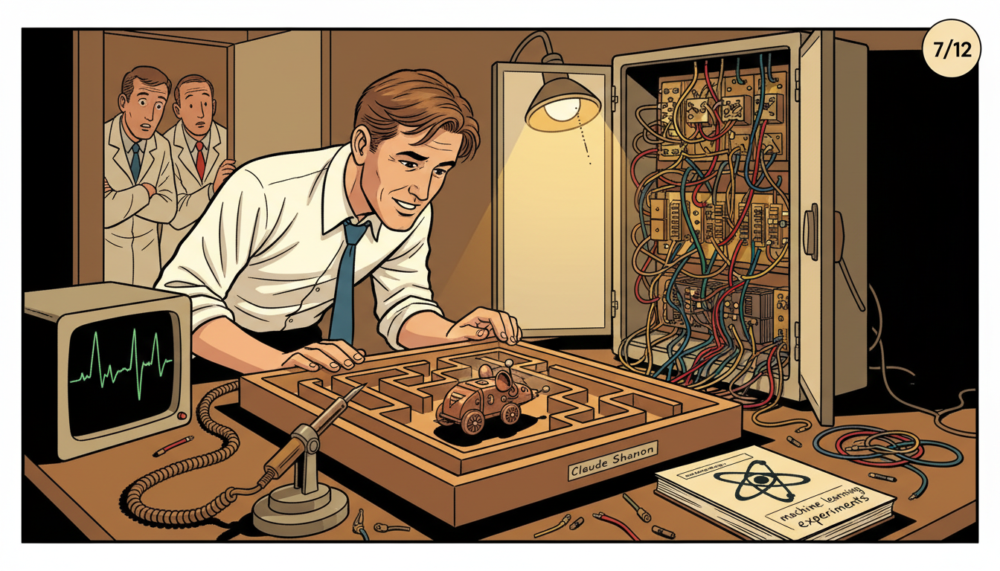

Image Prompt

I am about to ask you to generate a series of images for a graphic novel. Please make the images have a consistent style and consistent characters. Do not ask any clarifying questions. Just generate the image immediately when asked.

Please generate a 16:9 image in mid-century Atomic Age graphic-novel style depicting panel 7 of 12. The scene should include Claude Shannon in shirtsleeves leaning over a wooden maze about one meter square in his Bell Labs workshop in 1950, watching a small sensor-equipped mechanical mouse named Theseus find its way through the corridors while relay switches click in a cabinet beside the maze. Color palette: workshop wood brown, mouse copper, relay brass, lab coat white, warm lamp gold. The emotional tone should be playful pride of invention. Include exposed relay cabinets wired to the maze floor, an oscilloscope displaying signals, a soldering iron in a holder, wire clippings on the floor, curious colleagues in the doorway, a notebook labeled "machine learning experiments", and the mouse casting a small shadow. Generate the image immediately without asking clarifying questions.

In 1950 Shannon built Theseus, a small mechanical mouse that could learn its way through a maze. Under the maze floor, relay circuits remembered which turns led to dead ends and which led to cheese. Theseus was one of the earliest demonstrations of a machine learning from experience. Shannon had built a function that updated itself with every run.

## Panel 8: Juggling, Unicycles, and Joy

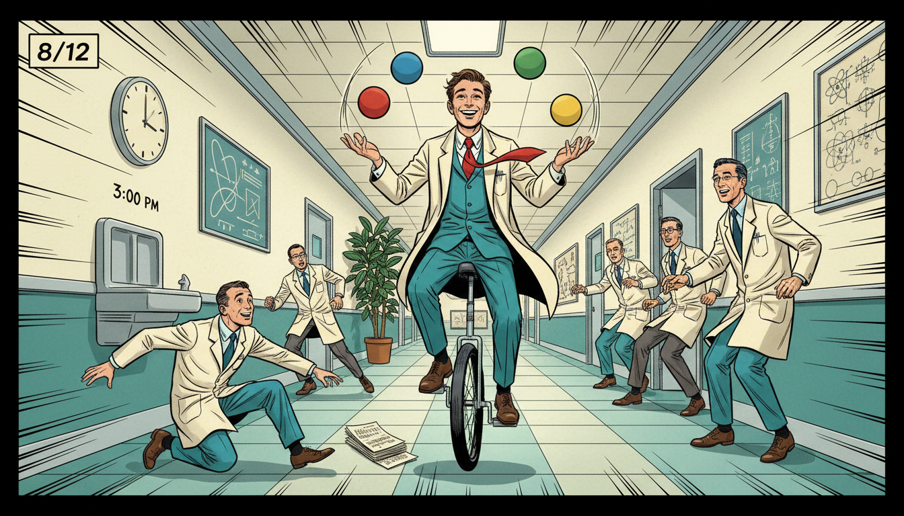

Image Prompt

I am about to ask you to generate a series of images for a graphic novel. Please make the images have a consistent style and consistent characters. Do not ask any clarifying questions. Just generate the image immediately when asked.

Please generate a 16:9 image in mid-century Atomic Age graphic-novel style depicting panel 8 of 12. The scene should include Claude Shannon riding a unicycle down a Bell Labs hallway in the mid 1950s while juggling four balls, laughing colleagues scattering to make room. Color palette: hallway teal, tie crimson, ball primary colors, chrome silver, cream wall. The emotional tone should be pure delight and eccentric genius. Include motion lines indicating movement, a clock on the wall reading 3 pm, a water fountain, framed physics diagrams, another scientist dropping papers in surprise, a potted rubber plant, and Shannon's grinning face absolutely focused. Generate the image immediately without asking clarifying questions.

Shannon famously rode a unicycle up and down the Bell Labs hallways, often while juggling. He built juggling machines, chess-playing robots, and a "Ultimate Machine" whose only function was to turn itself off. For Shannon, play and deep research were the same activity. He believed the best ideas came when you gave your mind room to wander.

## Panel 9: Sampling Theorem and the Digital Bridge

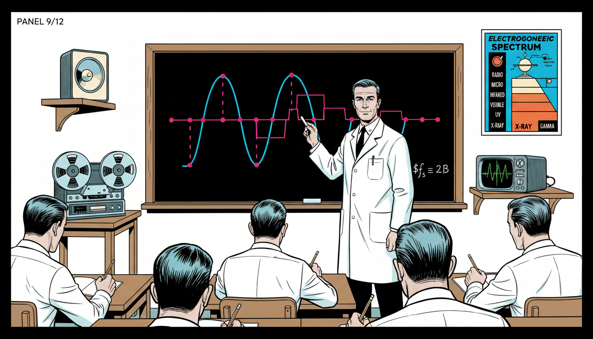

Image Prompt

I am about to ask you to generate a series of images for a graphic novel. Please make the images have a consistent style and consistent characters. Do not ask any clarifying questions. Just generate the image immediately when asked.

Please generate a 16:9 image in mid-century Atomic Age graphic-novel style depicting panel 9 of 12. The scene should include Shannon standing at a chalkboard drawing a smooth continuous sine wave being sampled at regular intervals into a sequence of dots, then reconstructed, in a Bell Labs classroom in 1949. Color palette: chalkboard black, chalk white, sine wave cyan, sample dot magenta, lab coat white. The emotional tone should be clear teaching elegance. Include students in white shirts and ties taking notes, a reel-to-reel audio tape machine, a loudspeaker on a shelf, the formula f_s greater than or equal to 2B written in the corner, a waveform oscilloscope trace, and a poster of the electromagnetic spectrum. Generate the image immediately without asking clarifying questions.

Shannon also formalized the sampling theorem, which explains how a continuous signal like sound or a TV image can be captured perfectly using discrete samples. As long as you sample at more than twice the highest frequency, the original function can be reconstructed exactly. This is why CDs, Wi-Fi, and streaming all work. He had built a bridge between the analog world and the digital one.

## Panel 10: Chess, AI, and the Future

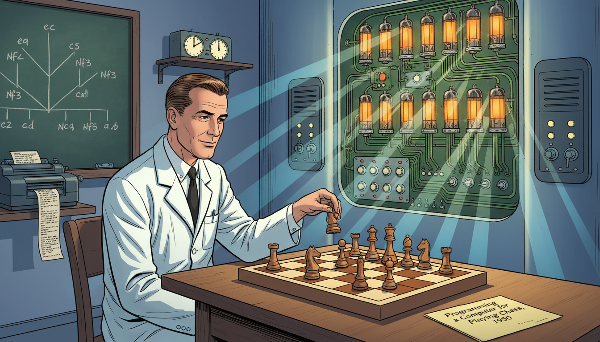

Image Prompt

I am about to ask you to generate a series of images for a graphic novel. Please make the images have a consistent style and consistent characters. Do not ask any clarifying questions. Just generate the image immediately when asked.

Please generate a 16:9 image in mid-century Atomic Age graphic-novel style depicting panel 10 of 12. The scene should include Claude Shannon in the early 1950s playing chess against an experimental Bell Labs computer system, his knight poised above a wooden chessboard while a wall of vacuum tubes and switches evaluates positions. Color palette: chessboard walnut brown and cream, vacuum tube amber, circuit green, lab coat white, shadow blue. The emotional tone should be thoughtful pioneering foresight. Include a tree diagram of possible moves on a nearby chalkboard, a teletype printer clacking out move notation, a wall clock with a chess tournament timer, a folded paper labeled "Programming a Computer for Playing Chess, 1950", and Shannon's calm intent expression. Generate the image immediately without asking clarifying questions.

In 1950 Shannon published one of the first papers on programming a computer to play chess. He estimated the number of possible chess games, a number now called the Shannon number, around $10^{120}$. He showed how a computer could evaluate positions using a mathematical scoring function. Modern AI still traces many of its ideas back to these early Shannon sketches.

## Panel 11: MIT Professor and Quiet Elder

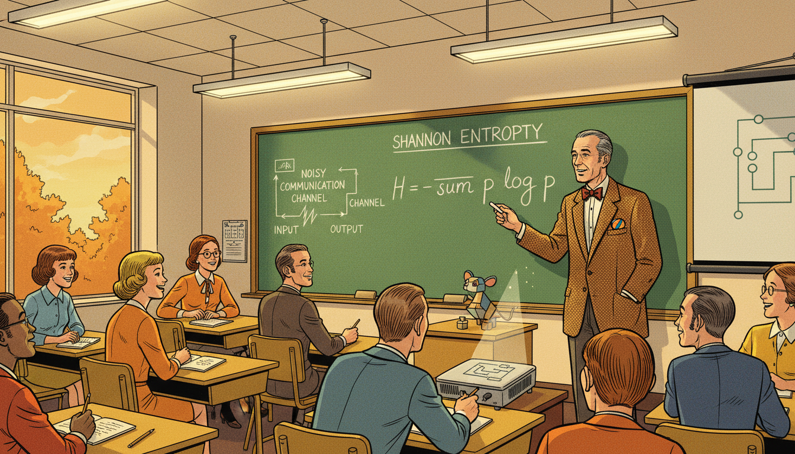

Image Prompt

I am about to ask you to generate a series of images for a graphic novel. Please make the images have a consistent style and consistent characters. Do not ask any clarifying questions. Just generate the image immediately when asked.

Please generate a 16:9 image in mid-century Atomic Age graphic-novel style depicting panel 11 of 12. The scene should include a middle aged Claude Shannon in a tweed jacket lecturing in an MIT classroom in the 1970s, chalk in hand, explaining Shannon entropy H = -sum p log p to a classroom of students including both men and women. Color palette: tweed brown, chalkboard green, classroom gold, chalk white, autumn orange through the window. The emotional tone should be warm mentorship. Include overhead fluorescent lights, wooden desks with notebooks, an overhead projector, a diagram of a noisy communication channel, a small model of Theseus the mouse on the desk, a juggling ball peeking out of his jacket pocket, and students smiling in recognition. Generate the image immediately without asking clarifying questions.

Shannon returned to MIT as a professor in 1958, where he taught and mentored students who would go on to shape modern computing. He remained playful into old age, filling his home with unicycles, juggling machines, and a mechanical Rubik's cube solver. Though he stopped publishing new major results, his existing theorems quietly powered every new communication technology of the next fifty years. He watched the digital world bloom from the seeds he had planted.

## Panel 12: Bits That Run the World

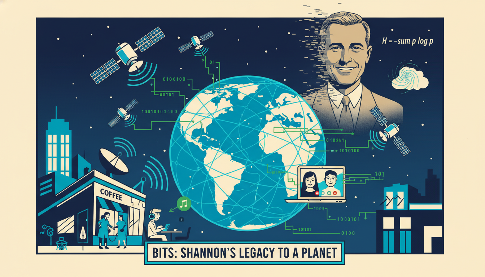

Image Prompt

I am about to ask you to generate a series of images for a graphic novel. Please make the images have a consistent style and consistent characters. Do not ask any clarifying questions. Just generate the image immediately when asked.

Please generate a 16:9 image in mid-century Atomic Age graphic-novel style depicting panel 12 of 12. The scene should include a modern global scene with smartphones, fiber optic cables glowing with data, satellites orbiting, Wi-Fi signals radiating from a coffee shop, and streams of 1s and 0s flowing between them, with a ghostly translucent Claude Shannon in his tie and white shirt smiling approvingly in the sky. Color palette: midnight blue, fiber-optic cyan, data stream green, satellite silver, Shannon warm cream. The emotional tone should be triumphant and connective. Include a video call on a laptop, a student using earbuds, a city skyline, a satellite dish, a streaming music icon, a globe with network lines, a floating formula H = -sum p log p, and the caption "Bits: Shannon's legacy to the planet". Generate the image immediately without asking clarifying questions.

Every message you send, every song you stream, and every page you load is measured in bits, encoded according to Shannon's limits, and reconstructed using his sampling theorem. When you study logic, functions, or probability in your IB class, you are using the same Boolean and information functions he made famous. The digital world did not just happen. It was woven, one clean function at a time, by a man on a unicycle.

### Epilogue - What Made Shannon Different?

Shannon combined deep mathematical talent with an engineer's love of tinkering and a child's love of play. He refused to separate "serious" research from toys, games, and juggling. By treating information itself as a mathematical function, he gave the world a new way to build technology. His life shows that curiosity and whimsy are engineering tools too.

| Challenge | How Shannon Responded | Lesson for Today |
|-----------|----------------------|------------------|
| A messy patchwork of communication technologies | Unified them with a single theory of information | Look for the common function beneath different problems |
| No existing unit for information | Invented the bit with help from a colleague | Sometimes you need to name a new idea before you can study it |
| Pressure to only do "serious" work | Built mazes, juggling robots, and chess machines | Play is part of serious research |
| Vast complexity of analog signals | Proved the sampling theorem to digitize them perfectly | Discrete functions can capture continuous worlds |
| Skepticism toward machine intelligence | Showed early AI through chess and Theseus | Small experiments can demonstrate big futures |

### Call to Action

The next time you text a friend, stream a song, or run a Boolean expression in code, remember Claude Shannon. He turned a farm-boy's barbed-wire telegraph into the mathematical foundation of the internet. Play with ideas. Build weird things. Find the function hiding inside the chaos. Every input still has its output.

---

*"Information is the resolution of uncertainty."*
—Claude Shannon

*"I visualize a time when we will be to robots what dogs are to humans, and I'm rooting for the machines."*
—Claude Shannon

---

## References

1. [Wikipedia: Claude Shannon](https://en.wikipedia.org/wiki/Claude_Shannon) - Biography of the American engineer and father of information theory
2. [Wikipedia: Information theory](https://en.wikipedia.org/wiki/Information_theory) - The field Shannon founded with his 1948 paper
3. [Wikipedia: A Mathematical Theory of Communication](https://en.wikipedia.org/wiki/A_Mathematical_Theory_of_Communication) - Shannon's foundational 1948 paper
4. [MacTutor: Claude Elwood Shannon](https://mathshistory.st-andrews.ac.uk/Biographies/Shannon/) - University of St Andrews history of mathematics archive
5. [Encyclopaedia Britannica: Claude Shannon](https://www.britannica.com/biography/Claude-Shannon) - Overview of Shannon's work at Bell Labs and MIT
