# Emmy Noether: The Equation of Hope

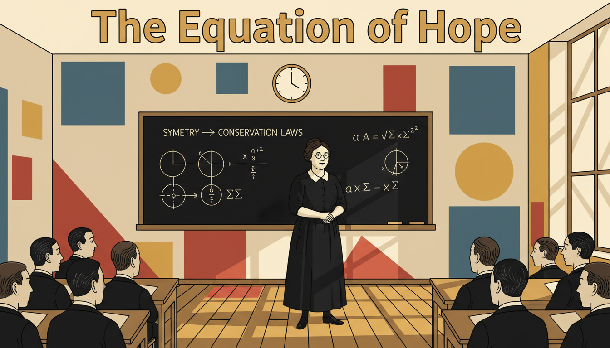

Cover Image Prompt

Please generate a wide-landscape 16:9 cover image in early 20th century Bauhaus/Weimar Germany illustration style depicting Emmy Noether, a German Jewish mathematician in her early 40s, standing confidently at a chalkboard in 1920s Gottingen. She has a round face, dark hair pinned up, small round wire-rim glasses, and wears a simple dark long-sleeved dress. Include the title text "The Equation of Hope" rendered in a geometric Bauhaus-era sans-serif typeface. Color palette: mustard yellow, deep black, warm cream, brick red, and steel blue. Emotional tone: intellectual power and quiet defiance. Behind her, the chalkboard displays her famous theorem linking symmetry and conservation laws. The setting has Bauhaus-inspired geometric shapes: circles, squares, and triangles in primary colors, a round wall clock, and tall windows with diagonal morning light. Male students and colleagues listen attentively at wooden desks. Generate the image immediately without asking clarifying questions.

Narrative Prompt

This graphic novel tells the story of Emmy Noether (1882-1935), the German Jewish mathematician whose theorem linking symmetry and conservation laws became one of the foundations of modern physics and abstract algebra. The story spans her childhood in Erlangen Germany, her student years at the University of Erlangen, her famous collaboration at Gottingen with David Hilbert, her forced exile from Nazi Germany, and her final years teaching at Bryn Mawr in Pennsylvania. Keep Emmy's appearance consistent: round warm face, dark hair gathered up, small round wire-rim glasses, simple practical dark dresses. Supporting characters include the elderly David Hilbert (white beard, felt hat, formal suit) and Albert Einstein (wild dark hair, brown jacket). Visual style should evoke Bauhaus and Weimar Germany: geometric shapes, bold primary colors against cream, clean sans-serif type, and constructivist composition.

### Prologue – The Woman Who Rewrote Physics

In 1918, a German mathematician proved a theorem so powerful that Einstein himself called her a genius. It explained why energy is conserved, why momentum never disappears, and why the laws of physics are the same yesterday and today. Her name was Emmy Noether, and the world tried hard to ignore her. She taught anyway.

## Panel 1: A Girl in Erlangen

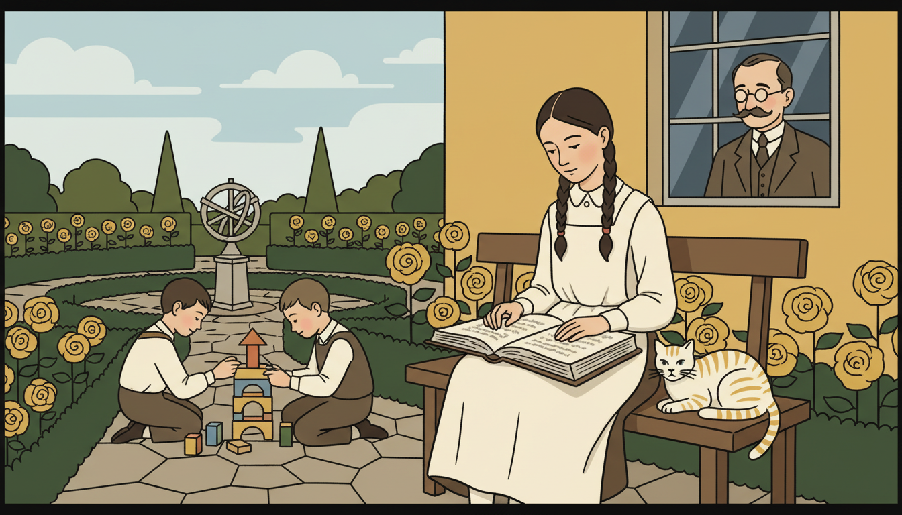

Image Prompt

I am about to ask you to generate a series of images for a graphic novel. Please make the images have a consistent style and consistent characters. Do not ask any clarifying questions. Just generate the image immediately when asked.

Please generate a 16:9 image in early 20th century Bauhaus/Weimar Germany illustration style depicting panel 1 of 12. The scene shows 10-year-old Emmy Noether in 1892 in the garden of her family home in Erlangen, Bavaria. She sits on a bench reading a thick mathematics book while her younger brothers play with wooden blocks nearby. She wears a plain gray pinafore dress with white collar, her dark hair in two braids. Color palette: mustard yellow roses, cream dress, deep green hedges, soft sky blue. Emotional tone: quiet independence. Include her father Max Noether (a mathematics professor) at a window watching proudly, a tabby cat, geometric flower beds laid out like a Bauhaus pattern, and a stone sundial. Generate the image immediately without asking clarifying questions.

Emmy Noether was born in 1882 in the Bavarian town of Erlangen. Her father Max was a mathematics professor, and dinner table conversation often ran to theorems. Young Emmy was not pushed toward math, girls then were steered toward piano and French, but she kept asking questions. The love of patterns was already in her blood.

## Panel 2: Sneaking into Lectures

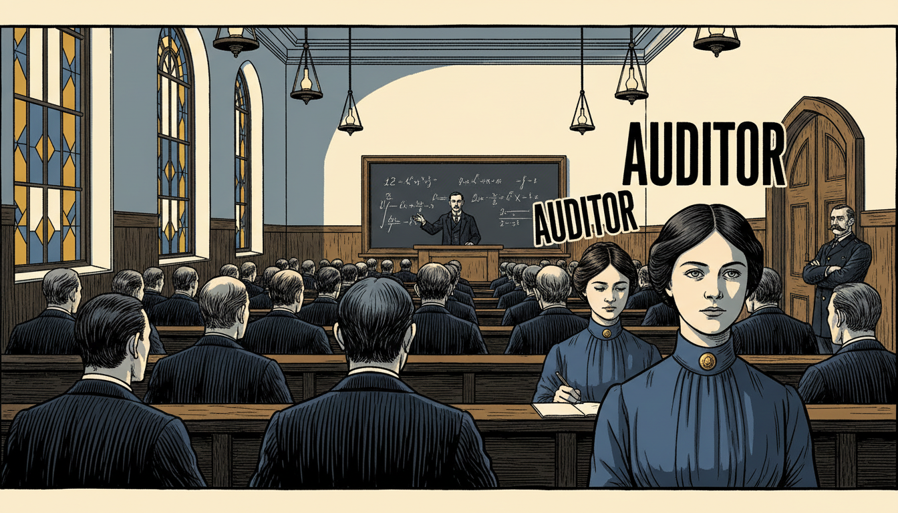

Image Prompt

I am about to ask you to generate a series of images for a graphic novel. Please make the images have a consistent style and consistent characters. Do not ask any clarifying questions. Just generate the image immediately when asked.

Please generate a 16:9 image in early 20th century Bauhaus/Weimar Germany illustration style depicting panel 2 of 12. The scene shows 18-year-old Emmy in 1900 at the University of Erlangen, sitting in the very back row of a lecture hall as a professor teaches a large class of men. She is one of only two women in the room, both marked as "auditors" who cannot earn credit. She wears a plain dark blue blouse with a high collar and simple gold pin. Color palette: steel blue, deep mustard, cream walls, dark oak benches. Emotional tone: determined patience. Include a chalkboard with algebraic expressions, kerosene lamps, tall stained-glass windows, men in formal suits with pocket watches, and a stern proctor at the door. Generate the image immediately without asking clarifying questions.

Women could not enroll as regular students at German universities in 1900. Emmy had to beg each professor personally for permission to audit classes. She passed the final exams for a high school teaching certificate, then waited until the law changed. She was one of the first women in Germany ever to earn a mathematics PhD.

## Panel 3: Doctorate in Invariants

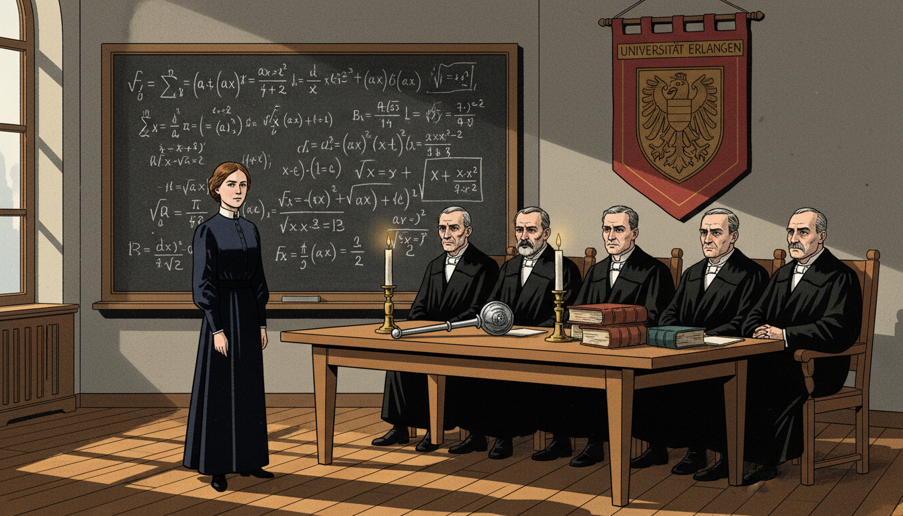

Image Prompt

I am about to ask you to generate a series of images for a graphic novel. Please make the images have a consistent style and consistent characters. Do not ask any clarifying questions. Just generate the image immediately when asked.

Please generate a 16:9 image in early 20th century Bauhaus/Weimar Germany illustration style depicting panel 3 of 12. The scene shows Emmy in 1907 at age 25 defending her dissertation at Erlangen University, standing at a chalkboard full of invariant theory equations. A panel of stern male professors in formal black academic gowns sits before her. Emmy wears a modest dark navy dress. Color palette: deep black robes, chalk white, navy, brick red banner with university crest, warm oak. Emotional tone: rigorous triumph. Include a ceremonial mace on the table, heavy leather-bound books, tall candles, the Erlangen university coat of arms, and sunlight streaming through arched windows. Generate the image immediately without asking clarifying questions.

Emmy earned her doctorate in 1907 with a thesis on algebraic invariants, the quantities that stay the same when you transform an equation. Already, she was hunting the deepest idea in math: what stays constant when things change? This question would define her entire career.

## Panel 4: Teaching Without a Salary

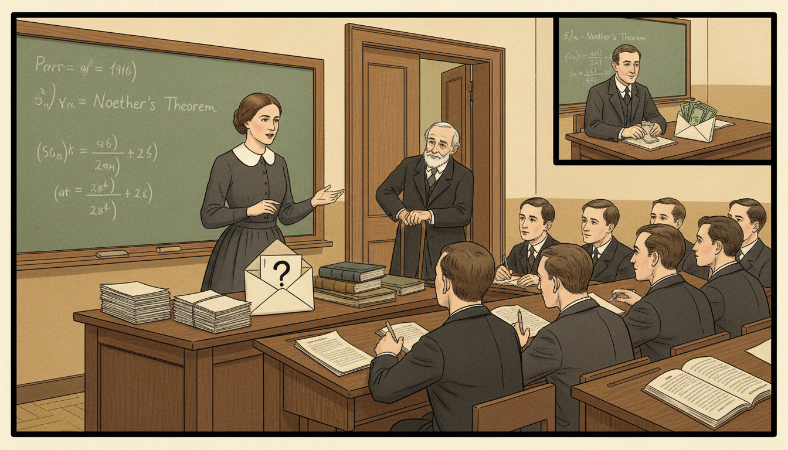

Image Prompt

I am about to ask you to generate a series of images for a graphic novel. Please make the images have a consistent style and consistent characters. Do not ask any clarifying questions. Just generate the image immediately when asked.

Please generate a 16:9 image in early 20th century Bauhaus/Weimar Germany illustration style depicting panel 4 of 12. The scene shows Emmy in 1910 at Erlangen giving a lecture to a small group of male students while her father Max Noether, now older and using a cane, watches from the doorway. There is no salary envelope on her desk, unlike a neighboring professor shown in an inset. She wears a practical dark dress with a white collar. Color palette: warm cream walls, mustard yellow light, deep brown oak, muted green chalkboard. Emotional tone: dedication without reward. Include a chalkboard with Noether's early algebra work, stacks of student papers, an empty pay envelope marked with a question mark, and her father's proud smile. Generate the image immediately without asking clarifying questions.

For seven years after her PhD, Emmy taught at Erlangen without pay or title. She substituted for her ailing father in the classroom and published brilliant papers on her own. Her work began attracting attention from mathematicians across Europe. Still, no official position would hire a woman.

## Panel 5: Hilbert's Invitation

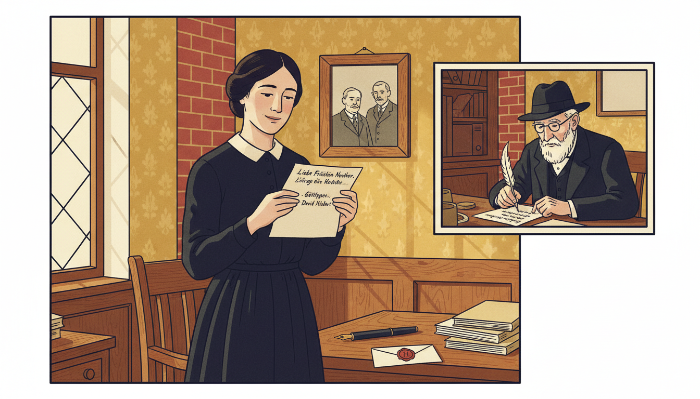

Image Prompt

I am about to ask you to generate a series of images for a graphic novel. Please make the images have a consistent style and consistent characters. Do not ask any clarifying questions. Just generate the image immediately when asked.

Please generate a 16:9 image in early 20th century Bauhaus/Weimar Germany illustration style depicting panel 5 of 12. The scene shows Emmy in 1915 receiving a letter from David Hilbert inviting her to Gottingen. She stands in her Erlangen study, holding the letter with quiet joy. In a floating inset on the right, David Hilbert, an elderly white-bearded mathematician in a felt hat and dark suit, writes the letter at his Gottingen desk. Color palette: cream parchment, deep navy ink, warm oak, mustard wallpaper, brick red stamp. Emotional tone: hope arriving. Include a wax seal, a fountain pen, a framed photo of her parents, a stack of her published papers, and soft light from a leaded window. Generate the image immediately without asking clarifying questions.

In 1915, the world's greatest mathematician David Hilbert invited Emmy to join him at Gottingen, the Mecca of mathematics. Einstein had just proposed general relativity, and Hilbert needed Emmy's algebraic genius to solve a deep problem. She packed her bags and headed north. The collaboration would change physics.

## Panel 6: The Faculty Refuses

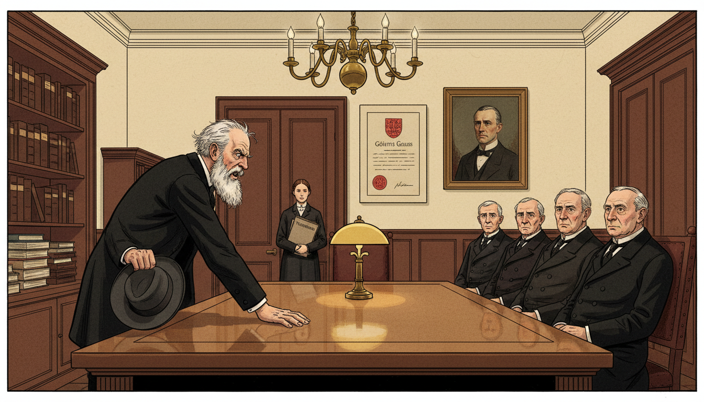

Image Prompt

I am about to ask you to generate a series of images for a graphic novel. Please make the images have a consistent style and consistent characters. Do not ask any clarifying questions. Just generate the image immediately when asked.

Please generate a 16:9 image in early 20th century Bauhaus/Weimar Germany illustration style depicting panel 6 of 12. The scene shows David Hilbert in 1915 angrily confronting a faculty committee at Gottingen, slamming his hand on a polished oak table. Emmy stands calmly in the background. Hilbert has a white beard, dark suit, and felt hat in hand. The committee is a row of stern older men in frock coats. Color palette: deep mahogany, cream walls, dark suits, mustard lamp glow, a splash of red Gottingen crest. Emotional tone: righteous indignation. Include a portrait of Gauss on the wall, a brass chandelier, bound volumes of mathematics journals, and Emmy holding a folder of theorems. Generate the image immediately without asking clarifying questions.

The Gottingen faculty refused to hire a woman, even with Hilbert's backing. Hilbert famously snapped, "I do not see that the sex of the candidate is an argument against her admission. We are a university, not a bathhouse!" For four years Emmy lectured under his name, giving her work away so it could be heard. She did not complain.

## Panel 7: Noether's Theorem

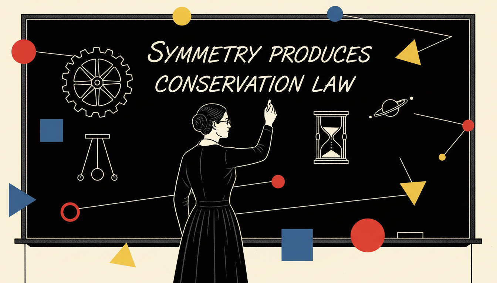

Image Prompt

I am about to ask you to generate a series of images for a graphic novel. Please make the images have a consistent style and consistent characters. Do not ask any clarifying questions. Just generate the image immediately when asked.

Please generate a 16:9 image in early 20th century Bauhaus/Weimar Germany illustration style depicting panel 7 of 12. The scene shows Emmy in 1918 at a large chalkboard in Gottingen writing her famous theorem. Floating geometric shapes in primary colors (red circles, blue squares, yellow triangles) symbolize symmetries around her. Emmy wears a practical dark dress and small wire glasses. Color palette: deep black chalkboard, chalk white, Bauhaus primary red yellow and blue, cream walls. Emotional tone: cosmic insight. Include the theorem statement "symmetry produces conservation law," a rotating wheel diagram, a pendulum, an hourglass, and a small diagram of a planet orbiting the sun. Generate the image immediately without asking clarifying questions.

In 1918, Emmy proved what we now call Noether's Theorem. It says: every symmetry in nature produces a conservation law. If the laws of physics are the same today as yesterday, then energy must be conserved. If space is the same in every direction, then momentum must be conserved. This single idea reshaped theoretical physics.

## Panel 8: Einstein's Praise

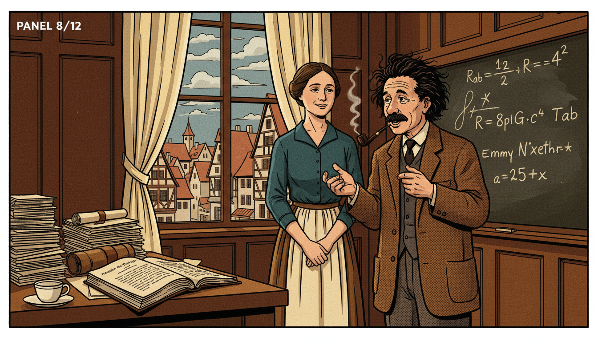

Image Prompt

I am about to ask you to generate a series of images for a graphic novel. Please make the images have a consistent style and consistent characters. Do not ask any clarifying questions. Just generate the image immediately when asked.

Please generate a 16:9 image in early 20th century Bauhaus/Weimar Germany illustration style depicting panel 8 of 12. The scene shows Emmy and Albert Einstein in 1918 meeting at Gottingen. Einstein has wild dark hair, a brown tweed jacket, and a pipe, gesturing excitedly. Emmy listens warmly with a slight smile. They stand near a window overlooking the Gottingen town square. Color palette: warm oak, cream curtains, mustard jacket, steel blue sky, deep brown walls. Emotional tone: mutual respect between geniuses. Include a chalkboard with general relativity equations, stacks of manuscripts, a teacup and saucer, a physics journal open on the desk, and medieval rooftops visible through the window. Generate the image immediately without asking clarifying questions.

Einstein wrote to Hilbert after reading Emmy's work: "Yesterday I received from Miss Noether a very interesting paper on invariants. I'm impressed that such things can be understood in such a general way." Later he called her "the most significant creative mathematical genius thus far produced since the higher education of women began." Coming from Einstein, that was something.

## Panel 9: Mother of Modern Algebra

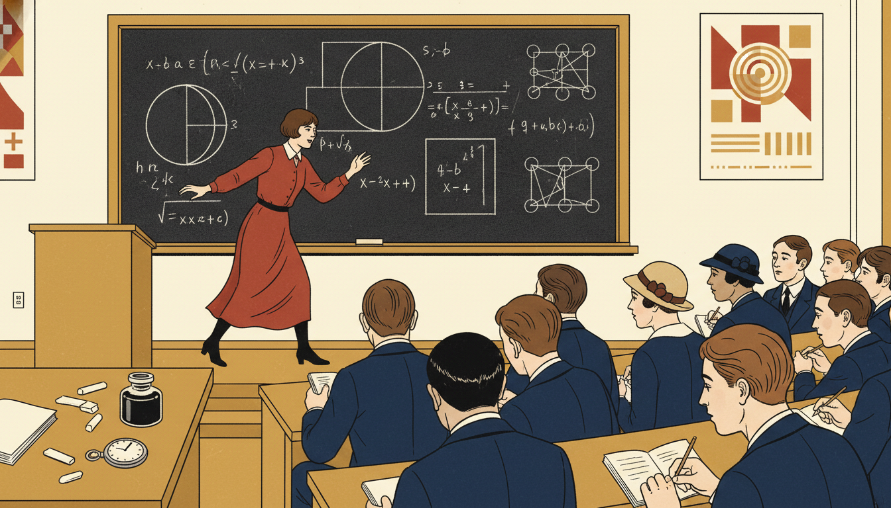

Image Prompt

I am about to ask you to generate a series of images for a graphic novel. Please make the images have a consistent style and consistent characters. Do not ask any clarifying questions. Just generate the image immediately when asked.

Please generate a 16:9 image in early 20th century Bauhaus/Weimar Germany illustration style depicting panel 9 of 12. The scene shows Emmy in the 1920s leading a lecture at Gottingen, surrounded by devoted young students known as "the Noether boys." She paces energetically in front of a chalkboard covered with abstract algebra symbols: rings, ideals, modules. Students of both sexes in simple 1920s dress lean forward taking notes. Color palette: cream walls, mustard highlights, deep navy suits, brick red accent, chalk white. Emotional tone: inspirational mentorship. Include diagrams of rings and ideals, a pocket watch on the lectern, an inkwell, scattered chalk stubs, and geometric Bauhaus posters on the walls. Generate the image immediately without asking clarifying questions.

During the 1920s, Emmy created the modern framework of abstract algebra, the study of rings, ideals, and modules. Students from around the world flocked to her lectures. Though they were sometimes chaotic, her ideas were electrifying. The structures you learn today, functions between sets, groups and operations, bear her fingerprints.

## Panel 10: Exile from Gottingen

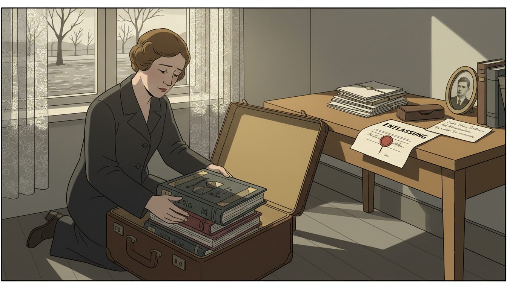

Image Prompt

I am about to ask you to generate a series of images for a graphic novel. Please make the images have a consistent style and consistent characters. Do not ask any clarifying questions. Just generate the image immediately when asked.

Please generate a 16:9 image in early 20th century Bauhaus/Weimar Germany illustration style depicting panel 10 of 12. The scene shows Emmy in April 1933 packing books into an open leather suitcase in her Gottingen apartment as she prepares to leave Germany. An official-looking government dismissal letter with a generic wax seal lies face-up on her desk. The window looks out on a quiet gray cobblestone street with bare trees. She wears a plain dark travel coat. Color palette: somber gray, muted mustard, faded cream, deep brown, dull charcoal. Emotional tone: sorrow and quiet resolve. Include her open suitcase half-full of mathematics books, stacks of papers tied with string, her glasses case on the desk, a handwritten farewell note from a student, a small framed photo of her brother Fritz, and soft afternoon light filtering through a lace curtain. Generate the image immediately without asking clarifying questions.

When the Nazis came to power in 1933, Emmy was dismissed from Gottingen for being Jewish. She never raised her voice in protest. Instead, she held small algebra seminars in her apartment for any student who still dared to come. When safe passage became possible, she left for America.

## Panel 11: Bryn Mawr and Peace

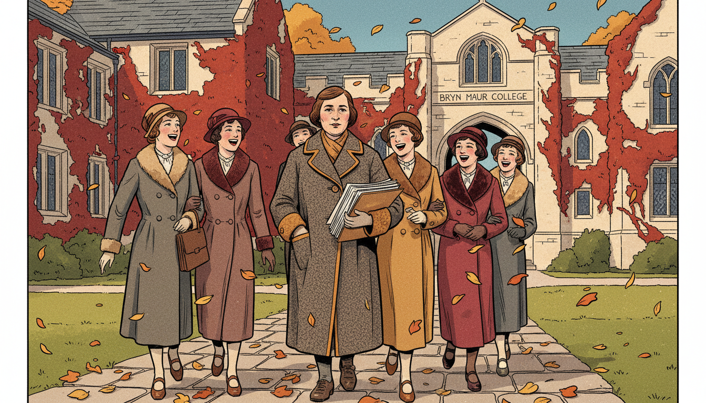

Image Prompt

I am about to ask you to generate a series of images for a graphic novel. Please make the images have a consistent style and consistent characters. Do not ask any clarifying questions. Just generate the image immediately when asked.

Please generate a 16:9 image in early 20th century Bauhaus/Weimar Germany illustration style transitioning to American academic setting depicting panel 11 of 12. The scene shows Emmy in 1934 at Bryn Mawr College in Pennsylvania, walking on the ivy-covered stone campus with a group of young American women graduate students. Autumn leaves fall around them. She wears a warm wool coat and carries a folder of papers. Color palette: warm ochre autumn leaves, deep brick red ivy, cream stone, steel blue sky, mustard trim. Emotional tone: hard-won peace. Include the Bryn Mawr stone arch, Gothic windows, female students in 1930s coats, her students laughing at one of her jokes, and mathematics papers in her arm. Generate the image immediately without asking clarifying questions.

At Bryn Mawr College, Emmy finally had what she always deserved: a real professorship, a salary, and adoring students. She taught advanced algebra to young American women who would become the next generation of mathematicians. For the first time, she was simply and fully recognized. It did not last long enough.

## Panel 12: Legacy of Symmetry

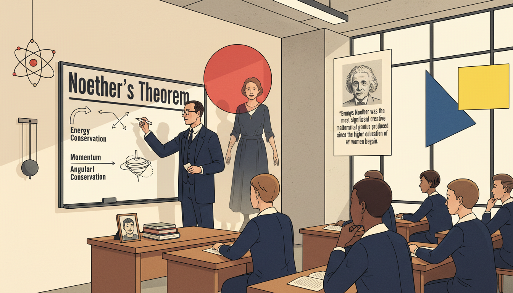

Image Prompt

I am about to ask you to generate a series of images for a graphic novel. Please make the images have a consistent style and consistent characters. Do not ask any clarifying questions. Just generate the image immediately when asked.

Please generate a 16:9 image in early 20th century Bauhaus/Weimar Germany illustration style depicting panel 12 of 12. The scene shows a modern physics classroom where a teacher writes "Noether's Theorem" on a whiteboard while a diverse group of students listen. A translucent figure of Emmy Noether in her 1920s dark dress smiles gently in the background. Bauhaus geometric shapes (red circle, yellow square, blue triangle) float as symmetry icons. Color palette: warm cream, Bauhaus primary red yellow blue, deep navy, soft fluorescent white. Emotional tone: eternal recognition. Include diagrams of conservation laws (energy, momentum, angular momentum), a model atom, a pendulum, a poster of Einstein's quote praising Noether, and a small photo of Emmy on the teacher's desk. Generate the image immediately without asking clarifying questions.

Emmy Noether died suddenly in 1935, only 53 years old. But her theorem still powers every branch of physics, from quantum mechanics to particle accelerators. Abstract algebra, the language of modern mathematics, is shaped by her vision of structure and symmetry. Every function you study that respects a symmetry owes her a silent thank you.

### Epilogue – What Made Emmy Different?

Emmy Noether asked one of the deepest questions in all of science: what stays the same when things change? Her answer connected algebra and physics forever and gave the world a new way to think about laws of nature.

| Challenge | How Emmy Responded | Lesson for Today |
|-----------|---------------------|------------------|
| Women banned from universities | Audited classes, waited, persisted | Systems change when people refuse to leave |
| No salary or title | Taught anyway, kept publishing | Love of the work outlasts injustice |
| Nazi dismissal for being Jewish | Held secret seminars, then emigrated | Teaching is resistance |
| History overlooked her | Her theorems endured and spread | Truth eventually finds its audience |

### Call to Action

Next time you notice something staying the same while everything else changes, an output that does not flinch when its input transforms, you are seeing Noether's legacy. Look for symmetry in your equations and your world. Appreciate the teachers who lift others even when the system will not lift them. Emmy Noether believed in mathematics, in students, and in hope. So can you.

---

*"My methods are really methods of working and thinking; this is why they have crept in everywhere anonymously."*
—Emmy Noether

*"In the judgment of the most competent living mathematicians, Fraulein Noether was the most significant creative mathematical genius thus far produced since the higher education of women began."*
—Albert Einstein, about Emmy Noether

---

## References

1. [Wikipedia: Emmy Noether](https://en.wikipedia.org/wiki/Emmy_Noether) - Biography of the German mathematician (1882–1935)
2. [Wikipedia: Noether's theorem](https://en.wikipedia.org/wiki/Noether%27s_theorem) - Her landmark result connecting symmetries and conservation laws
3. [Wikipedia: Abstract algebra](https://en.wikipedia.org/wiki/Abstract_algebra) - The field Noether helped establish in its modern form
4. [MacTutor: Emmy Amalie Noether](https://mathshistory.st-andrews.ac.uk/Biographies/Noether_Emmy/) - University of St Andrews history of mathematics archive
5. [Encyclopaedia Britannica: Emmy Noether](https://www.britannica.com/biography/Emmy-Noether) - Overview of Noether's life and contributions to algebra and physics
