# Frank Drake: Are We Alone?

Cover Image Prompt

Please generate a wide-landscape 16:9 cover image in mid-century space age graphic-novel style depicting Frank Drake as a young astronomer in a dark suit, narrow tie, and horn-rimmed glasses standing before a chalkboard at the Green Bank Observatory in 1961, writing his famous equation N = R* times f_p times n_e times f_l times f_i times f_c times L, with the enormous white dish of the 85-foot telescope visible through the window behind him against a starry night sky. Include the title text "Are We Alone?" rendered in a Space Age sans-serif typeface. Color palette: deep cosmic blue, chalkboard green, chalk white, Bell Labs cream, warm lamp gold, star silver. Emotional tone: awestruck scientific hope. Include a radio signal waveform, the constellation Orion in the sky, a notebook labeled "Project Ozma", coffee cups on a table, a reel-to-reel data recorder, and a West Virginia mountain ridge silhouette. Generate the image immediately without asking clarifying questions.

Narrative Prompt

Tell the story of Frank Drake (1930-2022), the American astronomer and astrophysicist who pioneered the search for extraterrestrial intelligence (SETI). Cover his childhood fascination with other worlds, his Cornell training, his Project Ozma in 1960 at Green Bank Observatory, the creation of the Drake Equation at the 1961 Green Bank conference, the Arecibo message of 1974, and his lifelong commitment to SETI. Focus on how the Drake Equation is a product of factors, a function with seven inputs that produces an output estimating communicating civilizations in the galaxy. Use a tone that is curious and hopeful for IB Diploma high school students, capturing the optimism of the space age.

### Prologue - A Chalkboard Question

In November 1961, eleven scientists gathered in a small observatory in the West Virginia mountains to answer the biggest question a human being can ask: Are we alone? Their host, a 31-year-old astronomer named Frank Drake, walked to the chalkboard and wrote a single equation with seven factors. That equation would launch a new scientific field and guide humanity's search for other minds among the stars.

## Panel 1: A Curious Kid in Chicago

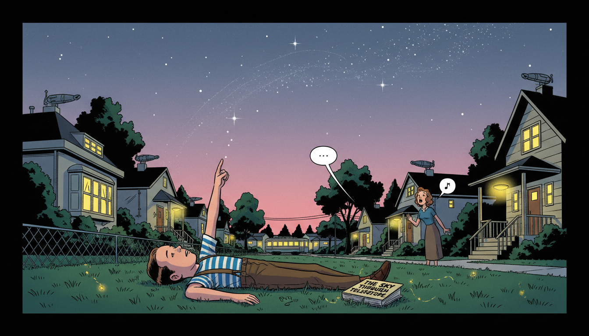

Image Prompt

I am about to ask you to generate a series of images for a graphic novel. Please make the images have a consistent style and consistent characters. Do not ask any clarifying questions. Just generate the image immediately when asked.

Please generate a 16:9 image in mid-century space age graphic-novel style depicting panel 1 of 12. The scene should include an 8 year old Frank Drake in a striped t-shirt and suspenders in 1938, lying on his back on a grassy lawn in Chicago at dusk, pointing up at the first stars appearing over his suburban neighborhood. Color palette: twilight indigo, lawn green, warm porch yellow, star silver, soft rose sky. The emotional tone should be tender childhood wonder. Include 1930s suburban houses with porch lights glowing, a distant streetcar, a chain-link fence, fireflies, a library book titled "The Sky Through the Telescope" lying beside him, his mother calling from a porch, and the faint outline of the Milky Way overhead. Generate the image immediately without asking clarifying questions.

Frank Drake was born in Chicago in 1930 and grew up during the golden age of science fiction and radio. At eight years old, he wondered whether other planets might have children looking back at his star. His parents taught him that such questions were welcome, and his Sunday school teacher never told him other worlds were off limits. That openness gave him permission to take the question seriously for the rest of his life.

## Panel 2: Cornell and Radio Astronomy

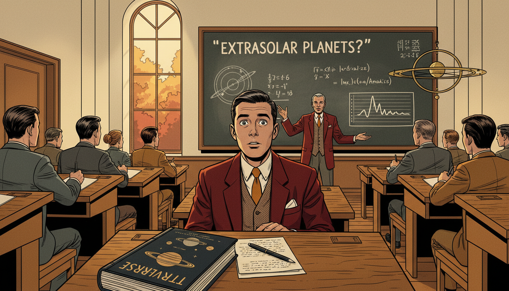

Image Prompt

I am about to ask you to generate a series of images for a graphic novel. Please make the images have a consistent style and consistent characters. Do not ask any clarifying questions. Just generate the image immediately when asked.

Please generate a 16:9 image in mid-century space age graphic-novel style depicting panel 2 of 12. The scene should include a 21 year old Frank Drake in a Cornell University lecture hall in 1951, wearing a dark blazer and narrow tie, listening intently as Otto Struve lectures on the possibility of extrasolar planets, with a blackboard full of orbital diagrams in front. Color palette: Cornell red, autumn leaves amber, classroom cream, chalk white, tweed brown. The emotional tone should be the thrilling moment when a lifelong path opens up. Include wooden tiered seating, other students taking notes, a tall window with autumn trees outside, a diagram of spectral lines, a model of the solar system, a book titled "The Universe" on Drake's desk, and his wide eyes fixed on the lecturer. Generate the image immediately without asking clarifying questions.

At Cornell, Drake studied engineering physics and attended a lecture by the astronomer Otto Struve about the likelihood that other stars had planets. That lecture convinced him that astronomy, not engineering, was his calling. He went on to earn a Ph.D. from Harvard in 1958, specializing in the new field of radio astronomy. Radio telescopes, he realized, could listen across light-years for signals no optical telescope could ever see.

## Panel 3: Green Bank Observatory

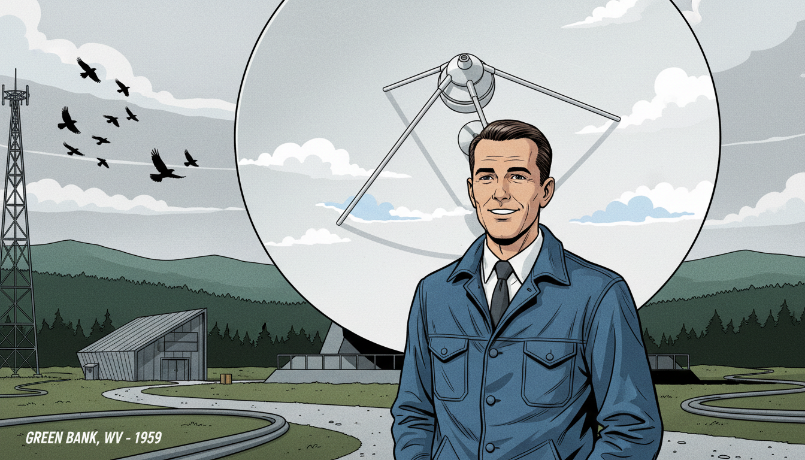

Image Prompt

I am about to ask you to generate a series of images for a graphic novel. Please make the images have a consistent style and consistent characters. Do not ask any clarifying questions. Just generate the image immediately when asked.

Please generate a 16:9 image in mid-century space age graphic-novel style depicting panel 3 of 12. The scene should include Frank Drake standing beside the 85-foot Tatel radio telescope at the National Radio Astronomy Observatory in Green Bank, West Virginia in 1959, the enormous white parabolic dish pointed at the sky behind him. Color palette: mountain forest green, dish white, overcast silver, denim blue, steel gray. The emotional tone should be reverent quiet excitement. Include the Allegheny mountain ridges in the distance, a winding gravel access road, a small control building, a flock of crows, cables running along the ground, Drake in a work jacket and tie, and puffy summer clouds reflected in the dish. Generate the image immediately without asking clarifying questions.

In 1958 Drake joined the brand new National Radio Astronomy Observatory at Green Bank, West Virginia. The observatory sat in a protected quiet zone where radio interference was banned by law so telescopes could listen undisturbed. Drake operated the 85-foot Tatel telescope, studying the radio emissions of distant stars and gas clouds. He also quietly began designing a much bolder experiment.

## Panel 4: Project Ozma

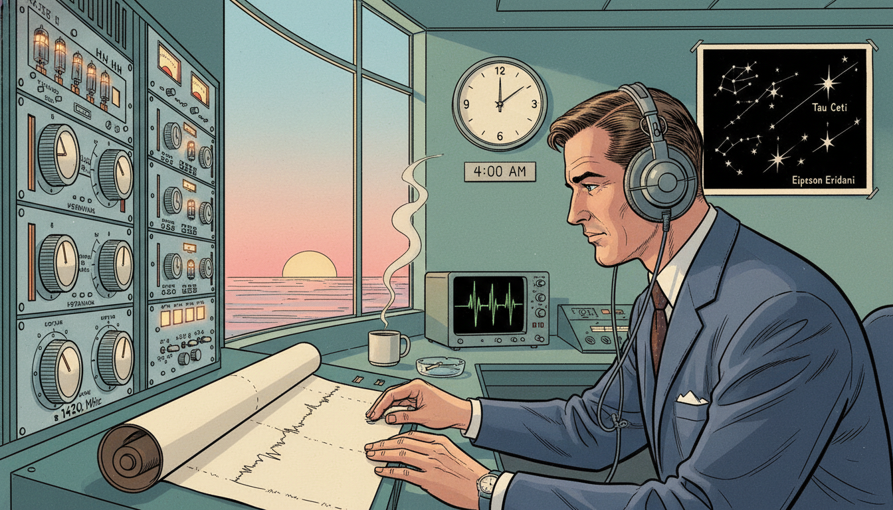

Image Prompt

I am about to ask you to generate a series of images for a graphic novel. Please make the images have a consistent style and consistent characters. Do not ask any clarifying questions. Just generate the image immediately when asked.

Please generate a 16:9 image in mid-century space age graphic-novel style depicting panel 4 of 12. The scene should include Frank Drake in the Green Bank control room at dawn on April 8, 1960, wearing headphones, adjusting dials on a rack of receiver electronics, listening for signals from the nearby star Tau Ceti as a chart recorder draws a thin ink line on paper. Color palette: control room teal, receiver silver, warm lamp amber, chart paper cream, dawn rose through the window. The emotional tone should be historic stillness and focused hope. Include a large clock reading 4:00 am, a mug of coffee, a star chart labeled Tau Ceti and Epsilon Eridani, an oscilloscope, a rotary knob tuned to 1420 megahertz (the hydrogen line), a cigarette smoldering in an ashtray, and his reflection faintly visible in the console glass. Generate the image immediately without asking clarifying questions.

On April 8, 1960, Drake launched Project Ozma, the first modern scientific search for extraterrestrial radio signals. He pointed the Green Bank telescope at two nearby sun-like stars, Tau Ceti and Epsilon Eridani, and tuned his receiver to the 1420 megahertz hydrogen line. That frequency was a natural "universal" channel all radio astronomers everywhere would know. For the first time in history, someone was actually listening.

## Panel 5: A Strange Signal

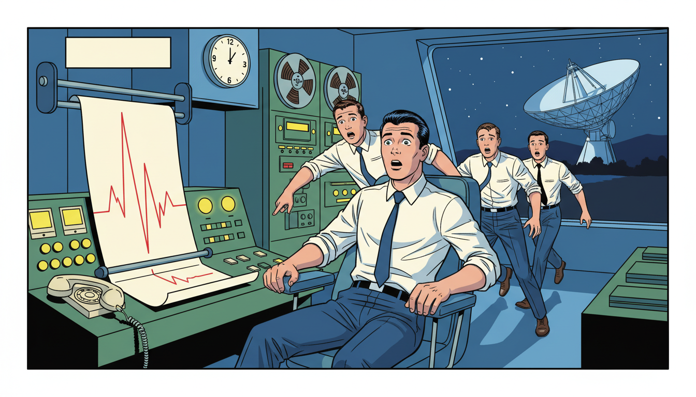

Image Prompt

I am about to ask you to generate a series of images for a graphic novel. Please make the images have a consistent style and consistent characters. Do not ask any clarifying questions. Just generate the image immediately when asked.

Please generate a 16:9 image in mid-century space age graphic-novel style depicting panel 5 of 12. The scene should include Drake half-rising from his console chair in surprise as a sharp regular pulse suddenly shoots across the chart recorder paper in Green Bank, other technicians rushing over to see the tracing. Color palette: control room green, alarm red, chart paper cream, lamp yellow, shadow blue. The emotional tone should be electric suspense followed by cautious realization. Include a wall clock showing early morning, technicians in white shirts and narrow ties, the chart pen mid-spike, a telephone handset off its cradle, reels of magnetic tape, and a window revealing the huge telescope dish still locked on target outside. Generate the image immediately without asking clarifying questions.

On the first day of Project Ozma, Drake's receiver suddenly picked up a strong pulsing signal. For a heartbeat, the team thought they had found aliens. The signal turned out to be a secret military radar, not an alien broadcast. The disappointment did not discourage Drake; it taught him that someday, maybe soon, a real signal could arrive.

## Panel 6: The Green Bank Conference

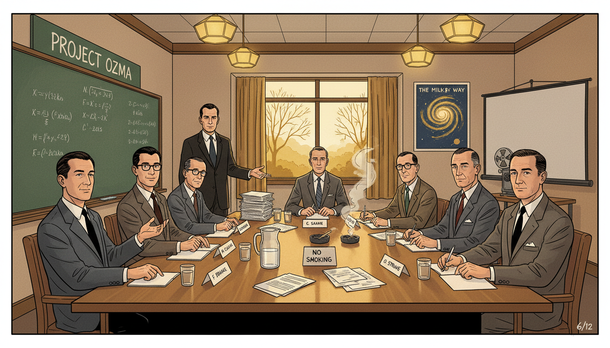

Image Prompt

I am about to ask you to generate a series of images for a graphic novel. Please make the images have a consistent style and consistent characters. Do not ask any clarifying questions. Just generate the image immediately when asked.

Please generate a 16:9 image in mid-century space age graphic-novel style depicting panel 6 of 12. The scene should include a conference room at Green Bank Observatory in November 1961, with eleven scientists seated around a long wooden table, including a young Carl Sagan, Melvin Calvin, Philip Morrison, Otto Struve, and Frank Drake at the head of the table standing beside a chalkboard. Color palette: conference room brown, chalkboard green, suit gray, autumn window gold, warm ceiling lamp. The emotional tone should be serious collaborative hope. Include stacks of paper and coffee cups on the table, a pitcher of water, wooden chairs, a no-smoking sign being ignored, a poster of the Milky Way on the wall, a reel-to-reel projector, and name cards in front of each scientist. Generate the image immediately without asking clarifying questions.

In November 1961, Drake convened eleven scientists at Green Bank to discuss whether SETI could become a real scientific field. The group included a young Carl Sagan, chemist Melvin Calvin (who would win a Nobel Prize that week), physicist Philip Morrison, and Drake's former mentor Otto Struve. They needed an agenda. Drake decided to turn the big fuzzy question into a clear mathematical expression.

## Panel 7: The Drake Equation

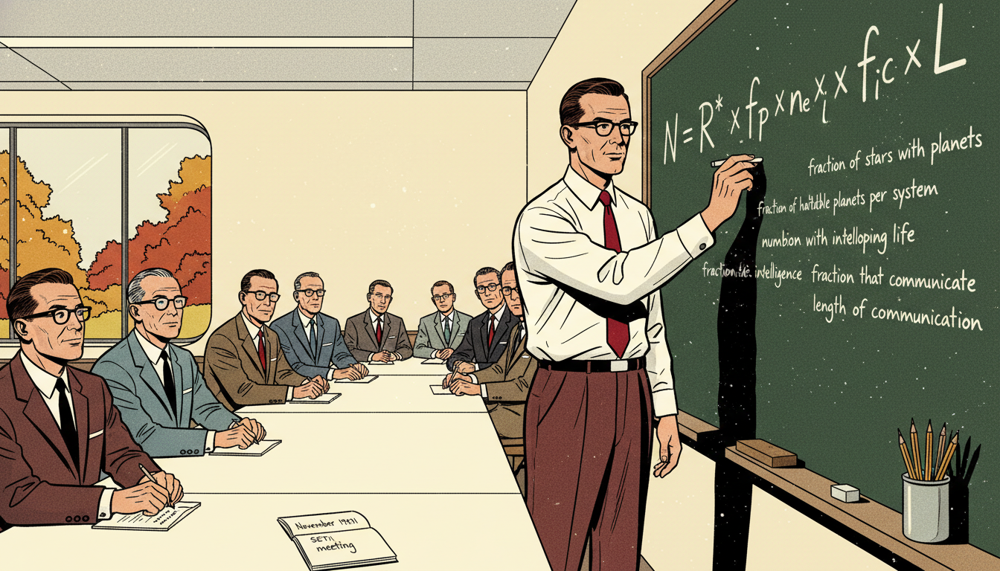

Image Prompt

I am about to ask you to generate a series of images for a graphic novel. Please make the images have a consistent style and consistent characters. Do not ask any clarifying questions. Just generate the image immediately when asked.

Please generate a 16:9 image in mid-century space age graphic-novel style depicting panel 7 of 12. The scene should include Frank Drake at the chalkboard writing in bold white chalk the equation N = R* times f_p times n_e times f_l times f_i times f_c times L, with each factor labeled beneath in smaller letters: rate of star formation, fraction of stars with planets, number of habitable planets per system, fraction developing life, fraction with intelligence, fraction that communicate, length of communication. Color palette: chalkboard green, chalk white, shirt white, tie crimson, wall cream. The emotional tone should be historic clarity. Include the eleven seated scientists watching intently, chalk dust in the air, an eraser on the ledge, a cup of pencils, a window showing autumn trees, a notebook labeled "November 1961 SETI meeting", and Drake's hand mid-stroke on the final L. Generate the image immediately without asking clarifying questions.

Drake wrote on the chalkboard an equation that would become famous: $N = R_* \cdot f_p \cdot n_e \cdot f_\ell \cdot f_i \cdot f_c \cdot L$. Here $N$ is the number of communicating civilizations in our galaxy, and the seven factors on the right describe everything from the rate of star formation to the average lifetime of a broadcasting civilization. It is a function of seven inputs producing one output. Even if you do not know each factor exactly, the equation tells you exactly which questions to study.

## Panel 8: A Function of Seven Factors

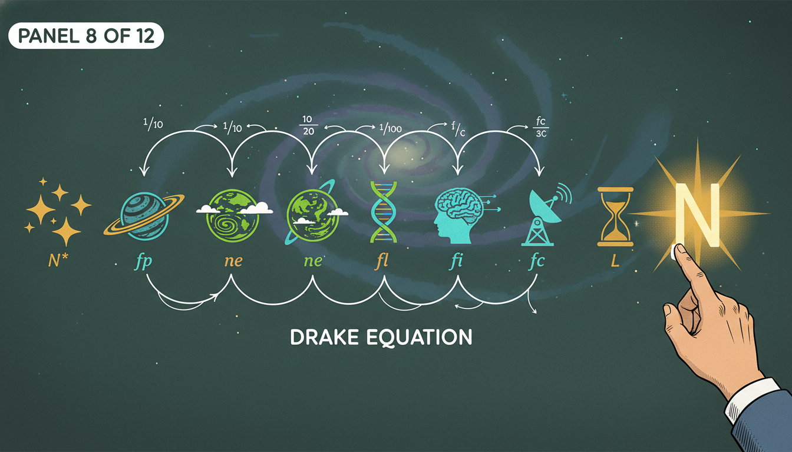

Image Prompt

I am about to ask you to generate a series of images for a graphic novel. Please make the images have a consistent style and consistent characters. Do not ask any clarifying questions. Just generate the image immediately when asked.

Please generate a 16:9 image in mid-century space age graphic-novel style depicting panel 8 of 12. The scene should include a stylized infographic view of the seven factors of the Drake Equation as a pipeline of floating icons above a chalkboard: a star cluster, a planet system, a green habitable Earth, a strand of DNA, a thinking brain silhouette, a radio tower, and an hourglass, all arranged left to right with a glowing N at the end. Color palette: chalkboard green, cosmic blue, star gold, life green, communication cyan, time amber. The emotional tone should be elegant clarity. Include small handwritten labels under each icon, a faint spiral galaxy backdrop, tick marks and probability fractions, arrows linking each factor, and Drake's hand at the edge of the frame pointing to the final N. Generate the image immediately without asking clarifying questions.

Each factor is itself a probability or rate that scientists can investigate. Astronomers study $R_*$ and $f_p$ by counting stars and finding exoplanets. Biologists and chemists tackle $f_\ell$, the fraction of habitable planets where life actually begins. Other thinkers work on the fraction that develop intelligence, technology, and willingness to communicate. The equation turned a dream into a research program.

## Panel 9: The Pioneer Plaque

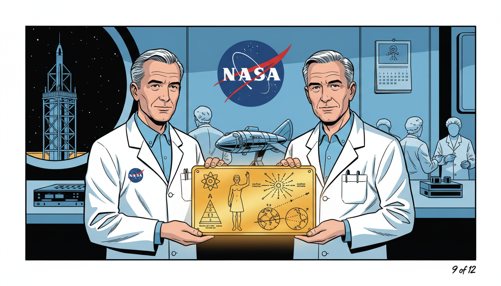

Image Prompt

I am about to ask you to generate a series of images for a graphic novel. Please make the images have a consistent style and consistent characters. Do not ask any clarifying questions. Just generate the image immediately when asked.

Please generate a 16:9 image in mid-century space age graphic-novel style depicting panel 9 of 12. The scene should include Frank Drake and Carl Sagan in 1972 examining the gold-anodized aluminum Pioneer plaque, a rectangular engraved plate showing a nude man and woman, a diagram of our solar system, and a hydrogen atom, held up in a NASA lab. Color palette: gold plaque amber, NASA white, lab blue, cosmic black, instrument silver. The emotional tone should be thoughtful ceremonial hope. Include the Pioneer spacecraft model on a workbench, technicians in cleanroom caps, the NASA logo on the wall, a star map showing 14 pulsar directions originating from Earth, a calendar page marked March 1972, and a window view of a rocket gantry in the distance. Generate the image immediately without asking clarifying questions.

In 1972, Drake and Carl Sagan designed the Pioneer plaque, a gold-anodized aluminum message attached to the Pioneer 10 and 11 spacecraft. The plaque shows a man, a woman, our solar system, and a pulsar map locating Earth. It was humanity's first deliberate message sent into interstellar space. If aliens ever intercept Pioneer, they will receive a function that decodes back to us.

## Panel 10: The Arecibo Message

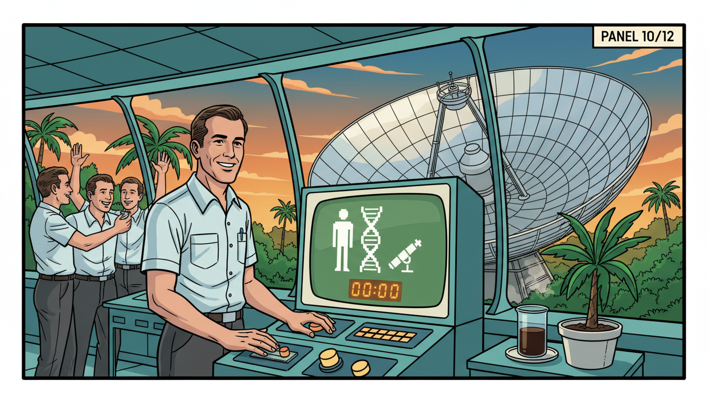

Image Prompt

I am about to ask you to generate a series of images for a graphic novel. Please make the images have a consistent style and consistent characters. Do not ask any clarifying questions. Just generate the image immediately when asked.

Please generate a 16:9 image in mid-century space age graphic-novel style depicting panel 10 of 12. The scene should include Frank Drake at the control room of the Arecibo radio telescope in Puerto Rico in November 1974, watching a giant 1679-bit binary message being transmitted toward the globular cluster M13, with the spherical dish visible through the window. Color palette: jungle green, dish silver, control panel teal, tropical sunset orange, chalk white. The emotional tone should be outward reaching optimism. Include the famous pixel image decoded on a monitor showing a stick figure human and DNA helix, a beaker of cold coffee, tropical plants outside, the suspended receiver platform over the dish, scientists in short-sleeved shirts cheering, and the countdown timer at 00:00. Generate the image immediately without asking clarifying questions.

On November 16, 1974, Drake used the Arecibo radio telescope in Puerto Rico to transmit a brief but powerful message toward the globular cluster M13. The 1679-bit message encoded numbers, DNA, a human figure, our solar system, and a sketch of the telescope itself. It was a function mapping humanity into a few seconds of binary. Even if no one ever decodes it, the broadcast was a declaration that we are here and we are listening.

## Panel 11: A Lifetime of Listening

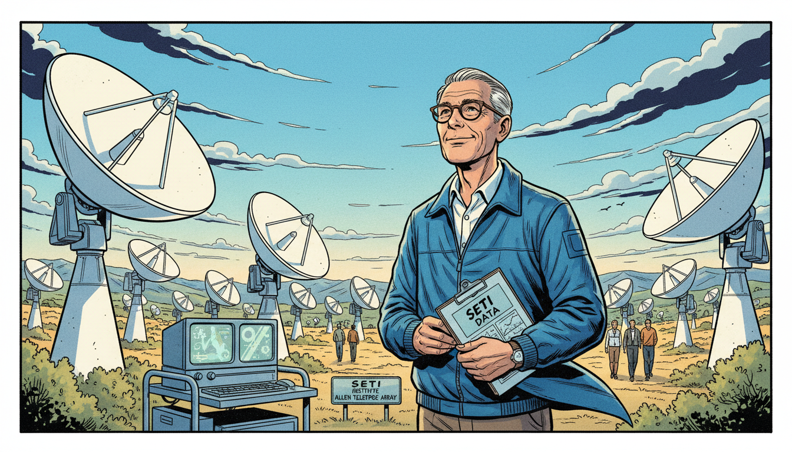

Image Prompt

I am about to ask you to generate a series of images for a graphic novel. Please make the images have a consistent style and consistent characters. Do not ask any clarifying questions. Just generate the image immediately when asked.

Please generate a 16:9 image in mid-century space age graphic-novel style depicting panel 11 of 12. The scene should include an older Frank Drake in his 70s with gray hair and glasses, in the 2000s, standing among the dishes of the Allen Telescope Array in northern California, smiling as he looks up at dozens of small white radio dishes all pointing at the sky together. Color palette: California sky blue, dish white, chaparral gold, sage green, deep navy. The emotional tone should be patient steady hope across decades. Include a clipboard with SETI data, computer screens on a mobile cart, a gentle breeze moving his windbreaker, a small sign reading "SETI Institute Allen Telescope Array", mountains in the distance, and other researchers walking between the dishes. Generate the image immediately without asking clarifying questions.

Drake co-founded the SETI Institute in 1984 and spent decades refining telescope searches. He helped guide the Allen Telescope Array, a field of radio dishes dedicated to scanning millions of stars. No confirmed alien signal has ever been received. Yet every year the equation's factors get better numbers, and the search expands. Drake treated silence not as failure but as data.

## Panel 12: The Equation as a Telescope

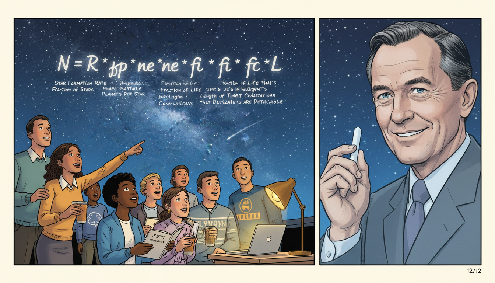

Image Prompt

I am about to ask you to generate a series of images for a graphic novel. Please make the images have a consistent style and consistent characters. Do not ask any clarifying questions. Just generate the image immediately when asked.

Please generate a 16:9 image in mid-century space age graphic-novel style depicting panel 12 of 12. The scene should include a modern split scene showing on the left a diverse group of contemporary IB high school students looking up at a planetarium ceiling projecting the Milky Way, with the Drake Equation written across the dome, and on the right a translucent ghostly image of Frank Drake smiling down, holding a piece of chalk. Color palette: planetarium deep blue, star silver, chalk white, warm student lamp gold, classroom cream. The emotional tone should be torch-passing inspiration. Include a student pointing at the equation, a teacher with a laptop showing exoplanet data, a notebook titled "SETI research project", the seven factors labeled across the dome, Drake's kind expression, and a shooting star crossing the projected sky. Generate the image immediately without asking clarifying questions.

The Drake Equation is more than a formula. It is a telescope built out of mathematics, pointing at the biggest question humans can ask. When you learn to multiply probabilities in your IB course, you are using the same reasoning Drake used to organize an entire scientific field. Whether or not we ever receive a signal, his equation changed what we consider answerable. Every input, from a lab experiment to a distant star, contributes to the output.

### Epilogue - What Made Drake Different?

Drake was willing to take a childhood question seriously enough to design an experiment around it. He understood that turning a dream into a function of measurable factors was the first step to making it science. He kept listening for over sixty years, through disappointments and budget cuts. His story shows that big questions deserve disciplined tools.

| Challenge | How Drake Responded | Lesson for Today |
|-----------|---------------------|------------------|
| No scientific field for searching for aliens | Launched Project Ozma and created SETI | Build the field you wish existed |
| A vague question about life in the universe | Wrote the Drake Equation as a function of seven factors | Turn big questions into measurable variables |
| Decades of no confirmed signals | Treated silence as data and kept refining | Negative results still narrow the search |
| Public skepticism and funding cuts | Co-founded the SETI Institute for private support | Find new homes for important science |
| Limited telescope sensitivity | Helped design arrays like Allen Telescope Array | Better tools follow better questions |

### Call to Action

The next time you look up at the night sky, remember Frank Drake. Somewhere out there, a function with seven factors is quietly estimating how many neighbors we might have. Ask your own big questions, and then write them as equations you can actually solve. Every input has its output, even across light-years.

---

*"We are one species of many on a small planet in a universe full of astonishing possibilities."*
—Frank Drake

*"As I planned Project Ozma, I was a bit scared. I was afraid I was doing something too bold."*
—Frank Drake

---

## References

1. [Wikipedia: Frank Drake](https://en.wikipedia.org/wiki/Frank_Drake) - Biography of the American astronomer (1930–2022)
2. [Wikipedia: Drake equation](https://en.wikipedia.org/wiki/Drake_equation) - The 1961 equation estimating the number of communicating civilizations
3. [Wikipedia: Search for extraterrestrial intelligence](https://en.wikipedia.org/wiki/Search_for_extraterrestrial_intelligence) - The scientific field Drake helped found with Project Ozma
4. [SETI Institute: Frank Drake](https://www.seti.org/frank-drake-trustee-emeritus) - SETI Institute biography and memorial
5. [Encyclopaedia Britannica: Frank Drake](https://www.britannica.com/biography/Frank-Drake) - Overview of Drake's life and contributions to astrobiology
