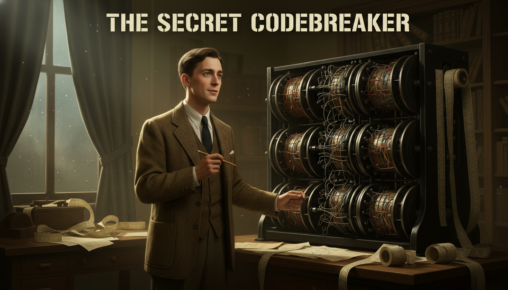
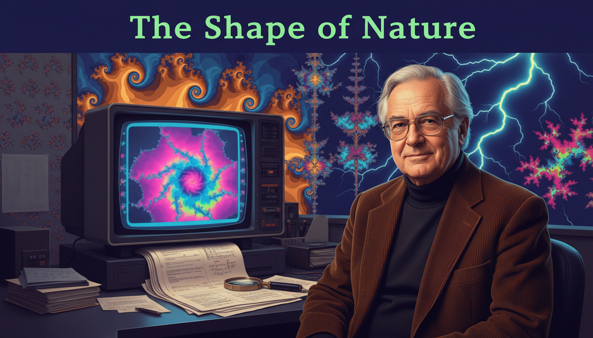
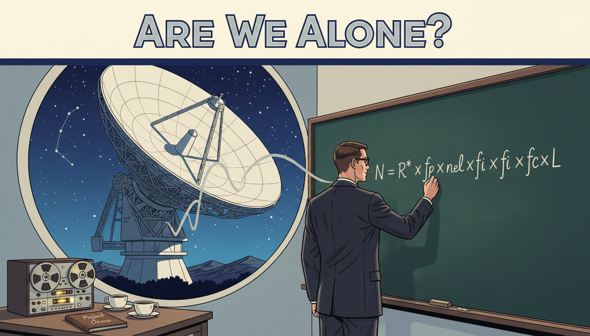

# Stories from the History of Functions

Functions are not just symbols on a page — they are ideas invented, fought over, refined, and applied by real people across centuries and continents. These short graphic novels introduce you to the mathematicians and scientists who built the world of functions we still use today. Each story is told in twelve panels, designed to be read in a single sitting.

Every story highlights a central theme: curiosity, persistence, imagination, or the courage to think differently. As you read them, watch for the moments when an ordinary person saw something nobody else could see — and remember that you are learning the very same tools they used.

- **[The Language of Change: René Descartes](rene-descartes/index.md)**

    
    A sick French philosopher watches a fly on his ceiling and invents the coordinate plane, forever joining algebra and geometry.

- **[The Notation Wars: Leibniz vs. Newton](leibniz-vs-newton/index.md)**

    
    Two geniuses invent calculus on opposite sides of the English Channel and trigger a decades-long feud over whose notation would survive.

- **[The Symbol That Stuck: Leonhard Euler](leonhard-euler/index.md)**

    
    A blind Swiss mathematician dictates papers to his sons and gives the world the notation $f(x)$ that every student now uses.

- **[From Waves to Music: Joseph Fourier](joseph-fourier/index.md)**

    
    A French mathematician insists that any function can be built from sines and cosines, and his idea ends up powering every song streaming to your phone.

- **[The First Programmer: Ada Lovelace](ada-lovelace/index.md)**

    
    In Victorian London, a young countess looks at a mechanical computer and imagines the first algorithm — a full century before computers exist.

- **[The Pandemic Modeler: Ronald Ross](ronald-ross/index.md)**

    
    A British doctor in colonial India uses functions to model malaria and proves that mathematics can save millions of lives.

- **[The Equation of Hope: Emmy Noether](emmy-noether/index.md)**

    
    Barred from official university positions because she was a woman, a German mathematician quietly proves theorems that become the foundation of modern physics.

- **[The Infinity Dreamer: Srinivasa Ramanujan](srinivasa-ramanujan/index.md)**

    
    A self-taught clerk in India fills notebooks with astonishing formulas and then travels to Cambridge to shock the mathematical world.

- **[The Secret Codebreaker: Alan Turing](alan-turing/index.md)**

    
    During World War II, a brilliant mathematician uses logic and functions to crack the Nazi Enigma code and invent the foundations of modern computing.

- **[The Network Weaver: Claude Shannon](claude-shannon/index.md)**

    
    An American engineer combines Boolean functions with electrical circuits and launches the entire digital age — while juggling and riding a unicycle at Bell Labs.

- **[Mapping the Unknown: Katherine Johnson](katherine-johnson/index.md)**

    
    An African American mathematician at NASA calculates the orbital trajectories that send astronauts into space — and John Glenn refuses to fly without her approval.

- **[The Shape of Nature: Benoit Mandelbrot](benoit-mandelbrot/index.md)**

    
    A mathematician asks "How long is the coastline of Britain?" and discovers fractals — functions that reveal hidden patterns in clouds, mountains, and markets.

- **[Are We Alone? Frank Drake](frank-drake/index.md)**

    
    In 1961, an astronomer writes a single equation on a chalkboard and turns humanity's oldest question — are we alone in the universe? — into a function we can actually compute.

- **[The Climate Function: Syukuro Manabe](syukuro-manabe/index.md)**

    
    A Japanese-American scientist builds the first mathematical model of Earth's atmosphere and predicts global warming decades before the world is ready to listen.

- **[Functions for the Future: Karen Uhlenbeck](karen-uhlenbeck/index.md)**

    
    The first woman to win the Abel Prize uses functions and geometry to understand soap bubbles — and spends decades mentoring the next generation of women in math.

- **[The Invisible Architect: Maryam Mirzakhani](maryam-mirzakhani/index.md)**

    
    The first woman to win the Fields Medal describes her research as "the joy of discovery" and fills her daughter's playroom with giant sheets of mathematical doodles.

