# Joseph Fourier: From Waves to Music

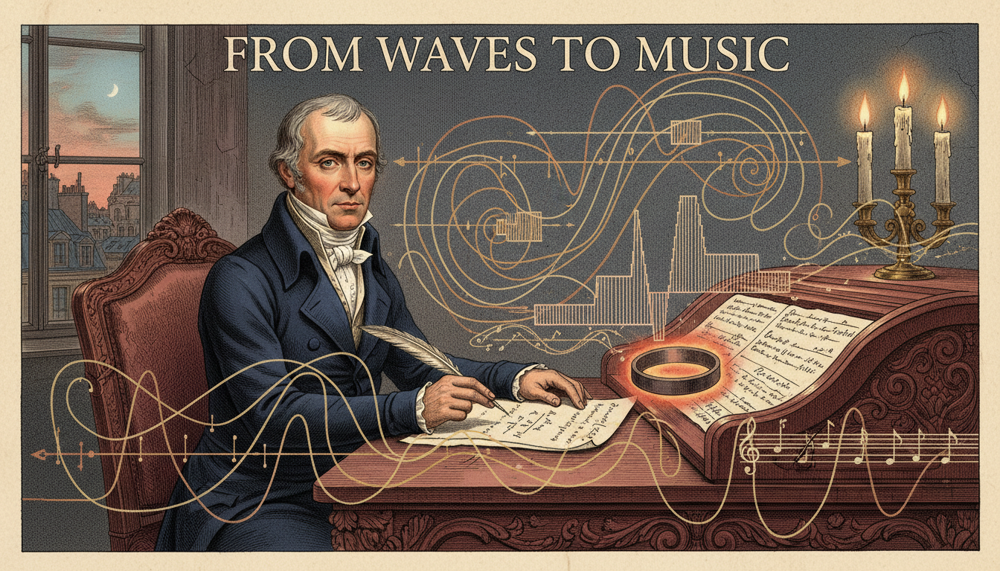

Cover Image Prompt

Please generate a wide-landscape 16:9 cover image in Napoleonic Empire-era illustration style depicting Joseph Fourier at his desk in early 1800s Paris, surrounded by hand-drawn sine and cosine curves floating in the air, a heated iron ring on the table glowing faintly, and quill in hand. Include the title text "From Waves to Music" rendered in a period-appropriate serif typeface reminiscent of early 19th-century French engravings. Color palette: deep navy, burgundy, cream parchment, muted gold, and copper. Emotional tone: contemplative, intellectually triumphant, quietly revolutionary. Include: Empire-style furniture, candlelight, a window showing Parisian rooftops, overlapping waves morphing into a square wave, a handwritten equation on parchment, Fourier in a dark tailcoat. Generate the image immediately without asking clarifying questions.

Narrative Prompt

This graphic novel tells the story of Jean-Baptiste Joseph Fourier (1768-1830), French mathematician and physicist who lived through the French Revolution, served as a scientific advisor on Napoleon's Egyptian campaign, and later became prefect of Isere. His greatest contribution was the idea that any periodic function can be decomposed into a sum of sines and cosines - now called a Fourier series. The style should evoke Napoleonic Empire-era France with hints of Egyptian expedition imagery. Themes: revolution, curiosity, heat, sound, the hidden unity of waves. Keep the tone contemplative and triumphant, suitable for IB Diploma students meeting periodic functions for the first time.

### Prologue – The Boy Who Loved Heat

In a drafty stone house in Auxerre, France, a nine-year-old orphan named Joseph wraps himself in a blanket and stares at the fireplace. He wonders why the metal poker gets hot at the handle long after the flame stops touching the tip. That simple question about how heat travels will one day reshape every branch of mathematics and give the modern world everything from MP3 files to medical scans.

## Panel 1: The Orphan in Auxerre

Image Prompt

I am about to ask you to generate a series of images for a graphic novel. Please make the images have a consistent style and consistent characters. Do not ask any clarifying questions. Just generate the image immediately when asked.

Please generate a 16:9 image in Napoleonic Empire-era illustration style depicting panel 1 of 12. The scene should include a nine-year-old Joseph Fourier in worn 1770s French clothing, holding a metal poker by the fire in a modest stone home in Auxerre, France, 1777. Color palette: amber firelight, deep brown, charcoal gray, cream. The emotional tone should be quiet curiosity and vulnerability. Include: flickering hearth, stone walls, wooden beams, a kind-faced monk in the doorway, a worn book on a table, thermal glow on the boy's face, snow visible through a small window. Generate the image immediately without asking clarifying questions.

Joseph Fourier loses both parents before age ten and is taken in by the Benedictine monks of Auxerre. The monks recognize his sharp mind and give him access to their library. By twelve he is already devouring every mathematics text he can find. Heat, light, and numbers become his lifelong companions.

## Panel 2: Revolution in the Classroom

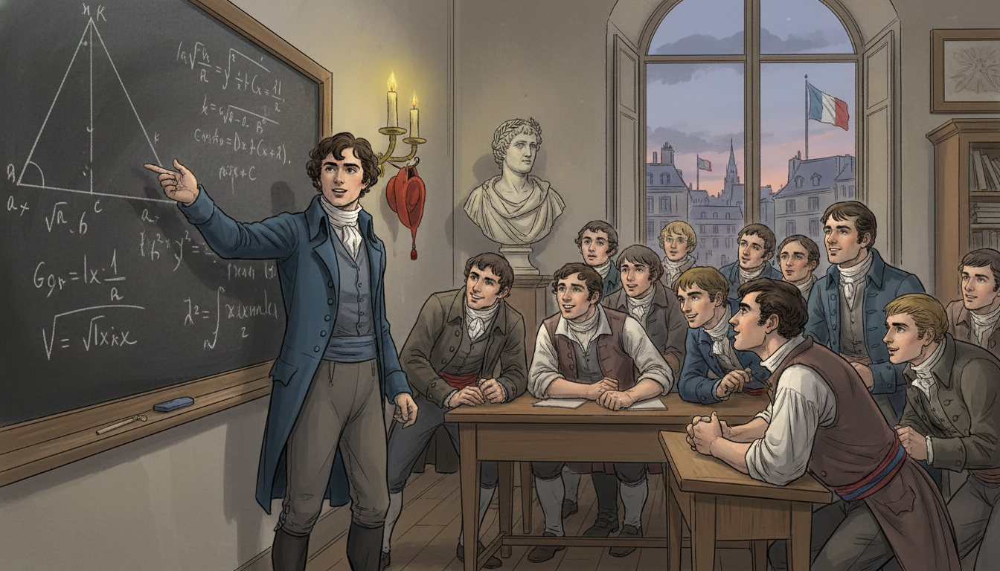

Image Prompt

I am about to ask you to generate a series of images for a graphic novel. Please make the images have a consistent style and consistent characters. Do not ask any clarifying questions. Just generate the image immediately when asked.

Please generate a 16:9 image in Napoleonic Empire-era illustration style depicting panel 2 of 12. The scene should include a young adult Joseph Fourier teaching mathematics to students at the Ecole Normale in revolutionary Paris, 1795. Color palette: tricolor red-white-blue accents, chalky slate, wood browns, candlelight yellow. The emotional tone should be energetic and hopeful amid political chaos. Include: a large blackboard with geometric proofs, students in post-Revolution clothing, a bust of a philosopher, tall windows showing Paris, a liberty cap on a peg, Fourier gesturing at an equation. Generate the image immediately without asking clarifying questions.

As a young man, Fourier nearly loses his head - literally - during the Reign of Terror. He survives and becomes a star teacher at the brand-new Ecole Normale, then at the Ecole Polytechnique. His lectures are legendary for their clarity and warmth. Mathematics, he insists, should be understood, not merely memorized.

## Panel 3: Egypt and the Pyramids

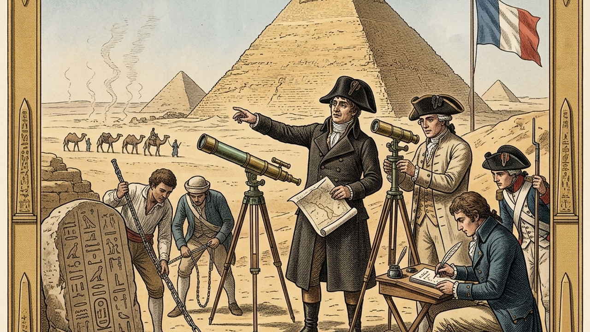

Image Prompt

I am about to ask you to generate a series of images for a graphic novel. Please make the images have a consistent style and consistent characters. Do not ask any clarifying questions. Just generate the image immediately when asked.

Please generate a 16:9 image in Napoleonic Empire-era illustration style depicting panel 3 of 12. The scene should include Joseph Fourier in 1798 on Napoleon's Egyptian expedition, standing near the Great Pyramid of Giza with a group of French savants taking measurements. Color palette: desert ochre, sandstone, Nile blue, faded tricolor, sun-bleached whites. The emotional tone should be awe and scholarly adventure. Include: measuring instruments, a telescope, camels in the distance, notebooks, hieroglyphs on a stele, Fourier in a dark coat despite the heat, shimmering heat waves rising from the sand. Generate the image immediately without asking clarifying questions.

In 1798, Napoleon invites Fourier to join his expedition to Egypt as a scientific advisor. For three years Fourier studies ancient monuments, helps found the Institut d'Egypte, and becomes obsessed with the desert heat. He notices how warmth flows through stone, sand, and air in strangely predictable ways. A question begins forming in his mind: can heat itself be described by an equation?

## Panel 4: The Prefect Who Could Not Stop Thinking

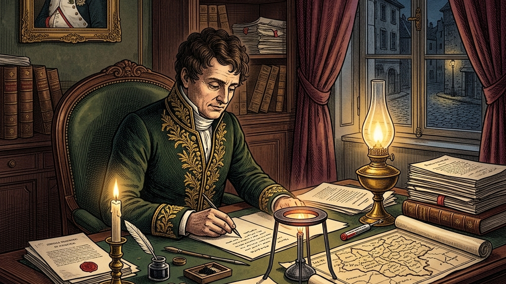

Image Prompt

I am about to ask you to generate a series of images for a graphic novel. Please make the images have a consistent style and consistent characters. Do not ask any clarifying questions. Just generate the image immediately when asked.

Please generate a 16:9 image in Napoleonic Empire-era illustration style depicting panel 4 of 12. The scene should include Joseph Fourier as Prefect of Isere, working late at an elegant desk in Grenoble, France, around 1807. Color palette: burgundy, deep green, polished mahogany, candle gold, ink black. The emotional tone should be focused obsession balanced with civic duty. Include: official documents stamped with wax seals, an oil lamp, a map of the Isere region, a heated metal ring on the desk, scattered equations on parchment, a portrait of Napoleon on the wall, heavy velvet curtains. Generate the image immediately without asking clarifying questions.

Back in France, Napoleon appoints Fourier prefect of the Isere department. He drains swamps, builds roads, and governs fairly by day. But every night he returns to his true obsession: writing equations that describe how heat spreads through solid objects. He works on the problem for nearly a decade.

## Panel 5: The Heated Ring

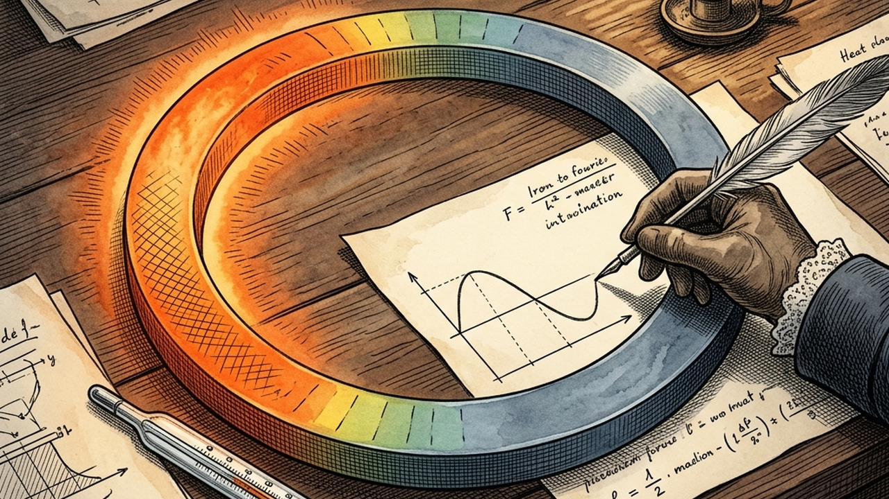

Image Prompt

I am about to ask you to generate a series of images for a graphic novel. Please make the images have a consistent style and consistent characters. Do not ask any clarifying questions. Just generate the image immediately when asked.

Please generate a 16:9 image in Napoleonic Empire-era illustration style depicting panel 5 of 12. The scene should include a close-up of a circular iron ring on a laboratory table, one side glowing red-hot, the other cool, with temperature gradients visualized as colored bands. Color palette: fiery orange, cool slate blue, parchment cream, iron gray. The emotional tone should be scientific wonder and discovery. Include: a mercury thermometer, Fourier's hand tracing a curve on paper, a small sand hourglass, graph sketches, candles casting shadows, a sinusoidal curve emerging from the ring's temperature pattern. Generate the image immediately without asking clarifying questions.

Fourier imagines a simple thought experiment. Heat one side of an iron ring and let it cool. How does the temperature vary around the ring at each moment? He realizes the answer looks like a wave - and that wave can be described as a sum of simple sines and cosines. This is the seed of one of the most powerful ideas in mathematics.

## Panel 6: The Bold Claim

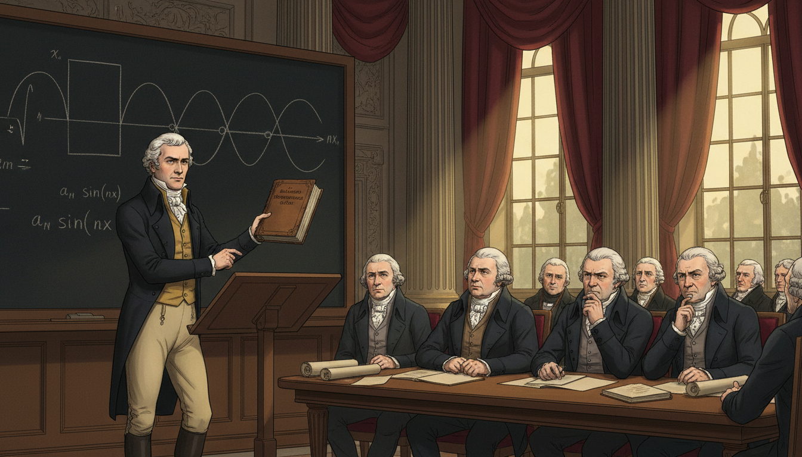

Image Prompt

I am about to ask you to generate a series of images for a graphic novel. Please make the images have a consistent style and consistent characters. Do not ask any clarifying questions. Just generate the image immediately when asked.

Please generate a 16:9 image in Napoleonic Empire-era illustration style depicting panel 6 of 12. The scene should include Fourier presenting his 1807 memoir to the French Academy of Sciences in Paris, with Lagrange, Laplace, and other skeptical mathematicians listening. Color palette: rich maroon, academic gold, deep shadows, parchment white. The emotional tone should be tense intellectual confrontation. Include: an ornate hall with columns, a large chalkboard showing a square wave being decomposed into sine curves, Lagrange frowning, Laplace leaning forward with interest, Fourier standing confident in a dark tailcoat, bound journals on a table. Generate the image immediately without asking clarifying questions.

In 1807, Fourier submits his memoir to the Academy of Sciences. His claim sounds outrageous. Even discontinuous shapes - like a square wave - can be built by adding together enough smooth sine and cosine curves. The great Lagrange refuses to believe it and blocks publication for years.

## Panel 7: Building a Wave From Waves

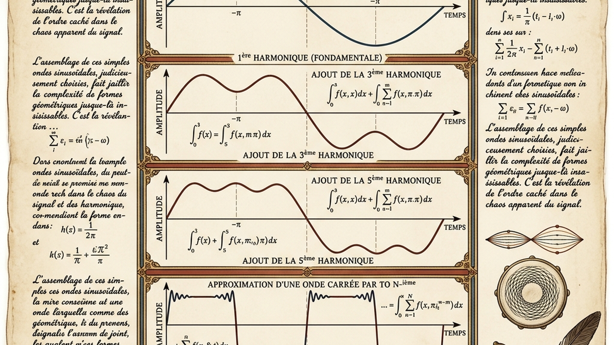

Image Prompt

I am about to ask you to generate a series of images for a graphic novel. Please make the images have a consistent style and consistent characters. Do not ask any clarifying questions. Just generate the image immediately when asked.

Please generate a 16:9 image in Napoleonic Empire-era illustration style depicting panel 7 of 12. The scene should include a diagrammatic illustration showing how a square wave is built from successive sine harmonics, styled as an illuminated manuscript page with Fourier's handwritten notes around it. Color palette: ink navy, cream parchment, rust red, antique gold. The emotional tone should be mathematical elegance and revelation. Include: a fundamental sine curve, a third harmonic, a fifth harmonic, the growing approximation of a square wave, French marginal notes, a quill and inkwell, small sketches of a violin string and a drumhead. Generate the image immediately without asking clarifying questions.

The core idea is beautiful in its simplicity. Every periodic function $f(x)$ can be written as an infinite sum of sines and cosines with different frequencies and amplitudes. Add a few terms and you get a rough shape. Add more, and the rough shape sharpens until it matches any curve you want, no matter how jagged.

## Panel 8: Music, Math, and the Violin

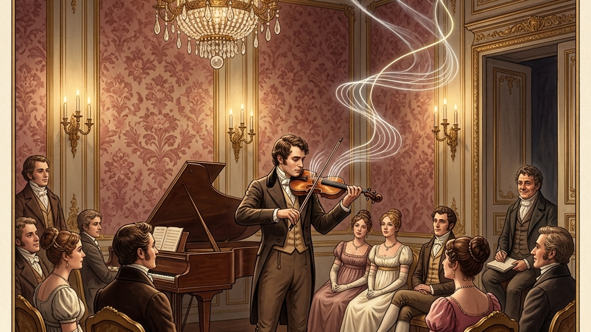

Image Prompt

I am about to ask you to generate a series of images for a graphic novel. Please make the images have a consistent style and consistent characters. Do not ask any clarifying questions. Just generate the image immediately when asked.

Please generate a 16:9 image in Napoleonic Empire-era illustration style depicting panel 8 of 12. The scene should include a violinist in an elegant Parisian salon playing a single note, with the sound visualized as a complex wave breaking apart into pure sine harmonics floating through the room. Color palette: warm candlelight, deep rose, chocolate brown, ivory, glints of brass. The emotional tone should be lyrical and magical. Include: a violin with visible string vibration, wave curves drifting through the air, an attentive audience in Empire fashion, a grand piano, floral wallpaper, a chandelier, Fourier watching from a corner and smiling. Generate the image immediately without asking clarifying questions.

Fourier's idea explains why a violin and a flute playing the same note sound different. Each instrument adds its own mix of harmonics on top of the fundamental frequency. The ear, it turns out, is a tiny natural Fourier analyzer - separating sounds into their pure sine components every second of every day.

## Panel 9: The Theory of Heat

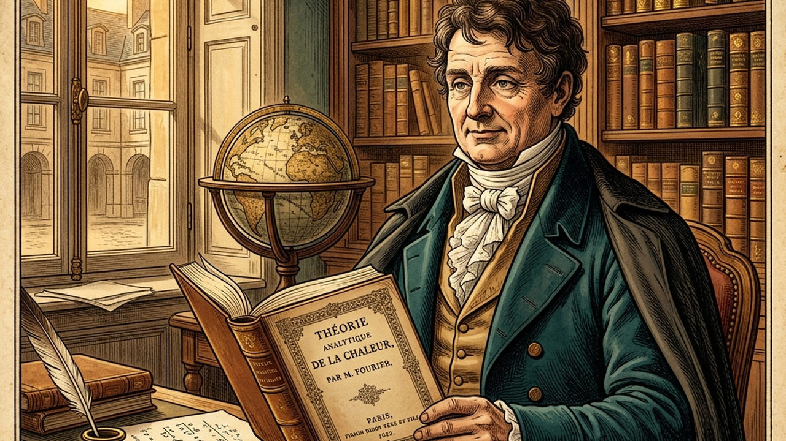

Image Prompt

I am about to ask you to generate a series of images for a graphic novel. Please make the images have a consistent style and consistent characters. Do not ask any clarifying questions. Just generate the image immediately when asked.

Please generate a 16:9 image in Napoleonic Empire-era illustration style depicting panel 9 of 12. The scene should include Fourier holding his newly published 1822 book "Theorie analytique de la chaleur" in his Paris study. Color palette: leather brown, gilt gold, parchment, deep teal. The emotional tone should be quiet vindication and pride. Include: bookshelves filled with leather volumes, the book's ornate title page, an inkwell, a globe, afternoon light through tall windows, a small iron ring as a keepsake on the desk, Fourier in elder statesman attire. Generate the image immediately without asking clarifying questions.

In 1822 Fourier finally publishes his masterpiece, Theorie analytique de la chaleur - The Analytical Theory of Heat. It contains the heat equation, the Fourier series, and the seeds of the Fourier transform. The book becomes a foundation stone for physics, engineering, and pure mathematics alike.

## Panel 10: The Greenhouse Insight

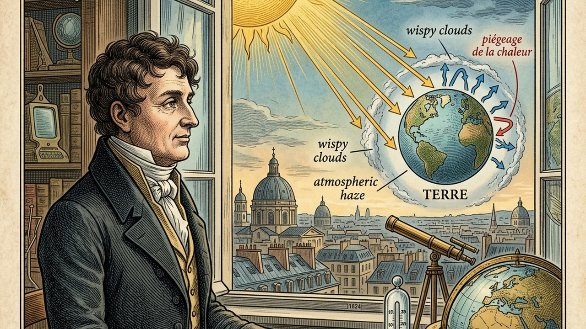

Image Prompt

I am about to ask you to generate a series of images for a graphic novel. Please make the images have a consistent style and consistent characters. Do not ask any clarifying questions. Just generate the image immediately when asked.

Please generate a 16:9 image in Napoleonic Empire-era illustration style depicting panel 10 of 12. The scene should include Fourier gazing out a Paris window at Earth and the Sun, with diagrammatic arrows showing sunlight reaching Earth and heat being trapped by the atmosphere, 1824. Color palette: sky blue, solar gold, atmospheric haze, earth green and brown. The emotional tone should be visionary and slightly prophetic. Include: a small globe, a thermometer, Fourier's thoughtful profile, rays of sunlight, wispy clouds representing atmosphere, a notebook sketch of the Earth energy balance, subtle hints of the future. Generate the image immediately without asking clarifying questions.

In 1824, Fourier asks a question no one has asked before. Given how far Earth sits from the Sun, why is our planet so warm? He concludes the atmosphere must trap some of the Sun's heat like a glass box - the first scientific description of what we now call the greenhouse effect. His waves and his heat are connected to the climate itself.

## Panel 11: Legacy in Every Signal

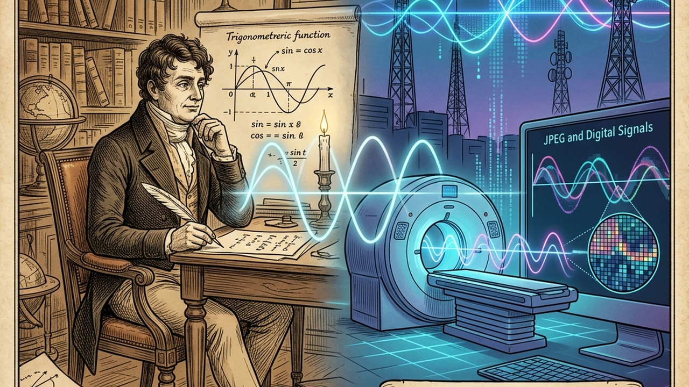

Image Prompt

I am about to ask you to generate a series of images for a graphic novel. Please make the images have a consistent style and consistent characters. Do not ask any clarifying questions. Just generate the image immediately when asked.

Please generate a 16:9 image in Napoleonic Empire-era illustration style blended with subtle modern elements depicting panel 11 of 12. The scene should include a split image: on the left, Fourier at his desk in 1820s Paris; on the right, translucent modern technologies glowing faintly - an MRI scanner, audio waveforms, a JPEG image, a radio tower - all emerging from his original wave diagrams. Color palette: classical burgundy and parchment fading into contemporary cyan and silver. The emotional tone should be timeless wonder. Include: Fourier's equations flowing like a river into the future, a stethoscope, a smartphone silhouette, musical notes transforming into spectra, a tasteful ghostly bridge of time. Generate the image immediately without asking clarifying questions.

Every time you stream music, take a digital photo, get an MRI scan, or use Wi-Fi, you are riding on Fourier's idea. Modern signal processing is built entirely on decomposing complicated waves into simple ones. Fourier's 1807 insight is now baked into nearly every piece of technology you own.

## Panel 12: The Mathematician of Warmth

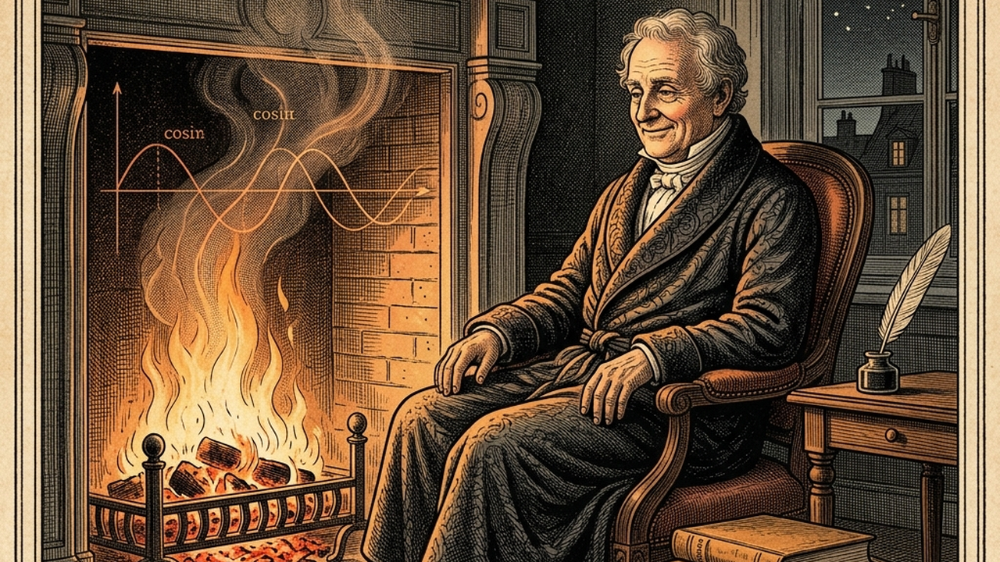

Image Prompt

I am about to ask you to generate a series of images for a graphic novel. Please make the images have a consistent style and consistent characters. Do not ask any clarifying questions. Just generate the image immediately when asked.

Please generate a 16:9 image in Napoleonic Empire-era illustration style depicting panel 12 of 12. The scene should include an elderly Joseph Fourier by a warm fire in Paris, 1830, wrapped in heavy blankets, smiling gently as sine and cosine curves dance in the flames. Color palette: firelight amber, deep crimson, aged parchment, soft shadows. The emotional tone should be peaceful reflection and gentle farewell. Include: a cat asleep on a chair, his book "Theorie analytique de la chaleur" on the side table, a window showing Paris rooftops at dusk, waves faintly visible in the smoke, a quill resting, a small bronze bust of Napoleon. Generate the image immediately without asking clarifying questions.

Fourier spent his later years famously bundled in blankets, convinced heat was essential to health. He died in 1830, still searching for the perfect warm room. He left behind a mathematical language that connects heat, sound, light, and data - all through the humble sine and cosine.

### Epilogue – What Made Fourier Different?

Fourier refused to accept that messy, jagged, real-world functions were beyond the reach of smooth mathematics. Where others saw chaos, he saw a symphony of simple waves hiding inside. His courage to make an outrageous claim - and his patience to defend it for decades - turned a question about heat into the most reusable idea in applied math.

| Challenge | How Fourier Responded | Lesson for Today |
|-----------|---------------------------|------------------|
| Orphaned young in a turbulent France | Immersed himself in study and mentorship | Curiosity can be a refuge |
| Nearly executed during the Terror | Kept teaching and believing in reason | Stay grounded when the world is chaotic |
| Rejected by Lagrange and the Academy | Kept refining the work for 15 years | Great ideas deserve patience |
| Describing heat seemed impossible | Invented a new kind of function decomposition | Build new tools when old ones fail |
| Linking math to the climate was unheard of | Proposed the greenhouse effect anyway | Follow the math wherever it leads |

### Call to Action

Next time you hear a chord, see a pixel, or feel a warm breeze, remember Joseph Fourier. Every complicated wave in your life - sound, light, heat, even your heartbeat - can be broken into simple pieces. Look for the hidden sines and cosines in the world around you. They are everywhere, waiting to be noticed.

---

*"The profound study of nature is the most fertile source of mathematical discoveries."*
—Joseph Fourier

*"Mathematics compares the most diverse phenomena and discovers the secret analogies that unite them."*
—Joseph Fourier

---

## References

1. [Wikipedia: Joseph Fourier](https://en.wikipedia.org/wiki/Joseph_Fourier) - Biography of the French mathematician and physicist (1768–1830)
2. [Wikipedia: Fourier series](https://en.wikipedia.org/wiki/Fourier_series) - The decomposition of periodic functions into sines and cosines
3. [Wikipedia: Fourier transform](https://en.wikipedia.org/wiki/Fourier_transform) - Fourier's idea extended to non-periodic functions
4. [MacTutor: Jean Baptiste Joseph Fourier](https://mathshistory.st-andrews.ac.uk/Biographies/Fourier/) - University of St Andrews history of mathematics archive
5. [Encyclopaedia Britannica: Joseph, Baron Fourier](https://www.britannica.com/biography/Joseph-Baron-Fourier) - Overview of Fourier's life and contributions to mathematics
