# Karen Uhlenbeck: Functions for the Future

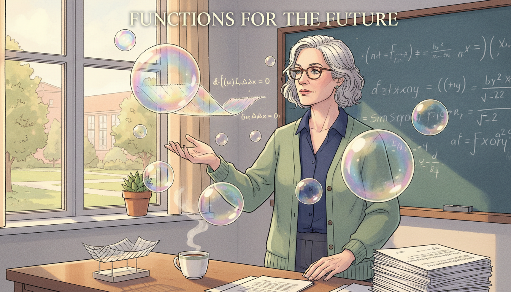

Cover Image Prompt

Please generate a wide-landscape 16:9 cover image in contemporary academic graphic-novel style with soft watercolor and clean vector linework depicting Karen Uhlenbeck as a thoughtful woman in her 40s with short silver hair, glasses, and a comfortable cardigan, standing in a sunlit university office with large floating iridescent soap bubbles forming minimal surfaces around her, equations of calculus of variations drifting in the air. Include the title text "Functions for the Future" rendered in a modern clean serif typeface. Color palette: soap bubble iridescent rainbow, chalkboard slate, sunlight cream, sage green, deep navy accents. Emotional tone: reflective quiet brilliance and wonder. Include a wire frame outlining a minimal surface on her desk, a stack of papers on partial differential equations, a window looking onto a tree-lined campus quad, a cup of tea, a chalkboard in the background with gauge theory equations, and a small plant on the windowsill. Generate the image immediately without asking clarifying questions.

Narrative Prompt

Tell the story of Karen Uhlenbeck (born 1942), the American mathematician from Cleveland, Ohio, who pioneered geometric analysis and became the first woman to win the Abel Prize in 2019. Cover her childhood love of reading, her undergraduate years at the University of Michigan, her doctoral work at Brandeis, her struggles with discrimination in academia, her breakthroughs on minimal surfaces, harmonic maps, and gauge theory (Yang-Mills equations), and her mentorship work through the Park City Mathematics Institute and the Women and Mathematics program at the Institute for Advanced Study. Focus on how her work treats functions as objects that can be bent, minimized, and studied geometrically. Use a tone that is thoughtful and empowering for IB Diploma high school students.

### Prologue - Bubbles, Wires, and Wonder

Dip a loop of wire into soapy water and pull it out. The film that forms is not random. It is the exact shape that minimizes surface area, a tiny solution to one of the deepest problems in mathematics. A girl from Cleveland named Karen Uhlenbeck grew up to explain why those bubbles behave that way, and her explanation reshaped modern geometry. In 2019, she became the first woman to win the Abel Prize, mathematics' version of the Nobel.

## Panel 1: A Reader in Cleveland

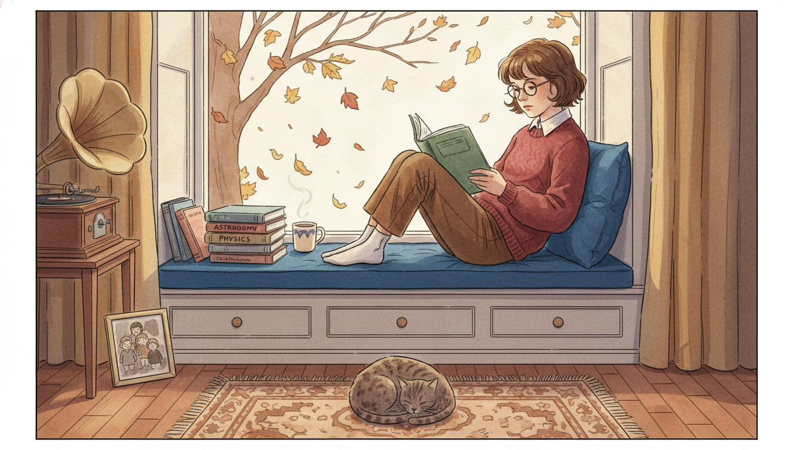

Image Prompt

I am about to ask you to generate a series of images for a graphic novel. Please make the images have a consistent style and consistent characters. Do not ask any clarifying questions. Just generate the image immediately when asked.

Please generate a 16:9 image in contemporary academic graphic-novel style with soft watercolor depicting panel 1 of 12. The scene should include a 10 year old Karen Uhlenbeck in 1952, a serious girl with short brown hair and glasses, curled up in a window seat of a modest Cleveland Ohio suburban home, absorbed in a thick science book while autumn leaves fall outside. Color palette: autumn amber, window-seat cushion blue, book cover green, sweater cranberry, hardwood brown. The emotional tone should be introspective curiosity. Include a stack of library books beside her titled astronomy, physics, and biology, a cup of cocoa, a tabby cat on the rug, a record player in the corner, a framed photo of her siblings, bare tree branches outside, and soft afternoon sunlight. Generate the image immediately without asking clarifying questions.

Karen Keskulla Uhlenbeck was born in Cleveland, Ohio in 1942 and grew up loving science books more than anything else. She read constantly, especially books about astronomy and physics, which her parents supplied from the public library. She did not yet know she would become a mathematician. She only knew that ideas about how the universe fit together made her feel at home.

## Panel 2: University of Michigan

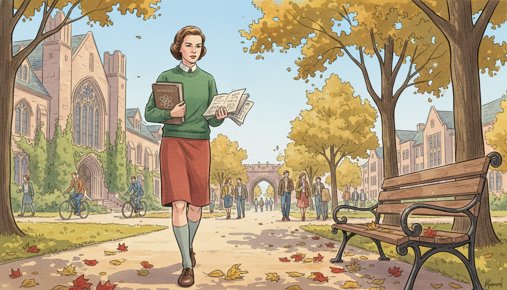

Image Prompt

I am about to ask you to generate a series of images for a graphic novel. Please make the images have a consistent style and consistent characters. Do not ask any clarifying questions. Just generate the image immediately when asked.

Please generate a 16:9 image in contemporary academic graphic-novel style with soft watercolor depicting panel 2 of 12. The scene should include 19 year old Karen Uhlenbeck as an undergraduate in 1961 walking across the University of Michigan Ann Arbor quad in the fall, carrying a physics textbook and a notebook, wearing a wool skirt and sweater, with ivy-covered buildings and tall elms around her. Color palette: Michigan maize, campus red brick, maple red, sky blue, wool sweater forest green. The emotional tone should be bright determined ambition. Include other students walking to class, bicycles, a wooden bench with leaves on it, the Law Quad archway in the distance, a small notebook full of handwritten equations, and a thoughtful focused expression. Generate the image immediately without asking clarifying questions.

Uhlenbeck started at the University of Michigan intending to major in physics. But the more math classes she took, the more she fell in love with the logic and structure of pure mathematics. By graduation in 1964, she had switched to math for good. She liked how mathematics gave her quiet, rigorous freedom in a world that often tried to tell young women what they could and could not do.

## Panel 3: Brandeis and a Ph.D.

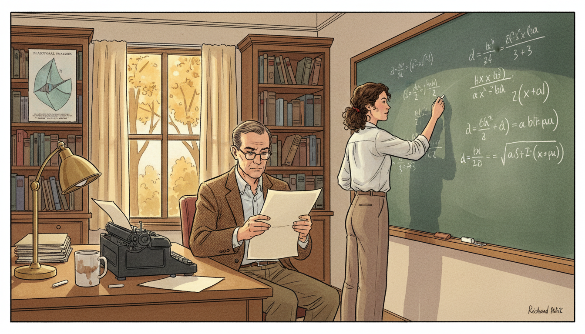

Image Prompt

I am about to ask you to generate a series of images for a graphic novel. Please make the images have a consistent style and consistent characters. Do not ask any clarifying questions. Just generate the image immediately when asked.

Please generate a 16:9 image in contemporary academic graphic-novel style with soft watercolor depicting panel 3 of 12. The scene should include Karen Uhlenbeck in her mid 20s at a chalkboard in a Brandeis University office in 1968, working on her doctoral dissertation in calculus of variations, her advisor Richard Palais seated nearby reviewing a page. Color palette: chalkboard slate green, chalk white, academic tweed brown, paper cream, autumn window gold. The emotional tone should be focused collaborative growth. Include books on functional analysis, a poster of a minimal surface on the wall, a desk lamp, a typewriter with a half-finished page, a coffee mug, oak bookshelves, and equations involving energy functionals on the chalkboard. Generate the image immediately without asking clarifying questions.

Uhlenbeck earned her Ph.D. from Brandeis University in 1968 under advisor Richard Palais. Her dissertation was in the calculus of variations, a branch of math that finds functions which minimize or maximize a quantity like length, area, or energy. Soap films, geodesics, and even light rays all follow these minimization rules. She was already circling the questions that would define her career.

## Panel 4: Doors That Would Not Open

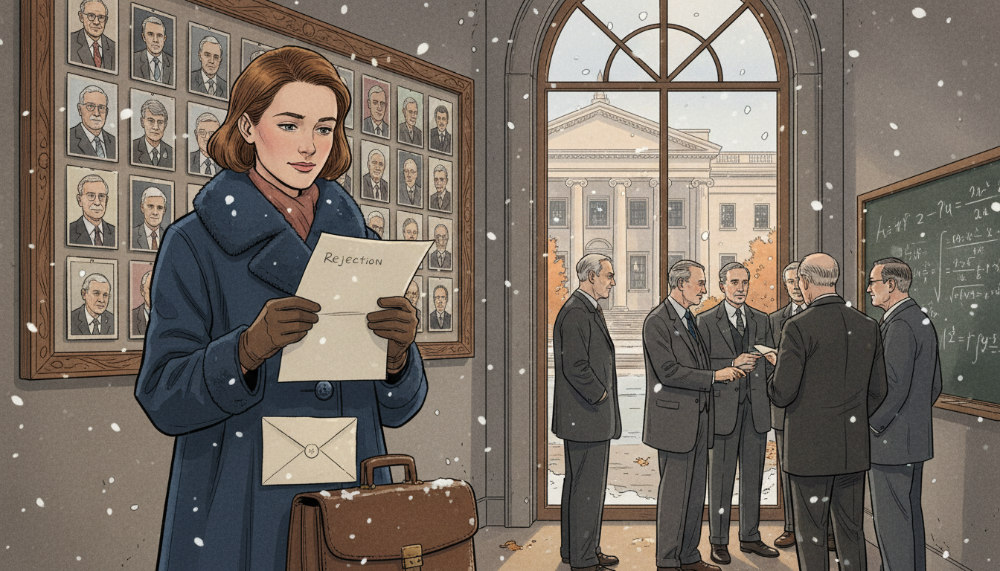

Image Prompt

I am about to ask you to generate a series of images for a graphic novel. Please make the images have a consistent style and consistent characters. Do not ask any clarifying questions. Just generate the image immediately when asked.

Please generate a 16:9 image in contemporary academic graphic-novel style with soft watercolor depicting panel 4 of 12. The scene should include Karen Uhlenbeck in her late 20s around 1970 standing quietly outside an elite American mathematics department, reading a polite rejection letter, while inside through the large glass window a group of male professors in suits discuss math. Color palette: academic stone gray, letter cream, wool coat navy, autumn maple orange, muted window light. The emotional tone should be quiet resilience despite injustice. Include a briefcase at her feet, a snow flurry in the air, a bulletin board with faculty photos showing almost entirely men, a worn envelope, her steady composed expression, and a distant glimpse of a library across the plaza. Generate the image immediately without asking clarifying questions.

As she searched for academic jobs, Uhlenbeck faced open discrimination. Several top departments refused to hire women, and one famously said it could not hire her because her mathematician husband was there. She eventually found a position at the University of Illinois at Urbana-Champaign in 1971, and later moved to others. The doors that were closed did not stop her; they only made her more determined to build new ones for those who would come after.

## Panel 5: Soap Films and Minimal Surfaces

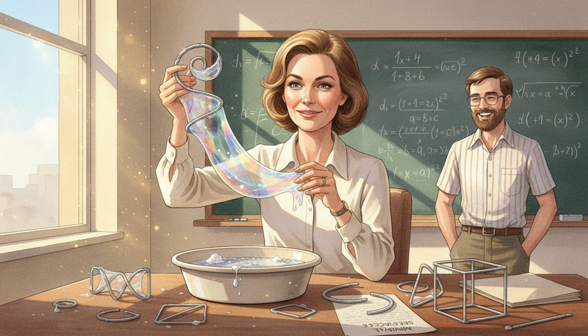

Image Prompt

I am about to ask you to generate a series of images for a graphic novel. Please make the images have a consistent style and consistent characters. Do not ask any clarifying questions. Just generate the image immediately when asked.

Please generate a 16:9 image in contemporary academic graphic-novel style with soft watercolor depicting panel 5 of 12. The scene should include Karen Uhlenbeck in a sunlit math department office in the late 1970s, holding a twisted wire loop just pulled from a basin of soapy water, an iridescent minimal soap film stretched across the loop catching the light. Color palette: soap bubble rainbow iridescence, office sunlight gold, sleeve cream, wire silver, sky blue through window. The emotional tone should be playful serious wonder. Include a basin of soapy water on the desk, a chalkboard with equations of the area functional, other wire loops of different shapes, a paper labeled "minimal surfaces", a laughing graduate student observing, and sunlight glinting off every curve of the film. Generate the image immediately without asking clarifying questions.

Uhlenbeck studied minimal surfaces, the shapes soap films form when stretched across a wire loop. Each such surface minimizes a function called the area functional. She developed powerful new techniques to prove when such surfaces exist, how they behave, and what happens when they break apart. Her methods still guide researchers working in geometry and physics today.

## Panel 6: Harmonic Maps and Bubbling

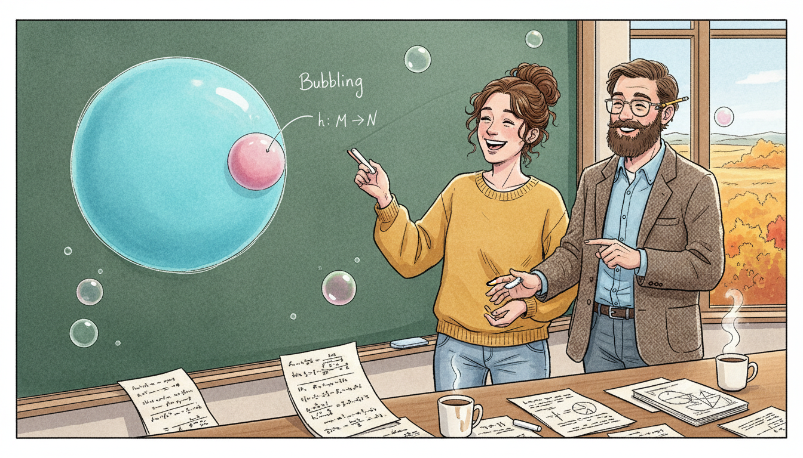

Image Prompt

I am about to ask you to generate a series of images for a graphic novel. Please make the images have a consistent style and consistent characters. Do not ask any clarifying questions. Just generate the image immediately when asked.

Please generate a 16:9 image in contemporary academic graphic-novel style with soft watercolor depicting panel 6 of 12. The scene should include Karen Uhlenbeck and her collaborator Jonathan Sacks at a chalkboard in 1981 at the University of Illinois, drawing a two-dimensional sphere that is breaking off a small bubble from a larger map, illustrating their famous "bubbling" phenomenon in harmonic maps. Color palette: chalkboard green, chalk white, sphere cyan, bubble pink, office wood brown. The emotional tone should be eureka collaboration. Include two coffee cups, scattered papers with integrals of energy functionals, a window with prairie fall colors, a pencil behind Sacks's ear, notebooks with sketches, and small floating bubbles illustrating the theorem. Generate the image immediately without asking clarifying questions.

With Jonathan Sacks, Uhlenbeck studied harmonic maps, functions that minimize an energy between two curved spaces. They discovered that when energy concentrates at a single point, a small "bubble" can break off, carrying a perfect smaller copy of the map with it. This bubbling phenomenon became a core tool of modern geometric analysis. It showed that sometimes a function must split rather than smoothly stretch.

## Panel 7: Gauge Theory and Yang-Mills

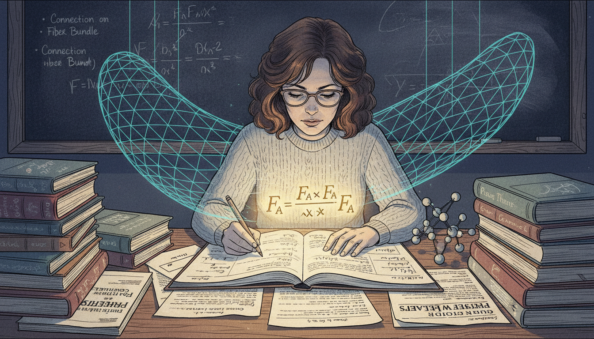

Image Prompt

I am about to ask you to generate a series of images for a graphic novel. Please make the images have a consistent style and consistent characters. Do not ask any clarifying questions. Just generate the image immediately when asked.

Please generate a 16:9 image in contemporary academic graphic-novel style with soft watercolor depicting panel 7 of 12. The scene should include Karen Uhlenbeck in the early 1980s at a desk covered with papers on Yang-Mills gauge theory, a glowing equation F_A wedge F_A visible in her notebook and a faint visualization of curved four-dimensional space rendered as a translucent lattice in the air. Color palette: deep physics indigo, equation gold, paper cream, lamp warm white, quantum cyan. The emotional tone should be bridge-building between math and physics. Include physics journals on the desk, a letter from Cliff Taubes or Simon Donaldson in the margin, a small model of subatomic particles, a blackboard with a connection on a fiber bundle, stacks of theory books, and her focused concentrated expression. Generate the image immediately without asking clarifying questions.

In the early 1980s Uhlenbeck published landmark papers on gauge theory and the Yang-Mills equations, which describe fundamental forces in physics. She proved deep technical results about how these equations behave, work that physicists and mathematicians have used ever since. Her theorems helped bridge pure mathematics and theoretical physics. She was quite literally writing the rulebook for functions on curved spaces.

## Panel 8: MacArthur Fellow

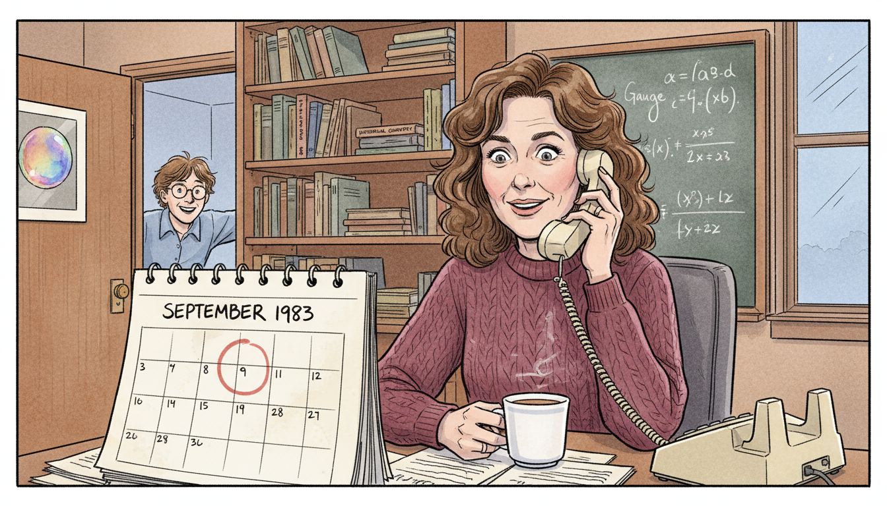

Image Prompt

I am about to ask you to generate a series of images for a graphic novel. Please make the images have a consistent style and consistent characters. Do not ask any clarifying questions. Just generate the image immediately when asked.

Please generate a 16:9 image in contemporary academic graphic-novel style with soft watercolor depicting panel 8 of 12. The scene should include Karen Uhlenbeck in her Chicago office in 1983 receiving a phone call announcing her MacArthur "Genius" Fellowship, her expression caught between surprise and quiet pride. Color palette: office teak brown, telephone cream, sweater burgundy, window winter blue, paper white. The emotional tone should be understated joyful recognition. Include a rotary desk phone to her ear, a mug of tea, a calendar page reading September 1983, a bookshelf of math texts, a chalkboard with gauge theory equations behind her, a framed photo of a soap bubble, and a student peeking through the open door in excitement. Generate the image immediately without asking clarifying questions.

In 1983 Uhlenbeck received a MacArthur Fellowship, the famous "genius grant," in recognition of her breakthroughs. The award gave her freedom to pursue any problem without justification. She used that freedom to push deeper into geometric analysis and to mentor the next generation. For a mathematician who had been told she did not belong, the recognition was also a door finally opening for others behind her.

## Panel 9: University of Texas at Austin

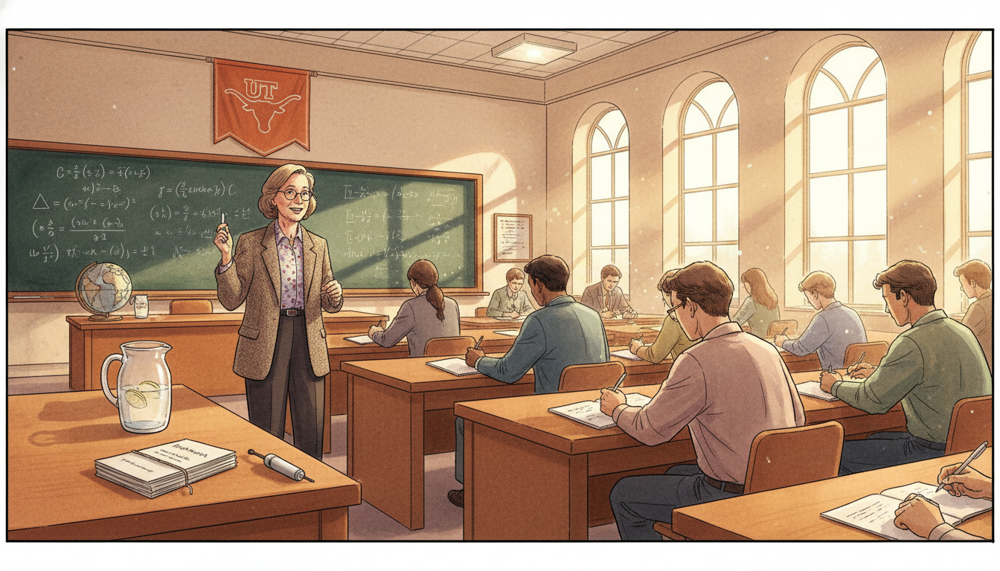

Image Prompt

I am about to ask you to generate a series of images for a graphic novel. Please make the images have a consistent style and consistent characters. Do not ask any clarifying questions. Just generate the image immediately when asked.

Please generate a 16:9 image in contemporary academic graphic-novel style with soft watercolor depicting panel 9 of 12. The scene should include Karen Uhlenbeck in a bright University of Texas at Austin lecture hall in the early 1990s, teaching a diverse group of graduate students, chalkboard full of partial differential equations, Texas sunlight streaming through tall windows. Color palette: Texas burnt orange, chalkboard dark green, sunlight gold, student notebook white, academic wood brown. The emotional tone should be generous teaching energy. Include a Longhorn banner on the wall, students of varied backgrounds and genders taking notes, a pitcher of ice water, a laser pointer, a stack of preprints labeled "Geometric Analysis", a globe of the mathematical world map, and Uhlenbeck mid-sentence with chalk in hand. Generate the image immediately without asking clarifying questions.

In 1988 Uhlenbeck joined the University of Texas at Austin, where she held the Sid W. Richardson Foundation Regents Chair. At Austin she taught, advised graduate students, and expanded her work on integrable systems. She made a point of welcoming students who had been overlooked elsewhere. Her classrooms were places where mathematical rigor and human kindness were part of the same curriculum.

## Panel 10: Women and Mathematics Program

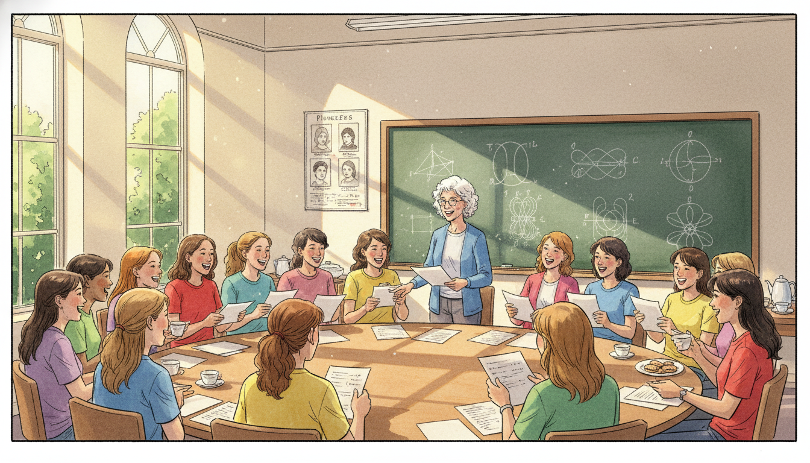

Image Prompt

I am about to ask you to generate a series of images for a graphic novel. Please make the images have a consistent style and consistent characters. Do not ask any clarifying questions. Just generate the image immediately when asked.

Please generate a 16:9 image in contemporary academic graphic-novel style with soft watercolor depicting panel 10 of 12. The scene should include Karen Uhlenbeck in the late 1990s at the Institute for Advanced Study in Princeton, New Jersey, leading a summer Women and Mathematics workshop in a seminar room full of young women mathematicians of diverse backgrounds. Color palette: Princeton ivy green, seminar room cream, summer window light, chalkboard slate, rainbow of casual shirts. The emotional tone should be warm empowering community. Include a lively discussion at a round table, papers being shared, a whiteboard with topology diagrams, tea and cookies on a side table, laughter in the room, a poster of women mathematicians on the wall, and sunlight falling across the group. Generate the image immediately without asking clarifying questions.

In 1993 Uhlenbeck co-founded the Women and Mathematics program at the Institute for Advanced Study in Princeton, which still runs today. Every summer it brings young women mathematicians together to learn, collaborate, and find mentors. She also helped launch the Park City Mathematics Institute. Uhlenbeck did not want her career to be unusual; she wanted many careers like hers to become ordinary.

## Panel 11: The Abel Prize

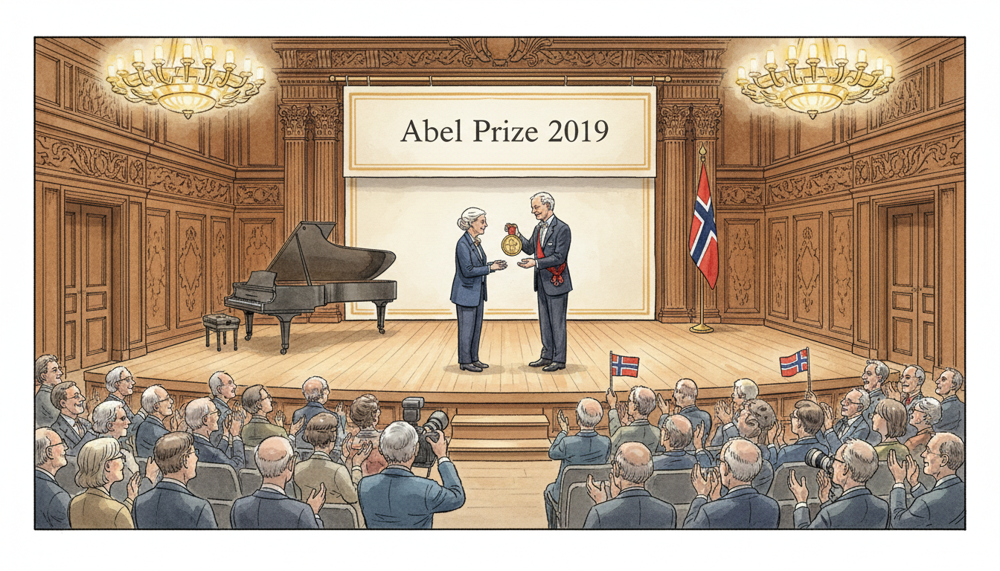

Image Prompt

I am about to ask you to generate a series of images for a graphic novel. Please make the images have a consistent style and consistent characters. Do not ask any clarifying questions. Just generate the image immediately when asked.

Please generate a 16:9 image in contemporary academic graphic-novel style with soft watercolor depicting panel 11 of 12. The scene should include 76 year old Karen Uhlenbeck on stage in Oslo Norway in 2019, being handed the Abel Prize medal by King Harald V in a grand hall, with a banner reading "Abel Prize 2019" behind them. Color palette: royal blue, gold medal, Norwegian red, hall cream, chandelier amber. The emotional tone should be historic dignified triumph. Include a cheering audience of international mathematicians, a grand piano, the Norwegian flag, carved wood paneling, photographers in the front row, Uhlenbeck's elegant dark jacket, and her calm smile of quiet accomplishment. Generate the image immediately without asking clarifying questions.

In 2019 Karen Uhlenbeck became the first woman ever awarded the Abel Prize, often called the Nobel Prize of mathematics. The citation honored her work on geometric partial differential equations, gauge theory, and integrable systems, and called her a founder of modern geometric analysis. She accepted the prize in Oslo from King Harald V of Norway. Girls around the world saw, perhaps for the first time, a woman at the very top of their subject.

## Panel 12: The Future of Functions

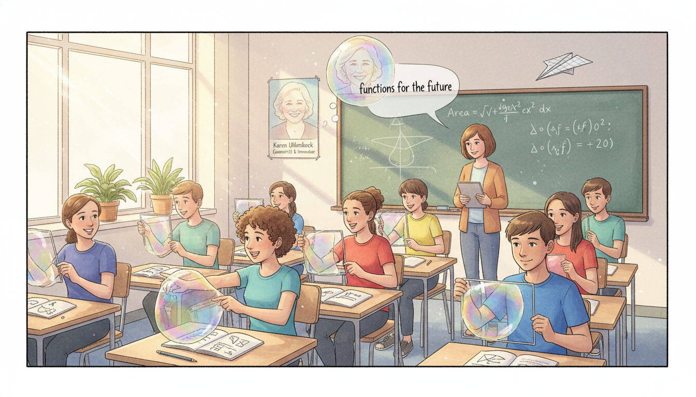

Image Prompt

I am about to ask you to generate a series of images for a graphic novel. Please make the images have a consistent style and consistent characters. Do not ask any clarifying questions. Just generate the image immediately when asked.

Please generate a 16:9 image in contemporary academic graphic-novel style with soft watercolor depicting panel 12 of 12. The scene should include a modern sunlit classroom of IB high school students of diverse backgrounds and genders experimenting with wire loops and soap bubbles on their desks, a poster of Karen Uhlenbeck on the wall, and a translucent smiling Uhlenbeck watching over them. Color palette: soap bubble rainbow iridescence, classroom window daylight, wall cream, wire silver, student shirt variety. The emotional tone should be joyful inspirational handing-on. Include a student pointing at a bubble's curve, a teacher with a tablet showing minimal surface graphics, notebooks with function diagrams, equations of area minimization on the whiteboard, a paper airplane in mid-flight, houseplants on the windowsill, and a faint quote bubble reading "functions for the future". Generate the image immediately without asking clarifying questions.

When you study functions in your IB course, you are learning the language Uhlenbeck used to transform geometry. Every time you find the minimum or maximum of a function, you are playing in the same sandbox as her minimal surfaces and Yang-Mills fields. Her work reminds us that functions are not just formulas on a page; they are shapes, forces, and futures waiting to be explored. And her life reminds us that mathematics belongs to everyone.

### Epilogue - What Made Uhlenbeck Different?

Uhlenbeck combined fearless technical mathematics with quiet persistence in the face of discrimination. She chose problems that sat at the intersection of geometry, analysis, and physics, and she was not afraid to invent new tools to solve them. She also refused to keep her success to herself, creating programs that opened doors for thousands of young mathematicians. Her career is a blueprint for how brilliance and generosity reinforce each other.

| Challenge | How Uhlenbeck Responded | Lesson for Today |
|-----------|--------------------------|------------------|
| Discrimination against women in academia | Kept producing top-tier research and opened doors for others | Excellence and advocacy can grow together |
| Hard problems in calculus of variations | Invented bubbling analysis and gauge-theory tools | New problems need new techniques |
| Isolation as a rare woman in her field | Co-founded the Women and Mathematics program | Build the community you wish existed |
| Barrier between math and physics | Bridged both with her Yang-Mills results | The best ideas cross disciplinary walls |
| The "genius myth" excluding newcomers | Mentored students of all backgrounds | Talent grows with support, not hype |

### Call to Action

The next time you blow a soap bubble, remember Karen Uhlenbeck. Its perfect shape is an answer a function gave to a very old question, and she helped us understand why. Study the functions in front of you carefully, but also look for the new ones no one has written yet. And wherever you find a door that says "not for you," do what Karen did. Walk through it anyway, then hold it open.

---

*"I am aware that I am a role model for young women in mathematics. It's hard to be a role model, however, because what you really need to do is show students how imperfect people can be and still succeed."*
—Karen Uhlenbeck

*"The world is not organized the way we think it is."*
—Karen Uhlenbeck

---

## References

1. [Karen Uhlenbeck - Abel Prize 2019 Citation](PLACEHOLDER) - Official prize documentation
2. [Karen Uhlenbeck - MacTutor History of Mathematics](PLACEHOLDER) - Biography and contributions
3. [Women and Mathematics Program - Institute for Advanced Study](PLACEHOLDER) - Program Uhlenbeck co-founded
4. [Geometric Analysis and Gauge Theory Papers](PLACEHOLDER) - Research overview
5. [Karen Uhlenbeck Interview - Quanta Magazine](PLACEHOLDER) - Personal and mathematical reflections
