# Katherine Johnson: Mapping the Unknown

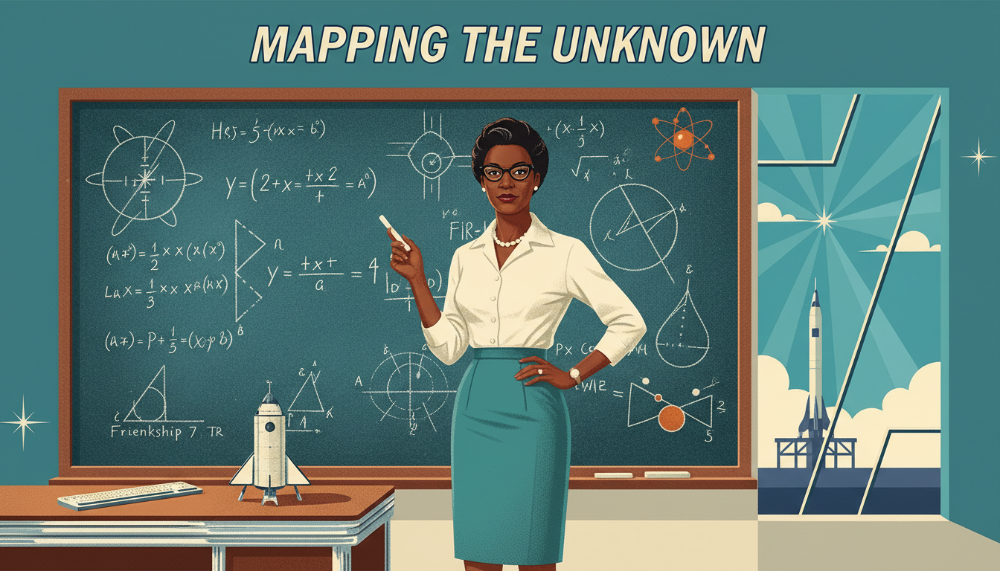

Cover Image Prompt

Please generate a wide-landscape 16:9 cover image in mid-century Atomic Age illustration style depicting Katherine Johnson, an African American mathematician in her early 40s, standing confidently in front of a huge chalkboard filled with orbital equations and trajectory curves at NASA Langley Research Center in 1962. Include the title text "Mapping the Unknown" rendered in a retro NASA-inspired typeface. Color palette: teal, cream, warm orange, deep navy, and chrome silver. Emotional tone: brilliant, poised, quietly revolutionary. Katherine wears a fitted cream blouse, pearl necklace, a tailored teal pencil skirt, and cat-eye glasses, holding a piece of chalk. Behind her, a Friendship 7 capsule model sits on a desk with a slide rule, and through a window a rocket stands on a distant launchpad beneath a cerulean sky. Clean geometric design with starbursts and atomic motifs. Generate the image immediately without asking clarifying questions.

Narrative Prompt

This graphic novel tells the story of Katherine Johnson (1918-2020), the African American NASA mathematician whose calculations of orbital trajectories made American spaceflight possible. Set mostly between 1953 and 1969 at NASA's Langley Research Center in Hampton, Virginia, and earlier in her hometown of White Sulphur Springs, West Virginia. Keep Katherine's appearance consistent: slender, warm brown skin, hair in neat waves or a low chignon, cat-eye glasses, tailored 1960s dresses and blouses in teal, cream, or mustard. Supporting characters include astronaut John Glenn (tall white man with reddish hair and blue flight suit) and her fellow "West Computers" (Dorothy Vaughan and Mary Jackson). Visual style should feel like a mid-century Atomic Age illustrated magazine with clean geometric shapes, limited but bold color, and optimistic futurism.

### Prologue – A Girl Who Counted Everything

Before she charted a path to the Moon, Katherine Johnson counted the steps to church, the stars in the sky, and the dishes in the sink. She once said, "I counted everything." That curiosity carried her from a small West Virginia town all the way to NASA, where her functions steered astronauts safely through space.

## Panel 1: The Girl Who Loved Numbers

Image Prompt

I am about to ask you to generate a series of images for a graphic novel. Please make the images have a consistent style and consistent characters. Do not ask any clarifying questions. Just generate the image immediately when asked.

Please generate a 16:9 image in mid-century Atomic Age illustration style depicting panel 1 of 12. The scene shows 8-year-old Katherine Coleman (later Johnson) in 1926 sitting on the wooden porch of a modest white clapboard house in White Sulphur Springs, West Virginia, counting stars on a summer night. She wears a simple cotton dress with a Peter Pan collar and her hair is in two neat braids with ribbons. Color palette: midnight navy sky, cream house, soft yellow porch light, lavender twilight. Emotional tone: wondrous curiosity. Include fireflies in a jar beside her, an open chalkboard slate in her lap with tally marks, crickets, a rocking chair, and the silhouette of distant Appalachian hills. Generate the image immediately without asking clarifying questions.

Katherine was born in 1918 in West Virginia, where Black children could only attend school through the eighth grade. But she loved numbers so much her family moved 125 miles every school year so she could keep learning. She finished high school at 14 and college at 18. Math was always her compass.

## Panel 2: College Prodigy

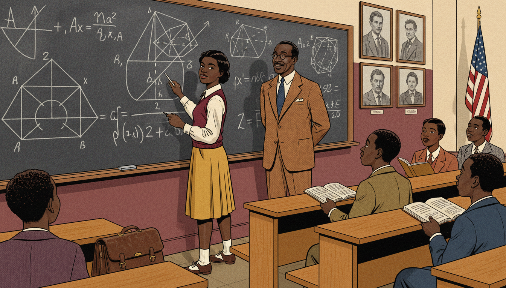

Image Prompt

I am about to ask you to generate a series of images for a graphic novel. Please make the images have a consistent style and consistent characters. Do not ask any clarifying questions. Just generate the image immediately when asked.

Please generate a 16:9 image in mid-century Atomic Age illustration style depicting panel 2 of 12. The scene shows a 17-year-old Katherine at West Virginia State College in 1936 solving an advanced geometry problem at a blackboard while her professor, Dr. W. W. Schieffelin Claytor (a tall African American mathematician in a tweed suit), watches proudly. She wears a pleated skirt, a sweater vest, and saddle shoes. Color palette: chalk white, warm oak, mustard yellow, deep maroon. Emotional tone: mentorship and rising confidence. Include wooden lecture benches, a leather satchel, classmates looking on in admiration, an American flag in the corner, and framed portraits of mathematicians on the walls. Generate the image immediately without asking clarifying questions.

At West Virginia State College, professor W. W. Schieffelin Claytor recognized Katherine's gift. He created advanced geometry courses just for her, including analytic geometry, the study of functions on the coordinate plane. "You would make a good research mathematician," he told her. She never forgot those words.

## Panel 3: The West Computers

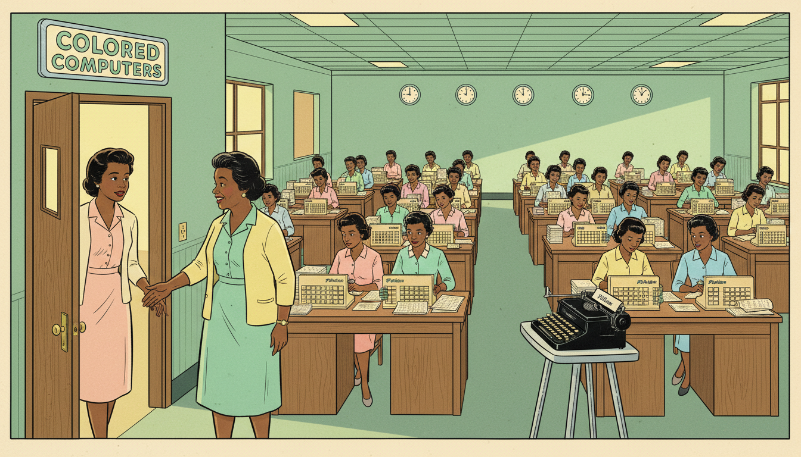

Image Prompt

I am about to ask you to generate a series of images for a graphic novel. Please make the images have a consistent style and consistent characters. Do not ask any clarifying questions. Just generate the image immediately when asked.

Please generate a 16:9 image in mid-century Atomic Age illustration style depicting panel 3 of 12. The scene shows Katherine in 1953 walking into the West Area Computing unit at NACA Langley in Hampton Virginia, a large open room filled with African American women seated at rows of wooden desks working on mechanical calculators. They wear pastel 1950s dresses and cardigans. Dorothy Vaughan, an older woman with kind eyes, greets Katherine at the door. Color palette: mint green, pale peach, cream, chrome silver, warm lemon light. Emotional tone: welcoming community amid segregation. Include a "Colored Computers" sign on the door, Friden calculators, stacks of data sheets, round clocks, and a typewriter on a metal stand. Generate the image immediately without asking clarifying questions.

In 1953, Katherine joined NACA, the agency that became NASA. She was assigned to the West Area Computing unit, a team of Black women mathematicians who did calculations by hand, long before electronic computers. Segregation laws meant they had separate bathrooms and lunch tables, but their math was second to none.

## Panel 4: Asking the Right Questions

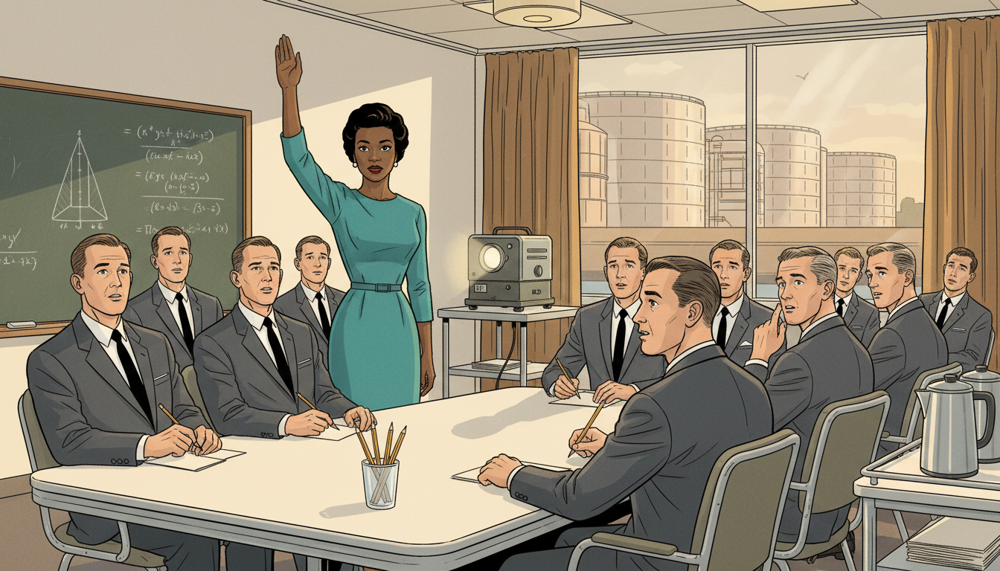

Image Prompt

I am about to ask you to generate a series of images for a graphic novel. Please make the images have a consistent style and consistent characters. Do not ask any clarifying questions. Just generate the image immediately when asked.

Please generate a 16:9 image in mid-century Atomic Age illustration style depicting panel 4 of 12. The scene shows Katherine confidently raising her hand in an all-male engineering briefing room at NASA Langley in 1958, asking to attend the editorial meetings where research was shared. White male engineers in dark suits and skinny ties look surprised but thoughtful. Katherine wears a teal sheath dress with pearl earrings. Color palette: charcoal gray suits, teal, white walls, chrome chairs, warm overhead light. Emotional tone: quiet courage. Include a projector, chalkboard with aerodynamic diagrams, pencils in a cup, a coffee pot on a side table, and a window showing Langley wind tunnels. Generate the image immediately without asking clarifying questions.

Katherine asked a simple, radical question: "Why can't I attend the editorial meetings?" Women were banned, but no rule actually forbade her specifically. Her polite persistence opened a door that stayed open. From then on, she sat at the table where spaceflight was planned.

## Panel 5: Functions of Flight

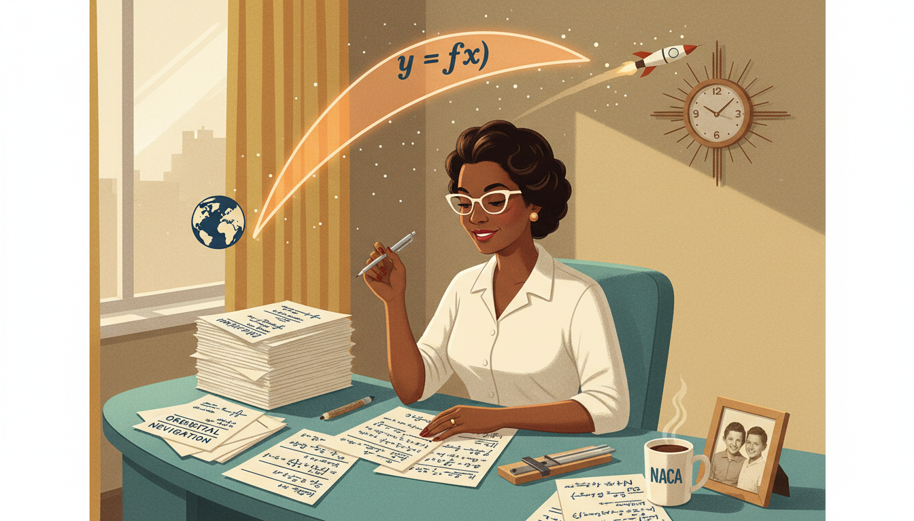

Image Prompt

I am about to ask you to generate a series of images for a graphic novel. Please make the images have a consistent style and consistent characters. Do not ask any clarifying questions. Just generate the image immediately when asked.

Please generate a 16:9 image in mid-century Atomic Age illustration style depicting panel 5 of 12. The scene shows Katherine at her desk in 1959, surrounded by paper covered in trajectory equations. Above her, translucent overlay shows a parabolic arc labeled "y = f(x)" connecting Earth to a tiny rocket. She holds a mechanical pencil and smiles faintly. Color palette: soft cream paper, navy ink, orange parabola glow, teal desk. Emotional tone: focused mathematical joy. Include a slide rule, a framed photo of her daughters, a coffee mug with a NACA logo, stacked technical reports, and retro atomic clock on the wall showing 4:20 PM. Generate the image immediately without asking clarifying questions.

Every rocket trajectory is a function: time goes in, position comes out. Katherine mastered the equations that described how gravity, thrust, and atmospheric drag shaped these curves. Coordinate geometry, the same topic you study today, was her daily tool. Each parabola she drew carried real astronauts.

## Panel 6: Alan Shepard's Freedom 7

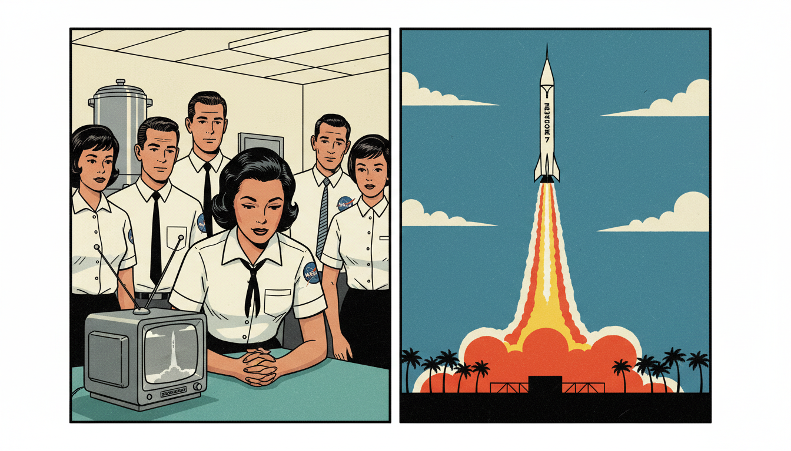

Image Prompt

I am about to ask you to generate a series of images for a graphic novel. Please make the images have a consistent style and consistent characters. Do not ask any clarifying questions. Just generate the image immediately when asked.

Please generate a 16:9 image in mid-century Atomic Age illustration style depicting panel 6 of 12. The scene shows Alan Shepard's Mercury-Redstone rocket launching in May 1961 from Cape Canaveral, a split composition with the rocket rising on the right and Katherine watching a small black-and-white TV in a NASA break room on the left. Other NASA staff in white shirts and skinny ties gather around. Color palette: launch flame orange, white rocket, TV silver gray, cream walls, teal break room furniture. Emotional tone: held breath followed by triumph. Include Freedom 7 capsule name on rocket, contrail, palm trees silhouetted at Cape Canaveral, NASA patches, and a coffee urn in the background. Generate the image immediately without asking clarifying questions.

Katherine calculated the trajectory for Alan Shepard's Freedom 7 mission, America's first human spaceflight. The math had to be perfect: one wrong decimal and a person could die. When Shepard splashed down safely, Katherine simply smiled and turned to her next assignment. Her work was just beginning.

## Panel 7: John Glenn's Trust

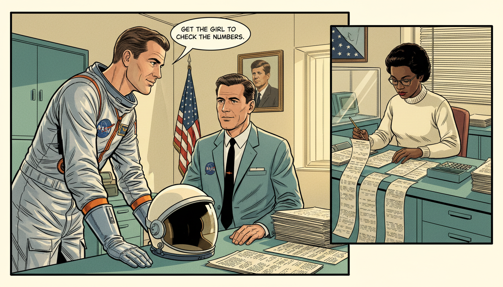

Image Prompt

I am about to ask you to generate a series of images for a graphic novel. Please make the images have a consistent style and consistent characters. Do not ask any clarifying questions. Just generate the image immediately when asked.

Please generate a 16:9 image in mid-century Atomic Age illustration style depicting panel 7 of 12. The scene shows astronaut John Glenn in his silver Mercury flight suit in 1962 leaning toward a NASA engineer and saying "Get the girl to check the numbers." Cut-in on the right shows Katherine at her desk verifying the IBM 7090 computer output by hand. Color palette: silver suit, orange jumpsuit accents, cream office walls, teal desk, warm light. Emotional tone: trust and mutual respect. Include astronaut helmet on table, IBM printouts fanning across desk, a mechanical calculator, a portrait of President Kennedy on the wall, and an American flag. Generate the image immediately without asking clarifying questions.

Before Friendship 7, John Glenn refused to fly until Katherine personally verified the computer's numbers by hand. "If she says they're good," he said, "then I'm ready to go." She spent a day and a half rechecking the orbital equations with pencil and paper. Glenn orbited Earth three times and returned safely.

## Panel 8: Orbital Mechanics at the Chalkboard

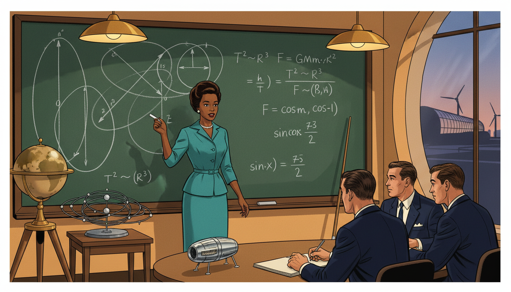

Image Prompt

I am about to ask you to generate a series of images for a graphic novel. Please make the images have a consistent style and consistent characters. Do not ask any clarifying questions. Just generate the image immediately when asked.

Please generate a 16:9 image in mid-century Atomic Age illustration style depicting panel 8 of 12. The scene shows Katherine at a massive green chalkboard covered with elliptical orbit diagrams, Kepler's equations, and trigonometric functions. She is mid-sentence, chalk in hand, teaching three male engineers who listen intently. Color palette: chalkboard green, chalk white, navy suits, teal dress, warm overhead lamps. Emotional tone: authoritative brilliance. Include a globe on a stand, orbital models, pointer stick, a model of the Mercury capsule, and a window showing a wind tunnel building. Generate the image immediately without asking clarifying questions.

Katherine co-authored a landmark 1960 report on calculating orbital paths, the first time a woman at her division was credited as an author. It used functions of angle and time to predict exactly where a capsule would be at any moment. Her equations are still taught today in aerospace engineering courses.

## Panel 9: Apollo 11 and the Moon

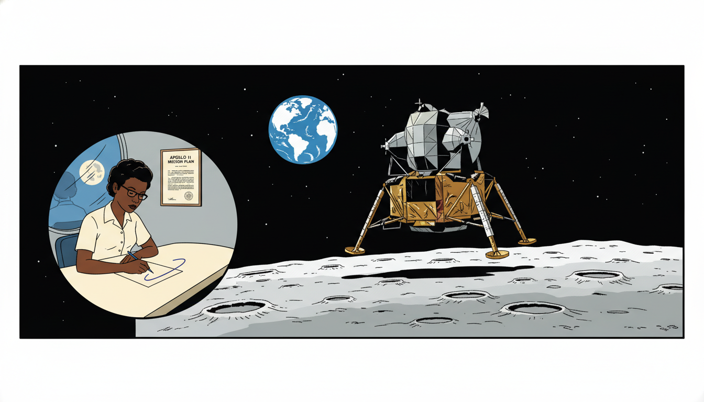

Image Prompt

I am about to ask you to generate a series of images for a graphic novel. Please make the images have a consistent style and consistent characters. Do not ask any clarifying questions. Just generate the image immediately when asked.

Please generate a 16:9 image in mid-century Atomic Age illustration style depicting panel 9 of 12. The scene shows a wide view of the Apollo 11 lunar module descending toward the Moon's surface in 1969, with the Earth rising in the black distance. Overlay on the lower left shows Katherine at her NASA desk tracing the trajectory curve on paper. Color palette: deep black space, lunar silver-gray, blue Earth, cream paper, navy ink. Emotional tone: awe and quiet pride. Include stars, lunar craters, the module's gold foil, Katherine's reflection in a window with the Moon outside, and a framed copy of the mission plan on her wall. Generate the image immediately without asking clarifying questions.

When Apollo 11 carried astronauts to the Moon, Katherine helped calculate the trajectory for the lunar landing and the return home. She later said the Moon mission was her proudest moment. The same functions a student graphs in high school were guiding humans across 238,900 miles of empty space.

## Panel 10: Raising a Family and a Standard

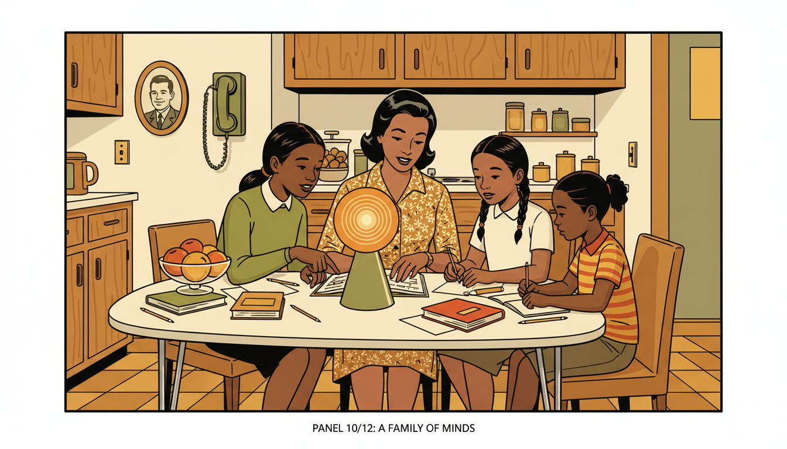

Image Prompt

I am about to ask you to generate a series of images for a graphic novel. Please make the images have a consistent style and consistent characters. Do not ask any clarifying questions. Just generate the image immediately when asked.

Please generate a 16:9 image in mid-century Atomic Age illustration style depicting panel 10 of 12. The scene shows Katherine at her kitchen table in the evening helping her three daughters (Joylette, Katherine, and Constance, ages roughly 10-15) with their homework. A geometry book is open between them. Warm lamp light fills the cozy mid-century kitchen. Color palette: mustard yellow, avocado green, cream walls, oak cabinets, warm lamp orange. Emotional tone: familial warmth. Include a formica table, chrome chairs, a bowl of fruit, a rotary phone on the wall, a framed photo of her husband in uniform, and schoolbooks scattered across the table. Generate the image immediately without asking clarifying questions.

Katherine raised three daughters while working at NASA. She tutored them in math every night, insisting that girls could do anything. Her daughters went on to become teachers and advocates for STEM education. Math was a family language.

## Panel 11: Presidential Medal of Freedom

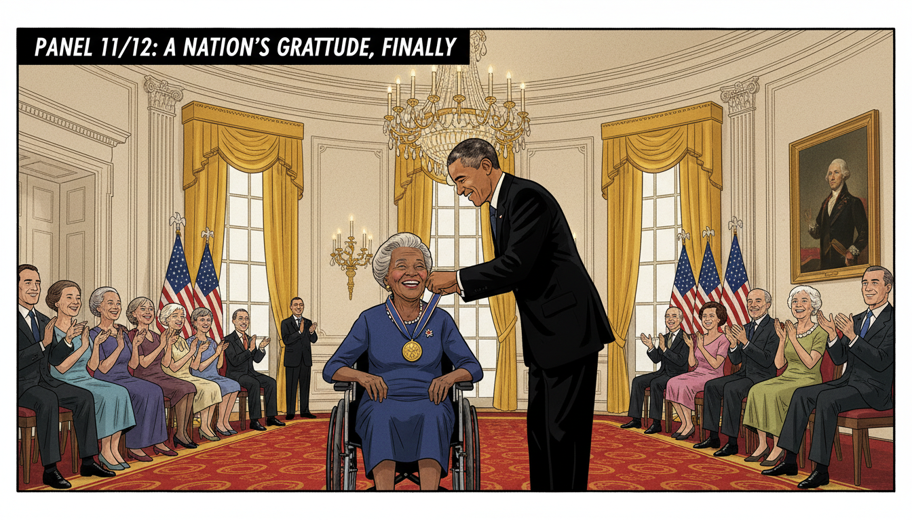

Image Prompt

I am about to ask you to generate a series of images for a graphic novel. Please make the images have a consistent style and consistent characters. Do not ask any clarifying questions. Just generate the image immediately when asked.

Please generate a 16:9 image in mid-century Atomic Age illustration style depicting panel 11 of 12. The scene shows an elderly Katherine Johnson at age 97 in 2015 receiving the Presidential Medal of Freedom from President Barack Obama in the East Room of the White House. She wears an elegant navy dress and sits in a wheelchair, beaming. Color palette: gold medal, navy dress, cream walls, presidential red carpet, warm chandelier glow. Emotional tone: long-delayed recognition and joy. Include American flags, crystal chandelier, ornate gold curtains, applauding audience in formal attire, and a large portrait of George Washington on the wall. Generate the image immediately without asking clarifying questions.

In 2015, President Obama awarded Katherine the Presidential Medal of Freedom, America's highest civilian honor. She was 97. Her story, long hidden, finally reached the world through books and films like "Hidden Figures." Generations of students now know her name.

## Panel 12: Every Student's Orbit

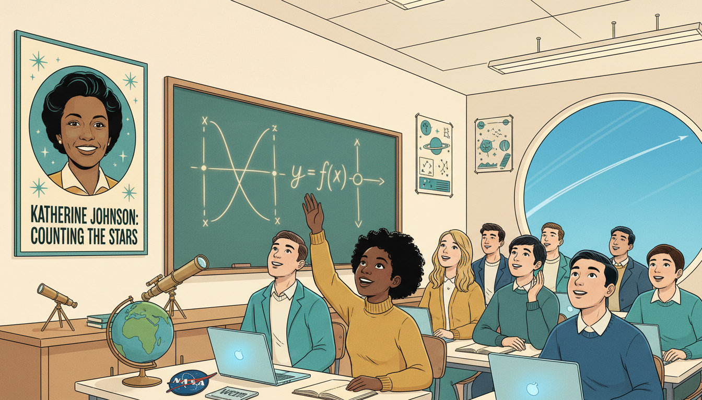

Image Prompt

I am about to ask you to generate a series of images for a graphic novel. Please make the images have a consistent style and consistent characters. Do not ask any clarifying questions. Just generate the image immediately when asked.

Please generate a 16:9 image in mid-century Atomic Age illustration style depicting panel 12 of 12. The scene shows a modern diverse classroom of high school students looking up at a poster of Katherine Johnson, with a chalkboard beside it showing a parabolic function y = f(x). A teenage Black girl in the front row smiles and raises her hand. Color palette: teal, mustard, cream, navy, warm fluorescent white. Emotional tone: inspiration passed on. Include a globe, a NASA patch, star posters, a small telescope, laptops, and a window showing a clear blue sky with a jet contrail arcing overhead. Generate the image immediately without asking clarifying questions.

Katherine Johnson passed away in 2020 at age 101, but her trajectory continues in every student who sits down with a function and believes she can solve it. Whenever you plot a parabola, remember: this is the same math that sent humans to the Moon. Every input really does have its output.

### Epilogue – What Made Katherine Different?

Katherine Johnson refused to accept limits that others tried to place on her. She combined mathematical brilliance with steady grace, proving that talent recognizes no boundaries of race or gender.

| Challenge | How Katherine Responded | Lesson for Today |
|-----------|-------------------------|------------------|
| Segregated schools | Moved towns to keep learning | Persistence opens locked doors |
| "Women can't attend meetings" | Asked anyway, politely | Ask the question others assume has been asked |
| Computer vs. hand calculation | Verified by hand, trusted the math | Understand the tool you use |
| History ignored her | Kept working anyway | Do the work; recognition may follow later |

### Call to Action

When you graph a function in class, imagine an astronaut riding that curve. Katherine showed that high school math is spaceflight math. Stay curious, ask questions, count everything. Somewhere out there, a future mission is waiting for your equations.

---

*"I counted everything. I counted the steps to the road, the steps up to church, the number of dishes and silverware I washed... anything that could be counted, I did."*
—Katherine Johnson

*"Like what you do, and then you will do your best."*
—Katherine Johnson

---

## References

1. [Wikipedia: Katherine Johnson](https://en.wikipedia.org/wiki/Katherine_Johnson) - Biography of the NASA mathematician (1918–2020)
2. [Wikipedia: Project Mercury](https://en.wikipedia.org/wiki/Project_Mercury) - The first U.S. human spaceflight program, whose orbits Johnson calculated
3. [Wikipedia: Hidden Figures](https://en.wikipedia.org/wiki/Hidden_Figures) - The book and film that brought Johnson's story to the public
4. [NASA: Katherine Johnson Biography](https://www.nasa.gov/centers-and-facilities/langley/katherine-johnson-biography/) - Official NASA Langley Research Center biography
5. [Encyclopaedia Britannica: Katherine Johnson](https://www.britannica.com/biography/Katherine-Johnson-mathematician) - Overview of Johnson's NASA career and mathematical contributions
