# Leibniz vs. Newton: The Notation Wars

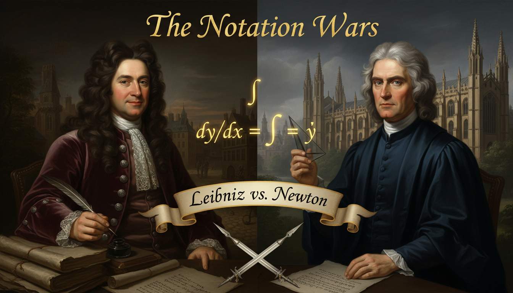

Cover Image Prompt

Please generate a wide-landscape 16:9 cover image in Baroque Enlightenment portraiture style depicting a split-screen confrontation between Gottfried Wilhelm Leibniz on the left — a German scholar with a long curly dark brown wig, kind intelligent eyes, a velvet coat with silver buttons, and an inkwell and quill in hand — and Isaac Newton on the right — an English scientist with shoulder-length gray-white hair, piercing stern eyes, a dark academic gown, and a prism in hand. Between them floats an ornate glowing equation showing both notations: Leibniz's dy/dx and Newton's y with a dot over it. Include the title text "The Notation Wars" in elegant Baroque gold lettering at the top. Color palette: deep burgundy, royal blue, candle gold, ivory, ink black. Emotional tone: intellectual rivalry, drama, history on the brink. Dramatic candlelit lighting on both faces, a ribbon banner reading "Leibniz vs. Newton" beneath, quills crossed like swords, scattered mathematical manuscripts, a German city skyline behind Leibniz and Cambridge spires behind Newton, and a faint integral symbol glowing above. Generate the image immediately without asking clarifying questions.

Narrative Prompt

This is a 12-panel graphic novel primarily about Gottfried Wilhelm Leibniz (1646–1716), the German polymath who co-invented calculus, but it also features his rival Isaac Newton (1643–1727) and their infamous priority dispute. The story spans Germany, France, the Netherlands, and England during the late 17th and early 18th centuries. Themes include the power of good notation, independent discovery, international scientific rivalry, and how clear symbols can outlast even the most famous names. Keep Leibniz consistent: long curly dark brown wig, kind round face, velvet coats in wine red or deep blue, silver buttons. Keep Newton consistent: long gray-white hair, stern angular face, dark scholar's gown, often holding a prism or quill. Settings should evoke Baroque European scholarship — candlelit libraries, ornate studies, and Enlightenment-era cities.

### Prologue – Two Minds, One Idea

In the 1660s and 1670s two of the greatest minds in Europe, working hundreds of miles apart and almost completely unaware of each other, invented essentially the same thing: calculus. One was a brooding English physicist named Isaac Newton. The other was a cheerful German polymath named Gottfried Wilhelm Leibniz. What happened next was a decades-long fight over who got there first — and a quieter, more important victory over whose notation would survive.

## Panel 1: A Boy Who Read Everything in Leipzig

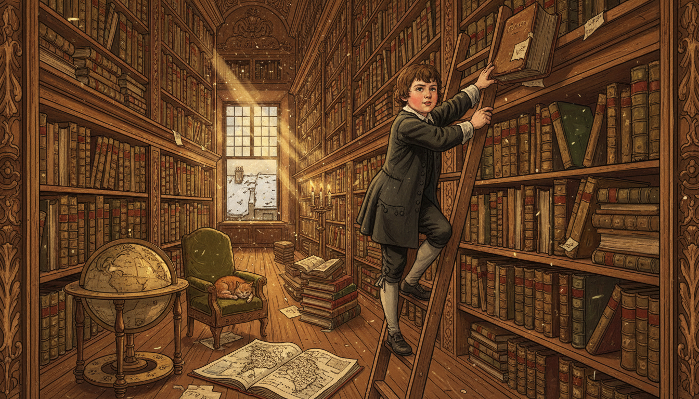

Image Prompt

I am about to ask you to generate a series of images for a graphic novel. Please make the images have a consistent style and consistent characters. Do not ask any clarifying questions. Just generate the image immediately when asked.

Please generate a 16:9 image in Baroque Enlightenment portraiture style depicting panel 1 of 12. The scene shows a small twelve-year-old Gottfried Leibniz in 1658, with round cheeks, short brown hair, and a simple dark coat, perched on a wooden ladder in the enormous private library of his late father's home in Leipzig, Germany, reaching eagerly for a thick Latin volume on a high shelf. Stacks of books rise all around him like canyon walls. Color palette: warm walnut brown, parchment gold, deep green leather bindings, candlelight amber. Emotional tone: hungry curiosity, boyish wonder. Include dust motes in slanting window light, a wooden globe in the corner, a brass candlestick on a reading stand, an open atlas on the floor, a small cat curled on a chair, and leaded-glass windows looking out onto a snowy Leipzig rooftop. Generate the image immediately without asking clarifying questions.

Leibniz's father, a professor of philosophy, died when Gottfried was only six, but he left behind an enormous library. By age twelve the boy had taught himself Latin just so he could read everything on the shelves. By fifteen he was enrolled at the University of Leipzig, and by twenty he had a doctorate in law. His mind was the kind that refused to specialize.

## Panel 2: Meanwhile, in Cambridge

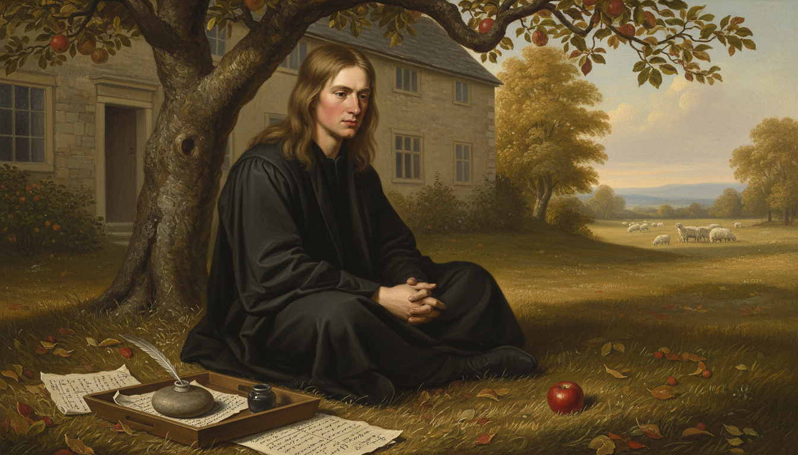

Image Prompt

Please generate a 16:9 image in Baroque Enlightenment portraiture style depicting panel 2 of 12. Make the style consistent with the prior panel. The scene shows a young Isaac Newton, age 23 in 1666, with long straight light brown hair, a serious angular face, and a plain dark scholar's gown, sitting cross-legged under an apple tree in the garden of his family farm at Woolsthorpe Manor during the plague year while Cambridge was closed. An apple has just fallen beside him, and he stares at it with an expression of dawning realization. Color palette: harvest gold, apple red, sage green, stone gray. Emotional tone: quiet revelation, solitary genius. Include the stone farmhouse in the background, a flock of sheep in a distant field, scattered handwritten mathematical pages weighted with a small rock, a quill and inkwell on a wooden tray, autumn leaves, and soft golden afternoon light. Generate the image immediately without asking clarifying questions.

While Leibniz was devouring books in Germany, Isaac Newton was sitting out a plague outbreak on his mother's farm in England. In those eighteen months of forced isolation, Newton worked out the laws of motion, the theory of gravity, and what he called "the method of fluxions" — his own private version of calculus. He told almost nobody.

## Panel 3: Leibniz in Paris, 1672

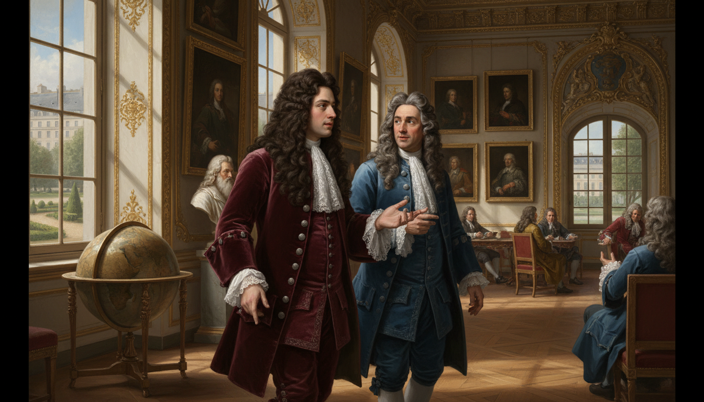

Image Prompt

Please generate a 16:9 image in Baroque Enlightenment portraiture style depicting panel 3 of 12. Make the characters and style consistent with the prior panels. The scene shows a 26-year-old Leibniz in Paris in 1672, now wearing a fashionable long curly dark brown wig, a deep wine-red velvet coat with silver buttons, and lace cuffs, walking through a grand salon of the French Academy of Sciences deep in conversation with the Dutch physicist Christiaan Huygens, a distinguished older man in a blue coat. Color palette: Parisian cream, wine red, royal blue, gilt gold. Emotional tone: intellectual awakening, sophisticated excitement. Include ornate gilded moldings, a large globe, oil portraits on the walls, a marble bust of Descartes, tall arched windows overlooking a Parisian garden, other scholars in wigs conversing in small groups, and sunlight pouring through the windows onto polished parquet floors. Generate the image immediately without asking clarifying questions.

In 1672 Leibniz was sent to Paris on a diplomatic mission and met the great Dutch scientist Christiaan Huygens, who essentially told him, "Young man, your math is a hundred years behind. Catch up." Leibniz took the advice seriously and spent the next four years teaching himself the most advanced mathematics in Europe — at a speed that stunned everyone around him.

## Panel 4: The Birth of dy/dx

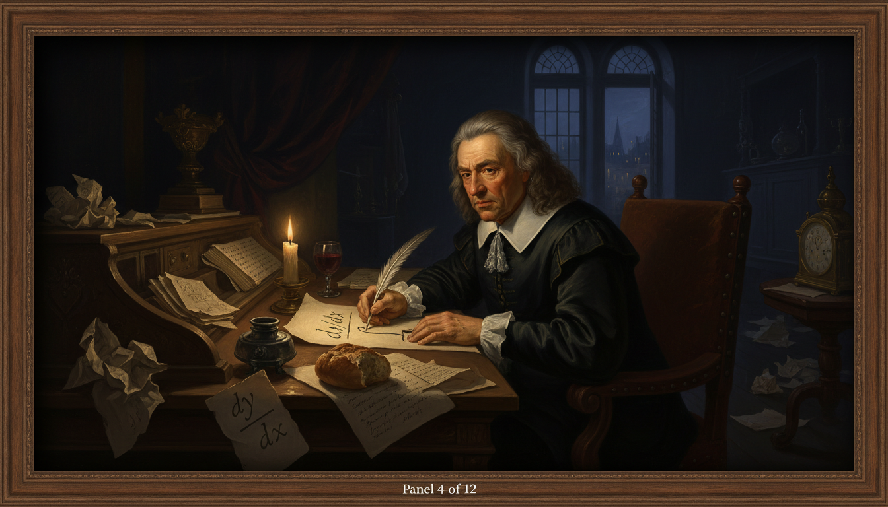

Image Prompt

Please generate a 16:9 image in Baroque Enlightenment portraiture style depicting panel 4 of 12. Make the characters and style consistent with the prior panels. The scene shows Leibniz alone at a large oak desk in a candlelit Paris apartment at night in 1675, hunched over a sheet of parchment writing the symbols "dy/dx" and a long elegant integral sign "∫" for the very first time. Multiple crumpled drafts lie scattered on the floor. Color palette: midnight blue, candle gold, parchment cream, deep burgundy. Emotional tone: intimate, historic, the quiet birth of a symbol. Include a single beeswax candle burning low, a pewter inkwell, a feathered quill mid-stroke, a half-eaten bread roll, a glass of wine, a stack of Huygens's letters nearby, a ticking brass clock reading past midnight, and dramatic Rembrandt-style chiaroscuro lighting on Leibniz's focused face. Generate the image immediately without asking clarifying questions.

On October 29, 1675, Leibniz sat down in Paris and wrote two symbols that would change mathematics forever: a long curly "∫" for integration (a stretched letter S for "summa," or sum) and the fraction-like "dy/dx" for the derivative. His notation treated calculus as an algebra of tiny differences and tiny sums — clean, symmetric, and easy to manipulate on paper.

## Panel 5: Newton's Dots and Leibniz's Fractions

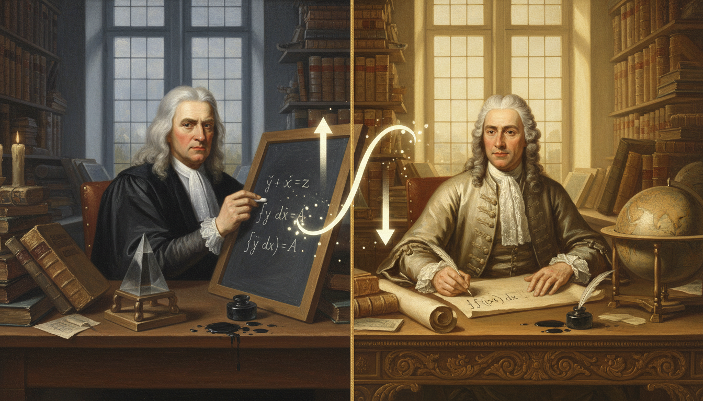

Image Prompt

Please generate a 16:9 image in Baroque Enlightenment portraiture style depicting panel 5 of 12. Make the characters and style consistent with the prior panels. The scene is a dramatic split composition: on the left, Newton in his dark Cambridge study writes his fluxion notation — letters with dots above them like ẏ and ẍ — on a slate board. On the right, Leibniz in his bright Paris study writes dy/dx and ∫ on parchment. Between them floats a large glowing symbol of a curve being analyzed both ways. Color palette: Newton's side in cool gray-blue and candle amber; Leibniz's side in warm cream and gold. Emotional tone: parallel genius, destined collision. Include stacks of books on both sides, a prism on Newton's desk, a globe on Leibniz's, quills, ink spills, and a thin gold line down the center separating the two worlds. Generate the image immediately without asking clarifying questions.

Newton had beaten Leibniz to calculus by nearly ten years, but he wrote his derivatives as letters with dots on top — $\dot{y}$ meant the rate of change of $y$. Leibniz's $dy/dx$, by contrast, looked like a fraction and behaved like one in calculations. The two notations described the same mathematics, but one was much easier to actually use.

## Panel 6: A Polite Exchange of Letters

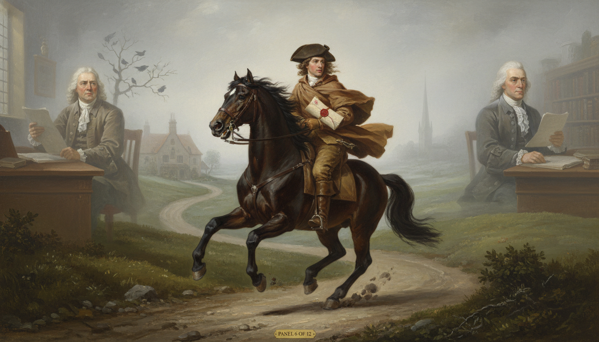

Image Prompt

Please generate a 16:9 image in Baroque Enlightenment portraiture style depicting panel 6 of 12. Make the characters and style consistent with the prior panels. The scene shows a courier in a long traveling cloak on horseback galloping across a misty northern European landscape carrying a sealed letter with a red wax seal, with faint ghostly images of Leibniz at his desk in Hanover on the left and Newton at his desk in Cambridge on the right, each holding pages of a letter. Color palette: fog gray, saddle brown, wax red, parchment cream, muted green countryside. Emotional tone: civility stretched across great distance. Include a winding dirt road, a stone inn in the distance, a flock of crows, hills rolling into mist, a church spire in the far background, and the horse's breath visible in the cold air. Generate the image immediately without asking clarifying questions.

In the late 1670s, Leibniz and Newton exchanged a few careful letters through a mutual acquaintance, Henry Oldenburg of the Royal Society. Newton hinted at his methods using anagrams — literally scrambled letters — so that he could later claim priority without revealing anything. Leibniz, for his part, shared his own ideas much more openly. Seeds of suspicion were planted on both sides.

## Panel 7: Leibniz Publishes, 1684

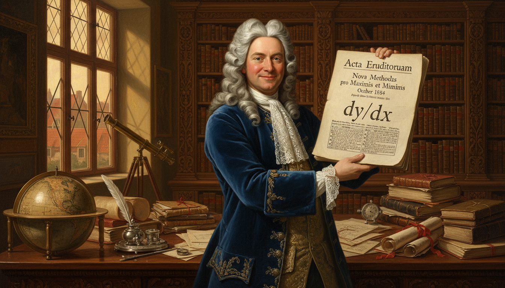

Image Prompt

Please generate a 16:9 image in Baroque Enlightenment portraiture style depicting panel 7 of 12. Make the characters and style consistent with the prior panels. The scene shows Leibniz, now in his late thirties with a full curly wig and a deep blue velvet coat, holding up a freshly printed copy of the October 1684 issue of the academic journal Acta Eruditorum in his Hanover study. The open journal clearly displays his calculus paper with the dy/dx notation. A proud smile plays on his face. Color palette: royal blue, ivory parchment, oak brown, candle gold. Emotional tone: triumph, pride, the joy of publication. Include a large writing desk covered with correspondence, an ornate library behind him, a leaded-glass window showing the red rooftops of Hanover, a silver inkwell, a globe, a telescope, and warm afternoon light illuminating the journal page. Generate the image immediately without asking clarifying questions.

In October 1684, Leibniz published the world's first paper on differential calculus in the German journal *Acta Eruditorum*. Two years later he published integration. These papers used the exact notation we still teach today — $dy/dx$, $\int f(x)\,dx$, the product rule, and the chain rule. For the first time, any trained mathematician in Europe could learn calculus from a printed page.

## Panel 8: Newton Publishes the Principia, 1687

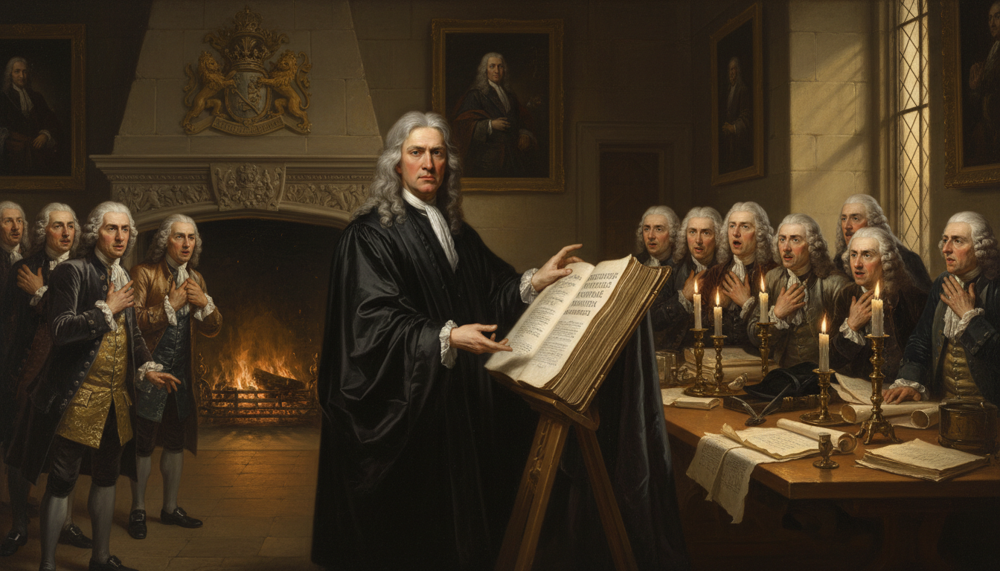

Image Prompt

Please generate a 16:9 image in Baroque Enlightenment portraiture style depicting panel 8 of 12. Make the characters and style consistent with the prior panels. The scene shows Isaac Newton in 1687, now in his mid-forties with long gray-white hair, dark academic robes, and a stern expression, unveiling a massive leather-bound copy of his Philosophiæ Naturalis Principia Mathematica at a meeting of the Royal Society in London. Gentlemen in powdered wigs lean forward in astonishment. Color palette: Cambridge stone, scholar's black, book leather brown, candle amber. Emotional tone: awe, gravity, the arrival of a giant. Include oil portraits of past Royal Society presidents on the walls, a massive fireplace with a coat of arms, tall candles in brass candelabras, a long polished table covered in papers, and late afternoon light filtering through diamond-paned windows. Generate the image immediately without asking clarifying questions.

Three years later, Newton finally published his *Principia Mathematica*, the book that gave the world his laws of motion and gravity — but buried its calculus inside dense geometric proofs written in his awkward fluxion notation. The *Principia* was a masterpiece of physics. As a teaching tool for calculus, it was almost unreadable.

## Panel 9: The Accusation

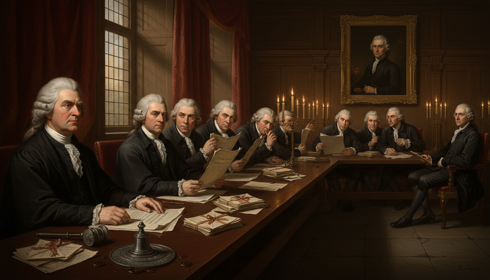

Image Prompt

Please generate a 16:9 image in Baroque Enlightenment portraiture style depicting panel 9 of 12. Make the characters and style consistent with the prior panels. The scene shows a tense Royal Society chamber in London around 1712. An older Newton in dark robes sits at the head of a long table presiding as president, while other members whisper and read from a damning report. On a far wall hangs an ornate portrait of Leibniz as if on trial in absentia. Color palette: shadowed oak, crimson drapery, powdered-wig white, candle gold, ink black. Emotional tone: cold accusation, institutional power, unfairness. Include stacks of letters being examined as evidence, a gavel, a large Royal Society seal, members in long curled wigs, shadows stretching across the stone floor, and dramatic candlelight picking out Newton's stern profile. Generate the image immediately without asking clarifying questions.

As calculus spread across Europe using Leibniz's symbols, Newton's supporters grew furious. In 1712 the Royal Society — with Newton himself as president — convened a committee to investigate who had invented calculus first. Unsurprisingly, it ruled in Newton's favor. What the Society did not mention was that Newton had secretly written much of the report himself.

## Panel 10: Leibniz Dies Alone in Hanover, 1716

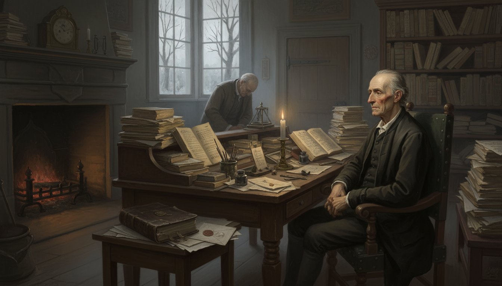

Image Prompt

Please generate a 16:9 image in Baroque Enlightenment portraiture style depicting panel 10 of 12. Make the characters and style consistent with the prior panels. The scene shows an elderly, tired Leibniz in his late sixties, thinner now, in a simple dark coat without the fine velvet of earlier years, sitting alone at a cluttered desk in a modest Hanover study in November 1716. A single servant stands at the door with a bowed head. Unfinished manuscripts are piled high on every surface. Color palette: muted gray, dim candle amber, faded parchment, sorrowful brown. Emotional tone: melancholy, quiet injustice, the end of a great life. Include a cold fireplace with dying embers, a worn Bible, an unopened letter bearing a foreign seal, a brass clock stopped, a single flickering candle, and pale winter light through a frosted window. Generate the image immediately without asking clarifying questions.

Leibniz died in Hanover in 1716, largely forgotten and out of favor at court, with only his secretary at his funeral. The priority dispute had poisoned the last years of his life. But mathematics does not listen to committees — and across Europe, students were already learning calculus from his symbols, not Newton's.

## Panel 11: The Continent Chooses Leibniz

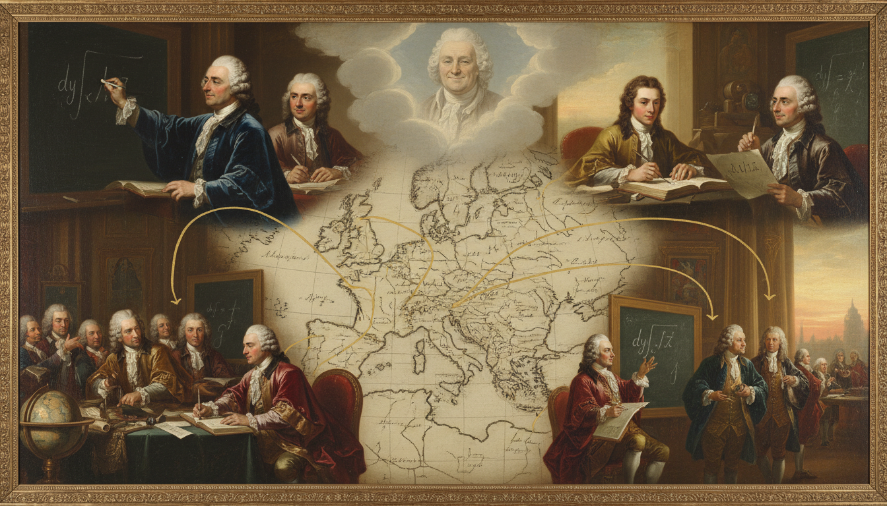

Image Prompt

Please generate a 16:9 image in Baroque Enlightenment portraiture style depicting panel 11 of 12. Make the characters and style consistent with the prior panels. The scene is a montage showing 18th-century European mathematicians — the Bernoulli brothers, a young Leonhard Euler, and others in powdered wigs and scholarly robes — all across different rooms in Basel, Berlin, St. Petersburg, and Paris, each writing dy/dx and ∫ on their own papers and chalkboards. A faint ghostly image of Leibniz smiles faintly in the background clouds above Europe. Color palette: Enlightenment cream, blue velvet, candle gold, map parchment. Emotional tone: vindication across borders, the quiet triumph of good notation. Include a map of Europe underlying the montage, connecting lines between cities, quills in motion, open journals, a globe, and warm dawn light breaking over the continent. Generate the image immediately without asking clarifying questions.

On the continent, the Bernoulli family in Switzerland, Euler in Berlin and St. Petersburg, and eventually every serious mathematician outside England chose Leibniz's notation. It was simply easier to teach, easier to use, and easier to extend. English mathematics, loyal to Newton's dots, actually fell behind for nearly a century because of the stubbornness of the notation war.

## Panel 12: dy/dx Lives Forever

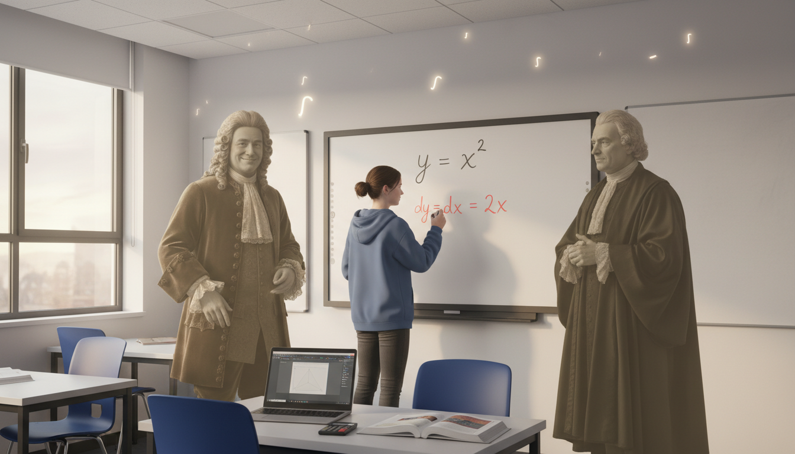

Image Prompt

Please generate a 16:9 image in Baroque Enlightenment style blended with modern classroom realism, depicting panel 12 of 12. Make the style consistent with the prior panels. The scene shows a modern IB math classroom with a teenage student at a whiteboard writing dy/dx = 2x under a large equation y = x squared, while translucent ghostly figures of Leibniz in his wig and velvet coat and Newton in his dark robes stand on either side watching. Leibniz smiles warmly; Newton nods with grudging respect. Color palette: modern classroom white and blue, warm sepia ghosts, marker red and black. Emotional tone: reconciliation, legacy, the present meeting the past. Include a laptop on a desk, an open IB textbook, a graphing calculator, sunlight through a window, and subtle glowing integral symbols floating near the ceiling. Generate the image immediately without asking clarifying questions.

Today, every calculus textbook on Earth uses Leibniz's $dy/dx$ and $\int$ symbols. Newton is rightly remembered as one of the greatest scientists who ever lived — but when you take the derivative of a function, the notation in your hand is Leibniz's. Good ideas matter; clear symbols for those ideas sometimes matter even more.

### Epilogue – What Made Leibniz Different?

Leibniz was not simply a mathematician; he was a philosopher, diplomat, historian, engineer, and inventor who happened to see calculus as part of a much larger dream of a universal language of thought. That dream is exactly why his notation won — he designed symbols that were meant to be shared, taught, and extended, not guarded like a secret. In the long run, clarity beat genius hoarded in silence.

| Challenge | How Leibniz Responded | Lesson for Today |
|-----------|------------------------|------------------|
| A powerful rival with a head start | Published openly and clearly | Share your work; hidden ideas rarely win |
| Clunky existing notation | Designed symbols anyone could use | Good tools beat raw talent |
| A priority fight he could not win | Kept inventing in many fields | Don't let one battle define you |
| Dying out of favor | Trusted that his symbols would outlast him | The work lasts longer than the quarrel |

### Call to Action

Every time you write $dy/dx$ or $\int f(x)\,dx$ in your IB math notebook, you are using the exact symbols a German polymath scribbled by candlelight in Paris in 1675. Pick your notation carefully in your own work — clarity is not decoration; it is the thing that lets your ideas travel.

---

*"The art of discovering the causes of phenomena… is the art of hypothesis, which requires above all a keen mind."*
—Gottfried Wilhelm Leibniz

*"If I have seen further it is by standing on the shoulders of giants."*
—Isaac Newton

---

## References

1. [Wikipedia: Gottfried Wilhelm Leibniz](https://en.wikipedia.org/wiki/Gottfried_Wilhelm_Leibniz) - Biography of the German polymath and co-inventor of calculus
2. [Wikipedia: Leibniz–Newton calculus controversy](https://en.wikipedia.org/wiki/Leibniz%E2%80%93Newton_calculus_controversy) - The decades-long priority dispute between Leibniz and Newton
3. [Wikipedia: History of calculus](https://en.wikipedia.org/wiki/History_of_calculus) - The development of calculus from antiquity to Leibniz and Newton
4. [MacTutor: Gottfried Wilhelm von Leibniz](https://mathshistory.st-andrews.ac.uk/Biographies/Leibniz/) - University of St Andrews history of mathematics archive
5. [Stanford Encyclopedia of Philosophy: Leibniz](https://plato.stanford.edu/entries/leibniz/) - Scholarly overview of Leibniz's philosophy and mathematics
