# Leonhard Euler: The Symbol That Stuck

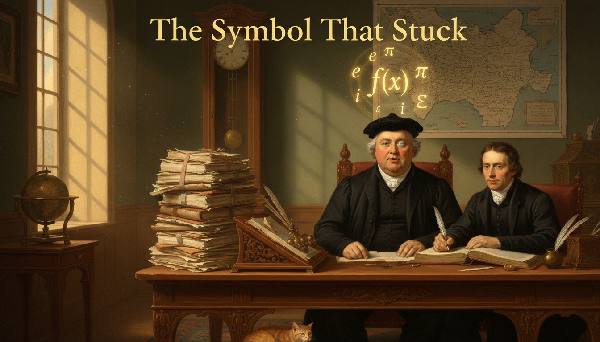

Cover Image Prompt

Please generate a wide-landscape 16:9 cover image in Enlightenment classical portraiture style depicting Leonhard Euler in his later years, a stout Swiss mathematician in his sixties with a round kind face, a modest dark velvet cap, a plain black scholar's coat with a white cravat, and one clouded blind eye, sitting calmly at a large wooden writing desk while his adult son Johann writes in a ledger beside him. Euler's lips are mid-sentence as he dictates. Above his head floats a luminous golden symbol "f(x)" surrounded by other glowing Euler notations — e, π, i, Σ. Include the title text "The Symbol That Stuck" in elegant Enlightenment gold serif lettering at the top. Color palette: warm candle gold, deep forest green, ivory, walnut brown, sky blue. Emotional tone: serene genius, patient dictation, wisdom triumphing over blindness. Include a quill in Johann's hand, a stack of nearly fifty completed manuscripts on the desk, a globe, a map of St. Petersburg on the wall, a ticking pendulum clock, a single tall window with afternoon light streaming in, and a small tabby cat curled at Euler's feet. Generate the image immediately without asking clarifying questions.

Narrative Prompt

This is a 12-panel graphic novel about Leonhard Euler (1707–1783), the Swiss mathematician who worked in Basel, St. Petersburg, and Berlin, and who is widely considered the most prolific mathematician in history. Key themes: the power of good notation, working through severe disability (he went blind in one eye by his thirties and totally blind by 1771), family life alongside genius, and the idea that clear communication can be as revolutionary as discovery. Keep Euler's appearance consistent: stout build, round kind face, modest dark velvet cap or plain hair, black scholar's coat with white cravat; later panels show him with one or both clouded eyes. Settings evolve from Basel mountains, to the Russian imperial court in St. Petersburg, to Frederick the Great's Berlin, and back to St. Petersburg under Catherine the Great.

### Prologue – The Notation Nobody Can Escape

If you have ever written $f(x)$, used $e$ for Euler's number, $\pi$ for pi as a ratio, $i$ for the imaginary unit, or $\Sigma$ for a sum, you have used notation introduced or popularized by one single man. Leonhard Euler produced so much mathematics that it took the Swiss Academy more than a hundred years after his death just to publish his collected works. And he did much of it while completely blind.

## Panel 1: A Pastor's Son in Basel

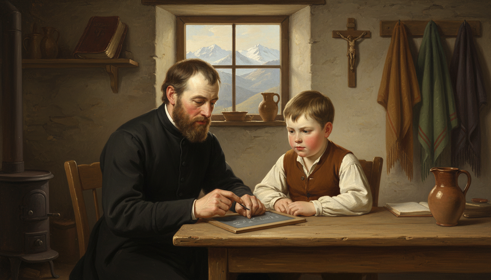

Image Prompt

I am about to ask you to generate a series of images for a graphic novel. Please make the images have a consistent style and consistent characters. Do not ask any clarifying questions. Just generate the image immediately when asked.

Please generate a 16:9 image in Enlightenment classical portraiture style depicting panel 1 of 12. The scene shows a young eight-year-old Leonhard Euler in 1715, a round-faced Swiss boy with short light brown hair in a simple linen shirt and woolen vest, sitting at a plain wooden table in the modest home of his father, a Reformed pastor, in the village of Riehen near Basel, Switzerland. His father, a gentle bearded man in a black pastor's coat, is teaching him basic arithmetic from a small slate. Color palette: alpine cream, chestnut brown, soft green, candle amber. Emotional tone: warm, humble, foundational. Include a window view of the Swiss Alps in the distance, a Bible on a shelf, a wooden crucifix on the wall, a clay pitcher, an iron stove, woolen shawls hanging on hooks, and gentle morning light crossing the slate. Generate the image immediately without asking clarifying questions.

Leonhard Euler was born in 1707 in Basel, Switzerland, to a Protestant pastor who loved mathematics on the side. His father taught him arithmetic as a small child and gently hoped he might grow up to take over the parish. Leonhard had other plans, but he kept his father's love of teaching and his patient, kindly temperament for the rest of his life.

## Panel 2: Studying Under the Bernoullis

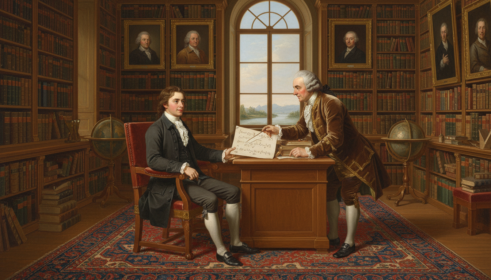

Image Prompt

Please generate a 16:9 image in Enlightenment classical portraiture style depicting panel 2 of 12. Make the style consistent with the prior panel. The scene shows a teenage Euler around age 15 in 1722, in a dark student's coat and white cravat, sitting in the ornate library of the famous Swiss mathematician Johann Bernoulli in Basel. Bernoulli, a distinguished older man with a gray wig and rich brown velvet coat, leans over a desk pointing to a page of differential equations while Euler listens with bright eager eyes. Color palette: oak brown, forest green, ivory parchment, gold leaf. Emotional tone: mentorship, awe, discovery. Include floor-to-ceiling bookshelves of leather-bound volumes, a large globe, an armillary sphere, oil portraits of the Bernoulli family, a Persian rug, a window looking out onto the Rhine river, and warm filtered afternoon light. Generate the image immediately without asking clarifying questions.

At the University of Basel young Euler was spotted by Johann Bernoulli, one of the greatest mathematicians in Europe and a former rival of Leibniz. Bernoulli agreed to give him private Saturday lessons — an enormous honor. Johann's sons, Daniel and Nicolaus Bernoulli, became Euler's lifelong friends and eventually helped bring him to Russia.

## Panel 3: A New Life in St. Petersburg, 1727

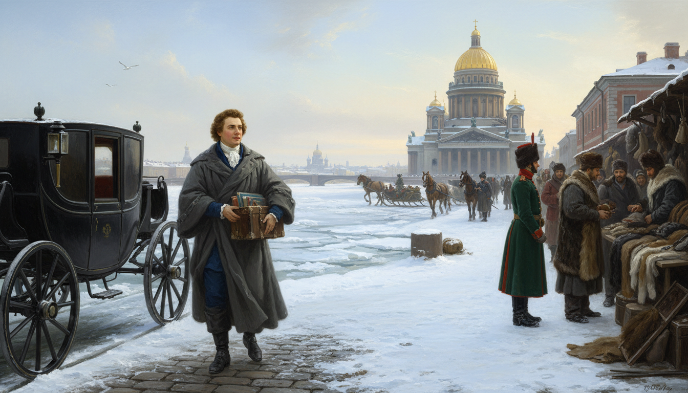

Image Prompt

Please generate a 16:9 image in Enlightenment classical portraiture style depicting panel 3 of 12. Make the characters and style consistent with the prior panels. The scene shows a twenty-year-old Euler arriving by horse-drawn carriage in snowy St. Petersburg, Russia, in May 1727, stepping out onto a cobblestone quay along the frozen Neva river. He carries a leather trunk of books and wears a heavy gray traveling cloak over his scholar's coat. The golden dome of a Russian Orthodox cathedral rises in the background. Color palette: icy blue, snow white, imperial gold, cloak gray, brick red. Emotional tone: hopeful beginning, cold awe, foreign wonder. Include horse-drawn sledges, Russian soldiers in long green coats, merchants selling furs, onion-domed churches in the distance, seagulls over the Neva, and pale northern light. Generate the image immediately without asking clarifying questions.

In 1727, only twenty years old, Euler was invited to join the brand-new Imperial Russian Academy of Sciences in St. Petersburg. He arrived the same day the empress who had founded it, Catherine I, died — not an encouraging start. But the Academy survived, and Euler quickly established himself as its brightest young star.

## Panel 4: Defining the Function

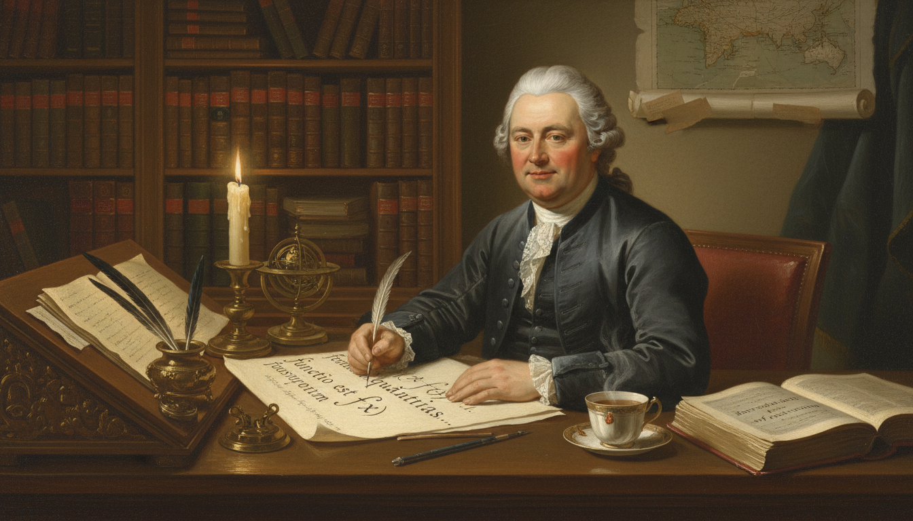

Image Prompt

Please generate a 16:9 image in Enlightenment classical portraiture style depicting panel 4 of 12. Make the characters and style consistent with the prior panels. The scene shows Euler in his early thirties, now with a round face and modest powdered hair, seated at a heavy wooden writing desk in his St. Petersburg study, writing the definition of a function in Latin on a large sheet of parchment. The symbol "f(x)" is clearly visible on the page in large elegant handwriting. Color palette: candlelight gold, deep oak, parchment cream, Prussian blue. Emotional tone: focused creation, historic moment, quiet pride. Include a tall bookshelf, an inkwell with multiple quills, a small brass orrery, a map of the Russian Empire on the wall, a steaming cup of tea, an open book labeled "Introductio in analysin infinitorum," and a tall candle with dripping wax. Generate the image immediately without asking clarifying questions.

In the 1730s and 1740s, Euler was the first mathematician to treat *functions* as the central object of analysis — not curves, not equations, but mappings from input to output. In his massive 1748 textbook *Introductio in analysin infinitorum*, he defined a function clearly and introduced the notation $f(x)$ to represent it. That single symbol is now used by every math student on Earth.

## Panel 5: Losing the Right Eye

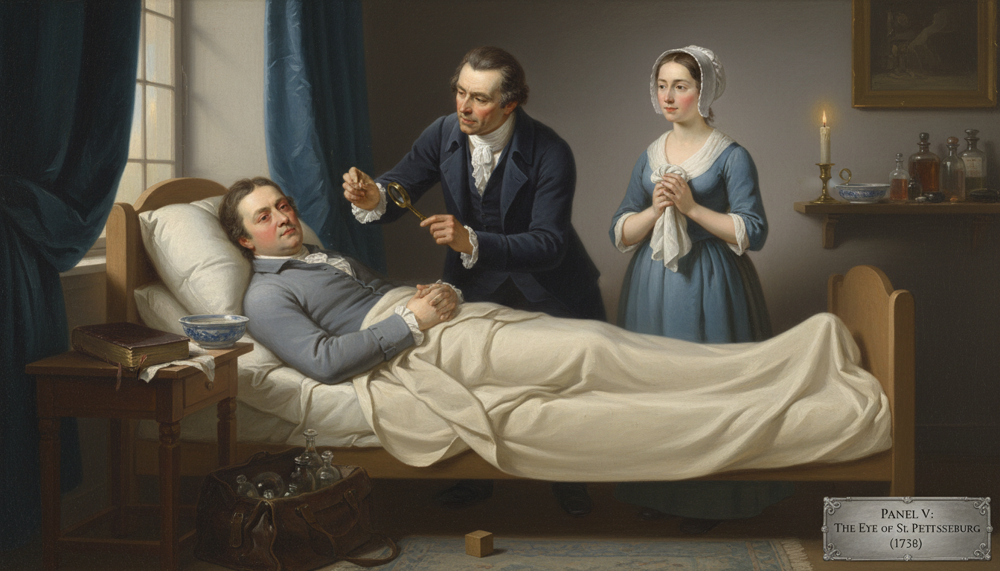

Image Prompt

Please generate a 16:9 image in Enlightenment classical portraiture style depicting panel 5 of 12. Make the characters and style consistent with the prior panels. The scene shows Euler around 1738, in his early thirties, lying on a simple bed in his St. Petersburg home while a concerned Russian physician in a dark coat examines his inflamed right eye with a small brass magnifying lens. A window with heavy drapes is half-closed to dim the light. Euler's wife, Katharina, a kind-faced woman in a modest blue dress and white bonnet, stands nearby holding a damp cloth. Color palette: muted blue, lamplight amber, pale ivory, worry gray. Emotional tone: vulnerable, tender, quietly brave. Include a porcelain basin, a small child's wooden toy on the floor (hinting at his growing family), a Bible on the bedside table, a doctor's leather bag with glass bottles, and soft diffused light from a single shielded candle. Generate the image immediately without asking clarifying questions.

Around 1738, Euler developed a severe fever and lost nearly all sight in his right eye. Modern historians think it may have been an infection from bending over manuscripts in poor light for years on end. He simply shrugged it off and kept working — he once joked that now he had "less to distract him."

## Panel 6: Frederick's Berlin

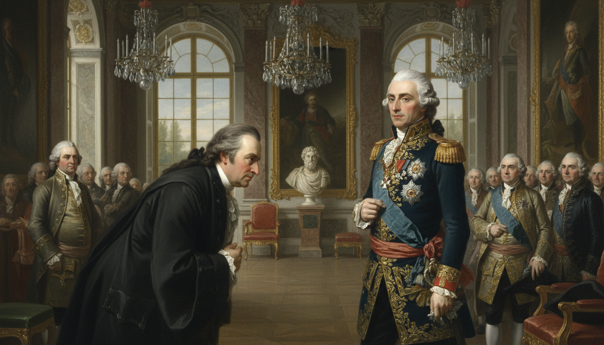

Image Prompt

Please generate a 16:9 image in Enlightenment classical portraiture style depicting panel 6 of 12. Make the characters and style consistent with the prior panels. The scene shows Euler in his forties in 1741, arriving at the magnificent Sanssouci-style Berlin Academy of Sciences under the invitation of King Frederick the Great of Prussia. Euler in a dark scholar's coat bows respectfully to Frederick, a slim sharp-featured king in a blue military uniform with gold trim and a white powdered wig. Other courtiers and scholars look on. Color palette: Prussian blue, royal gold, ivory marble, powder white. Emotional tone: formal, cool, politically charged. Include ornate baroque architecture, a parquet floor, tall gilded mirrors, oil portraits of Prussian royalty, a marble bust of a Greek philosopher, tall windows overlooking manicured gardens, and chandelier light glinting off the king's decorations. Generate the image immediately without asking clarifying questions.

In 1741 Euler accepted an invitation from Frederick the Great of Prussia to move to Berlin, where he spent the next twenty-five years. Frederick, who preferred witty French philosophers, once cruelly called Euler "my cyclops" behind his back. Euler ignored the insult and wrote more than 380 papers during his Berlin years — including some of his most famous work on functions, calculus, and number theory.

## Panel 7: Teaching a Princess

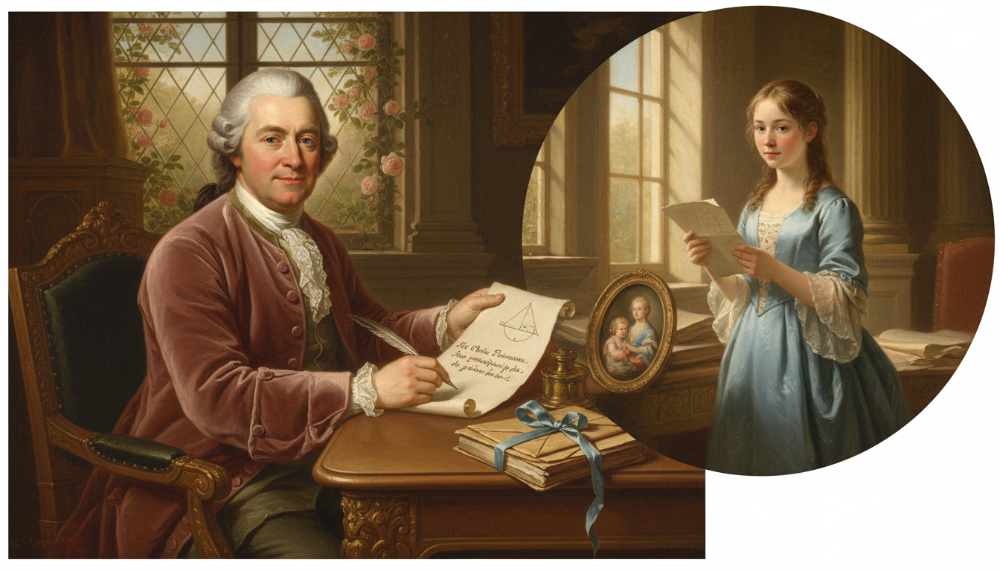

Image Prompt

Please generate a 16:9 image in Enlightenment classical portraiture style depicting panel 7 of 12. Make the characters and style consistent with the prior panels. The scene shows middle-aged Euler in his study writing a warm letter of instruction to a young German princess, with an imagined inset showing the princess — a poised teenage girl in a pale blue gown — reading the letter in a sunlit palace room. Euler's letter is in French with a sketch of a simple geometric diagram in the margin. Color palette: soft rose, sky blue, parchment cream, candle gold. Emotional tone: kind, avuncular, generous teaching. Include a stack of leather-bound letters tied with ribbon, an inkwell, a small framed miniature of his family, a quill, a window with roses, and a gentle afternoon light. Generate the image immediately without asking clarifying questions.

Between 1760 and 1762, Euler wrote a series of more than two hundred letters to a German princess, explaining physics, astronomy, logic, and philosophy in plain language. *Letters to a German Princess* became one of the most popular science books of the 18th century and was translated across Europe. It proved that Euler could teach as beautifully as he could discover.

## Panel 8: A House Full of Children

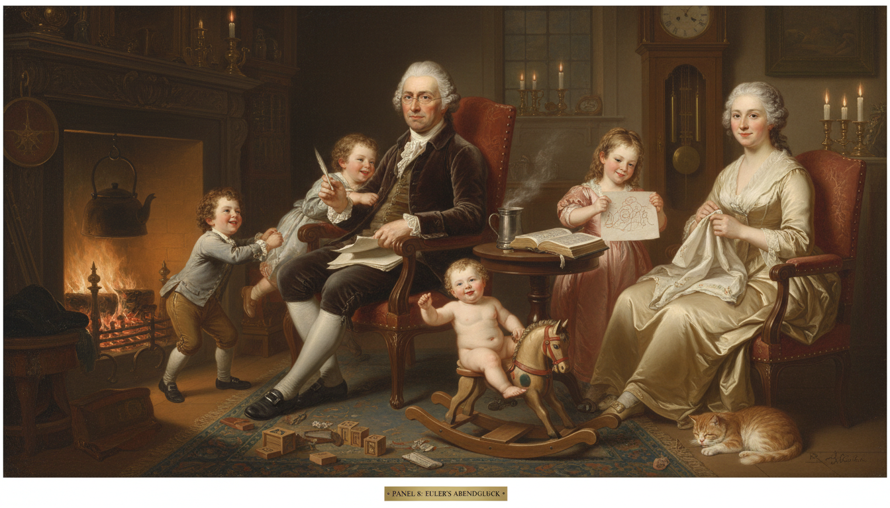

Image Prompt

Please generate a 16:9 image in Enlightenment classical portraiture style depicting panel 8 of 12. Make the characters and style consistent with the prior panels. The scene shows a cheerful domestic evening in Euler's Berlin home. Euler sits in a wooden armchair by a crackling fireplace, calmly writing a paper on his lap while four or five of his thirteen children play loudly around him — one little boy tugging at his sleeve, a girl showing him a drawing, a toddler on the rug with a wooden horse. His wife Katharina sits nearby with embroidery, smiling. Color palette: warm firelight orange, cream, chestnut brown, soft rose. Emotional tone: joyful chaos, family warmth, concentration amid noise. Include a plump tabby cat, a wooden rocking horse, scattered toy blocks, an iron kettle on the fire, an open Bible on a side table, a pewter mug of tea, a ticking grandfather clock, and candles in brass holders. Generate the image immediately without asking clarifying questions.

Euler and his wife Katharina had thirteen children, though only five survived to adulthood — a heartbreak common in the 18th century. Famously, Euler could work on a mathematics paper with a baby on one knee and another child climbing his leg. "A mathematician's most productive place," he said, "is among his family."

## Panel 9: Complete Blindness, 1771

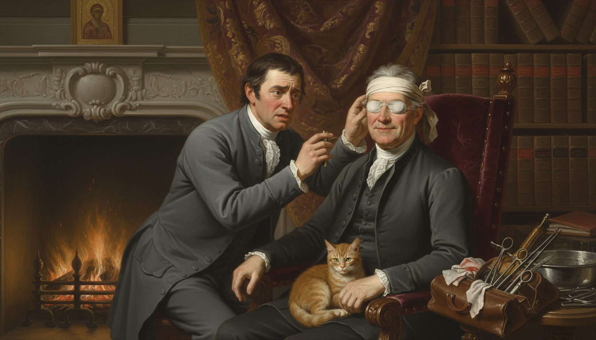

Image Prompt

Please generate a 16:9 image in Enlightenment classical portraiture style depicting panel 9 of 12. Make the characters and style consistent with the prior panels. The scene shows Euler in 1771, back in St. Petersburg, now in his sixties with both eyes visibly clouded, sitting serenely in a high-backed chair while a doctor examines him after a failed cataract surgery. A large fire roars in a marble fireplace behind him. Despite the visible disappointment on the doctor's face, Euler wears a calm, almost amused expression. Color palette: deep burgundy, candle gold, slate gray, ivory bandage white. Emotional tone: quiet courage, acceptance, stubborn spirit. Include a leather bag of surgical instruments, a basin of water, a shelf of his own books, a small tabby cat on his lap, heavy Russian-style drapery, an icon in a corner, and soft firelight on his face. Generate the image immediately without asking clarifying questions.

Euler returned to St. Petersburg in 1766 under Catherine the Great, and in 1771 a cataract surgery on his remaining eye left him totally blind. Almost any other scholar would have retired. Euler instead increased his output — he estimated that roughly half of his entire lifetime body of work was produced after he lost his sight.

## Panel 10: Dictation and a Perfect Memory

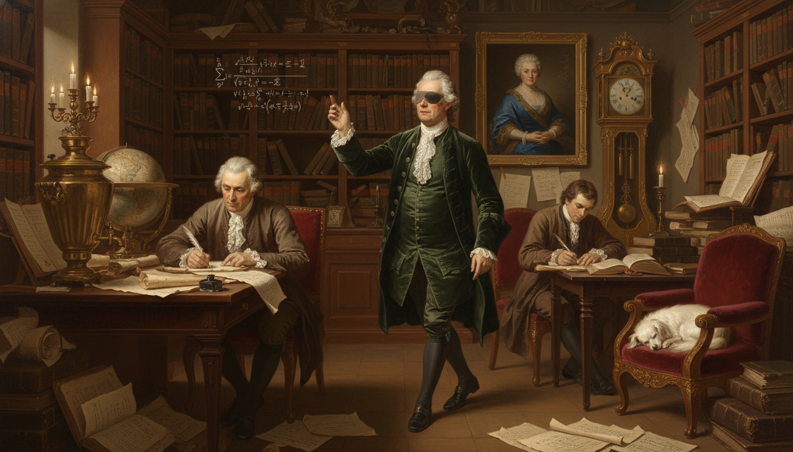

Image Prompt

Please generate a 16:9 image in Enlightenment classical portraiture style depicting panel 10 of 12. Make the characters and style consistent with the prior panels. The scene shows blind Euler in his late sixties pacing slowly across a large candlelit study in St. Petersburg, dictating a long mathematical proof aloud while his adult son Johann Albrecht Euler sits at a desk writing furiously with a quill. A second assistant, a young German scholar, also writes at a nearby table. Euler gestures in the air with one hand as if drawing an invisible integral. Color palette: candle gold, deep walnut brown, parchment cream, forest green. Emotional tone: astonishing mental power, trust, legacy in motion. Include floor-to-ceiling bookshelves, a large Russian samovar, a globe, an ornate ticking pendulum clock, an oil portrait of Catherine the Great on the wall, scattered pages of calculations, and a small white dog asleep in a chair. Generate the image immediately without asking clarifying questions.

Unable to see, Euler dictated his papers out loud — sometimes to his sons, sometimes to a tailor's apprentice who happened to be good with numbers. He could hold entire calculations in his head, including infinite series of fifty terms or more. Contemporaries said he did mathematics "as other men breathe, or as eagles sustain themselves in the air."

## Panel 11: The Last Day, 1783

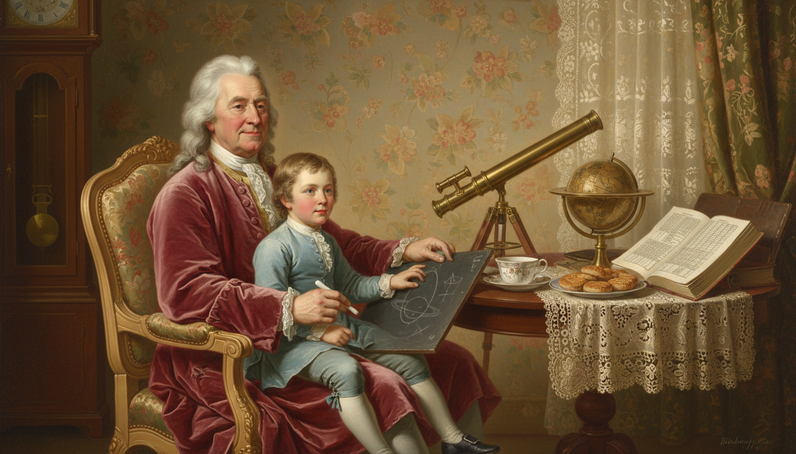

Image Prompt

Please generate a 16:9 image in Enlightenment classical portraiture style depicting panel 11 of 12. Make the characters and style consistent with the prior panels. The scene shows Euler on the afternoon of September 18, 1783, sitting at a tea table in his St. Petersburg home with his grandson on his lap, calmly drawing figures on a slate about the recently discovered planet Uranus. A teacup steams beside him. He appears peaceful, mid-thought. Color palette: afternoon gold, rose, pale blue, warm ivory. Emotional tone: gentle, ordinary, serene ending. Include a brass telescope on a table nearby, a small celestial globe, an open book of astronomical tables, a plate of Russian zavarka biscuits, floral wallpaper, a grandfather clock, and soft afternoon light through a lace curtain. Generate the image immediately without asking clarifying questions.

On September 18, 1783, Euler spent his morning doing calculations about the orbit of the newly discovered planet Uranus, had lunch with his family, played with his grandchildren, and in the late afternoon suffered a sudden stroke. His last words were reportedly "I am dying." The mathematician Condorcet later wrote that Euler "ceased to calculate and to live" in the same moment.

## Panel 12: The Symbol That Stuck

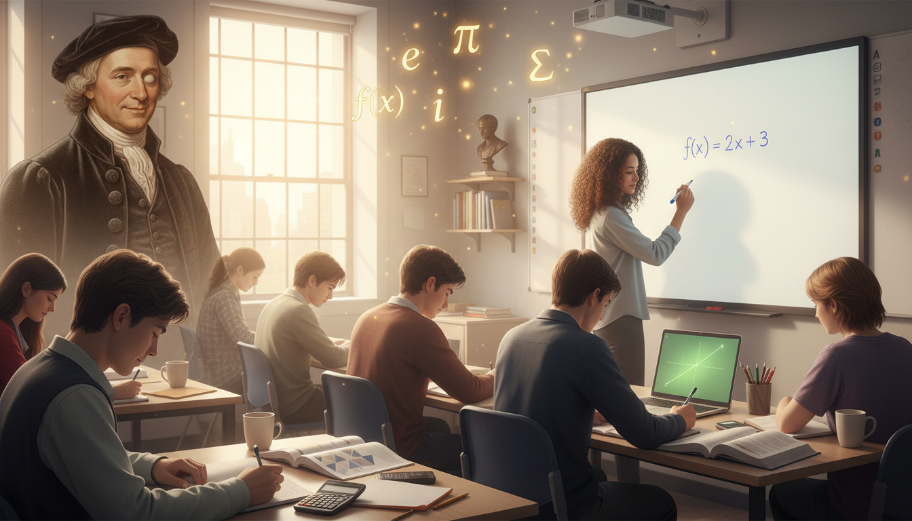

Image Prompt

Please generate a 16:9 image in Enlightenment classical style blended with modern photorealism depicting panel 12 of 12. Make the style consistent with the prior panels. The scene shows a modern IB mathematics classroom where a diverse group of teenage students are writing f(x) = 2x + 3 on a whiteboard and in their notebooks. A translucent ghostly Euler in his dark coat and velvet cap smiles gently from the corner of the room, one clouded eye barely visible. Floating softly above the students are glowing symbols: f(x), e, π, i, Σ. Color palette: modern classroom daylight, warm sepia for Euler, marker blue and black, golden symbols. Emotional tone: gratitude, continuity, quiet reverence. Include an open IB math textbook, a laptop showing a function graph, a calculator, a coffee mug, sunlight through large classroom windows, and a small bronze bust of Euler on a shelf. Generate the image immediately without asking clarifying questions.

Every time you write $f(x)$ on a homework problem, every time you use $e$, $\pi$, $i$, or $\Sigma$, you are using notation Euler either invented or fixed in place through sheer force of publication. He did not just advance mathematics — he gave it the vocabulary it still speaks in today. A blind Swiss pastor's son turned out to be the most productive mathematician in human history.

### Epilogue – What Made Euler Different?

Euler's secret was not that he was smarter than everyone else — though he probably was — but that he kept working, kept sharing, and kept making things simpler. He believed mathematics should be a language that anyone willing to learn could read. Blindness did not stop him. A rude king did not stop him. Thirteen children did not stop him. The mathematics we use today is the mathematics he decided to hand us in the cleanest form he could manage.

| Challenge | How Euler Responded | Lesson for Today |
|-----------|----------------------|------------------|
| Losing sight in one eye | Joked and kept publishing | Your body is not your mind |
| Complete blindness at 64 | Dictated papers from memory | Adaptation beats retirement |
| A home full of noisy children | Worked with them on his lap | Genius can live inside ordinary life |
| Overwhelming volume of discoveries | Gave each idea a clean symbol | Good notation is the final 10% that matters most |

### Call to Action

Open your notebook right now, write the letters $f(x)$, and notice how automatic it feels. That automatic feeling is Euler's real gift to you — he smoothed out the language of mathematics so thoroughly that you never had to wrestle with clunky symbols the way his teachers did. Use that gift well.

---

*"Logic is the foundation of the certainty of all the knowledge we acquire."*
—Leonhard Euler

*"Mathematicians have tried in vain to discover some order in the sequence of prime numbers, and we have reason to believe that it is a mystery into which the human mind will never penetrate."*
—Leonhard Euler

---

## References

1. [MacTutor: Leonhard Euler](PLACEHOLDER) - University of St Andrews biography
2. [Euler: The Master of Us All by William Dunham](PLACEHOLDER) - Mathematical Association of America, 1999
3. [Introductio in analysin infinitorum (1748)](PLACEHOLDER) - Euler's textbook introducing f(x) notation
4. [Letters to a German Princess](PLACEHOLDER) - Euler's popular science letters, English translation
5. [The Euler Archive](PLACEHOLDER) - Digital archive of Euler's complete works at eulerarchive.maa.org
