# Maryam Mirzakhani: The Invisible Architect

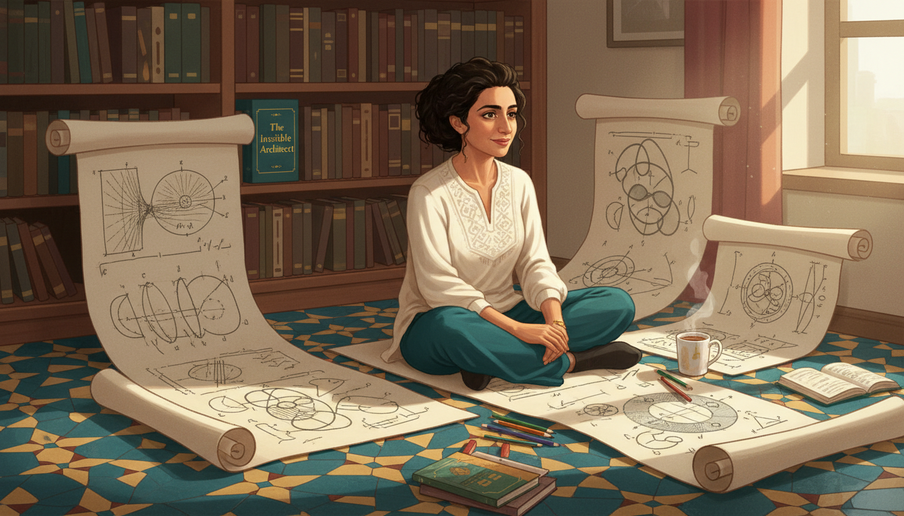

Cover Image Prompt

Please generate a wide-landscape 16:9 cover image in contemporary academic illustration style with a warm Persian-inspired palette, depicting Maryam Mirzakhani seated on the floor surrounded by enormous sheets of paper covered in hand-drawn curves, geodesics on hyperbolic surfaces, and topological shapes. Include the title text "The Invisible Architect" rendered in an elegant modern serif typeface with subtle Persian calligraphic influences. Color palette: deep teal, saffron gold, pomegranate red, ivory, soft lapis blue. Emotional tone: contemplative, luminous, quietly joyful. Include: a young woman with dark hair and thoughtful eyes, scattered colored pencils, geometric doodles of donut shapes and pretzels, a mug of tea, soft afternoon light, a bookshelf, tiled floor patterns echoing Iranian tile art. Generate the image immediately without asking clarifying questions.

Narrative Prompt

This graphic novel tells the story of Maryam Mirzakhani (1977-2017), the Iranian-American mathematician who became the first woman and first Iranian to win the Fields Medal in 2014. She grew up in Tehran during the Iran-Iraq war, won gold at the International Mathematical Olympiad twice, earned a PhD at Harvard, and made groundbreaking contributions to the dynamics and geometry of curved surfaces. The visual style should blend contemporary academic imagery with warm Persian-inspired tones and tile-inspired patterns. Themes: curiosity as identity, the beauty of slow thinking, women in mathematics, the unity of art and proof. Write for IB Diploma students.

### Prologue – The Girl Who Wanted to Be a Novelist

In a quiet Tehran apartment in the 1980s, a little girl named Maryam makes up stories about imaginary friends and invents their adventures. She wants to be a writer. She has no idea that one day she will tell the most beautiful stories of all - stories about curves, surfaces, and the secret shapes of space itself.

## Panel 1: A Childhood in Tehran

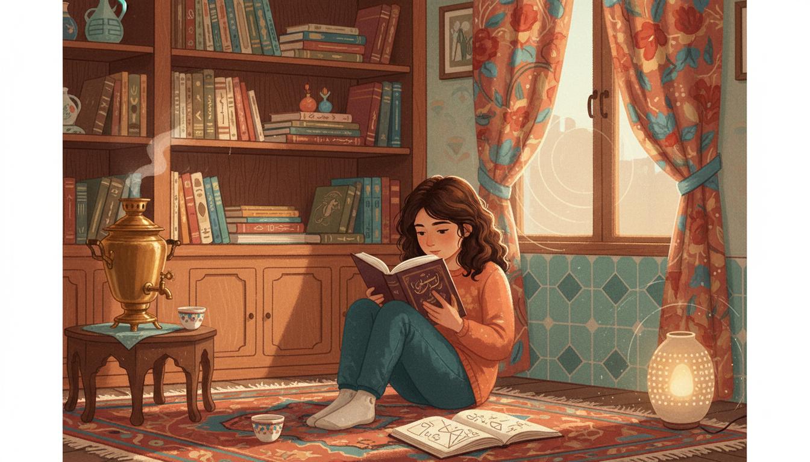

Image Prompt

I am about to ask you to generate a series of images for a graphic novel. Please make the images have a consistent style and consistent characters. Do not ask any clarifying questions. Just generate the image immediately when asked.

Please generate a 16:9 image in contemporary academic illustration style with warm Persian-inspired palette depicting panel 1 of 12. The scene should include a young Maryam Mirzakhani, around age eight, reading a novel in a cozy Tehran apartment in 1985 while the sounds of the Iran-Iraq war echo faintly outside. Color palette: warm saffron, terracotta, soft teal, pomegranate red, cream. The emotional tone should be quiet innocence and imagination. Include: a child curled up on a Persian rug, bookshelves full of Persian literature, a samovar, a window with curtains drawn, a sketchbook beside her, a tea cup, geometric tile patterns on the walls, a soft lamp. Generate the image immediately without asking clarifying questions.

Maryam is born in Tehran in 1977, two years before the Islamic Revolution. Her early childhood unfolds against the backdrop of the Iran-Iraq war. She loves reading novels, making up characters, and drawing. Mathematics is the last thing on her mind.

## Panel 2: Farzanegan School and a Spark

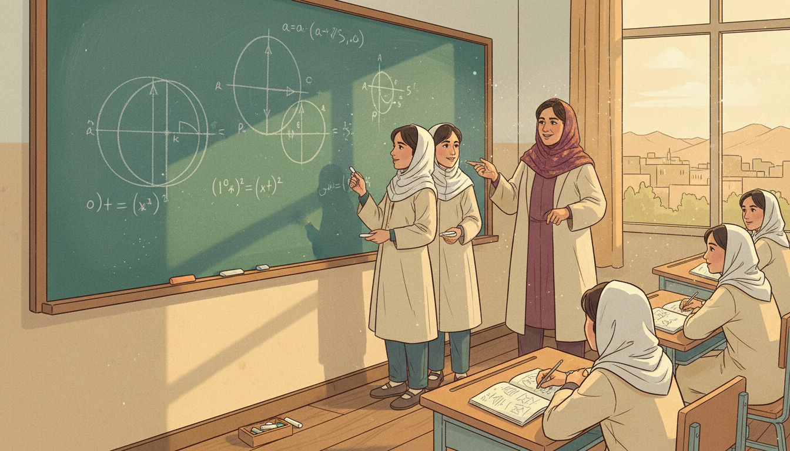

Image Prompt

I am about to ask you to generate a series of images for a graphic novel. Please make the images have a consistent style and consistent characters. Do not ask any clarifying questions. Just generate the image immediately when asked.

Please generate a 16:9 image in contemporary academic illustration style with warm Persian-inspired palette depicting panel 2 of 12. The scene should include Maryam as a middle school student at the Farzanegan School for gifted girls in Tehran, early 1990s, working with a classmate on a challenging geometry problem on a chalkboard. Color palette: chalky teal, warm ochre, cream uniforms, soft burgundy. The emotional tone should be collaborative curiosity and awakening. Include: geometry diagrams with circles and tangent lines, a female teacher in a patterned headscarf, attentive classmates, a simple wooden desk, a window with distant view of Tehran rooftops, notebooks, the chalk dust. Generate the image immediately without asking clarifying questions.

At Farzanegan, a school for gifted girls, Maryam meets her lifelong best friend Roya Beheshti. Their math teacher believes girls can do anything boys can do. Together Maryam and Roya discover they love wrestling with hard problems for days at a time. A new kind of story begins to interest her: the story a proof tells.

## Panel 3: Gold at the Olympiad

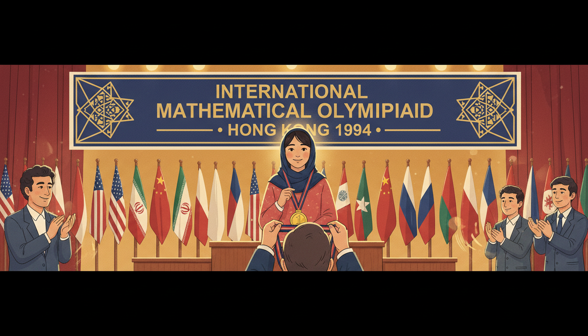

Image Prompt

I am about to ask you to generate a series of images for a graphic novel. Please make the images have a consistent style and consistent characters. Do not ask any clarifying questions. Just generate the image immediately when asked.

Please generate a 16:9 image in contemporary academic illustration style with warm Persian-inspired palette depicting panel 3 of 12. The scene should include teenage Maryam Mirzakhani standing on the podium at the International Mathematical Olympiad in Hong Kong, 1994, receiving a gold medal, smiling shyly. Color palette: gold, crimson, navy, warm ivory. The emotional tone should be quiet triumph and global stage. Include: flags of many countries, other young mathematicians in the background, a medal on a ribbon, a formal Olympiad banner, a proud team coach, stage lights, applause visualized as motion. Generate the image immediately without asking clarifying questions.

In 1994, at age seventeen, Maryam wins a gold medal at the International Mathematical Olympiad in Hong Kong. In 1995, she wins again, this time with a perfect score. She becomes the first Iranian girl to reach such heights in international mathematics. The world is starting to pay attention.

## Panel 4: Sharif University and Big Questions

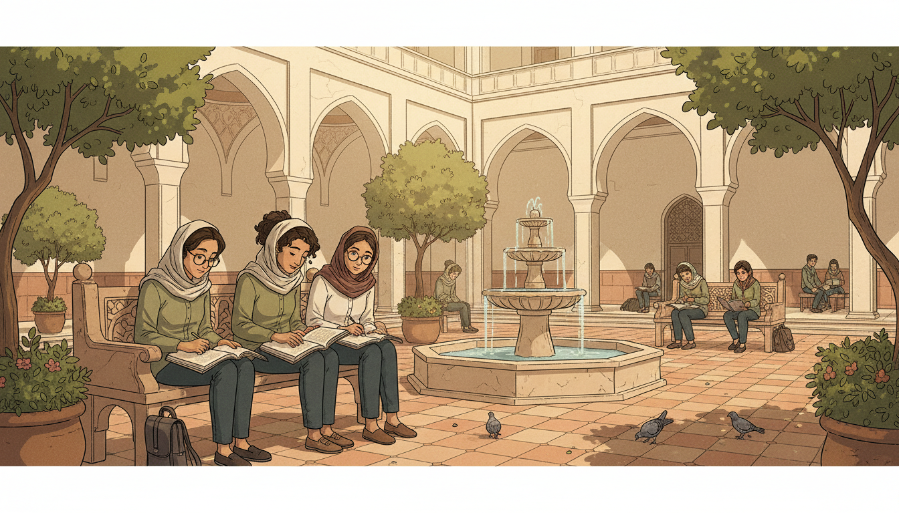

Image Prompt

I am about to ask you to generate a series of images for a graphic novel. Please make the images have a consistent style and consistent characters. Do not ask any clarifying questions. Just generate the image immediately when asked.

Please generate a 16:9 image in contemporary academic illustration style with warm Persian-inspired palette depicting panel 4 of 12. The scene should include Maryam as an undergraduate at Sharif University of Technology in Tehran, late 1990s, studying in a sunlit courtyard with friends, a math textbook open on her lap. Color palette: soft olive, cream stone, terracotta tile, warm sunlight. The emotional tone should be intellectual community and growth. Include: a leafy courtyard, traditional Persian architecture with arches, students in campus attire, Roya Beheshti nearby, a fountain, notebooks with hyperbolic curves sketched, pigeons, stone tilework. Generate the image immediately without asking clarifying questions.

Maryam studies mathematics at Sharif University of Technology, Iran's top engineering school. She publishes her first research papers as an undergraduate. Her classmates later remember her as patient, generous, and almost incapable of working on anything small.

## Panel 5: Harvard and a New World

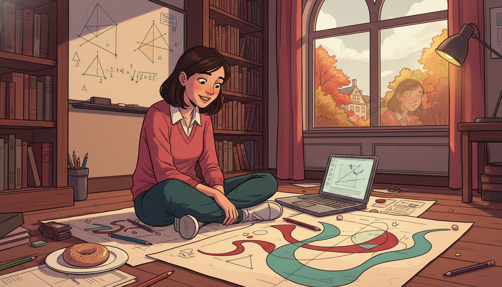

Image Prompt

I am about to ask you to generate a series of images for a graphic novel. Please make the images have a consistent style and consistent characters. Do not ask any clarifying questions. Just generate the image immediately when asked.

Please generate a 16:9 image in contemporary academic illustration style with warm Persian-inspired palette depicting panel 5 of 12. The scene should include Maryam as a PhD student at Harvard University in 2000, sitting on the floor of her office with enormous sheets of paper spread around her, drawing curves on hyperbolic surfaces. Color palette: deep academic crimson, cream paper, warm lamp yellow, soft teal. The emotional tone should be wide-eyed focus and joy of discovery. Include: scattered pencils, a bagel on a plate, an open laptop, a whiteboard with hyperbolic triangle sketches, bookshelves, a window showing Cambridge in autumn, her own reflection in the window faint. Generate the image immediately without asking clarifying questions.

In 2000 Maryam moves to Harvard for her PhD under Curtis McMullen. She becomes famous among her peers for working on the floor, covering huge sheets of paper with doodles. Her daughter later says it looked like she was painting. In truth she was thinking about geodesics on curved surfaces.

## Panel 6: Surfaces That Curve Like Saddles

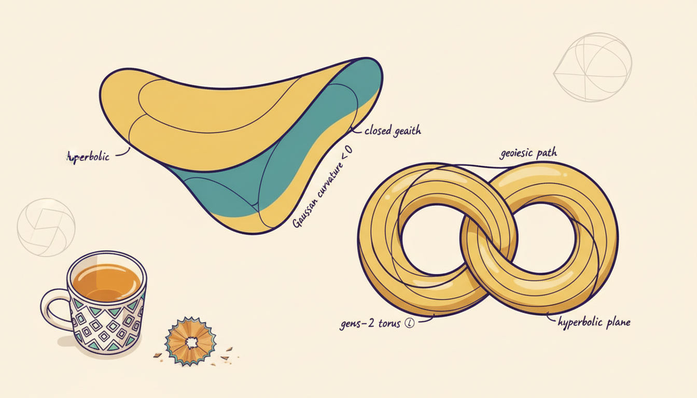

Image Prompt

I am about to ask you to generate a series of images for a graphic novel. Please make the images have a consistent style and consistent characters. Do not ask any clarifying questions. Just generate the image immediately when asked.

Please generate a 16:9 image in contemporary academic illustration style with warm Persian-inspired palette depicting panel 6 of 12. The scene should include a close-up illustrated view of hyperbolic surfaces - saddle shapes, donut-shaped tori with handles, and curves winding around them - rendered like pages from Maryam's notebook. Color palette: ivory paper, indigo ink, saffron highlights, teal shading. The emotional tone should be mathematical wonder. Include: a saddle-shaped surface, a two-holed pretzel surface, geodesic lines wrapping around the handles, Maryam's neat handwriting labeling things like "closed geodesic," a small mug of tea, pencil shavings. Generate the image immediately without asking clarifying questions.

Maryam becomes fascinated with surfaces that curve like saddles - the hyperbolic surfaces. On such a surface you can draw closed loops called geodesics that return to their starting point. How many short geodesic loops exist on a surface of a given complexity? Nobody knew. Maryam set out to count them.

## Panel 7: Counting the Uncountable

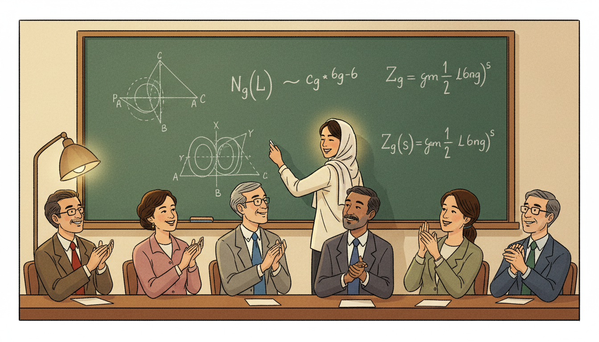

Image Prompt

I am about to ask you to generate a series of images for a graphic novel. Please make the images have a consistent style and consistent characters. Do not ask any clarifying questions. Just generate the image immediately when asked.

Please generate a 16:9 image in contemporary academic illustration style with warm Persian-inspired palette depicting panel 7 of 12. The scene should include Maryam presenting her thesis result at a blackboard in 2004, writing a formula that connects the number of closed geodesics on a hyperbolic surface to a polynomial-like function of length. Color palette: chalkboard green, white chalk, warm golden lamp, soft cream walls. The emotional tone should be triumphant clarity. Include: an equation showing a counting function growing like L to some power, diagrams of handled surfaces, a faculty audience in a seminar room, Maryam in a simple blouse and headscarf, admiring nods from the audience. Generate the image immediately without asking clarifying questions.

In her 2004 PhD thesis, Maryam proves that the number of short closed geodesics on a hyperbolic surface grows like a polynomial function of the length. This might sound technical, but it is the kind of precise answer mathematicians had been chasing for decades. Her thesis alone produces three papers in top journals.

## Panel 8: Billiards and Moduli Spaces

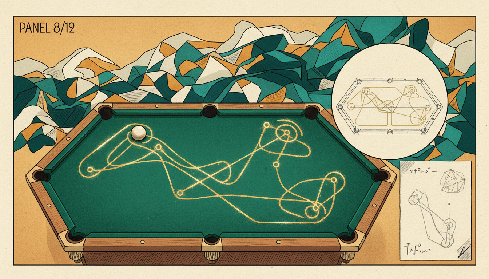

Image Prompt

I am about to ask you to generate a series of images for a graphic novel. Please make the images have a consistent style and consistent characters. Do not ask any clarifying questions. Just generate the image immediately when asked.

Please generate a 16:9 image in contemporary academic illustration style with warm Persian-inspired palette depicting panel 8 of 12. The scene should include a conceptual scene of a billiard ball bouncing endlessly inside a polygon, with the abstract "moduli space" of all possible surfaces visualized as a glowing landscape of connected shapes behind it. Color palette: velvet green billiard cloth, warm gold, deep teal, ivory, saffron sparkle. The emotional tone should be playful profundity. Include: a polygonal billiard table, a bouncing ball tracing a path, a diagram of unfolding the polygon into a flat surface, ghostly glowing surfaces floating behind, a pencil sketch beside the table. Generate the image immediately without asking clarifying questions.

Maryam's work moves beyond surfaces to the space of all possible surfaces - what mathematicians call moduli space. She uses simple questions about billiard balls bouncing inside polygons as a doorway into this vast abstract world. Everyday physics becomes a lens for seeing higher dimensions.

## Panel 9: Stanford and the Slow-Thinking Revolution

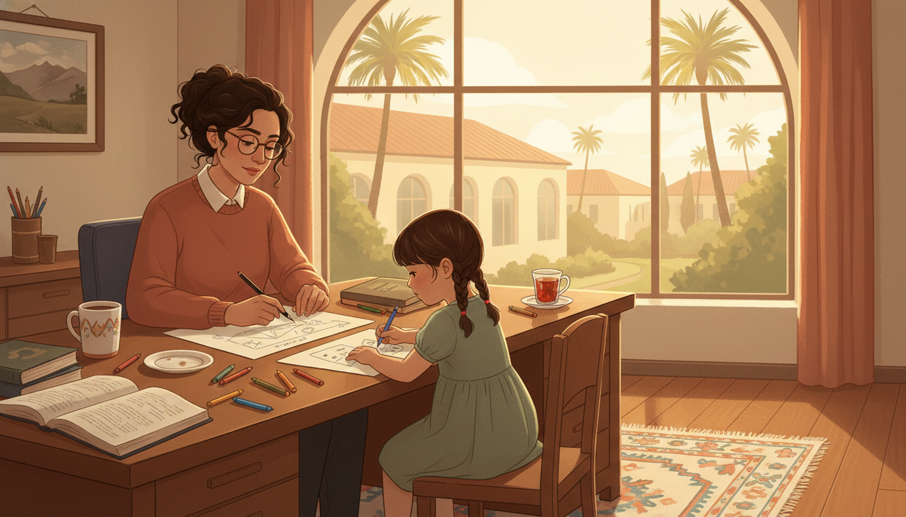

Image Prompt

I am about to ask you to generate a series of images for a graphic novel. Please make the images have a consistent style and consistent characters. Do not ask any clarifying questions. Just generate the image immediately when asked.

Please generate a 16:9 image in contemporary academic illustration style with warm Persian-inspired palette depicting panel 9 of 12. The scene should include Maryam in her Stanford University office around 2012, working slowly and calmly with her young daughter Anahita nearby drawing on paper. Color palette: warm California light, terracotta, sage green, cream, soft gold. The emotional tone should be tender balance and unhurried thought. Include: a large window overlooking Stanford's palm trees, a shared desk covered in diagrams, crayons, a mug, a mother and daughter working side by side, a framed picture of Iran on the wall, a small rug, a cup of Persian tea. Generate the image immediately without asking clarifying questions.

Maryam joins Stanford University in 2008 and becomes a full professor. She works slowly - sometimes spending years on a single question - and describes her own mathematics as "like being lost in a jungle and trying to use all the knowledge that you can gather." Her daughter, Anahita, often draws beside her.

## Panel 10: The Fields Medal

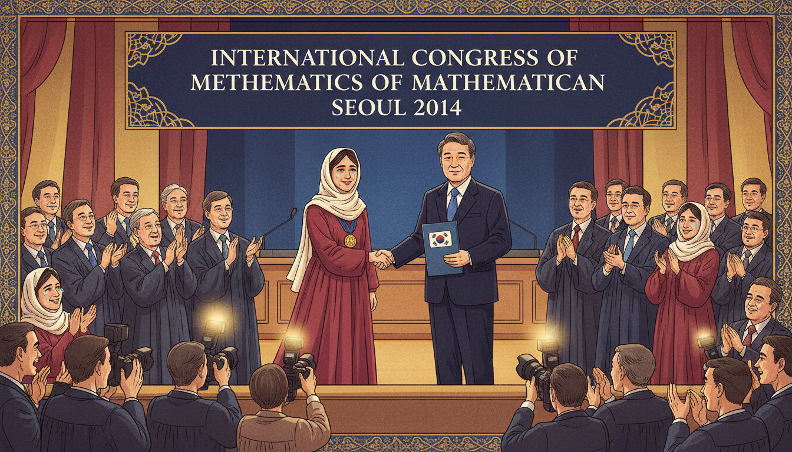

Image Prompt

I am about to ask you to generate a series of images for a graphic novel. Please make the images have a consistent style and consistent characters. Do not ask any clarifying questions. Just generate the image immediately when asked.

Please generate a 16:9 image in contemporary academic illustration style with warm Persian-inspired palette depicting panel 10 of 12. The scene should include Maryam Mirzakhani on stage at the International Congress of Mathematicians in Seoul, August 2014, receiving the Fields Medal from the President of South Korea - the first woman ever to do so. Color palette: gold, crimson, deep navy blue, ivory, warm stage light. The emotional tone should be historic pride and quiet humility. Include: the Fields Medal on its ribbon, a large ICM banner, applauding mathematicians, Maryam in a simple elegant outfit and headscarf, photographers, the blue of the South Korean flag, joyful tears in the audience. Generate the image immediately without asking clarifying questions.

In August 2014, in Seoul, Maryam Mirzakhani becomes the first woman and the first Iranian to win the Fields Medal - mathematics' highest honor. Girls across Iran and the world see a future that suddenly feels possible. She accepts the medal with quiet grace and calls it a recognition of many people's work.

## Panel 11: Illness and Light

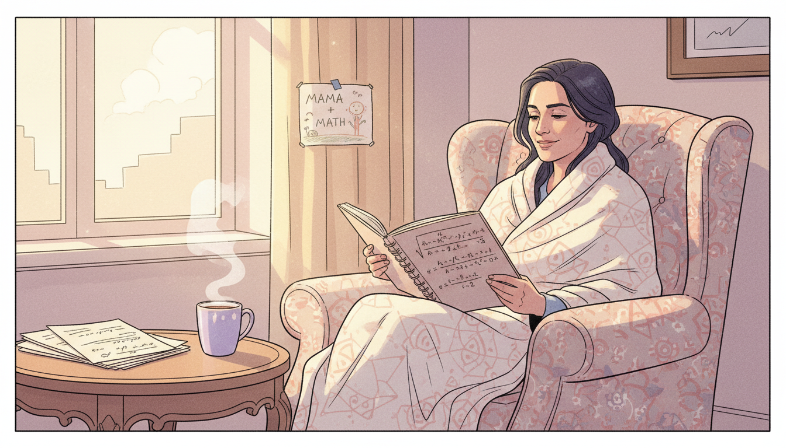

Image Prompt

I am about to ask you to generate a series of images for a graphic novel. Please make the images have a consistent style and consistent characters. Do not ask any clarifying questions. Just generate the image immediately when asked.

Please generate a 16:9 image in contemporary academic illustration style with warm Persian-inspired palette depicting panel 11 of 12. The scene should include Maryam at home in 2016, continuing her mathematics while ill with cancer, light streaming through a window onto pages of equations beside her. Color palette: soft lavender, pale gold, cream, muted rose. The emotional tone should be gentle courage and luminous spirit. Include: a cozy armchair, a blanket, a stack of math papers, a cup of tea, a window with soft sunlight, her daughter's drawing taped nearby, a notebook open to hyperbolic geometry, a peaceful smile. Generate the image immediately without asking clarifying questions.

In 2013 Maryam is diagnosed with cancer. Even as her health declines, she continues to work and to mentor students. Those who visit her describe her as radiant, still excited by mathematics, still asking new questions. In July 2017, at age forty, she passes away in Palo Alto.

## Panel 12: A New Generation

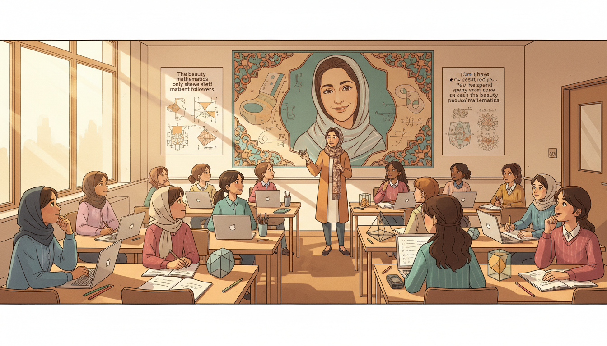

Image Prompt

I am about to ask you to generate a series of images for a graphic novel. Please make the images have a consistent style and consistent characters. Do not ask any clarifying questions. Just generate the image immediately when asked.

Please generate a 16:9 image in contemporary academic illustration style with warm Persian-inspired palette depicting panel 12 of 12. The scene should include a modern classroom filled with girls of diverse backgrounds working on mathematics problems, with a portrait of Maryam Mirzakhani on the wall and her theorems illustrated around it. Color palette: warm gold, saffron, soft teal, ivory, cream. The emotional tone should be inspired hope and continuity. Include: girls in various clothing including some in headscarves, laptops and notebooks, a teacher gesturing at a diagram of a hyperbolic surface, posters of her quotes, sunlight through a window, pencils and geometric models on the desks. Generate the image immediately without asking clarifying questions.

Maryam Mirzakhani lives on in every classroom where a student is told, "yes, you can." The International Day of Mathematics is now celebrated on May 12 in her honor. Her theorems about curves, surfaces, and moduli space still shape entire fields of research - and her story still shapes dreams.

### Epilogue – What Made Mirzakhani Different?

Maryam's gift was not speed. It was depth and patience. She treated hard problems like long conversations and returned to them day after day until the landscape became familiar. She also refused to be placed in a box - as a woman, as an Iranian, as a mathematician - and in doing so opened doors for everyone who came after her.

| Challenge | How Mirzakhani Responded | Lesson for Today |
|-----------|---------------------------|------------------|
| Grew up during war and revolution | Found refuge in stories and then in math | Imagination is portable |
| Few female role models in math | Became one herself | Representation starts with showing up |
| Problems took years to solve | Worked slowly and joyfully | Deep thinking is a superpower |
| Felt lost in abstract landscapes | Drew pictures and kept walking | Visualize the unknown |
| Illness at the height of her career | Kept creating and mentoring | Meaning outlasts circumstance |

### Call to Action

Pick a math problem you do not understand yet and sit with it for an hour. Draw it. Doodle around it. Let it be messy. That hour is exactly what Maryam Mirzakhani did, every day, for twenty years. You already have her most important tool: a curious mind willing to be patient.

---

*"The beauty of mathematics only shows itself to more patient followers."*
—Maryam Mirzakhani

*"I don't have any particular recipe. It is the reason why doing research is challenging as well as attractive. It is like being lost in a jungle and trying to use all the knowledge that you can gather to come up with some new tricks."*
—Maryam Mirzakhani

---

## References

1. [Wikipedia: Maryam Mirzakhani](https://en.wikipedia.org/wiki/Maryam_Mirzakhani) - Biography of the Iranian mathematician (1977–2017)
2. [Wikipedia: Fields Medal](https://en.wikipedia.org/wiki/Fields_Medal) - The top prize in mathematics, which Mirzakhani won in 2014
3. [Wikipedia: Moduli space](https://en.wikipedia.org/wiki/Moduli_space) - The geometry of Riemann surfaces Mirzakhani studied
4. [MacTutor: Maryam Mirzakhani](https://mathshistory.st-andrews.ac.uk/Biographies/Mirzakhani/) - University of St Andrews history of mathematics archive
5. [Stanford News: Maryam Mirzakhani obituary](https://news.stanford.edu/2017/07/15/maryam-mirzakhani-stanford-mathematician-and-fields-medal-winner-dies/) - Stanford University obituary and career retrospective
