# René Descartes: The Language of Change

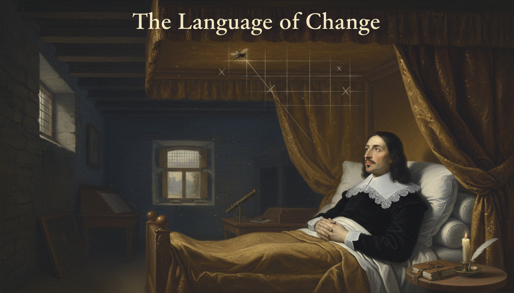

Cover Image Prompt

Please generate a wide-landscape 16:9 cover image in a Dutch Golden Age Baroque painting style depicting René Descartes in 1637, a pale, slender French philosopher with shoulder-length dark hair, a neatly trimmed mustache, and a wide white lace collar over a black doublet, reclining in a curtained four-poster bed in a candlelit stone-walled chamber, gazing upward at a fly crawling across a shadowy wooden-beamed ceiling where faint glowing grid lines are beginning to materialize like chalk drawn on air. Include the title text "The Language of Change" rendered in a period-appropriate engraved serif typeface at the top of the image. Color palette: deep umber, candle gold, ivory, slate gray, midnight blue. Emotional tone: quiet, contemplative, on the edge of discovery. Dramatic chiaroscuro lighting from a single beeswax candle, a leather-bound notebook and quill on the bedside table, dust motes suspended in the golden light, a small telescope on a nearby desk, and subtle ghostly x- and y-axes glowing faintly across the ceiling. Generate the image immediately without asking clarifying questions.

Narrative Prompt

This is a 12-panel graphic novel about René Descartes (1596–1650), the French philosopher and mathematician who invented the Cartesian coordinate system and, with it, the bridge between algebra and geometry. The story is set across France, the Netherlands, and Sweden in the early 17th century during the early Scientific Revolution. Key themes are curiosity, illness turned to insight, the power of unifying two fields, and the courage to publish bold ideas. Keep the character design consistent across panels: Descartes has pale skin, dark shoulder-length hair, a thin mustache, a white lace collar, and a black doublet. Settings should feel candlelit, scholarly, and intimate, with period-accurate 17th-century European details.

### Prologue – The Fly on the Ceiling

Before Descartes, algebra and geometry lived in separate rooms of the mathematical house. Equations were strings of symbols, and shapes were drawings in the sand — and nobody quite knew how to get from one to the other. Then a sickly French soldier-turned-philosopher, stuck in bed on a cold morning, noticed a fly walking across his ceiling. That small observation became one of the most consequential ideas in the history of mathematics.

## Panel 1: A Restless Childhood in La Haye

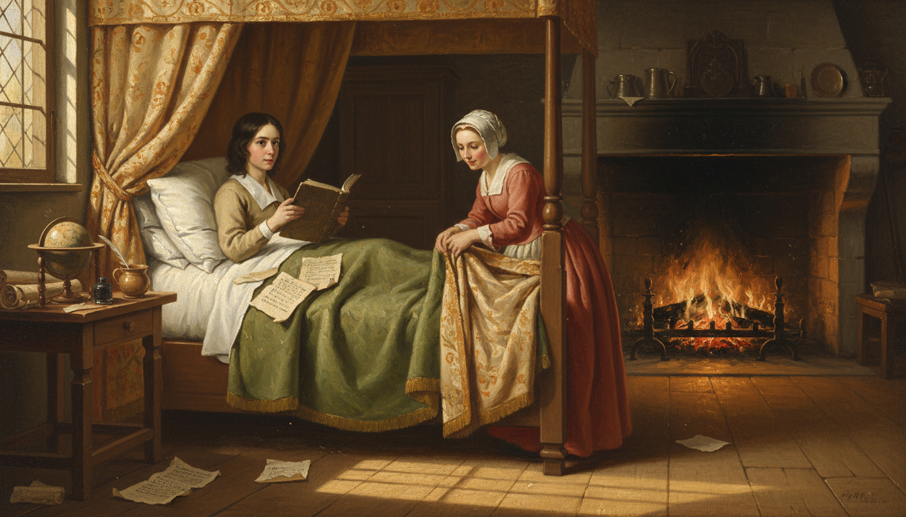

Image Prompt

I am about to ask you to generate a series of images for a graphic novel. Please make the images have a consistent style and consistent characters. Do not ask any clarifying questions. Just generate the image immediately when asked.

Please generate a 16:9 image in Dutch Golden Age Baroque style depicting panel 1 of 12. The scene shows a frail pale boy of about eight years old, young René Descartes, with dark shoulder-length hair and large curious eyes, sitting up in a canopied bed in a stone-walled French country house in La Haye en Touraine in 1604, reading a leather-bound Latin book by morning light streaming through a leaded-glass window. A kind-faced wet nurse in a linen cap adjusts his woolen blanket nearby. Color palette: warm ochre, cream, forest green, soft rose. Emotional tone: tender, studious, delicate. Include a wooden globe on a side table, a pewter cup of broth, a flickering fireplace in the background, scattered parchment sheets on the bed, sunlight casting long golden bars across the floor, and a quill resting in an inkwell. Generate the image immediately without asking clarifying questions.

René was born in 1596 in the small French town of La Haye, and by all accounts he was a sickly child who spent many mornings in bed. His father, a minor nobleman, allowed him to sleep late and read whatever he wanted — a habit René kept for the rest of his life. Those quiet morning hours of thinking in bed would turn out to be the most productive hours of his entire career.

## Panel 2: The Jesuit College of La Flèche

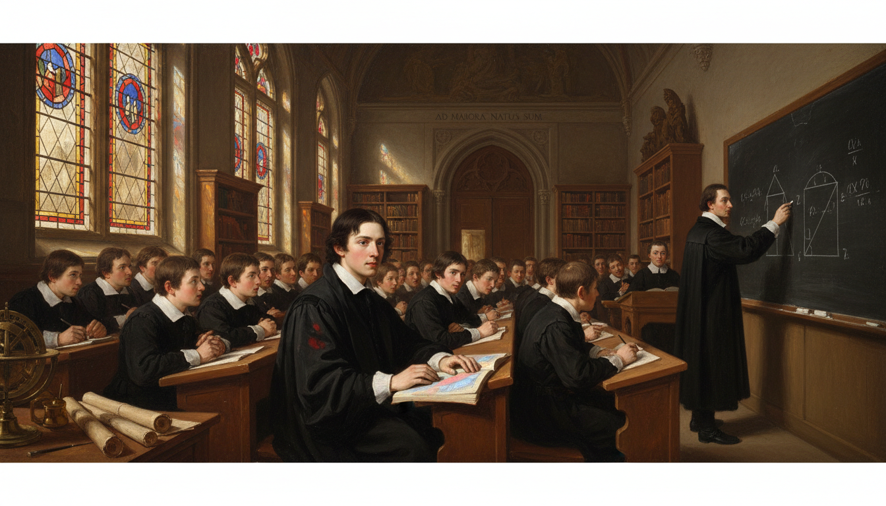

Image Prompt

Please generate a 16:9 image in Dutch Golden Age Baroque style depicting panel 2 of 12. Make the characters and style consistent with the prior panel. The scene shows a teenage René Descartes, pale with dark hair and a black scholar's robe, sitting among a classroom of uniformed boys in the grand hall of the Jesuit College of La Flèche in 1610. A tall Jesuit priest in a black cassock writes Euclidean geometry proofs on a slate board at the front. Sunlight streams through tall Gothic arched windows onto polished wooden benches. Color palette: deep charcoal, parchment, stained-glass blues and reds, warm wood. Emotional tone: disciplined, curious, awakening. Include rows of leather-bound books on shelves, a brass astrolabe on a desk, a Latin inscription carved above the doorway, ink-stained fingers, other students whispering, and a single shaft of colored light from a stained-glass window falling onto René's open notebook. Generate the image immediately without asking clarifying questions.

At age ten René was sent to the Jesuit College of La Flèche, one of the finest schools in Europe, where he soaked up Latin, logic, and especially Euclidean geometry. He loved the certainty of geometric proof — the way one line of reasoning locked into the next with no room for doubt. But he also noticed that algebra and geometry were taught as if they had nothing to do with each other, and that bothered him deeply.

## Panel 3: A Soldier's Dream in Germany

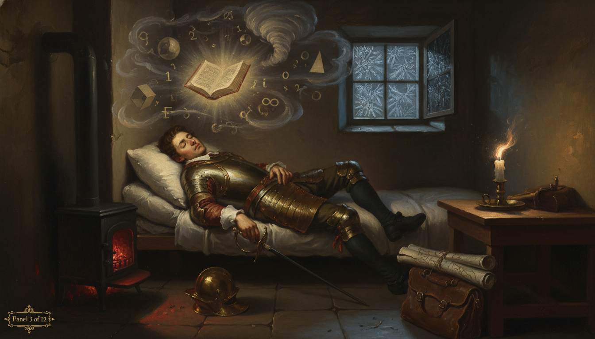

Image Prompt

Please generate a 16:9 image in Dutch Golden Age Baroque style depicting panel 3 of 12. Make the characters and style consistent with the prior panel. The scene shows a young-adult René Descartes, age 23, in a soldier's leather buff coat and breastplate with a sheathed rapier, sleeping restlessly in a small heated stove-room in Neuburg, Bavaria, on the night of November 10, 1619. Swirling dream imagery drifts above him: floating geometric shapes, numbers, a whirlwind, and a mysterious glowing book. A small iron stove glows red in the corner. Color palette: ember red, shadow black, cold blue moonlight, brass. Emotional tone: visionary, uneasy, electric with revelation. Include frost on a small window, a fallen helmet on the floor, a candle guttering low, a leather satchel with rolled maps, the faint outline of dream-symbols in the air like smoke, and dramatic chiaroscuro lighting. Generate the image immediately without asking clarifying questions.

As a young man Descartes joined the army of Prince Maurice of Nassau and later the Duke of Bavaria, not to fight but to travel and think. On a freezing November night in 1619, holed up in a warm stove-heated room in Germany, he had three vivid dreams that convinced him his life's mission was to unify all of knowledge through mathematics. He walked out of that room a philosopher, not a soldier.

## Panel 4: The Fly on the Ceiling

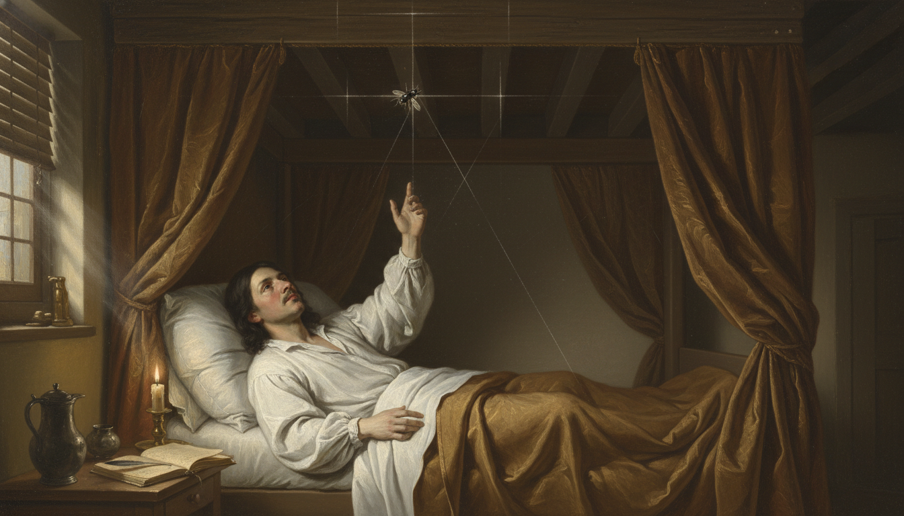

Image Prompt

Please generate a 16:9 image in Dutch Golden Age Baroque style depicting panel 4 of 12. Make the characters and style consistent with the prior panel. The scene shows an adult René Descartes, pale with dark shoulder-length hair, thin mustache, and a loose white linen nightshirt, lying on his back in a curtained bed in his Dutch home in the 1620s, staring intently upward at a small black housefly crawling across a wooden-beamed ceiling. Faint chalk-like glowing lines radiate outward from the fly forming a subtle grid, with a vertical and horizontal axis materializing in the air. Color palette: candle gold, deep umber, parchment cream, soft charcoal. Emotional tone: the quiet electric moment of a great idea forming. Include a beeswax candle on a nightstand, an open notebook with a quill laid across it, morning light just beginning to break through shuttered windows, dust motes floating in the light, a pewter pitcher, and Descartes's right hand reaching upward as if tracing the fly's path. Generate the image immediately without asking clarifying questions.

The most famous story about Descartes may or may not be literally true, but it captures his thinking perfectly. Lying in bed one morning, he watched a fly move across the ceiling and realized he could describe its position at any moment with just two numbers — its distance from one wall and its distance from another. That was the seed of the coordinate system: any point in a plane could be pinned down by an ordered pair $(x, y)$.

## Panel 5: Algebra Meets Geometry

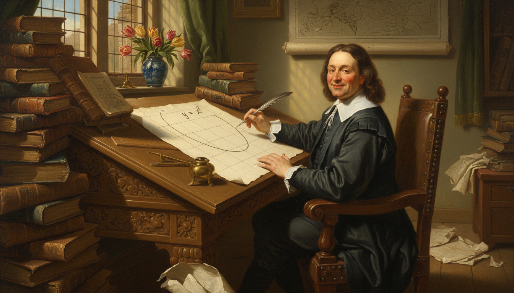

Image Prompt

Please generate a 16:9 image in Dutch Golden Age Baroque style depicting panel 5 of 12. Make the characters and style consistent with the prior panel. The scene shows Descartes seated at a heavy oak writing desk in a sunlit study in the Netherlands, quill in hand, drawing a large clean coordinate grid on a sheet of parchment with a parabola curving gracefully through it and the equation y = x squared written beside it in period handwriting. Stacks of Euclid's Elements and algebra texts in Latin surround him. Color palette: warm oak, parchment ivory, ink black, muted green drapery, brass. Emotional tone: focused joy, creative breakthrough. Include a brass drafting compass, a ruler, a pewter inkwell, tulips in a delft vase by the window, a wall map of Europe, crumpled draft pages on the floor, and morning light pouring in from a tall mullioned window onto the parchment. Generate the image immediately without asking clarifying questions.

With coordinates in hand, Descartes could do something nobody had ever done cleanly before: turn a geometric curve into an algebraic equation, and turn an algebraic equation into a curve. A circle became $x^2 + y^2 = r^2$. A line became $y = mx + c$. Two ancient branches of mathematics suddenly spoke the same language.

## Panel 6: Exile in the Dutch Republic

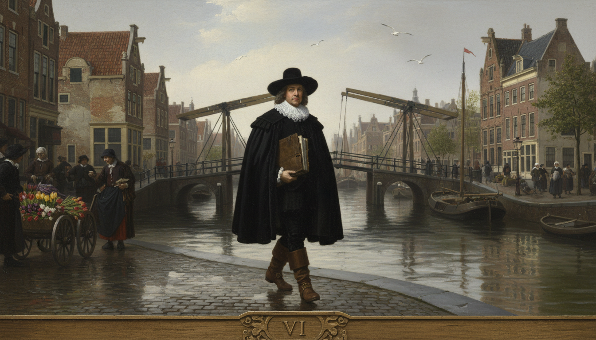

Image Prompt

Please generate a 16:9 image in Dutch Golden Age Baroque style depicting panel 6 of 12. Make the characters and style consistent with the prior panel. The scene shows Descartes walking along a canal in Amsterdam in the 1630s, wearing a black cloak, wide-brimmed black hat, white lace collar, and leather boots, carrying a leather folio of manuscripts under one arm. Tall narrow brick Dutch canal houses with stepped gables line the water, a wooden drawbridge rises in the background, and merchants in Dutch dress hurry past. Color palette: canal slate, brick red, cloud gray, white lace, muted gold. Emotional tone: solitary, free, quietly determined. Include a small sailing barge on the canal, reflections in the water, a flock of gulls, a tulip seller's cart, cobblestones slick with rain, and soft overcast northern light. Generate the image immediately without asking clarifying questions.

To work in peace and avoid the censors of the French Catholic church, Descartes moved to the Dutch Republic, where tolerance for new ideas was unusually high for the 17th century. He lived there for more than twenty years, moving from town to town and guarding his privacy fiercely. It was in this quiet exile that he wrote almost all of his most important work.

## Panel 7: Discourse on the Method, 1637

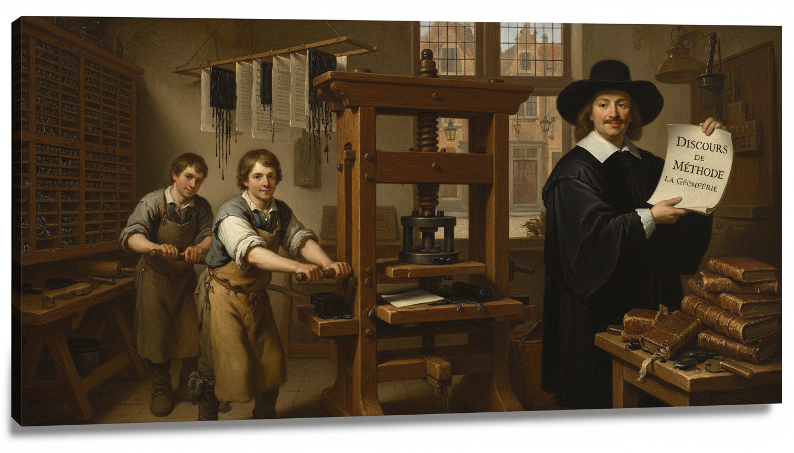

Image Prompt

Please generate a 16:9 image in Dutch Golden Age Baroque style depicting panel 7 of 12. Make the characters and style consistent with the prior panel. The scene shows a 17th-century Dutch printing workshop in Leiden in 1637, with a large wooden Gutenberg-style printing press being operated by two apprentices in leather aprons, while Descartes stands nearby inspecting a freshly printed page of his book "Discours de la méthode" with its appendix "La Géométrie." Color palette: ink black, parchment cream, oak brown, lantern amber. Emotional tone: proud, historic, workmanlike. Include stacked type cases with lead letters, a frame full of wet freshly pulled pages hanging to dry, ink rollers, a pile of bound books on a table, a window looking out onto a cobblestone street, and warm lantern light mixing with daylight. Generate the image immediately without asking clarifying questions.

In 1637 Descartes published his *Discourse on the Method*, and tucked into the back of it was an appendix called *La Géométrie*. That appendix introduced the coordinate system and the algebraic treatment of curves that now bears his name — "Cartesian." He wrote it in French rather than Latin so that educated non-specialists could read it, which was itself a radical choice.

## Panel 8: "I Think, Therefore I Am"

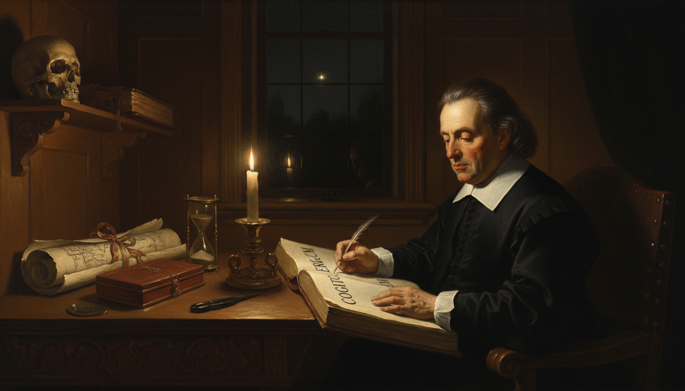

Image Prompt

Please generate a 16:9 image in Dutch Golden Age Baroque style depicting panel 8 of 12. Make the characters and style consistent with the prior panel. The scene shows Descartes alone in a candlelit study at night, pale face half in shadow, writing by candlelight in a leather-bound journal with the Latin phrase "Cogito, ergo sum" visible on the open page. A single beeswax candle in a brass holder provides the only light, throwing dramatic Rembrandt-like shadows across the wood-paneled room. Color palette: deep black, candle gold, warm mahogany, parchment cream. Emotional tone: profound, solitary, philosophical. Include a skull on a shelf as a memento mori, a closed Bible, a brass hourglass, a rolled map, a quill case, and the reflection of the candle flame in a dark windowpane behind him. Generate the image immediately without asking clarifying questions.

Descartes was as much a philosopher as a mathematician, and his line "I think, therefore I am" became one of the most famous sentences ever written. He believed that careful, systematic doubt — stripping away everything you could not be sure of — was the only reliable path to truth. That same mindset is exactly what he brought to mathematics: start from what you know, and build.

## Panel 9: Teaching Queen Christina of Sweden

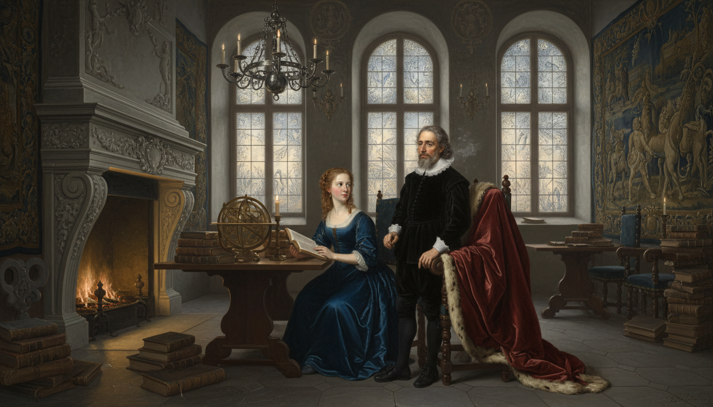

Image Prompt

Please generate a 16:9 image in Dutch Golden Age Baroque style depicting panel 9 of 12. Make the characters and style consistent with the prior panel. The scene shows a predawn winter morning in Stockholm Castle in 1649. Queen Christina of Sweden, a regal young woman with reddish hair in a simple dark dress, sits at a polished table receiving a philosophy lesson from an exhausted Descartes, who stands in his black doublet and lace collar with visible fatigue and shivering slightly. A heavy fur-trimmed cloak hangs over a chair. Color palette: icy blue, pale gold candlelight, wine red, gray stone. Emotional tone: dutiful, bitterly cold, foreboding. Include frost on tall arched windows, a massive marble fireplace with a weak fire, a globe, stacks of books, a silver chandelier, heavy tapestries, and his breath visible in the cold air. Generate the image immediately without asking clarifying questions.

Late in life, Queen Christina of Sweden invited Descartes to Stockholm to serve as her personal philosophy tutor. She insisted on lessons at 5 a.m. in an unheated castle library — brutal hours for a man who had spent his whole life thinking in bed. Within a few months of arriving in the freezing Swedish winter he caught pneumonia.

## Panel 10: A Quiet Death, a Loud Legacy

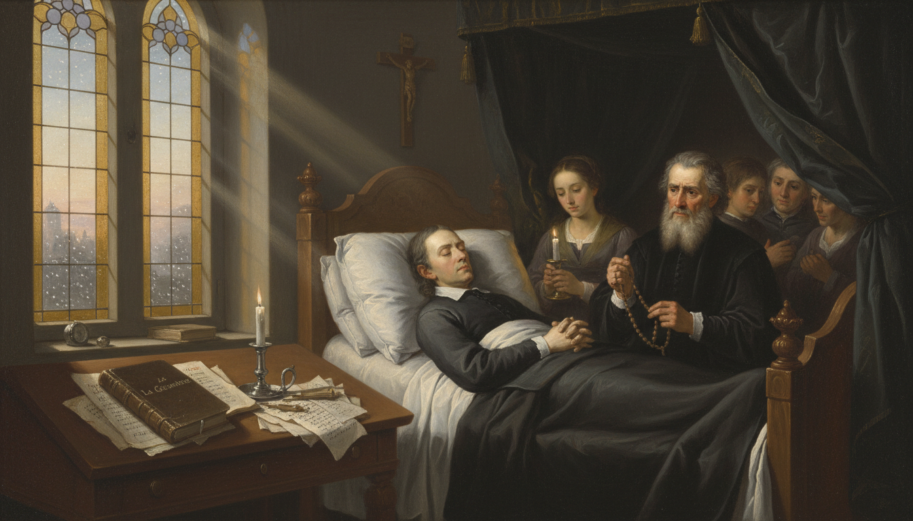

Image Prompt

Please generate a 16:9 image in Dutch Golden Age Baroque style depicting panel 10 of 12. Make the characters and style consistent with the prior panel. The scene shows Descartes on his deathbed in Stockholm in February 1650, pale and peaceful, surrounded by a small group of mourners including a concerned doctor and a servant holding a candle. A stained-glass window throws soft colored light onto a nearby writing desk where his unfinished manuscripts lie. Color palette: muted violet, candle gold, ivory linen, soft slate. Emotional tone: sorrowful, reverent, the passing of a great mind. Include a crucifix on the wall, a single white candle burning, a leather-bound copy of La Géométrie on the desk, falling snow visible through the window, a rosary in the doctor's hand, and gentle diagonal beams of dawn light. Generate the image immediately without asking clarifying questions.

Descartes died in Stockholm in February 1650, only 53 years old. He never saw how far his ideas would travel, but within a generation every serious mathematician in Europe was using his coordinate system. Newton and Leibniz would soon build calculus on top of it.

## Panel 11: Every Graph You Have Ever Drawn

Image Prompt

Please generate a 16:9 image in Dutch Golden Age Baroque style blended with modern classroom photorealism, depicting panel 11 of 12. Make the characters and style consistent with the prior panels. The scene is a split composition: on the left, a ghostly translucent Descartes in his black doublet looks over the shoulder of a modern high school student on the right, a teenager in a hoodie at a desk plotting a parabola on graph paper with a pencil while a laptop beside them shows the same curve in a graphing app. Color palette: warm classroom sunlight, cool digital blue, parchment cream, Descartes in muted sepia tones. Emotional tone: connection across centuries, quiet wonder. Include an open IB math textbook, a coffee cup, a calculator, a ruler, sunlight through a classroom window, and a subtle glowing coordinate grid overlaying the whole scene. Generate the image immediately without asking clarifying questions.

Every graph you have ever drawn in a math class — every parabola, every line, every exponential curve — lives on a Cartesian coordinate plane. When you write $f(x) = x^2$ and then sketch it, you are using a tool that was revolutionary less than four hundred years ago. Descartes gave us the ruled paper of the mathematical mind.

## Panel 12: The Language of Change

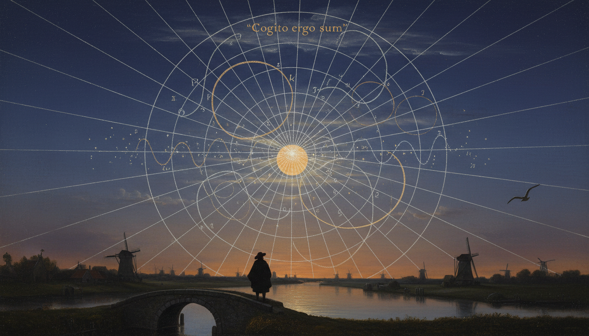

Image Prompt

Please generate a 16:9 image in Dutch Golden Age Baroque style depicting panel 12 of 12. Make the characters and style consistent with the prior panels. The scene is a symbolic tableau: a single massive glowing Cartesian grid stretches across a twilight sky over a 17th-century Dutch landscape of canals and windmills, with curves of all kinds — parabolas, circles, sine waves, hyperbolas — drawn in luminous lines across the grid. In the lower foreground, a small silhouette of Descartes in cloak and hat stands on a canal bridge looking up at his own creation. Color palette: deep indigo, starlight silver, warm amber, parchment gold. Emotional tone: triumphant, eternal, awe-inspiring. Include a full moon, distant windmills, a scattering of stars forming faint axis marks, reflections of the glowing curves in the canal water, a single gull overhead, and a faint Latin inscription "Cogito ergo sum" in the clouds. Generate the image immediately without asking clarifying questions.

Descartes called mathematics "the language of change," and he meant it literally. By marrying algebra to geometry he gave humanity a way to write change down, study it, and predict it — from planetary orbits to stock markets to the motion of a fly on a ceiling. Every function you will ever meet speaks his language.

### Epilogue – What Made Descartes Different?

Descartes was not the fastest calculator of his age, nor the most prolific. What set him apart was a willingness to ask why two fields that seemed unrelated — algebra and geometry — could not be one. He trusted slow thinking, he trusted doubt, and he trusted that a good idea scribbled in bed could outlive empires. The coordinate plane is, in many ways, his quiet signature on every math classroom on Earth.

| Challenge | How Descartes Responded | Lesson for Today |
|-----------|--------------------------|------------------|
| Chronic illness and fatigue | Turned bed rest into thinking time | Your environment is not your limit |
| Fear of religious censors | Moved to the tolerant Dutch Republic | Seek places that let your ideas breathe |
| Two fields that would not talk | Invented a language they could share | Look for the bridge nobody else sees |
| Writing for specialists only | Published in plain French, not Latin | Clear communication is part of the discovery |

### Call to Action

The next time you plot a point on a graph, pause for a second and picture a sick Frenchman watching a fly on his ceiling. Every axis you draw is a gift from someone who refused to accept that algebra and geometry should be strangers. Your job now is to use that gift boldly.

---

*"It is not enough to have a good mind; the main thing is to use it well."*
—René Descartes

*"Each problem that I solved became a rule which served afterwards to solve other problems."*
—René Descartes

---

## References

1. [Stanford Encyclopedia of Philosophy: René Descartes](PLACEHOLDER) - Comprehensive scholarly biography of Descartes
2. [MacTutor: René Descartes](PLACEHOLDER) - University of St Andrews history of mathematics archive
3. [La Géométrie (1637) - Full Text](PLACEHOLDER) - English translation of Descartes's original geometry appendix
4. [Descartes: A Biography by Desmond Clarke](PLACEHOLDER) - Cambridge University Press, 2006
5. [Encyclopaedia Britannica: Cartesian Coordinate System](PLACEHOLDER) - Overview of the coordinate system and its impact
