# Ronald Ross: The Pandemic Modeler

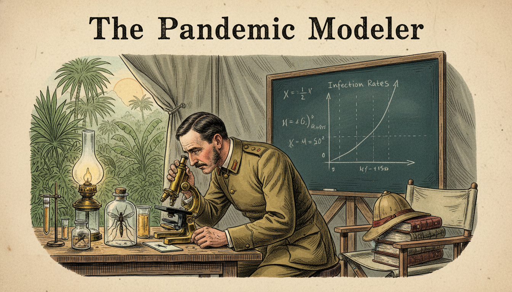

Cover Image Prompt

Please generate a wide-landscape 16:9 cover image in late Victorian colonial-era illustration style depicting Ronald Ross in a 1890s military field laboratory in India, peering through a brass microscope at a mosquito, with a chalkboard in the background showing early epidemiological equations. Include the title text "The Pandemic Modeler" rendered in a period-appropriate Victorian serif typeface. Color palette: muted tropical greens, colonial khaki, brass gold, ivory parchment, deep teal. Emotional tone: determined, investigative, quietly heroic. Include: a mosquito specimen under glass, a pith helmet on a nearby chair, tropical plants outside the window, a hand-drawn graph of infection rates, an oil lamp, and Ross in military uniform with rolled sleeves. Generate the image immediately without asking clarifying questions.

Narrative Prompt

This graphic novel tells the story of Sir Ronald Ross (1857-1932), British medical officer born in India who proved that mosquitoes transmit malaria and went on to invent mathematical epidemiology. The era spans Victorian and Edwardian colonial India and early 20th-century Britain. Themes: patience, observation, the power of models, public health. Visual style should evoke late Victorian scientific illustration with muted tropical tones. Write for IB Diploma students learning how functions can describe populations and the spread of disease. Focus equally on the biology and the birth of mathematical modeling.

### Prologue – A Fever That Would Not Quit

In the humid air of 1890s colonial India, millions die every year from a disease no one understands. Doctors blame "bad air" rising from swamps. A young army surgeon named Ronald Ross refuses to accept the mystery and decides to track down the killer himself. His hunt will end not only with a cure - but with a new branch of mathematics.

## Panel 1: A Boy Born in the Hills

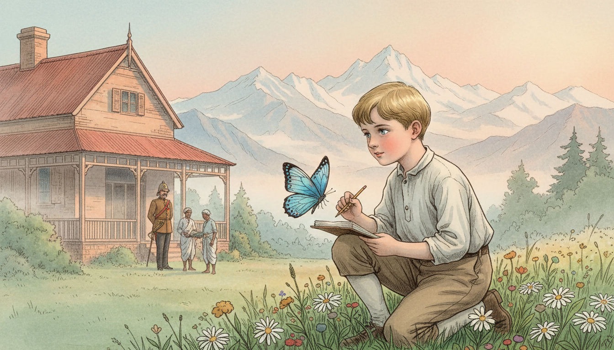

Image Prompt

I am about to ask you to generate a series of images for a graphic novel. Please make the images have a consistent style and consistent characters. Do not ask any clarifying questions. Just generate the image immediately when asked.

Please generate a 16:9 image in late Victorian colonial-era illustration style depicting panel 1 of 12. The scene should include a young Ronald Ross as a small boy in the hill station of Almora, northern India, 1860s, playing near a British bungalow with the Himalayas in the background. Color palette: misty blue, pine green, warm sandstone, soft peach sunrise. The emotional tone should be gentle nostalgia and wonder. Include: a British colonial bungalow, servants in traditional Indian dress in the background, mountain peaks, a butterfly, a notebook, Ross's father in army uniform, wildflowers. Generate the image immediately without asking clarifying questions.

Ronald Ross is born in 1857 in Almora, a hill station in British India, the son of a British army officer. The landscapes of the Himalayas shape his imagination early. He dreams of becoming a writer or a musician, not a doctor. But family expectations push him toward medicine.

## Panel 2: Reluctant Student, Restless Mind

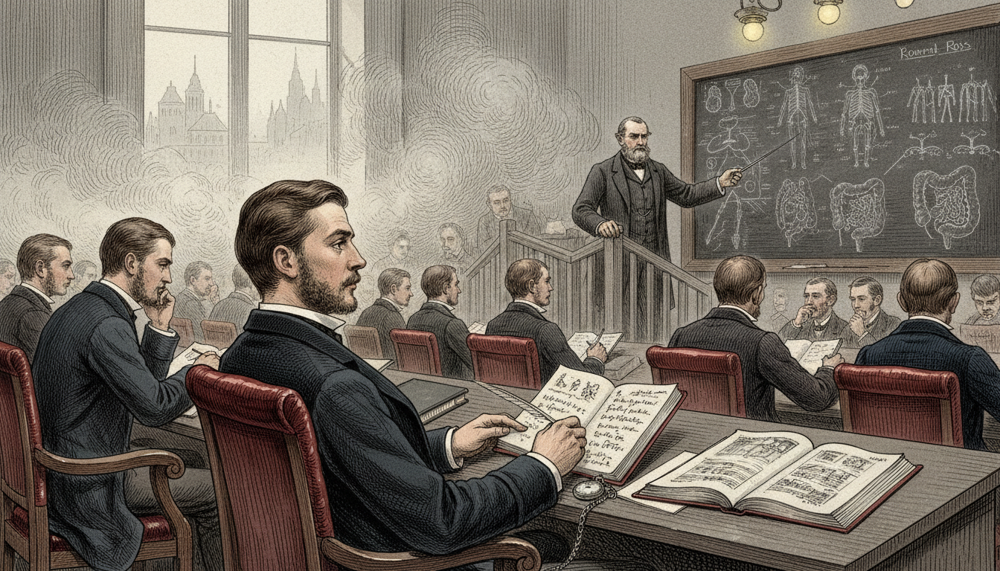

Image Prompt

I am about to ask you to generate a series of images for a graphic novel. Please make the images have a consistent style and consistent characters. Do not ask any clarifying questions. Just generate the image immediately when asked.

Please generate a 16:9 image in late Victorian colonial-era illustration style depicting panel 2 of 12. The scene should include Ronald Ross as a bored but talented medical student at St Bartholomew's Hospital in London, 1870s, sitting in a lecture hall half-listening while sketching poetry in a notebook. Color palette: smoky London gray, oxblood leather, candlelight yellow, chalk white. The emotional tone should be restless and slightly rebellious. Include: a lecturer at a blackboard, anatomical drawings, fellow students in Victorian dress, a window showing foggy London, sheet music tucked in a book, a pocket watch, an open medical textbook. Generate the image immediately without asking clarifying questions.

Ross studies medicine at St Bartholomew's in London but finds lectures dull. He writes poems, plays music, and barely passes his exams. Still, he earns his degree and joins the Indian Medical Service in 1881. Soon he is stationed across British India, treating soldiers and villagers alike.

## Panel 3: The Killer With No Face

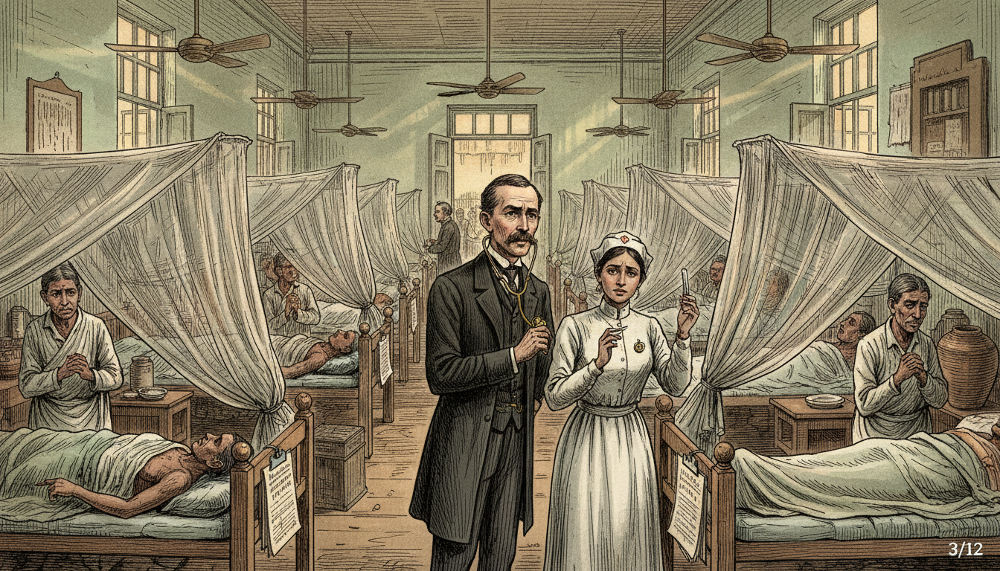

Image Prompt

I am about to ask you to generate a series of images for a graphic novel. Please make the images have a consistent style and consistent characters. Do not ask any clarifying questions. Just generate the image immediately when asked.

Please generate a 16:9 image in late Victorian colonial-era illustration style depicting panel 3 of 12. The scene should include a crowded Indian village hospital ward in the 1880s, with patients suffering from malarial fever, Ross moving between cots with a stethoscope, looking concerned and determined. Color palette: muted clay, faded white linen, pale jade, lantern amber. The emotional tone should be heavy and urgent. Include: mosquito nets, ceiling fans, ceramic water jugs, a thermometer, worried family members, a nurse in colonial uniform, sunlight through shuttered windows, medical charts. Generate the image immediately without asking clarifying questions.

Everywhere Ross goes, malaria kills. Fevers come in waves, patients shiver and sweat, and thousands die every month. At the time, everyone believes malaria comes from bad air near swamps - the word "malaria" literally means "bad air." Ross is skeptical and starts asking better questions.

## Panel 4: The Mentor and the Parasite

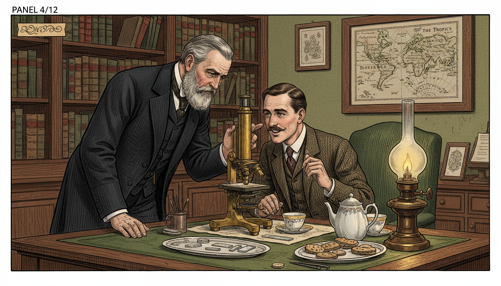

Image Prompt

I am about to ask you to generate a series of images for a graphic novel. Please make the images have a consistent style and consistent characters. Do not ask any clarifying questions. Just generate the image immediately when asked.

Please generate a 16:9 image in late Victorian colonial-era illustration style depicting panel 4 of 12. The scene should include Ross in London, 1894, meeting with Sir Patrick Manson in a tidy Victorian parlor-study, examining slides under a microscope together. Color palette: rich mahogany, brass, forest green, parchment. The emotional tone should be intellectual excitement and mentorship. Include: bookshelves with medical journals, a brass microscope, an oil lamp, Manson with a gray beard in a dark suit, Ross leaning in with interest, a framed map of the tropics, a tray with tea. Generate the image immediately without asking clarifying questions.

On a visit to London in 1894, Ross meets Sir Patrick Manson, the "father of tropical medicine." Manson shares a radical theory: mosquitoes might carry the malaria parasite from person to person. Ross is electrified. He sails back to India determined to prove it true.

## Panel 5: Months Under the Microscope

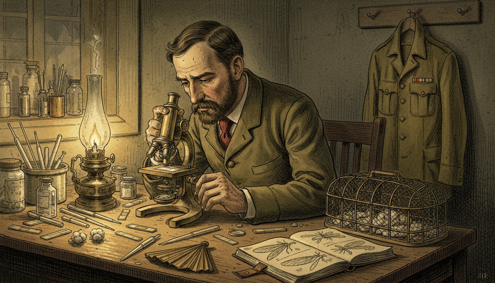

Image Prompt

I am about to ask you to generate a series of images for a graphic novel. Please make the images have a consistent style and consistent characters. Do not ask any clarifying questions. Just generate the image immediately when asked.

Please generate a 16:9 image in late Victorian colonial-era illustration style depicting panel 5 of 12. The scene should include Ross in a hot, dimly-lit field laboratory in Secunderabad, India, 1897, dissecting mosquitoes under a brass microscope, sweat on his brow, surrounded by glass slides. Color palette: dusty gold, olive drab, brass, ivory, deep shadows. The emotional tone should be exhausted obsession and quiet perseverance. Include: mosquito cages, glass pipettes, cotton wool, a hand fan, a notebook with sketches of mosquito anatomy, an oil lamp, military uniform jacket on a peg, beads of perspiration. Generate the image immediately without asking clarifying questions.

For two grueling years Ross dissects thousands of mosquitoes in stifling heat. He works long after sundown by lamplight. His eyes ache, his back aches, and his superiors tell him to stop wasting time. He keeps going anyway.

## Panel 6: The Mosquito Day

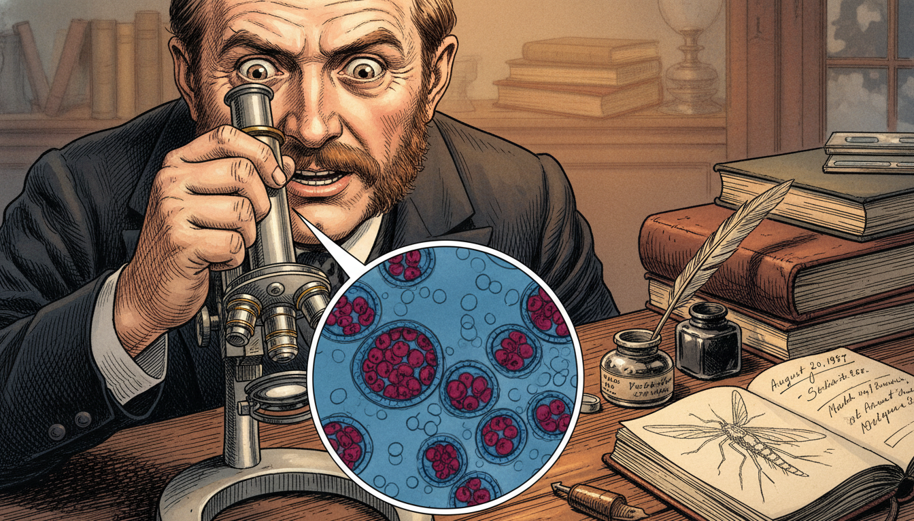

Image Prompt

I am about to ask you to generate a series of images for a graphic novel. Please make the images have a consistent style and consistent characters. Do not ask any clarifying questions. Just generate the image immediately when asked.

Please generate a 16:9 image in late Victorian colonial-era illustration style depicting panel 6 of 12. The scene should include a close-up of Ross's triumphant face on August 20, 1897, as he looks through the microscope and sees dark pigmented malaria parasite cells inside the stomach wall of an Anopheles mosquito. Color palette: amber lamplight, microscope silver, deep crimson, midnight blue. The emotional tone should be electrifying discovery. Include: the microscopic view inside a circular frame showing parasite cysts, Ross's wide eyes, his hand gripping the microscope, a single sketch of the finding on paper, an inkwell, the date written in a journal. Generate the image immediately without asking clarifying questions.

On August 20, 1897 - a day he will later call "Mosquito Day" - Ross finally spots the malaria parasite inside the stomach of an Anopheles mosquito. The link is real. Mosquitoes carry the disease. The discovery will eventually earn him the Nobel Prize in 1902.

## Panel 7: From Biology to Mathematics

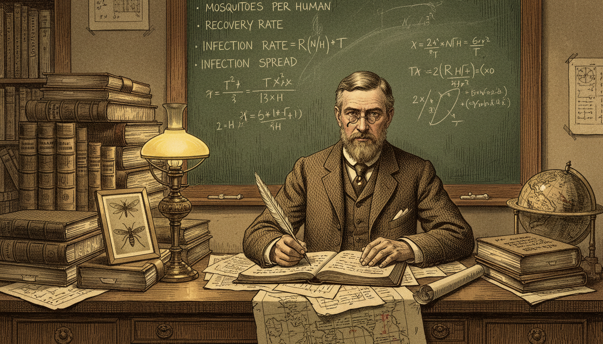

Image Prompt

I am about to ask you to generate a series of images for a graphic novel. Please make the images have a consistent style and consistent characters. Do not ask any clarifying questions. Just generate the image immediately when asked.

Please generate a 16:9 image in late Victorian colonial-era illustration style depicting panel 7 of 12. The scene should include Ross back in Britain around 1908, seated at a desk covered in ledgers, graphs, and equations, combining his medical knowledge with mathematical modeling. Color palette: tea brown, ink black, graph-paper green, warm lamp yellow. The emotional tone should be focused intellectual synthesis. Include: a chalkboard with variables like "mosquitoes per human" and "recovery rate," a stack of epidemiology notes, a pen, spectacles, a framed photo of mosquitoes, a globe, a small map of India. Generate the image immediately without asking clarifying questions.

Finding the parasite was only half the battle. Ross wants to stop malaria, not just explain it. He asks a new question: if we remove some mosquitoes from an area, how much does infection drop? To answer it, he reaches for mathematics - and invents a new field.

## Panel 8: The First Epidemic Equations

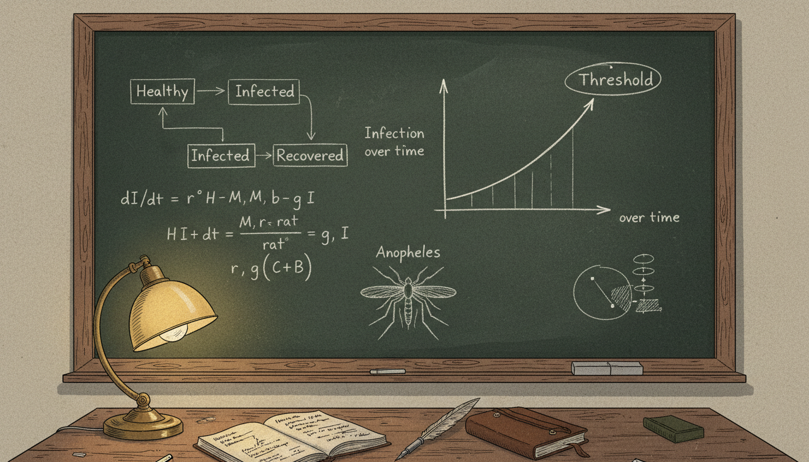

Image Prompt

I am about to ask you to generate a series of images for a graphic novel. Please make the images have a consistent style and consistent characters. Do not ask any clarifying questions. Just generate the image immediately when asked.

Please generate a 16:9 image in late Victorian colonial-era illustration style depicting panel 8 of 12. The scene should include a detailed view of a chalkboard filled with Ross's early epidemiological equations connecting infected humans, healthy humans, mosquito populations, and biting rates. Color palette: chalky green blackboard, white chalk, warm desk lamp, brown wood frame. The emotional tone should be quietly revolutionary. Include: boxes and arrows linking "Healthy" to "Infected" to "Recovered," a hand-drawn graph of infection over time, the word "Threshold" circled, Ross's notebook, a sketch of the Anopheles mosquito, an ink pen. Generate the image immediately without asking clarifying questions.

Ross builds the first compartmental model of a disease. He imagines the population split into groups: susceptible, infected, and recovered. Simple equations describe how people flow between the groups over time. These ideas become the foundation of the SIR models used in every modern pandemic.

## Panel 9: The Threshold Theorem

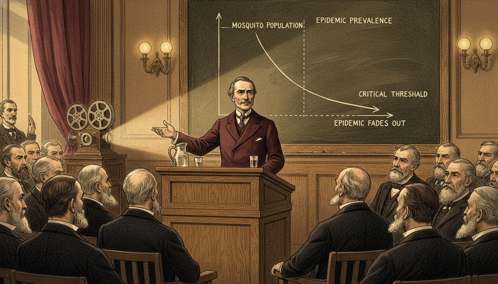

Image Prompt

I am about to ask you to generate a series of images for a graphic novel. Please make the images have a consistent style and consistent characters. Do not ask any clarifying questions. Just generate the image immediately when asked.

Please generate a 16:9 image in late Victorian colonial-era illustration style depicting panel 9 of 12. The scene should include Ross presenting his threshold theorem at a British medical conference around 1911, a graph behind him showing that below a critical mosquito population the epidemic fades out. Color palette: deep academic maroon, polished oak, chalk white, lamp gold. The emotional tone should be confident and prophetic. Include: a large wall graph with a rising curve and a falling curve separated by a dashed threshold line, attentive bearded scientists in suits, a wooden lectern, an old movie-reel projector, a pitcher of water, Ross gesturing at the graph. Generate the image immediately without asking clarifying questions.

Ross discovers a startling truth. You do not need to kill every mosquito to stop malaria - only enough to push the population below a critical threshold. Below that point, the disease cannot sustain itself and fades away. This "threshold theorem" is the direct ancestor of the modern concept of $R_0$, the basic reproduction number.

## Panel 10: Modeling Real Populations

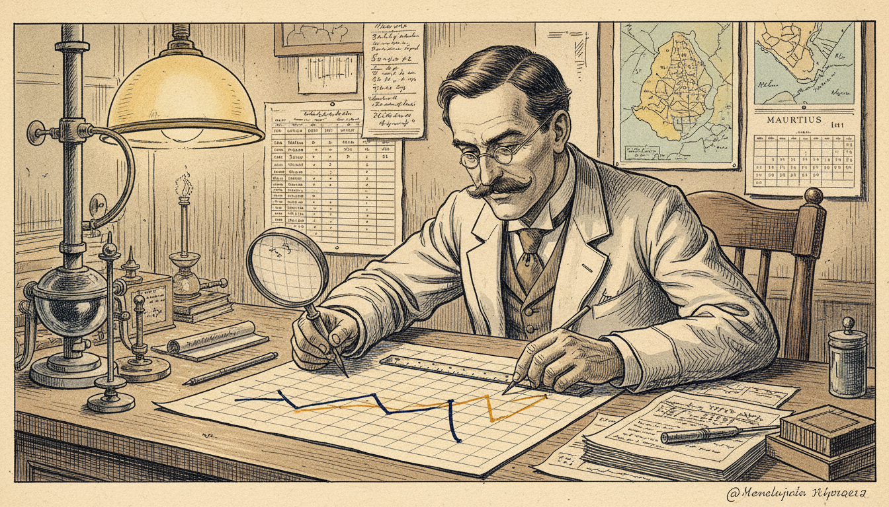

Image Prompt

I am about to ask you to generate a series of images for a graphic novel. Please make the images have a consistent style and consistent characters. Do not ask any clarifying questions. Just generate the image immediately when asked.

Please generate a 16:9 image in late Victorian colonial-era illustration style depicting panel 10 of 12. The scene should include Ross working on real case data from Mauritius and Egypt, overlaying predicted infection curves with observed data on graph paper. Color palette: parchment tan, ink navy, graph-grid cyan, warm lamplight. The emotional tone should be careful validation and satisfaction. Include: maps of Mauritius and the Nile, tabulated data, two curves drawn in different colors matching closely, a ruler, a compass, a magnifying glass, a calendar from 1911. Generate the image immediately without asking clarifying questions.

Ross tests his equations against real outbreaks in Mauritius, Egypt, and West Africa. The predicted infection curves match the observed data surprisingly well. For the first time in history, a human disease is being described by a mathematical function of time.

## Panel 11: A New Science Is Born

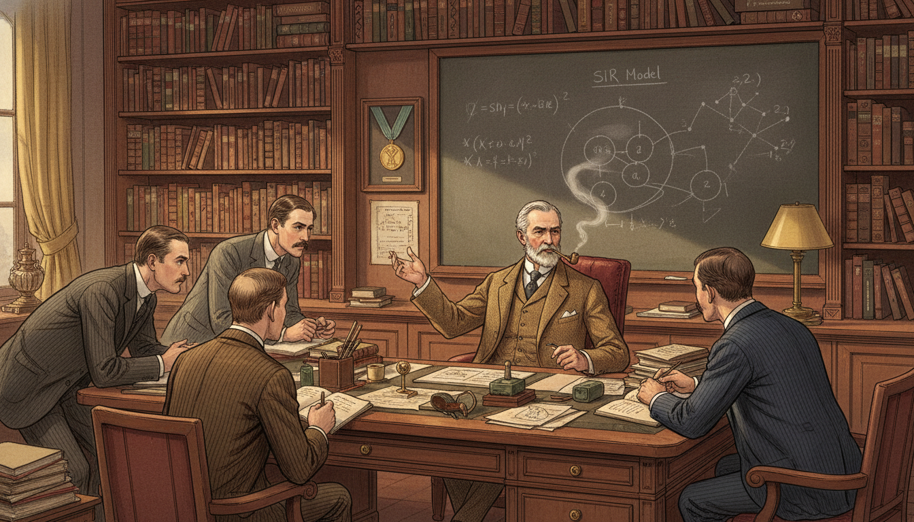

Image Prompt

I am about to ask you to generate a series of images for a graphic novel. Please make the images have a consistent style and consistent characters. Do not ask any clarifying questions. Just generate the image immediately when asked.

Please generate a 16:9 image in late Victorian colonial-era illustration style depicting panel 11 of 12. The scene should include Ross in his London office around 1920, surrounded by students and younger epidemiologists absorbing his ideas, with books, maps, and graphs covering every surface. Color palette: warm library brown, parchment, tea-stained cream, brass. The emotional tone should be generous mentorship and legacy-building. Include: bookshelves labeled "Epidemiology," "Mathematics," "Tropical Medicine," a wall chart of the SIR model, students taking notes, Ross older and gray-haired in a suit, a framed Nobel medal on the wall, pipe smoke. Generate the image immediately without asking clarifying questions.

Ross names his new science "a priori pathometry" - we now call it mathematical epidemiology. Kermack and McKendrick build directly on his equations in the 1920s. Every modern model of flu, COVID, measles, or HIV can trace its family tree back to Ronald Ross's chalkboard.

## Panel 12: The Poet Who Became a Hero

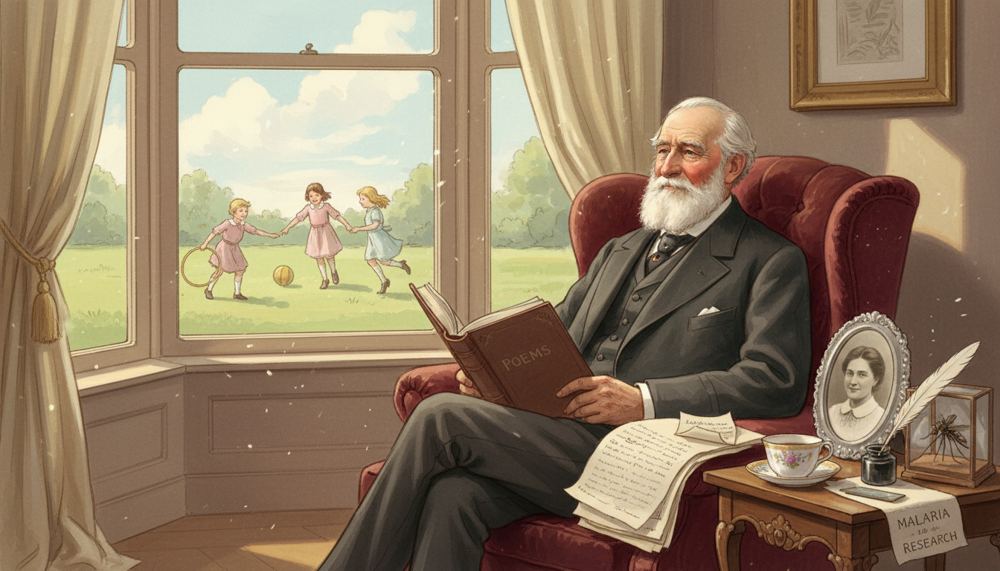

Image Prompt

I am about to ask you to generate a series of images for a graphic novel. Please make the images have a consistent style and consistent characters. Do not ask any clarifying questions. Just generate the image immediately when asked.

Please generate a 16:9 image in late Victorian colonial-era illustration style depicting panel 12 of 12. The scene should include an elder Ronald Ross in 1930, sitting at a window in London looking out at children playing safely, a book of his poetry in his lap alongside his epidemiology papers. Color palette: gentle rose, cream, soft gold, pale blue sky. The emotional tone should be peaceful pride and gentle farewell. Include: a bound volume of Ross's poems, a framed photo of his wife, a window with curtains, a small model of a mosquito in a glass case, a quill, a teacup, sunlight streaming in. Generate the image immediately without asking clarifying questions.

Ross never stopped writing poetry. He saw no conflict between verse and equations - both were ways of describing the truth. When he died in 1932, he had saved millions of lives twice over: once by finding the mosquito, and again by teaching the world how to model a pandemic.

### Epilogue – What Made Ross Different?

Ronald Ross combined two rare gifts: the patience to sit for years at a microscope, and the imagination to translate biology into mathematics. He refused to stop at the discovery of the mosquito vector. He wanted equations that governments could use to plan, predict, and protect. That leap - from biology to modeling - changed how humanity fights disease forever.

| Challenge | How Ross Responded | Lesson for Today |
|-----------|---------------------------|------------------|
| Forced into a career he did not want | Found his own meaningful mission inside it | Reframe obligations into opportunities |
| Two years of fruitless dissection | Kept going past exhaustion | Persistence often outlasts genius |
| Skeptical superiors and rivals | Published evidence and kept working | Let results answer doubt |
| Biology alone could not guide policy | Invented mathematical epidemiology | Use math to extend observation |
| Limited data from the field | Built models that still worked | Simple functions can reveal deep truths |

### Call to Action

The next time you hear about $R_0$ or a flattening curve, remember Ronald Ross hunched over a microscope in 1897 India. Functions are not just for textbooks - they describe real populations, real diseases, and real choices. Learn to read graphs of change, and you inherit Ross's superpower: the ability to see the future of a population before it arrives.

---

*"This day relenting God hath placed within my hand a wondrous thing. At His command, seeking His secret deeds with tears and toiling breath, I find thy cunning seeds, O million-murdering Death."*
—Ronald Ross

*"The study of epidemiology should be pursued with all the rigor of an exact science."*
—Ronald Ross

---

## References

1. [Ronald Ross - Nobel Prize Biographical](PLACEHOLDER) - Official biography from the Nobel Foundation.
2. [The Prevention of Malaria (1910)](PLACEHOLDER) - Ross's own book outlining his mathematical models.
3. [Mathematical Epidemiology: Ross to Kermack-McKendrick](PLACEHOLDER) - Historical overview of the SIR framework.
4. [Ronald Ross: Malariologist and Polymath](PLACEHOLDER) - Modern biography of his life and work.
5. [R-zero and the Threshold Theorem](PLACEHOLDER) - Accessible explanation of Ross's reproduction number concept.
