# Ramanujan: The Infinity Dreamer

Cover Image Prompt

Please generate a wide-landscape 16:9 cover image in warm watercolor and ink graphic-novel style depicting Srinivasa Ramanujan as a young South Indian man in a simple white dhoti and shirt, seated cross-legged on a temple stone floor with a slate and chalk, surrounded by floating golden equations and infinite series symbols swirling like smoke. Include the title text "The Infinity Dreamer" rendered in an elegant early 20th century serif typeface. Color palette: warm saffron, deep indigo, temple gold, chalkboard black, soft cream. Emotional tone: mystical, reverent, awestruck. Include a silhouette of a South Indian temple gopuram in the background, an oil lamp burning nearby, palm leaves framing the scene, stars visible through arched windows, a Cambridge spire ghosted behind the temple, and the goddess Namagiri faintly glowing above Ramanujan's head. Generate the image immediately without asking clarifying questions.

Narrative Prompt

Tell the story of Srinivasa Ramanujan (1887-1920), the self-taught Indian mathematical prodigy from Erode and Kumbakonam in colonial Tamil Nadu. Weave together his poverty, his devotion to the goddess Namagiri, his obsession with Carr's Synopsis of Pure Mathematics, his letter to G.H. Hardy, his years at Cambridge during World War I, and his tragic early death. Focus on his contributions to functions including infinite series for pi, the partition function, mock theta functions, and highly composite numbers. Use a tone that is reverent but accessible for IB Diploma high school students, honoring both his cultural context and his mathematical genius.

### Prologue - A Notebook Full of Dreams

In a small house in Kumbakonam, a young man fills notebook after notebook with equations no one has taught him. He claims his family goddess whispers formulas to him in his sleep. Within a few years, those scribbled functions will astonish the greatest mathematicians at Cambridge. His name is Srinivasa Ramanujan, and he is about to change what we thought functions could be.

## Panel 1: A Boy in Erode

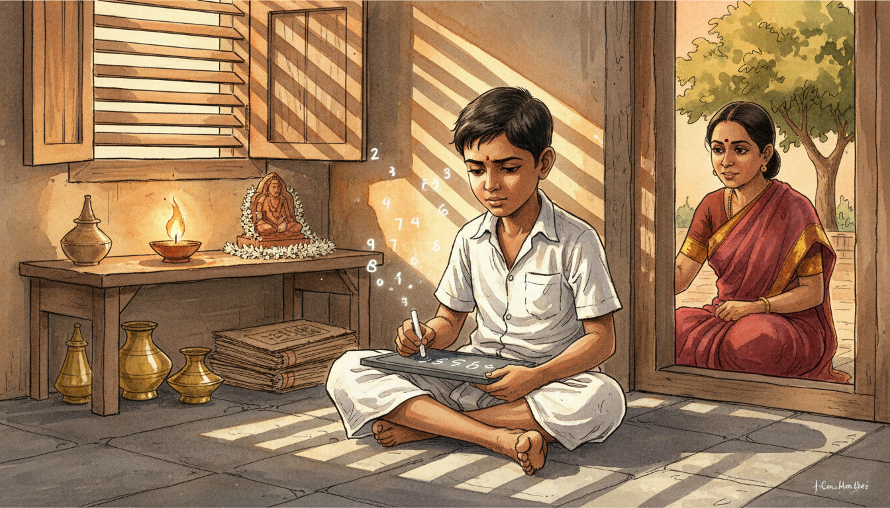

Image Prompt

I am about to ask you to generate a series of images for a graphic novel. Please make the images have a consistent style and consistent characters. Do not ask any clarifying questions. Just generate the image immediately when asked.

Please generate a 16:9 image in warm watercolor and ink graphic-novel style depicting panel 1 of 12. The scene should include a small barefoot South Indian boy around age 10, wearing a simple white cotton shirt and dhoti, with short dark hair, writing numbers on a slate with chalk while seated on the stone floor of a modest 1897 Tamil Nadu home. The setting is Erode, India, 1897, with a clay oil lamp flickering on a low wooden shelf, brass vessels in the corner, and afternoon light streaming through wooden shutters. Color palette: warm ochre, terracotta, saffron, chalk white, deep brown. The emotional tone should be quiet wonder and early curiosity. Include a curious mother in a red sari watching from the doorway, a jasmine garland by a small shrine, a stack of palm leaf manuscripts, bare feet dusty from the courtyard, numbers floating faintly above the slate, and a mango tree visible outside the window. Generate the image immediately without asking clarifying questions.

Srinivasa Ramanujan was born in 1887 in Erode, a small town in colonial Tamil Nadu, India. Even as a child, he showed an unusual hunger for numbers, teaching himself arithmetic faster than his classmates could follow. His family was poor but devout, and his mother encouraged his obsession with patterns and sums. By age ten, he was already asking questions about infinity that his teachers could not answer.

## Panel 2: The Book That Changed Everything

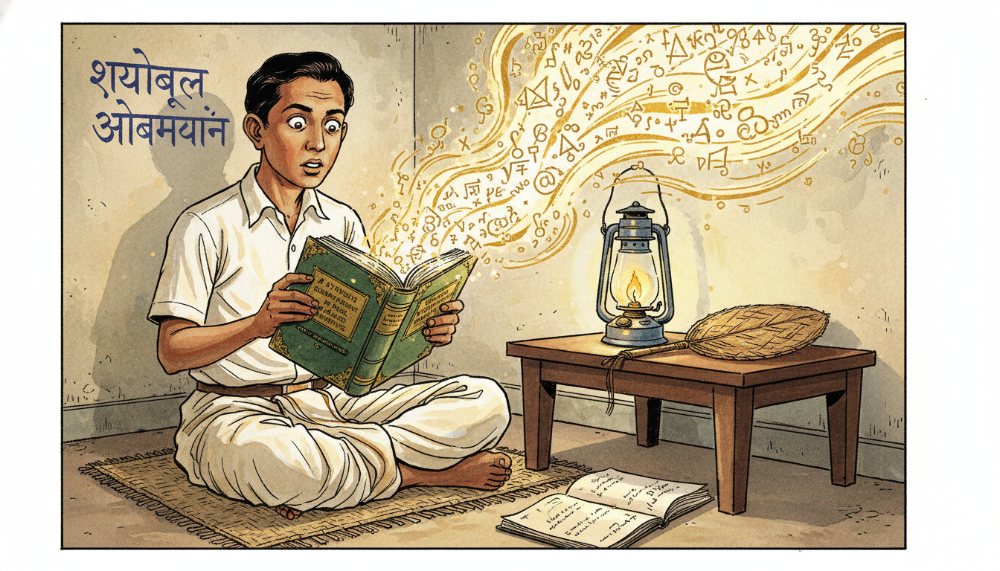

Image Prompt

I am about to ask you to generate a series of images for a graphic novel. Please make the images have a consistent style and consistent characters. Do not ask any clarifying questions. Just generate the image immediately when asked.

Please generate a 16:9 image in warm watercolor and ink graphic-novel style depicting panel 2 of 12. The scene should include Ramanujan as a 16 year old teenage boy in school uniform of white shirt and dhoti, eyes wide with astonishment as he opens an old worn book titled "A Synopsis of Elementary Results in Pure and Applied Mathematics" by George Shoobridge Carr, set in a modest Kumbakonam home in 1903. Color palette: aged paper cream, chalkboard green, saffron, indigo, gold. The emotional tone should be electric discovery and awakening. Include thousands of theorems spilling visually from the open pages like golden light, a kerosene lamp on a low desk, a coconut leaf fan, Sanskrit writing on a nearby wall, chalk dust on his fingers, and a second notebook already half-filled with his own derivations. Generate the image immediately without asking clarifying questions.

At sixteen, Ramanujan borrowed a battered book from a friend: G.S. Carr's Synopsis of Pure Mathematics. The book listed over 5,000 theorems with almost no proofs. For Ramanujan, this was not a limitation but an invitation. He worked through every result, deriving proofs himself and then pushing far beyond into territory Carr never imagined.

## Panel 3: Notebooks of the Night

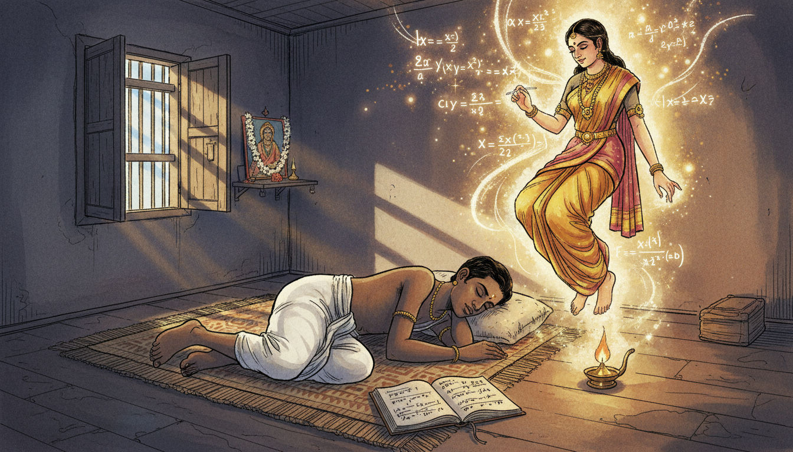

Image Prompt

I am about to ask you to generate a series of images for a graphic novel. Please make the images have a consistent style and consistent characters. Do not ask any clarifying questions. Just generate the image immediately when asked.

Please generate a 16:9 image in warm watercolor and ink graphic-novel style depicting panel 3 of 12. The scene should include Ramanujan as a young man around 20, sleeping on a woven mat in a small Kumbakonam room in 1907, while above him the goddess Namagiri appears as a softly glowing translucent figure in traditional South Indian dress, writing infinite series and continued fractions in the air. Color palette: deep midnight blue, temple gold, saffron, soft rose, starlight white. The emotional tone should be mystical and dreamlike. Include an open notebook by his side with half-written equations, a small oil lamp still burning, jasmine flowers at a family shrine with Namagiri's image, mathematical symbols floating like fireflies, moonlight through wooden shutters, and his hand reaching toward the equations in his sleep. Generate the image immediately without asking clarifying questions.

Ramanujan believed that his family goddess, Namagiri of Namakkal, revealed formulas to him in dreams. He would wake in the night and scribble these visions into notebooks that eventually held nearly 4,000 identities and theorems. Many were strange new functions involving infinite series, continued fractions, and modular forms. Mathematicians are still unpacking those notebooks more than a century later.

## Panel 4: The Clerk at Madras Port Trust

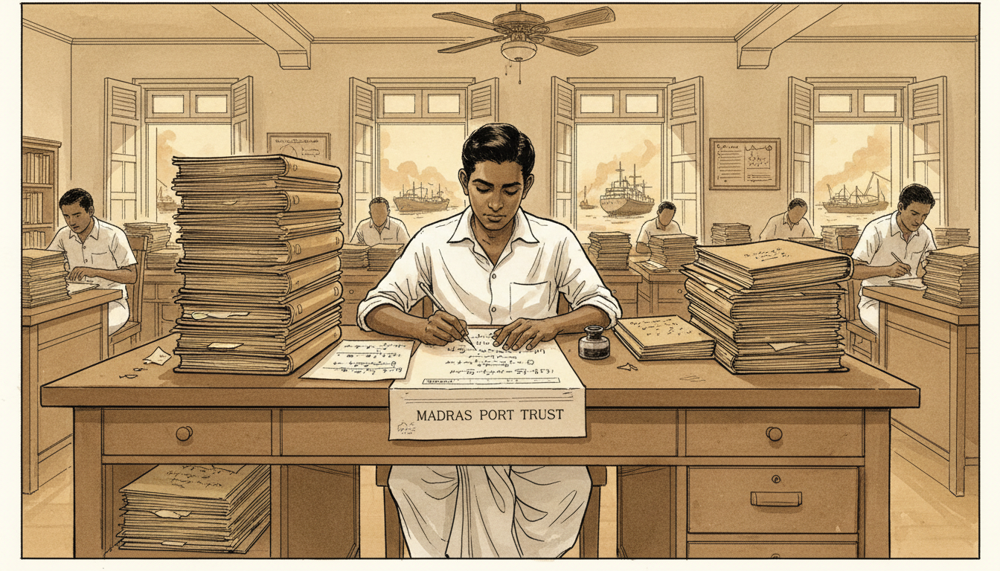

Image Prompt

I am about to ask you to generate a series of images for a graphic novel. Please make the images have a consistent style and consistent characters. Do not ask any clarifying questions. Just generate the image immediately when asked.

Please generate a 16:9 image in warm watercolor and ink graphic-novel style depicting panel 4 of 12. The scene should include Ramanujan as a young man in his early 20s wearing a simple white shirt and dhoti, working as a clerk at a wooden desk piled with shipping ledgers at the Madras Port Trust office in 1912, secretly writing mathematics on the back of official forms. Color palette: dusty sepia, colonial cream, ink black, warm amber. The emotional tone should be quiet determination under humble circumstances. Include a ceiling fan slowly turning, British colonial architecture with tall shuttered windows, other clerks in white uniforms in the background, a view of Madras harbor with ships through the window, an inkwell and steel nib pen, and a stack of personal mathematical papers hidden beneath the shipping logs. Generate the image immediately without asking clarifying questions.

To support his new wife and family, Ramanujan took a clerk's job at the Madras Port Trust in 1912. Between shipping ledgers, he covered scrap paper with functions that no European journal had ever published. His supervisors recognized that something unusual was happening and encouraged him to write to mathematicians in England. That small act of encouragement would change mathematical history.

## Panel 5: The Letter to Hardy

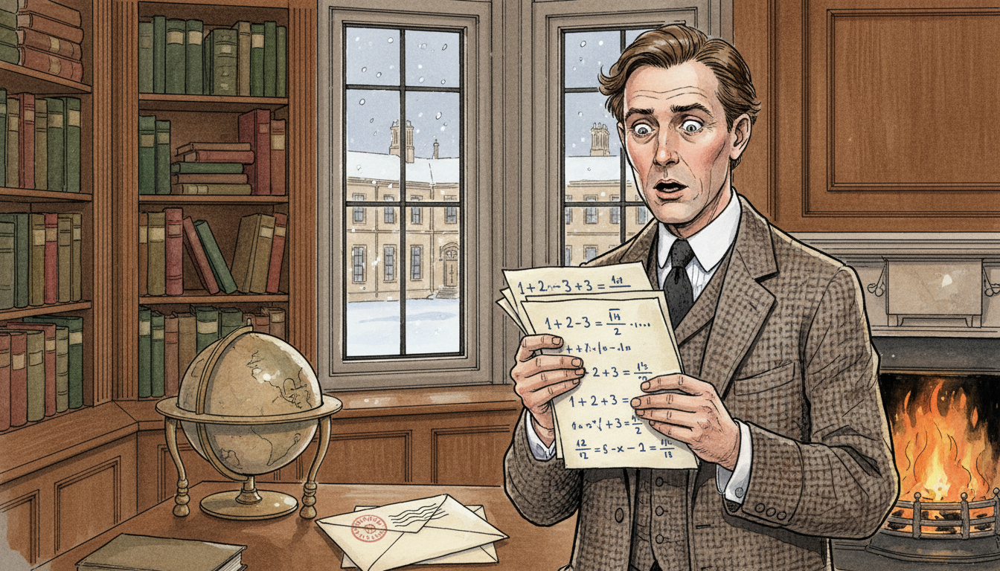

Image Prompt

I am about to ask you to generate a series of images for a graphic novel. Please make the images have a consistent style and consistent characters. Do not ask any clarifying questions. Just generate the image immediately when asked.

Please generate a 16:9 image in warm watercolor and ink graphic-novel style depicting panel 5 of 12. The scene should include G.H. Hardy, a clean-shaven middle aged English mathematician in a tweed jacket and tie, standing in his oak-paneled Trinity College Cambridge study in January 1913, reading a handwritten letter with nine pages of astonishing formulas, his expression shifting from skepticism to amazement. Color palette: Cambridge stone gray, oak brown, parchment cream, ink blue, deep green. The emotional tone should be growing astonishment and recognition of genius. Include a coal fire burning in the fireplace, leather-bound mathematical journals on shelves, a globe, a window looking onto the Great Court of Trinity, the envelope postmarked Madras on his desk, snow falling outside, and formulas like 1 + 2 + 3 + ... = -1/12 visible on the letter pages. Generate the image immediately without asking clarifying questions.

In January 1913, G.H. Hardy at Trinity College, Cambridge opened a letter from an unknown Indian clerk. The nine pages contained formulas so strange that Hardy at first suspected a hoax, until he realized no one could invent such results without being a genius. Some identities he recognized as correct but unprovable by current methods. Others were entirely new functions that Hardy had never seen in any textbook.

## Panel 6: Voyage to Cambridge

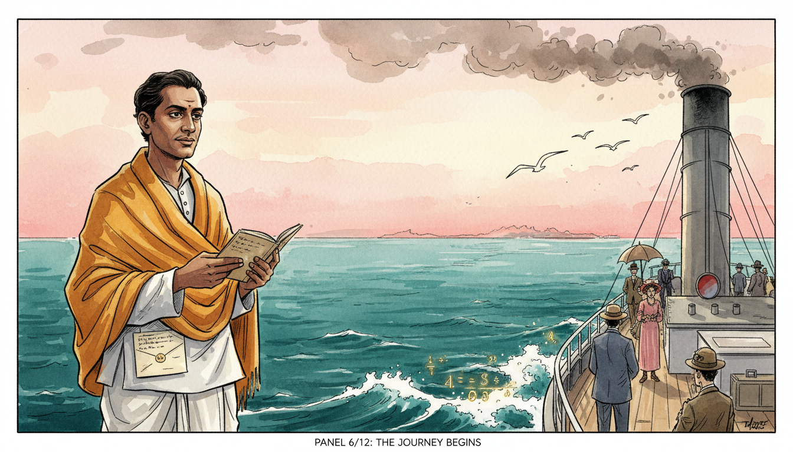

Image Prompt

I am about to ask you to generate a series of images for a graphic novel. Please make the images have a consistent style and consistent characters. Do not ask any clarifying questions. Just generate the image immediately when asked.

Please generate a 16:9 image in warm watercolor and ink graphic-novel style depicting panel 6 of 12. The scene should include Ramanujan standing on the deck of the steamship SS Nevasa in April 1914, wearing a white traditional dhoti and shirt with a woolen shawl over his shoulders, gazing eastward across the Arabian Sea, a small notebook in his hand. Color palette: ocean teal, dawn pink, steel gray, saffron, cream. The emotional tone should be brave anticipation mixed with homesickness. Include seagulls following the ship, coal smoke from the funnel, other passengers in colonial dress, the shoreline of India receding in the distance, a folded letter from Hardy in his pocket, and waves with faintly glowing mathematical symbols in their foam. Generate the image immediately without asking clarifying questions.

After long hesitation over religious concerns about crossing the ocean, Ramanujan sailed for England in 1914 aboard the SS Nevasa. He carried his notebooks and a promise from Hardy that Cambridge would give him the tools he lacked. The voyage took weeks, and the young man who stepped off at Tilbury had never seen snow or eaten a European meal. Everything about his new world would be strange, except the mathematics.

## Panel 7: Partnership at Trinity

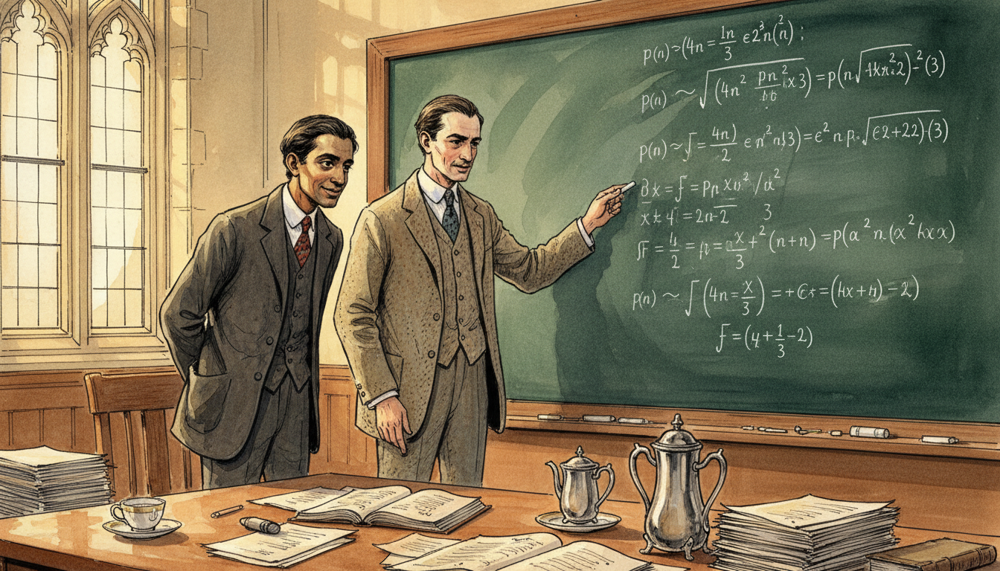

Image Prompt

I am about to ask you to generate a series of images for a graphic novel. Please make the images have a consistent style and consistent characters. Do not ask any clarifying questions. Just generate the image immediately when asked.

Please generate a 16:9 image in warm watercolor and ink graphic-novel style depicting panel 7 of 12. The scene should include Ramanujan in a dark suit and tie (uncomfortable in Western clothes) standing at a large chalkboard beside G.H. Hardy in a Trinity College lecture room in 1915, the two men deep in discussion over the partition function p(n). Color palette: chalk white, slate green, tweed brown, Cambridge stone, warm lamplight. The emotional tone should be intellectual partnership across cultures. Include complex infinite series covering the chalkboard, stacks of paper on a wooden table, a tea service with a cold untouched cup, tall arched gothic windows, Hardy pointing at a formula with chalk on his fingers, and Ramanujan's face lit with the quiet joy of being understood for the first time. Generate the image immediately without asking clarifying questions.

At Cambridge, Hardy and Ramanujan formed one of the most remarkable partnerships in mathematical history. Together they studied the partition function $p(n)$, which counts the number of ways a whole number can be written as a sum of positive integers. Their formula for $p(n)$ as $n$ grows large was so accurate it stunned the mathematical world. It was a function that could predict the behavior of infinity with astonishing precision.

## Panel 8: Infinite Series for Pi

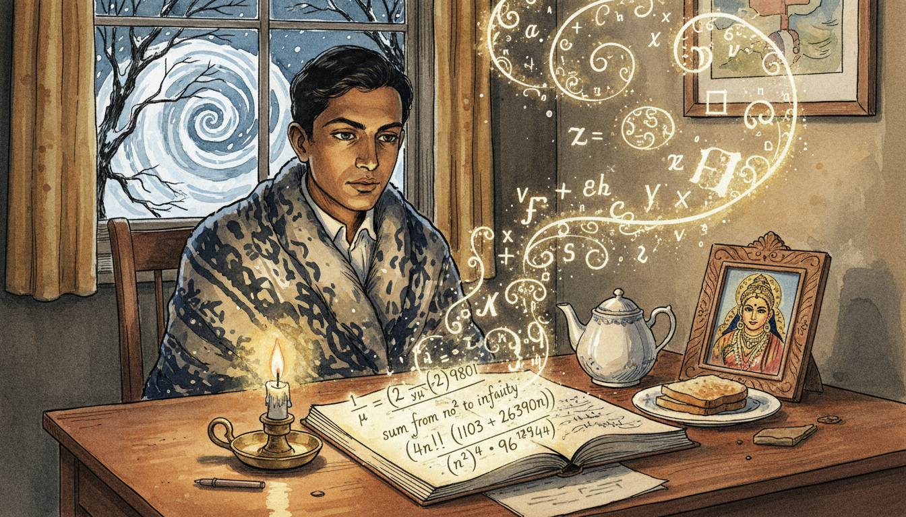

Image Prompt

I am about to ask you to generate a series of images for a graphic novel. Please make the images have a consistent style and consistent characters. Do not ask any clarifying questions. Just generate the image immediately when asked.

Please generate a 16:9 image in warm watercolor and ink graphic-novel style depicting panel 8 of 12. The scene should include Ramanujan seated alone at a wooden desk in his small Trinity College room in 1916, writing one of his famous rapidly converging series for 1/pi, with the formula glowing faintly on the page. Color palette: candle amber, deep indigo, parchment cream, chalk white, gold. The emotional tone should be focused wonder and solitary brilliance. Include a single candle burning low, a teapot and untouched toast, a wool blanket around his shoulders against Cambridge cold, snow visible through the leaded window, his notebook open to show the series 1/pi = (2 sqrt(2)/9801) times an infinite sum, a small framed image of goddess Namagiri on the desk, and mathematical symbols spiraling around him like incense smoke. Generate the image immediately without asking clarifying questions.

Ramanujan discovered infinite series for $\pi$ that converge so quickly each term adds eight correct digits. These formulas looked impossible, yet every one turned out to be exactly right. Modern computers still use his series to calculate $\pi$ to trillions of digits. He had found functions that compress infinity into a handful of beautiful lines.

## Panel 9: The Taxicab Number

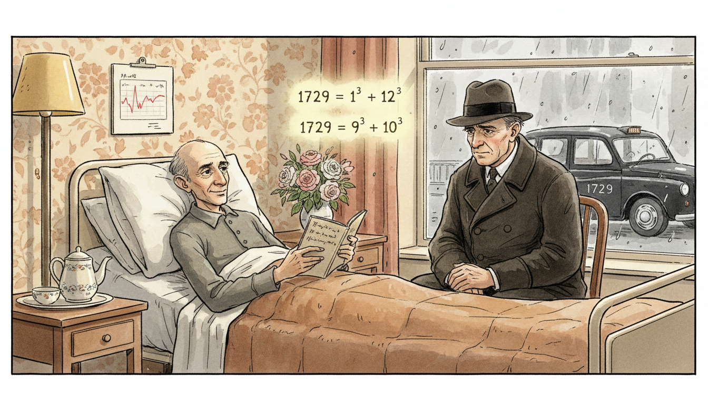

Image Prompt

I am about to ask you to generate a series of images for a graphic novel. Please make the images have a consistent style and consistent characters. Do not ask any clarifying questions. Just generate the image immediately when asked.

Please generate a 16:9 image in warm watercolor and ink graphic-novel style depicting panel 9 of 12. The scene should include Ramanujan lying pale and thin but smiling in a hospital bed at Putney nursing home in 1918, with Hardy in a dark overcoat seated beside him, a black London taxicab with number 1729 visible through the window, and the equation 1729 = 1 cubed + 12 cubed = 9 cubed + 10 cubed glowing in the air between them. Color palette: hospital white, London fog gray, warm lamp yellow, tea brown, quiet rose. The emotional tone should be tender friendship and wit despite illness. Include a bouquet of flowers, a teapot on a bedside table, rain streaking the window, Hardy's worried eyes, Ramanujan's notebook open on his lap, a chart of his temperature, and wallpaper with faded floral pattern. Generate the image immediately without asking clarifying questions.

While Ramanujan lay sick in a London nursing home, Hardy came to visit and remarked that his taxicab number, 1729, seemed dull. Ramanujan replied instantly that 1729 was actually very interesting, as the smallest number expressible as the sum of two cubes in two different ways: $1^3 + 12^3$ and $9^3 + 10^3$. Numbers with this property are now called taxicab numbers. Even illness could not slow his ability to see functions and patterns everywhere.

## Panel 10: Mock Theta Functions

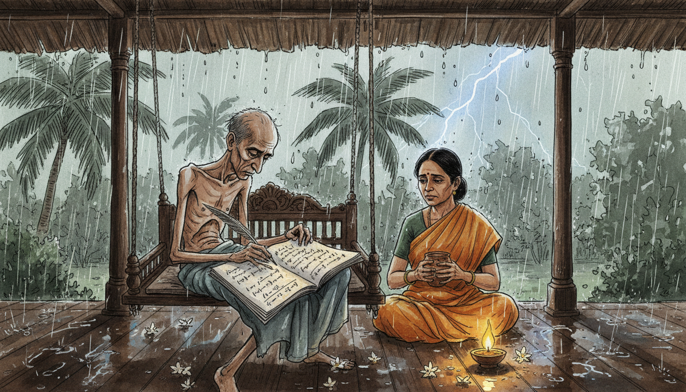

Image Prompt

I am about to ask you to generate a series of images for a graphic novel. Please make the images have a consistent style and consistent characters. Do not ask any clarifying questions. Just generate the image immediately when asked.

Please generate a 16:9 image in warm watercolor and ink graphic-novel style depicting panel 10 of 12. The scene should include a frail Ramanujan back in Kumbakonam India in 1919, seated on a traditional wooden swing on a veranda, writing his final mysterious "mock theta functions" in a notebook while a monsoon rain falls on palm trees in the courtyard. Color palette: monsoon gray-green, saffron, deep wood brown, rain silver, lamp gold. The emotional tone should be bittersweet urgency and final creative fire. Include his wife Janaki in a simple sari bringing a cup of coconut water, wet jasmine flowers on the floor, a banana leaf roof dripping rainwater, a small clay oil lamp, his notebook pages filled with functions like f(q) = sum of q to the n squared divided by products, and lightning briefly illuminating the scene. Generate the image immediately without asking clarifying questions.

Too ill to remain in England, Ramanujan returned to India in 1919. In his final months, he invented what he called mock theta functions, a strange new class of functions whose full significance took mathematicians almost a century to understand. These functions now play surprising roles in the study of black holes and string theory. He was inventing mathematical tools for a future he would never see.

## Panel 11: A Short Life, An Infinite Legacy

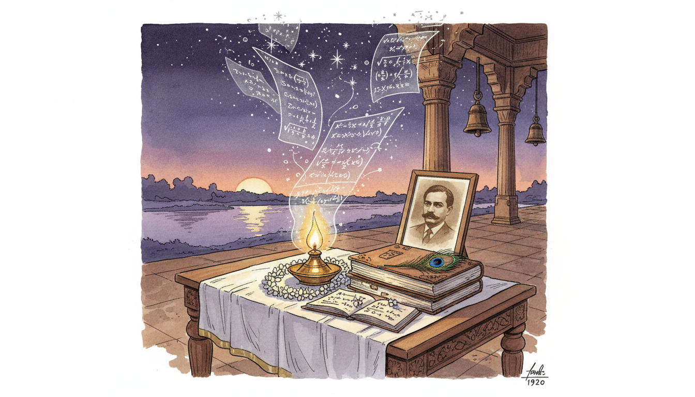

Image Prompt

I am about to ask you to generate a series of images for a graphic novel. Please make the images have a consistent style and consistent characters. Do not ask any clarifying questions. Just generate the image immediately when asked.

Please generate a 16:9 image in warm watercolor and ink graphic-novel style depicting panel 11 of 12. The scene should include a quiet memorial scene in Kumbakonam in 1920 showing Ramanujan's notebooks stacked on a low wooden table draped with a white cloth, a single oil lamp burning beside them, jasmine garlands, and ghostly translucent pages rising from the notebooks carrying equations up into the sky. Color palette: dusk violet, lamp gold, jasmine white, sandalwood brown, starlight silver. The emotional tone should be reverent mourning and eternal legacy. Include a framed photograph of Ramanujan on the table, a view of the Cauvery river at twilight through an archway, temple bells in silhouette, stars beginning to appear, a peacock feather, and equations transforming into constellations overhead. Generate the image immediately without asking clarifying questions.

Ramanujan died in April 1920 at just 32 years old, but his notebooks kept speaking long after he was gone. Mathematicians around the world spent the rest of the 20th century proving, extending, and finding applications for the functions he had simply written down as true. His "lost notebook," rediscovered in 1976, gave researchers another decade of new results. A short life, yet functions enough for centuries.

## Panel 12: The Dreamer's Gift to Modern Math

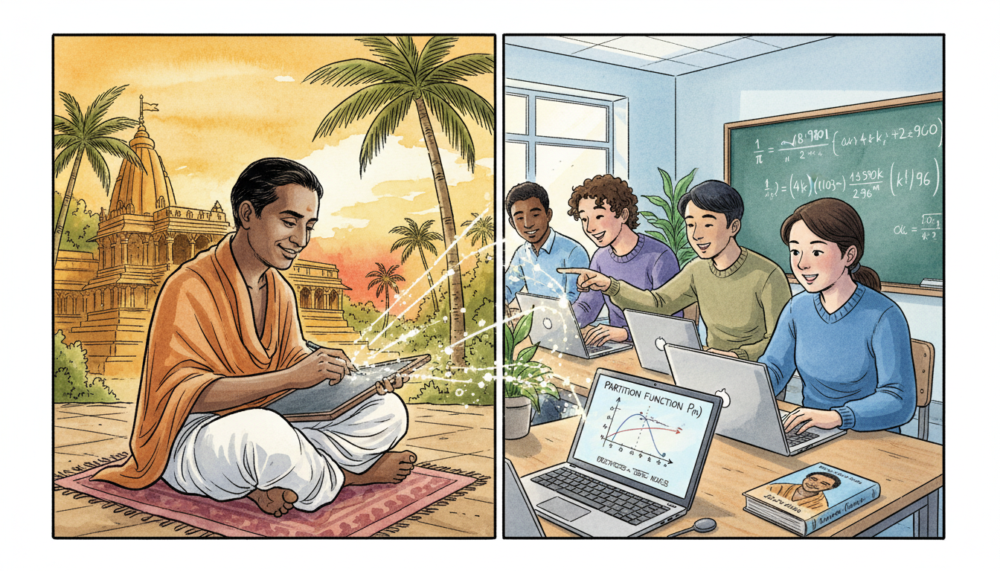

Image Prompt

I am about to ask you to generate a series of images for a graphic novel. Please make the images have a consistent style and consistent characters. Do not ask any clarifying questions. Just generate the image immediately when asked.

Please generate a 16:9 image in warm watercolor and ink graphic-novel style depicting panel 12 of 12. The scene should include a split composition showing Ramanujan's historic figure on the left in traditional dhoti writing at his slate, and on the right a modern diverse group of IB high school students of varied backgrounds in a bright contemporary classroom using laptops to compute Ramanujan's pi series, with glowing equations connecting the two scenes across time. Color palette: temple saffron and gold on the left, modern classroom blue and white on the right, with gold equations bridging both. The emotional tone should be timeless inspiration across generations. Include a graph of the partition function on a digital screen, a chalkboard showing 1/pi series, a student smiling in wonder, Ramanujan smiling back across time, a modern textbook with his portrait, palm trees merging into classroom plants, and constellations of formulas linking the centuries. Generate the image immediately without asking clarifying questions.

Today, Ramanujan's functions show up in number theory, physics, computer science, and even cryptography. When you study infinite series, partitions, or special functions in your IB course, you are walking on trails he blazed from a small room in Kumbakonam. His story reminds us that mathematical genius knows no border, no language, and no social class. Every input, no matter where it comes from, can produce a remarkable output.

### Epilogue - What Made Ramanujan Different?

Ramanujan had almost no formal training, limited access to journals, and only a few years of good health. Yet he produced functions and identities that reshaped modern mathematics. He combined intense intuition, deep cultural faith, relentless work, and a partnership with Hardy that bridged two very different worlds. His life teaches us that curiosity and persistence can rival any classroom.

| Challenge | How Ramanujan Responded | Lesson for Today |
|-----------|-------------------------|------------------|
| Poverty and no formal higher education | Taught himself from a single textbook | Great learning does not require great resources |
| Isolation from the global math community | Wrote boldly to G.H. Hardy in England | Reach out beyond your local circle |
| Cultural and religious barriers to travel | Trusted his mentors and sailed to Cambridge | Courage opens doors imagination alone cannot |
| Chronic illness and early death | Kept inventing mock theta functions until the end | Use the time you have fully |
| Skepticism from established mathematicians | Let his formulas speak for themselves | Let your work earn its own respect |

### Call to Action

The next time you see an infinite series or a strange new function in your IB class, remember Ramanujan. He saw beauty where others saw only symbols, and he refused to let his circumstances decide the size of his imagination. Wherever you come from, your input matters. Dream big, write it down, and trust the output.

---

*"An equation for me has no meaning unless it expresses a thought of God."*
—Srinivasa Ramanujan

*"I have found a friend in you who views my labors sympathetically."*
—Srinivasa Ramanujan

---

## References

1. [Srinivasa Ramanujan - MacTutor History of Mathematics](PLACEHOLDER) - Biography and mathematical contributions
2. [The Man Who Knew Infinity by Robert Kanigel](PLACEHOLDER) - Definitive biography of Ramanujan
3. [Ramanujan's Notebooks edited by Bruce Berndt](PLACEHOLDER) - Analysis of the original notebooks
4. [The Partition Function and Ramanujan-Hardy Formula](PLACEHOLDER) - Mathematical overview
5. [Mock Theta Functions and Modern Applications](PLACEHOLDER) - Modern significance of Ramanujan's last work
