# Syukuro Manabe: The Climate Function

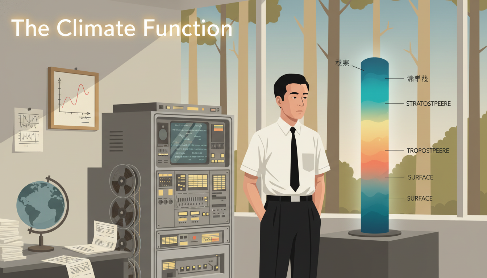

Cover Image Prompt

Please generate a wide-landscape 16:9 cover image in mid-century to contemporary Japanese-American illustration style depicting a young Syukuro Manabe in 1960s Princeton standing beside an early room-sized mainframe computer, with an atmospheric column diagram of Earth's layers glowing beside him. Include the title text "The Climate Function" rendered in a clean modernist sans-serif typeface. Color palette: atmospheric blues, warm beige, computational gray, punch-card yellow, deep ocean teal, subtle sunset orange. Emotional tone: thoughtful, determined, quietly groundbreaking. Include: spinning magnetic tape reels, printouts with temperature profiles, a model of the globe, a hand-drawn temperature-vs-altitude graph, Manabe in a simple white shirt and tie, large picture windows showing a forest. Generate the image immediately without asking clarifying questions.

Narrative Prompt

This graphic novel tells the story of Syukuro "Suki" Manabe (born 1931), Japanese-American climate scientist who built some of the first successful computer models of Earth's atmosphere and climate. Born in rural Shikoku, Japan, he moved to the United States in 1958 and joined the Geophysical Fluid Dynamics Laboratory in Princeton. His models showed that doubling carbon dioxide would warm the planet. He received the 2021 Nobel Prize in Physics. The art style should blend mid-century modernist sensibilities with contemporary computational aesthetics, featuring atmospheric blues and warm earthy tones. Themes: quiet persistence, the power of simple models, climate responsibility, bridging cultures.

### Prologue – The Doctor's Son Who Looked at Clouds

In a small mountain village on the Japanese island of Shikoku, a boy named Suki watches storm clouds roll over the rice terraces. His father is a country doctor and expects him to become one too. But Suki is terrible at memorizing symptoms. He is, however, extraordinary at noticing patterns in the sky.

## Panel 1: A Village in Shikoku

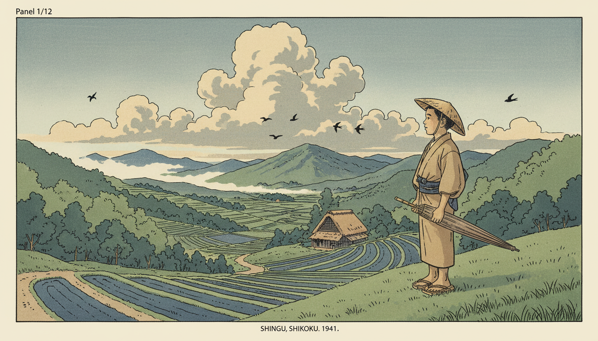

Image Prompt

I am about to ask you to generate a series of images for a graphic novel. Please make the images have a consistent style and consistent characters. Do not ask any clarifying questions. Just generate the image immediately when asked.

Please generate a 16:9 image in mid-century Japanese illustration style depicting panel 1 of 12. The scene should include a young Syukuro Manabe around age 10 in the village of Shingu in Ehime Prefecture, Shikoku, Japan, in 1941, standing on a hillside watching clouds gather over terraced rice paddies. Color palette: soft sage green, misty gray-blue, warm beige, slate indigo, pale gold. The emotional tone should be gentle wonder and rural stillness. Include: a straw hat, terraced rice fields, distant mountains, a thatched farmhouse, swallows in the sky, a wooden umbrella, cumulus clouds, a dirt path, forested slopes. Generate the image immediately without asking clarifying questions.

Syukuro Manabe is born in 1931 in a small village in Ehime Prefecture. His grandfather and father are both country doctors. The village, surrounded by mountains and clouds, gives him a front-row seat to the theater of weather.

## Panel 2: Postwar Tokyo and a Love of Weather

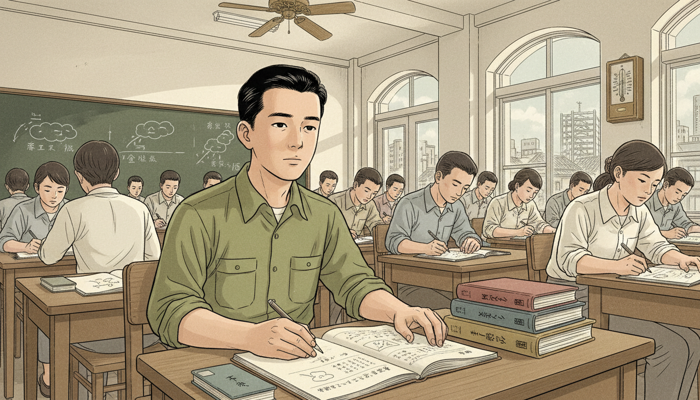

Image Prompt

I am about to ask you to generate a series of images for a graphic novel. Please make the images have a consistent style and consistent characters. Do not ask any clarifying questions. Just generate the image immediately when asked.

Please generate a 16:9 image in mid-century Japanese illustration style depicting panel 2 of 12. The scene should include young Manabe as a student at the University of Tokyo in the early 1950s, studying meteorology in a crowded postwar classroom. Color palette: muted olive, chalk white, worn wood brown, soft cream. The emotional tone should be hopeful rebuilding and academic curiosity. Include: a blackboard with weather front diagrams, fellow students in simple postwar clothes, textbooks in Japanese, a single rotating ceiling fan, a window showing the Tokyo skyline under reconstruction, Manabe's neat notebook, a barometer on the wall. Generate the image immediately without asking clarifying questions.

Manabe enters the University of Tokyo after the war and joins the meteorology group. Japan is rebuilding, and science is one of the ways the country finds its footing again. He is drawn to the physics of the atmosphere - to the idea that clouds, wind, and rain follow equations.

## Panel 3: A Letter from America

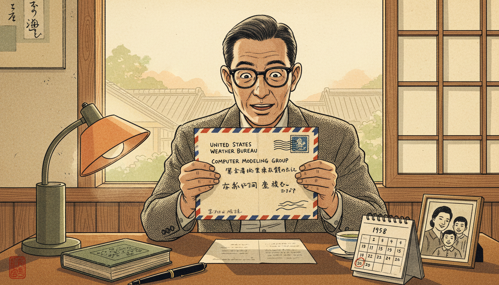

Image Prompt

I am about to ask you to generate a series of images for a graphic novel. Please make the images have a consistent style and consistent characters. Do not ask any clarifying questions. Just generate the image immediately when asked.

Please generate a 16:9 image in mid-century Japanese illustration style depicting panel 3 of 12. The scene should include Manabe in 1958 at his desk in Tokyo, opening a letter inviting him to join the US Weather Bureau's new computer modeling group. Color palette: warm envelope cream, deep navy ink, muted sunrise orange, desk wood brown. The emotional tone should be excitement and anxious possibility. Include: a handwritten air-mail envelope, a small lamp, a bilingual dictionary, a fountain pen, a framed photo of his family, a cup of green tea, a calendar showing 1958, a window with soft sunlight. Generate the image immediately without asking clarifying questions.

In 1958, the US Weather Bureau invites Manabe to join a small group of scientists trying something radical: simulating the atmosphere on a computer. He accepts, leaves Japan for Washington, DC, and steps into a world where mathematical functions are about to meet room-sized machines.

## Panel 4: Princeton and the GFDL

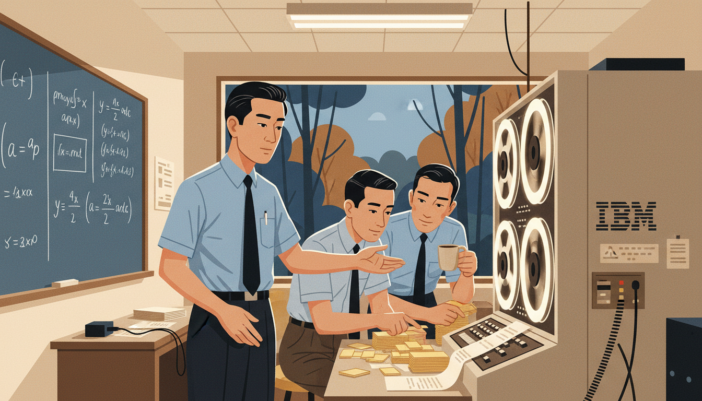

Image Prompt

I am about to ask you to generate a series of images for a graphic novel. Please make the images have a consistent style and consistent characters. Do not ask any clarifying questions. Just generate the image immediately when asked.

Please generate a 16:9 image in mid-century modern illustration style depicting panel 4 of 12. The scene should include Manabe at the Geophysical Fluid Dynamics Laboratory at Princeton in the early 1960s, working with colleagues beside an IBM mainframe computer. Color palette: institutional beige, computational gray, punch-card yellow, deep blue, warm fluorescent white. The emotional tone should be collaborative frontier science. Include: a room-sized mainframe with spinning tape reels, stacks of punch cards, a chalkboard with partial differential equations, colleagues in short-sleeved shirts and ties, a picture window showing Princeton woods, coffee cups, printout paper. Generate the image immediately without asking clarifying questions.

Manabe joins the Geophysical Fluid Dynamics Laboratory (GFDL), soon relocated to Princeton. GFDL is one of the only places on Earth where the atmosphere can be turned into equations and fed to a computer. Manabe's task sounds simple: write a program that behaves like the sky.

## Panel 5: One Column of Air

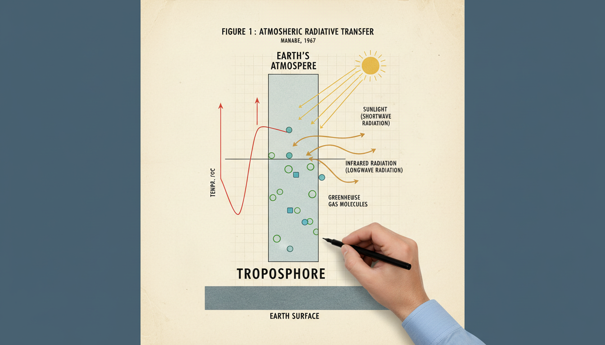

Image Prompt

I am about to ask you to generate a series of images for a graphic novel. Please make the images have a consistent style and consistent characters. Do not ask any clarifying questions. Just generate the image immediately when asked.

Please generate a 16:9 image in mid-century modern illustration style depicting panel 5 of 12. The scene should include a diagrammatic view of a vertical column of Earth's atmosphere divided into layers from the ground to the stratosphere, with arrows showing sunlight entering and infrared radiation leaving, annotated like a 1960s scientific paper. Color palette: atmospheric blue, cream paper, warm ochre, slate gray. The emotional tone should be clean intellectual elegance. Include: labels for troposphere and stratosphere, temperature profile curve, sun symbol at top, Earth surface at bottom, greenhouse gas molecules drawn simply, Manabe's hand drafting the figure with a technical pen. Generate the image immediately without asking clarifying questions.

Instead of simulating the whole atmosphere at once, Manabe starts small. He studies a single vertical column of air and asks how temperature varies with altitude. This simple one-dimensional model becomes the seed of everything that follows. Simplicity, he learns, is a superpower.

## Panel 6: The 1967 Paper That Changed Everything

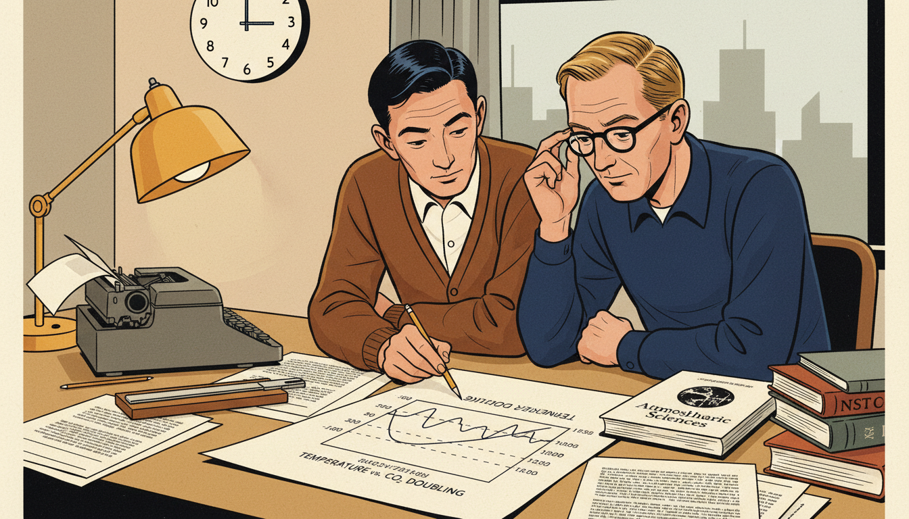

Image Prompt

I am about to ask you to generate a series of images for a graphic novel. Please make the images have a consistent style and consistent characters. Do not ask any clarifying questions. Just generate the image immediately when asked.

Please generate a 16:9 image in mid-century modern illustration style depicting panel 6 of 12. The scene should include Manabe and his colleague Richard Wetherald in 1967, at a desk reviewing the draft of their landmark paper showing that doubling CO2 raises Earth's surface temperature by about two degrees Celsius. Color palette: warm paper cream, deep navy ink, coffee brown, soft lamp yellow. The emotional tone should be quiet historic significance. Include: typewriter, hand-drawn graphs, a slide rule, a printout showing temperature as a function of CO2 concentration, a wall clock, two scientists leaning over the paper, a journal title "Journal of the Atmospheric Sciences." Generate the image immediately without asking clarifying questions.

In 1967, Manabe and Richard Wetherald publish a paper showing that doubling the amount of carbon dioxide in the atmosphere would raise Earth's surface temperature by about two degrees Celsius. It is the first physically realistic calculation of climate sensitivity. Scientists today still call it one of the most important papers in the history of science.

## Panel 7: Coupling Ocean and Atmosphere

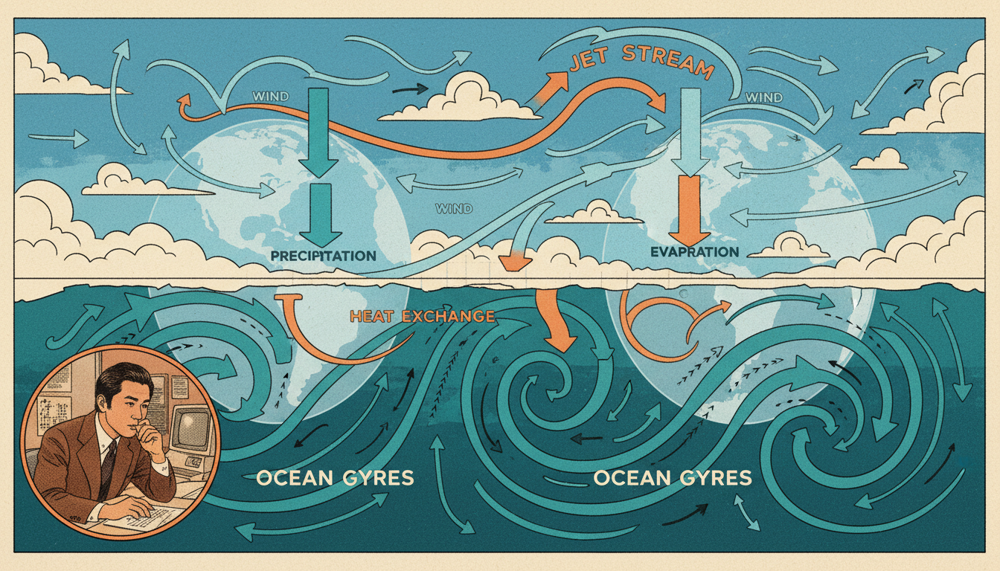

Image Prompt

I am about to ask you to generate a series of images for a graphic novel. Please make the images have a consistent style and consistent characters. Do not ask any clarifying questions. Just generate the image immediately when asked.

Please generate a 16:9 image in mid-century to 1970s scientific illustration style depicting panel 7 of 12. The scene should include a conceptual split view: the top half shows the atmosphere with wind arrows, and the bottom half shows ocean currents - linked by arrows showing heat exchange. Color palette: sky blue, ocean teal, warm sunset orange, white cloud cream. The emotional tone should be elegant systems thinking. Include: globe outline, jet stream curves, ocean gyres, labeled arrows for evaporation and precipitation, a small portrait of Manabe working at a desk inset into the corner, 1970s-style graph paper. Generate the image immediately without asking clarifying questions.

In the 1970s Manabe takes the next giant step. He couples his atmosphere model to a model of the ocean. This is incredibly difficult - the ocean is slow, the atmosphere is fast, and connecting them requires enormous computing power. The result is the world's first coupled general circulation model.

## Panel 8: Functions of Time, Functions of Place

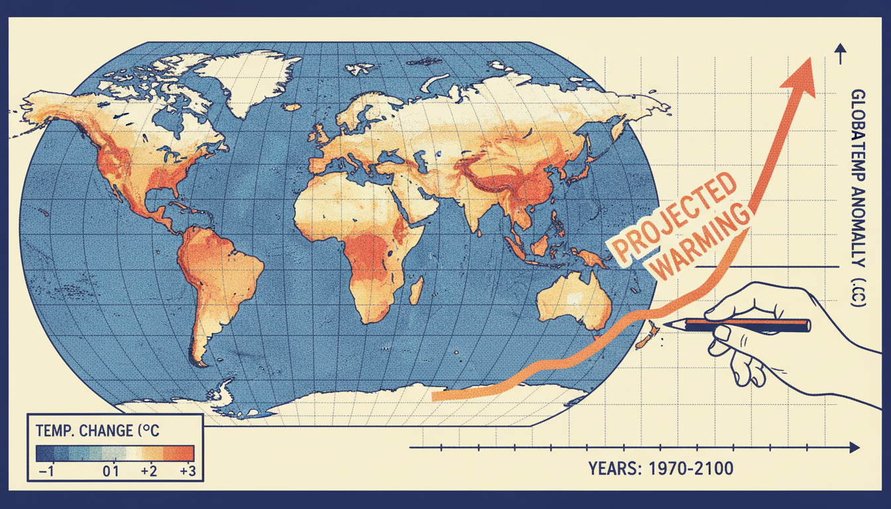

Image Prompt

I am about to ask you to generate a series of images for a graphic novel. Please make the images have a consistent style and consistent characters. Do not ask any clarifying questions. Just generate the image immediately when asked.

Please generate a 16:9 image in 1970s-80s computational illustration style depicting panel 8 of 12. The scene should include a world map with color-coded temperature predictions overlaid, and beside it a line graph showing projected global temperature rising over time. Color palette: cool blue, warm red, soft cream, deep navy, gradient yellow-orange. The emotional tone should be data-driven clarity. Include: latitude and longitude grid, a legend showing temperature changes, a rising curve labeled "projected warming," Manabe's hand holding a pencil comparing the graphs, dot-matrix printout aesthetic. Generate the image immediately without asking clarifying questions.

Manabe's models treat Earth's temperature as a function of many variables at once: latitude, longitude, altitude, and time. Feed in different amounts of greenhouse gases, and the function outputs a different climate. For the first time, humans can ask the planet "what if?" and get a thoughtful answer.

## Panel 9: Warnings Few Wanted to Hear

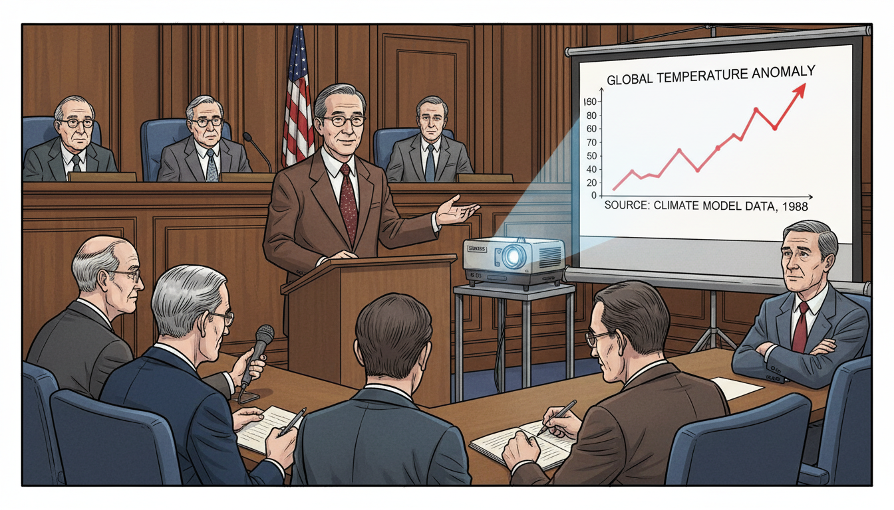

Image Prompt

I am about to ask you to generate a series of images for a graphic novel. Please make the images have a consistent style and consistent characters. Do not ask any clarifying questions. Just generate the image immediately when asked.

Please generate a 16:9 image in late 20th-century illustration style depicting panel 9 of 12. The scene should include Manabe presenting climate findings to a congressional committee in the late 1980s, projecting temperature graphs on a screen while some senators look concerned and others look skeptical. Color palette: muted institutional brown, flag blue and red, warm wood, cool projector light. The emotional tone should be serious civic responsibility. Include: a slide projector, a screen with a rising temperature curve, a microphone, a wood-paneled hearing room, attentive staffers, reporters taking notes, Manabe in a suit with a quiet steady expression. Generate the image immediately without asking clarifying questions.

As his models grow more detailed, the message becomes harder to ignore. Human carbon emissions are changing the climate, and the changes will accelerate. Manabe, modest and methodical, avoids political arguments. He lets the equations - and the data - speak for themselves.

## Panel 10: Teacher, Mentor, Bridge

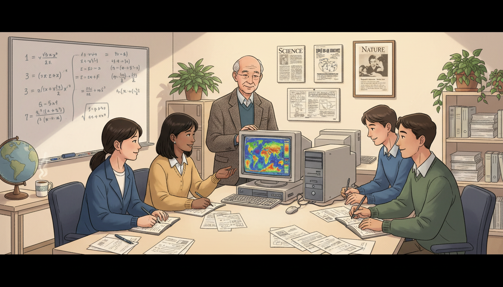

Image Prompt

I am about to ask you to generate a series of images for a graphic novel. Please make the images have a consistent style and consistent characters. Do not ask any clarifying questions. Just generate the image immediately when asked.

Please generate a 16:9 image in contemporary illustration style depicting panel 10 of 12. The scene should include an older Manabe in the 1990s mentoring a new generation of climate scientists at Princeton, students from Japan, the US, India, and Europe gathered around a monitor showing a colorful global simulation. Color palette: warm lamp yellow, cool monitor blue, cream walls, soft green plants. The emotional tone should be generous and multicultural. Include: modern desktop computers, printouts of papers, a whiteboard with equations, Manabe smiling gently, diverse students taking notes, a globe, a cup of tea, framed journal covers on the wall. Generate the image immediately without asking clarifying questions.

For decades Manabe mentors scientists at Princeton and back home in Japan. His students go on to lead climate research centers all over the world. He becomes a bridge between Japan and America, between physics and public policy, and between the atmosphere and the people who breathe it.

## Panel 11: The Nobel Prize

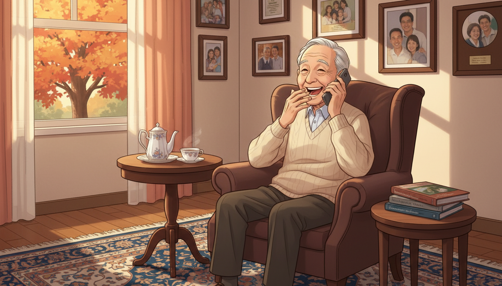

Image Prompt

I am about to ask you to generate a series of images for a graphic novel. Please make the images have a consistent style and consistent characters. Do not ask any clarifying questions. Just generate the image immediately when asked.

Please generate a 16:9 image in contemporary illustration style depicting panel 11 of 12. The scene should include a 90-year-old Syukuro Manabe at home in Princeton in October 2021, laughing with surprise on the phone as he learns he has won the Nobel Prize in Physics. Color palette: warm autumn light, cream, soft gold, cozy brown, deep blue. The emotional tone should be joyful disbelief. Include: a living room with framed science awards, a rotary-style phone or modern cordless, autumn leaves visible through a window, a tea set, a patterned rug, framed photos of family, a stack of climate journals. Generate the image immediately without asking clarifying questions.

In October 2021, at age ninety, Manabe receives a phone call telling him he has won the Nobel Prize in Physics, shared with Klaus Hasselmann and Giorgio Parisi. The Nobel committee cites his "physical modeling of Earth's climate, quantifying variability and reliably predicting global warming." He laughs and says he had no idea anyone still remembered his 1967 paper.

## Panel 12: The Planet as a Function

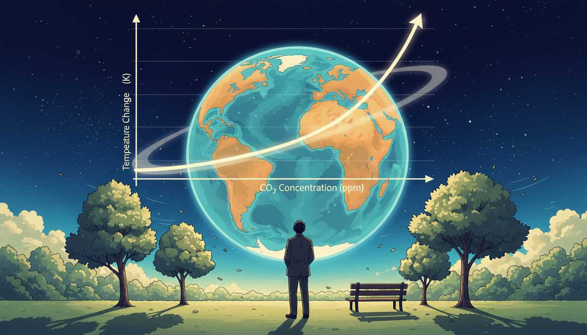

Image Prompt

I am about to ask you to generate a series of images for a graphic novel. Please make the images have a consistent style and consistent characters. Do not ask any clarifying questions. Just generate the image immediately when asked.

Please generate a 16:9 image in contemporary illustration style depicting panel 12 of 12. The scene should include a thoughtful composition of Earth seen from space, with an overlay of a simple mathematical function of temperature vs CO2 concentration, and a silhouette of Manabe looking up at the sky from a quiet garden. Color palette: deep space blue, atmospheric cyan, warm earth orange, cream, soft green. The emotional tone should be hopeful responsibility. Include: a glowing Earth, a graph curve rising smoothly, trees, a bench, sunlight, stars fading in, Manabe in a simple jacket from behind, a gentle breeze moving leaves. Generate the image immediately without asking clarifying questions.

Syukuro Manabe's greatest achievement was turning the entire planet into a function - a function that tells us what happens to the air, the ocean, and the ice if we change one number. His work is the foundation of every modern climate model. The future, he reminds us, is not fixed. It is an output we choose together.

### Epilogue – What Made Manabe Different?

Manabe never chased fame or controversy. He built small, clean, physically honest models and let them grow over decades. He was willing to simplify aggressively, then add complexity only when the science demanded it. That combination - humility, rigor, and patience - turned a single column of imaginary air into a tool that shapes global policy today.

| Challenge | How Manabe Responded | Lesson for Today |
|-----------|---------------------------|------------------|
| Postwar Japan with few resources | Focused on ideas, not equipment | Creativity beats scarcity |
| Leaving home for an unfamiliar country | Embraced collaboration across cultures | Travel widens thinking |
| Computers too slow for full Earth | Started with a single column of air | Simplify before you scale |
| Uncertain social reception of results | Stayed rigorous and patient | Let data carry the argument |
| Recognition came decades late | Kept working anyway | Do good work for its own sake |

### Call to Action

Next time you see a weather forecast, a climate graph, or a news story about rising temperatures, remember the quiet man from Shikoku who taught the planet how to model itself. Functions are not just abstract symbols - they are how we peek into the future. Learn to read them, and you can help choose a wiser world.

---

*"Curiosity is the most important thing."*
—Syukuro Manabe

*"I just wanted to understand how the climate works."*
—Syukuro Manabe

---

## References

1. [Wikipedia: Syukuro Manabe](https://en.wikipedia.org/wiki/Syukuro_Manabe) - Biography of the Japanese-American climatologist (born 1931)
2. [Wikipedia: Climate model](https://en.wikipedia.org/wiki/Climate_model) - The mathematical models of Earth's atmosphere Manabe helped pioneer
3. [Wikipedia: General circulation model](https://en.wikipedia.org/wiki/General_circulation_model) - The specific class of climate model Manabe built at GFDL
4. [Nobel Prize: Syukuro Manabe – Facts](https://www.nobelprize.org/prizes/physics/2021/manabe/facts/) - Official Nobel Foundation page (Physics, 2021)
5. [Encyclopaedia Britannica: Syukuro Manabe](https://www.britannica.com/biography/Syukuro-Manabe) - Overview of Manabe's climate modeling career
